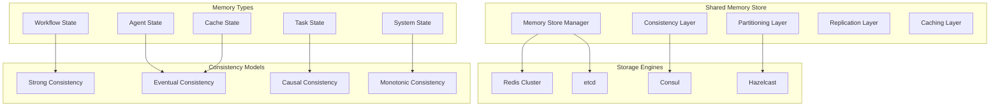
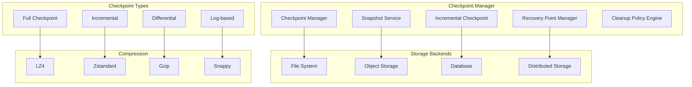
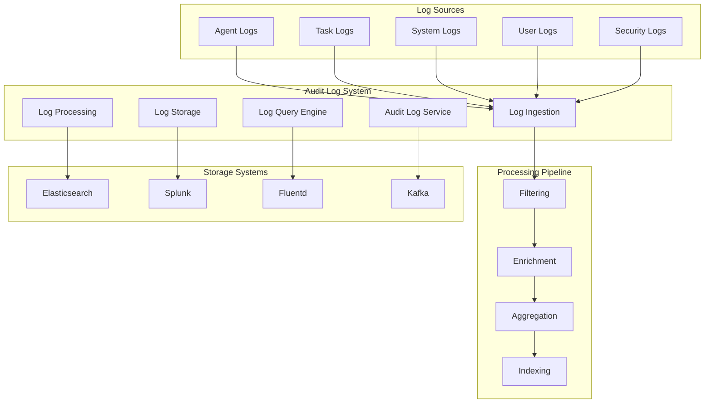
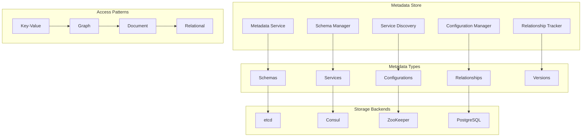

# Storage Layer Architecture

## Overview

The Storage Layer provides persistent, scalable, and highly available storage services for the MAOS system. It manages shared memory, checkpoints, audit logs, and metadata with strong consistency guarantees and performance optimization.

## Components

### 1. Shared Memory Store

#### Architecture


#### Memory Store Features
- **Distributed Caching**: Multi-node caching with consistency
- **Event Sourcing**: Immutable event log for state reconstruction
- **CQRS**: Separate read and write models for optimization
- **Conflict-Free Replicated Data Types (CRDTs)**: Merge without conflicts

#### Data Models
```typescript
interface MemoryStore {
  // Basic operations
  get(key: string): Promise<any>;
  set(key: string, value: any, ttl?: number): Promise<void>;
  delete(key: string): Promise<boolean>;
  exists(key: string): Promise<boolean>;
  
  // Advanced operations
  getMulti(keys: string[]): Promise<Record<string, any>>;
  setMulti(entries: Record<string, any>): Promise<void>;
  increment(key: string, delta?: number): Promise<number>;
  append(key: string, value: string): Promise<void>;
  
  // Collection operations
  listPush(key: string, value: any): Promise<number>;
  listPop(key: string): Promise<any>;
  setAdd(key: string, member: any): Promise<boolean>;
  setMembers(key: string): Promise<any[]>;
  
  // Transaction support
  multi(): Transaction;
  pipeline(): Pipeline;
  watch(keys: string[]): Promise<void>;
}

interface WorkflowState {
  id: string;
  status: 'pending' | 'running' | 'completed' | 'failed' | 'cancelled';
  currentStep: number;
  totalSteps: number;
  progress: number;
  startTime: Date;
  endTime?: Date;
  result?: any;
  error?: string;
  context: Record<string, any>;
}

interface AgentState {
  id: string;
  type: string;
  status: 'initializing' | 'ready' | 'busy' | 'idle' | 'error' | 'terminated';
  currentTasks: string[];
  capabilities: string[];
  resources: ResourceAllocation;
  health: HealthMetrics;
  lastHeartbeat: Date;
}
```

### 2. Checkpoint Manager

#### Responsibilities
- **State Snapshots**: Create consistent snapshots of system state
- **Incremental Checkpoints**: Optimize checkpoint size and speed
- **Recovery Points**: Maintain multiple recovery points
- **Cleanup Policies**: Manage checkpoint retention and cleanup

#### Architecture


#### Checkpoint Strategies
```typescript
interface CheckpointStrategy {
  type: 'full' | 'incremental' | 'differential' | 'log-based';
  frequency: number;
  retention: RetentionPolicy;
  compression: CompressionConfig;
  validation: ValidationConfig;
}

class IncrementalCheckpointManager {
  private lastCheckpoint?: CheckpointMetadata;
  private changeLogs: ChangeLog[] = [];
  
  async createCheckpoint(type: CheckpointType): Promise<CheckpointMetadata> {
    const timestamp = new Date();
    const checkpointId = generateCheckpointId(timestamp);
    
    switch (type) {
      case 'full':
        return this.createFullCheckpoint(checkpointId, timestamp);
      case 'incremental':
        return this.createIncrementalCheckpoint(checkpointId, timestamp);
      case 'differential':
        return this.createDifferentialCheckpoint(checkpointId, timestamp);
      default:
        throw new Error(`Unsupported checkpoint type: ${type}`);
    }
  }
  
  private async createIncrementalCheckpoint(
    id: string, 
    timestamp: Date
  ): Promise<CheckpointMetadata> {
    const changes = this.getChangesSinceLastCheckpoint();
    const compressedData = await this.compress(changes);
    
    const metadata: CheckpointMetadata = {
      id,
      type: 'incremental',
      timestamp,
      size: compressedData.length,
      parentCheckpoint: this.lastCheckpoint?.id,
      changeCount: changes.length,
      checksum: await this.calculateChecksum(compressedData)
    };
    
    await this.storeCheckpoint(metadata, compressedData);
    this.lastCheckpoint = metadata;
    this.changeLogs = [];
    
    return metadata;
  }
}
```

### 3. Audit Logs

#### Responsibilities
- **Activity Logging**: Log all system activities and changes
- **Compliance**: Meet regulatory and compliance requirements
- **Forensics**: Support security and troubleshooting investigations
- **Analytics**: Provide data for system analytics and optimization

#### Architecture


#### Log Schema
```typescript
interface AuditLogEntry {
  id: string;
  timestamp: Date;
  source: LogSource;
  level: LogLevel;
  category: LogCategory;
  event: string;
  actor: Actor;
  target?: Target;
  context: LogContext;
  metadata: Record<string, any>;
  checksum: string;
}

interface LogSource {
  component: string;
  instance: string;
  version: string;
  node: string;
}

interface Actor {
  type: 'user' | 'agent' | 'system';
  id: string;
  name?: string;
  roles?: string[];
}

interface Target {
  type: string;
  id: string;
  name?: string;
  properties?: Record<string, any>;
}

interface LogContext {
  traceId: string;
  spanId: string;
  parentSpanId?: string;
  workflowId?: string;
  taskId?: string;
  agentId?: string;
  userId?: string;
}

enum LogLevel {
  TRACE = 'trace',
  DEBUG = 'debug',
  INFO = 'info',
  WARN = 'warn',
  ERROR = 'error',
  FATAL = 'fatal'
}

enum LogCategory {
  AUTHENTICATION = 'authentication',
  AUTHORIZATION = 'authorization',
  DATA_ACCESS = 'data_access',
  SYSTEM_CHANGE = 'system_change',
  WORKFLOW = 'workflow',
  AGENT_ACTIVITY = 'agent_activity',
  SECURITY = 'security',
  PERFORMANCE = 'performance'
}
```

### 4. Metadata Store

#### Responsibilities
- **Schema Management**: Manage data schemas and versions
- **Service Discovery**: Store service endpoints and metadata
- **Configuration Management**: Centralized configuration storage
- **Relationship Tracking**: Track relationships between entities

#### Architecture


#### Metadata Models
```typescript
interface ServiceMetadata {
  name: string;
  version: string;
  endpoints: Endpoint[];
  health: HealthCheck;
  capabilities: Capability[];
  dependencies: Dependency[];
  configuration: ServiceConfig;
  tags: string[];
  lastUpdated: Date;
}

interface SchemaMetadata {
  id: string;
  name: string;
  version: string;
  schema: JSONSchema;
  compatibility: CompatibilityLevel;
  evolution: SchemaEvolution[];
  validation: ValidationRules;
  createdAt: Date;
  updatedAt: Date;
}

interface ConfigurationMetadata {
  key: string;
  value: any;
  type: ConfigType;
  scope: ConfigScope;
  version: number;
  encrypted: boolean;
  validation: ValidationRule[];
  history: ConfigHistory[];
  createdAt: Date;
  updatedAt: Date;
}
```

## Data Consistency and Replication

### 1. Consistency Models

#### Strong Consistency
```typescript
class StrongConsistencyManager {
  async write(key: string, value: any): Promise<void> {
    const transaction = await this.beginTransaction();
    try {
      await transaction.lock(key);
      await transaction.write(key, value);
      await transaction.replicate();
      await transaction.commit();
    } catch (error) {
      await transaction.rollback();
      throw error;
    }
  }
  
  async read(key: string): Promise<any> {
    return this.readFromPrimary(key);
  }
}
```

#### Eventual Consistency
```typescript
class EventualConsistencyManager {
  async write(key: string, value: any): Promise<void> {
    // Write to primary immediately
    await this.writeToPrimary(key, value);
    
    // Replicate asynchronously
    this.replicateAsync(key, value);
  }
  
  async read(key: string): Promise<any> {
    // Try local first, fallback to remote
    return this.readWithFallback(key);
  }
  
  private async replicateAsync(key: string, value: any): Promise<void> {
    const replicas = await this.getAvailableReplicas();
    const promises = replicas.map(replica => 
      replica.write(key, value).catch(error => 
        this.handleReplicationError(replica, error)
      )
    );
    
    // Don't wait for all replications to complete
    Promise.all(promises);
  }
}
```

### 2. Replication Strategies

#### Master-Slave Replication
```typescript
class MasterSlaveReplication {
  private master: StorageNode;
  private slaves: StorageNode[] = [];
  
  async write(key: string, value: any): Promise<void> {
    await this.master.write(key, value);
    
    // Replicate to slaves
    const promises = this.slaves.map(slave => 
      slave.replicate(key, value)
    );
    
    // Wait for majority of slaves
    const results = await Promise.allSettled(promises);
    const successful = results.filter(r => r.status === 'fulfilled').length;
    
    if (successful < Math.floor(this.slaves.length / 2)) {
      throw new Error('Replication failed - insufficient replicas');
    }
  }
}
```

#### Multi-Master Replication
```typescript
class MultiMasterReplication {
  private masters: StorageNode[] = [];
  private conflictResolver: ConflictResolver;
  
  async write(key: string, value: any): Promise<void> {
    const vector = this.generateVectorClock();
    const entry = { key, value, vector, timestamp: Date.now() };
    
    // Write to local master
    await this.getLocalMaster().write(entry);
    
    // Propagate to other masters
    this.propagateToMasters(entry);
  }
  
  async read(key: string): Promise<any> {
    const entries = await this.readFromAllMasters(key);
    if (entries.length === 1) {
      return entries[0].value;
    }
    
    // Resolve conflicts
    return this.conflictResolver.resolve(entries);
  }
}
```

## Performance Optimization

### 1. Caching Strategies

#### Multi-Level Caching
```typescript
class MultiLevelCache {
  private l1Cache: LRUCache; // In-memory
  private l2Cache: RedisCache; // Distributed
  private l3Cache: DatabaseCache; // Persistent
  
  async get(key: string): Promise<any> {
    // L1 cache
    let value = this.l1Cache.get(key);
    if (value !== undefined) {
      return value;
    }
    
    // L2 cache
    value = await this.l2Cache.get(key);
    if (value !== undefined) {
      this.l1Cache.set(key, value);
      return value;
    }
    
    // L3 cache (database)
    value = await this.l3Cache.get(key);
    if (value !== undefined) {
      this.l1Cache.set(key, value);
      this.l2Cache.set(key, value);
      return value;
    }
    
    return null;
  }
  
  async set(key: string, value: any): Promise<void> {
    // Write through all levels
    this.l1Cache.set(key, value);
    await this.l2Cache.set(key, value);
    await this.l3Cache.set(key, value);
  }
}
```

#### Cache Invalidation
```typescript
class CacheInvalidation {
  private dependencies = new Map<string, Set<string>>();
  
  addDependency(key: string, dependsOn: string): void {
    if (!this.dependencies.has(dependsOn)) {
      this.dependencies.set(dependsOn, new Set());
    }
    this.dependencies.get(dependsOn)!.add(key);
  }
  
  async invalidate(key: string): Promise<void> {
    // Invalidate the key itself
    await this.cache.delete(key);
    
    // Invalidate all dependent keys
    const dependents = this.dependencies.get(key);
    if (dependents) {
      const promises = Array.from(dependents).map(dependent => 
        this.invalidate(dependent)
      );
      await Promise.all(promises);
    }
  }
}
```

### 2. Data Partitioning

#### Horizontal Partitioning (Sharding)
```typescript
class ShardManager {
  private shards: Shard[] = [];
  private hashFunction: HashFunction;
  
  getShard(key: string): Shard {
    const hash = this.hashFunction.hash(key);
    const shardIndex = hash % this.shards.length;
    return this.shards[shardIndex];
  }
  
  async get(key: string): Promise<any> {
    const shard = this.getShard(key);
    return shard.get(key);
  }
  
  async set(key: string, value: any): Promise<void> {
    const shard = this.getShard(key);
    return shard.set(key, value);
  }
  
  async reshardData(newShardCount: number): Promise<void> {
    const oldShards = [...this.shards];
    this.shards = this.createShards(newShardCount);
    
    // Redistribute data
    for (const oldShard of oldShards) {
      const keys = await oldShard.getAllKeys();
      for (const key of keys) {
        const value = await oldShard.get(key);
        const newShard = this.getShard(key);
        await newShard.set(key, value);
        await oldShard.delete(key);
      }
    }
  }
}
```

### 3. Compression and Serialization

#### Adaptive Compression
```typescript
class AdaptiveCompressionManager {
  private compressors = new Map<string, Compressor>();
  
  constructor() {
    this.compressors.set('text', new TextCompressor());
    this.compressors.set('json', new JSONCompressor());
    this.compressors.set('binary', new BinaryCompressor());
    this.compressors.set('image', new ImageCompressor());
  }
  
  async compress(data: any, hint?: string): Promise<CompressedData> {
    const dataType = hint || this.detectDataType(data);
    const compressor = this.compressors.get(dataType) || this.getDefaultCompressor();
    
    const compressed = await compressor.compress(data);
    const ratio = compressed.length / data.length;
    
    // Return uncompressed if ratio is poor
    if (ratio > 0.9) {
      return { data, compressed: false, algorithm: 'none' };
    }
    
    return {
      data: compressed,
      compressed: true,
      algorithm: compressor.algorithm,
      originalSize: data.length,
      compressedSize: compressed.length,
      ratio
    };
  }
}
```

## Backup and Recovery

### 1. Backup Strategies
```typescript
interface BackupStrategy {
  type: 'full' | 'incremental' | 'differential';
  schedule: CronExpression;
  retention: RetentionPolicy;
  encryption: EncryptionConfig;
  compression: CompressionConfig;
  destinations: BackupDestination[];
}

class BackupManager {
  async createBackup(strategy: BackupStrategy): Promise<BackupMetadata> {
    const backupId = generateBackupId();
    const startTime = new Date();
    
    try {
      const data = await this.collectData(strategy.type);
      const compressedData = await this.compress(data, strategy.compression);
      const encryptedData = await this.encrypt(compressedData, strategy.encryption);
      
      const promises = strategy.destinations.map(dest => 
        this.storeBackup(dest, backupId, encryptedData)
      );
      
      await Promise.all(promises);
      
      return {
        id: backupId,
        type: strategy.type,
        startTime,
        endTime: new Date(),
        size: encryptedData.length,
        status: 'completed',
        checksum: await this.calculateChecksum(encryptedData)
      };
    } catch (error) {
      return {
        id: backupId,
        type: strategy.type,
        startTime,
        endTime: new Date(),
        size: 0,
        status: 'failed',
        error: error.message
      };
    }
  }
}
```

### 2. Disaster Recovery
```typescript
class DisasterRecoveryManager {
  async initiateRecovery(scenario: DisasterScenario): Promise<RecoveryResult> {
    const recoveryPlan = await this.getRecoveryPlan(scenario);
    const startTime = new Date();
    
    try {
      // Step 1: Assess damage
      const assessment = await this.assessDamage();
      
      // Step 2: Restore from backups
      const restoreResult = await this.restoreFromBackups(recoveryPlan);
      
      // Step 3: Verify data integrity
      const integrityCheck = await this.verifyDataIntegrity();
      
      // Step 4: Resume operations
      await this.resumeOperations();
      
      return {
        scenario,
        startTime,
        endTime: new Date(),
        status: 'success',
        assessment,
        restoreResult,
        integrityCheck
      };
    } catch (error) {
      return {
        scenario,
        startTime,
        endTime: new Date(),
        status: 'failed',
        error: error.message
      };
    }
  }
}