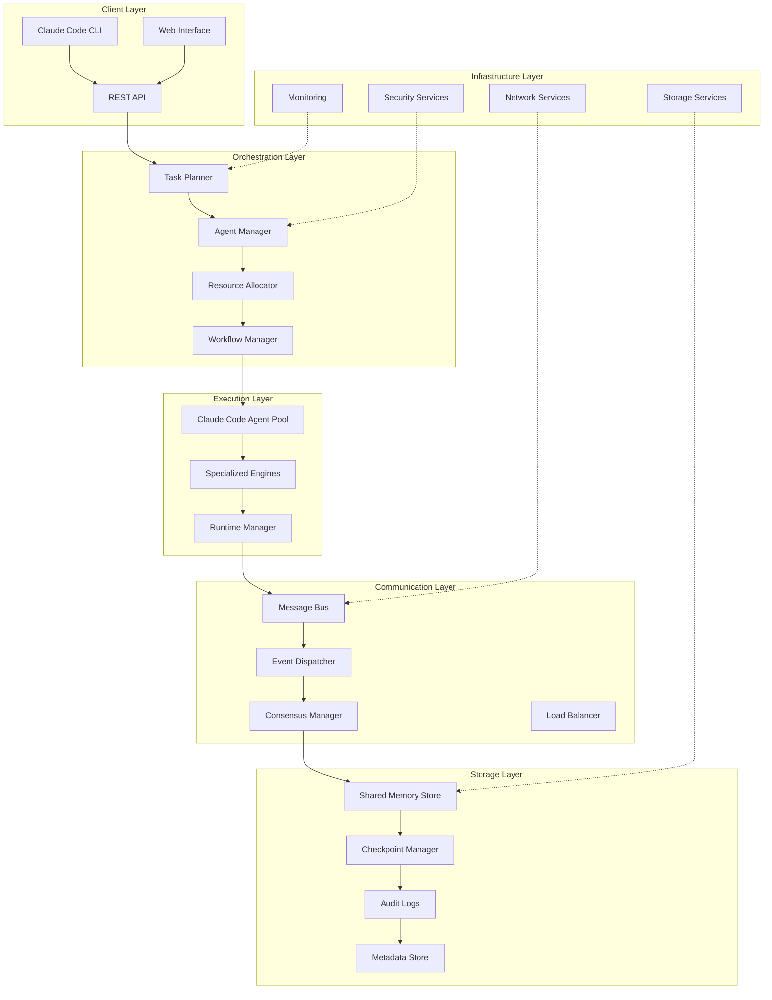

# MAOS System Architecture Overview

## Executive Summary

The Multi-Agent Orchestration System (MAOS) is designed as a distributed, fault-tolerant platform that orchestrates multiple AI agents for collaborative software development and complex task execution. The architecture follows a layered approach with clear separation of concerns, enabling scalability, maintainability, and robust operation.

## Architecture Principles

### 1. Layered Architecture
- **Orchestration Layer**: High-level planning and coordination
- **Execution Layer**: Agent pool management and task execution
- **Communication Layer**: Inter-agent messaging and consensus
- **Storage Layer**: Persistent state and shared memory

### 2. Design Principles
- **Fault Tolerance**: System continues operation despite component failures
- **Scalability**: Horizontal scaling to 20+ concurrent agents
- **Consistency**: Strong consistency for critical operations, eventual consistency for performance
- **Security**: Zero-trust architecture with end-to-end encryption
- **Observability**: Comprehensive monitoring and tracing

## High-Level Architecture

## Component Interaction Patterns

### 1. Request Flow
1. **Client Request** → Task Planner
2. **Task Decomposition** → Agent Manager
3. **Resource Allocation** → Workflow Manager
4. **Agent Orchestration** → Execution Layer
5. **Result Aggregation** → Client Response

### 2. Event-Driven Architecture
- **Asynchronous Processing**: Non-blocking operations
- **Event Sourcing**: Immutable event log for state reconstruction
- **CQRS**: Command Query Responsibility Segregation
- **Reactive Patterns**: Real-time response to system events

## Quality Attributes

### Performance
- **Target**: 20+ concurrent agents
- **Latency**: < 100ms for coordination operations
- **Throughput**: 1000+ tasks/minute

### Reliability
- **Availability**: 99.9% uptime
- **Recovery Time**: < 30 seconds
- **Data Durability**: 99.99%

### Security
- **Authentication**: Multi-factor authentication
- **Authorization**: Role-based access control
- **Encryption**: AES-256 at rest, TLS 1.3 in transit
- **Audit**: Complete audit trail

### Scalability
- **Horizontal**: Auto-scaling based on load
- **Vertical**: Resource allocation optimization
- **Geographic**: Multi-region deployment support