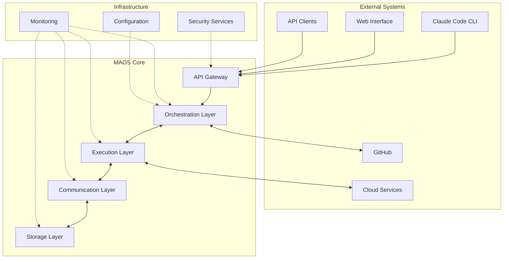

# Integration Patterns and Component Interactions

## Overview

This document defines the integration patterns, data flow, and interaction protocols between MAOS components. It serves as the blueprint for how different layers and services communicate, ensuring consistency and reliability across the system.

## Integration Architecture Overview



## Core Integration Patterns

### 1. Request-Response Pattern

#### Synchronous Request-Response
```typescript
interface RequestResponsePattern {
  request: Request;
  response: Response;
  timeout: number;
  retries: number;
}

class SynchronousRequestHandler {
  async handleRequest<T, R>(
    request: Request<T>,
    handler: RequestHandler<T, R>,
    options: RequestOptions = {}
  ): Promise<Response<R>> {
    const startTime = Date.now();
    const requestId = generateRequestId();
    const timeout = options.timeout || 30000;
    const maxRetries = options.retries || 3;
    
    // Add request context
    const contextualRequest = {
      ...request,
      id: requestId,
      timestamp: new Date(),
      timeout
    };
    
    let attempt = 0;
    let lastError: Error | null = null;
    
    while (attempt <= maxRetries) {
      try {
        // Set up timeout
        const timeoutPromise = new Promise<never>((_, reject) => {
          setTimeout(() => reject(new TimeoutError(`Request ${requestId} timed out`)), timeout);
        });
        
        // Execute handler with timeout
        const result = await Promise.race([
          handler(contextualRequest),
          timeoutPromise
        ]);
        
        const responseTime = Date.now() - startTime;
        
        // Successful response
        return {
          id: requestId,
          status: 'success',
          data: result,
          metadata: {
            responseTime,
            attempt: attempt + 1,
            timestamp: new Date()
          }
        };
        
      } catch (error) {
        lastError = error;
        attempt++;
        
        // Check if error is retryable
        if (!this.isRetryableError(error) || attempt > maxRetries) {
          break;
        }
        
        // Exponential backoff
        const backoffDelay = Math.min(1000 * Math.pow(2, attempt), 10000);
        await this.delay(backoffDelay);
      }
    }
    
    // All retries exhausted
    const responseTime = Date.now() - startTime;
    return {
      id: requestId,
      status: 'error',
      error: {
        code: lastError?.name || 'UNKNOWN_ERROR',
        message: lastError?.message || 'Unknown error occurred',
        attempts: attempt,
        responseTime
      },
      metadata: {
        responseTime,
        attempt,
        timestamp: new Date()
      }
    };
  }
}
```

#### Asynchronous Request-Response with Callbacks
```typescript
interface AsyncRequestPattern {
  request: AsyncRequest;
  callbackUrl: string;
  status: 'pending' | 'processing' | 'completed' | 'failed';
  result?: any;
  error?: Error;
}

class AsyncRequestHandler {
  private pendingRequests = new Map<string, AsyncRequestPattern>();
  private callbackService: CallbackService;
  
  async submitAsyncRequest<T>(
    request: AsyncRequest<T>,
    callbackUrl: string
  ): Promise<AsyncRequestResponse> {
    const requestId = generateRequestId();
    
    const asyncRequest: AsyncRequestPattern = {
      request,
      callbackUrl,
      status: 'pending'
    };
    
    this.pendingRequests.set(requestId, asyncRequest);
    
    // Process request asynchronously
    this.processAsyncRequest(requestId).catch(error => {
      console.error(`Async request ${requestId} failed:`, error);
    });
    
    return {
      requestId,
      status: 'accepted',
      estimatedCompletionTime: this.estimateCompletionTime(request),
      statusUrl: `/api/v1/requests/${requestId}/status`,
      callbackUrl
    };
  }
  
  private async processAsyncRequest(requestId: string): Promise<void> {
    const asyncRequest = this.pendingRequests.get(requestId);
    if (!asyncRequest) return;
    
    try {
      // Update status to processing
      asyncRequest.status = 'processing';
      await this.notifyStatusChange(requestId, asyncRequest);
      
      // Execute the actual request processing
      const result = await this.executeRequest(asyncRequest.request);
      
      // Update with result
      asyncRequest.status = 'completed';
      asyncRequest.result = result;
      
      // Notify completion
      await this.notifyCompletion(requestId, asyncRequest);
      
    } catch (error) {
      asyncRequest.status = 'failed';
      asyncRequest.error = error;
      
      // Notify failure
      await this.notifyFailure(requestId, asyncRequest);
    } finally {
      // Clean up after some time
      setTimeout(() => {
        this.pendingRequests.delete(requestId);
      }, 300000); // 5 minutes
    }
  }
  
  private async notifyStatusChange(
    requestId: string,
    asyncRequest: AsyncRequestPattern
  ): Promise<void> {
    try {
      await this.callbackService.notify(asyncRequest.callbackUrl, {
        requestId,
        status: asyncRequest.status,
        timestamp: new Date(),
        ...(asyncRequest.result && { result: asyncRequest.result }),
        ...(asyncRequest.error && { error: asyncRequest.error.message })
      });
    } catch (error) {
      console.error(`Failed to notify callback for request ${requestId}:`, error);
    }
  }
}
```

### 2. Event-Driven Integration Pattern

#### Event Publisher
```typescript
interface EventPattern {
  eventType: string;
  source: string;
  data: any;
  metadata: EventMetadata;
}

interface EventMetadata {
  timestamp: Date;
  correlationId?: string;
  causationId?: string;
  version: string;
  userId?: string;
  traceId?: string;
}

class EventPublisher {
  private messagebus: MessageBus;
  private eventStore: EventStore;
  
  constructor(messageBus: MessageBus, eventStore: EventStore) {
    this.messagebus = messageBus;
    this.eventStore = eventStore;
  }
  
  async publishEvent(event: EventPattern): Promise<void> {
    const enrichedEvent = this.enrichEvent(event);
    
    try {
      // Store event first (for reliability)
      await this.eventStore.store(enrichedEvent);
      
      // Then publish to message bus
      await this.messagebus.publish(enrichedEvent.eventType, enrichedEvent);
      
      // Update event status as published
      await this.eventStore.markAsPublished(enrichedEvent.metadata.eventId);
      
    } catch (error) {
      // Mark event as failed
      await this.eventStore.markAsFailed(enrichedEvent.metadata.eventId, error);
      throw error;
    }
  }
  
  private enrichEvent(event: EventPattern): EnrichedEvent {
    const eventId = generateEventId();
    const traceId = this.getCurrentTraceId();
    
    return {
      ...event,
      metadata: {
        ...event.metadata,
        eventId,
        traceId,
        publishedAt: new Date(),
        schemaVersion: '1.0'
      }
    };
  }
  
  async publishDomainEvent<T>(
    aggregateId: string,
    eventType: string,
    eventData: T,
    version: number
  ): Promise<void> {
    const domainEvent: DomainEvent<T> = {
      aggregateId,
      eventType,
      eventData,
      version,
      timestamp: new Date(),
      eventId: generateEventId()
    };
    
    await this.publishEvent({
      eventType: `domain.${eventType}`,
      source: 'domain',
      data: domainEvent,
      metadata: {
        timestamp: domainEvent.timestamp,
        version: version.toString(),
        correlationId: aggregateId
      }
    });
  }
}
```

#### Event Subscriber
```typescript
class EventSubscriber {
  private subscriptions = new Map<string, EventHandler[]>();
  private messagebus: MessageBus;
  private retryManager: RetryManager;
  
  constructor(messageBus: MessageBus) {
    this.messagebus = messageBus;
    this.retryManager = new RetryManager();
  }
  
  subscribe<T>(
    eventType: string,
    handler: EventHandler<T>,
    options: SubscriptionOptions = {}
  ): Subscription {
    const subscription: InternalSubscription<T> = {
      id: generateSubscriptionId(),
      eventType,
      handler,
      options,
      status: 'active',
      createdAt: new Date()
    };
    
    if (!this.subscriptions.has(eventType)) {
      this.subscriptions.set(eventType, []);
    }
    
    this.subscriptions.get(eventType)!.push(subscription);
    
    // Set up message bus subscription if first handler for this event type
    if (this.subscriptions.get(eventType)!.length === 1) {
      this.messagebus.subscribe(eventType, (message) => {
        this.handleEvent(eventType, message);
      });
    }
    
    return {
      id: subscription.id,
      unsubscribe: () => this.unsubscribe(subscription.id)
    };
  }
  
  private async handleEvent(eventType: string, message: any): Promise<void> {
    const handlers = this.subscriptions.get(eventType) || [];
    
    // Process handlers in parallel
    const handlerPromises = handlers.map(async (subscription) => {
      if (subscription.status !== 'active') return;
      
      try {
        // Check if handler should process this event
        if (subscription.options.filter && !subscription.options.filter(message)) {
          return;
        }
        
        // Execute handler with retry logic
        await this.retryManager.executeWithRetry(
          () => subscription.handler(message),
          subscription.options.retryPolicy || { maxAttempts: 3 }
        );
        
        // Update metrics
        this.updateHandlerMetrics(subscription.id, 'success');
        
      } catch (error) {
        this.updateHandlerMetrics(subscription.id, 'error');
        
        // Handle failed event
        await this.handleFailedEvent(subscription, message, error);
      }
    });
    
    await Promise.allSettled(handlerPromises);
  }
  
  private async handleFailedEvent(
    subscription: InternalSubscription,
    message: any,
    error: Error
  ): Promise<void> {
    const failedEvent: FailedEvent = {
      subscriptionId: subscription.id,
      eventType: subscription.eventType,
      message,
      error: error.message,
      timestamp: new Date(),
      retryCount: 0
    };
    
    // Send to dead letter queue if configured
    if (subscription.options.deadLetterQueue) {
      await this.messagebus.publish(
        subscription.options.deadLetterQueue,
        failedEvent
      );
    }
    
    // Log error
    console.error(`Event handler failed for ${subscription.eventType}:`, error);
  }
}
```

### 3. Saga Pattern for Distributed Transactions

#### Saga Orchestrator
```typescript
interface SagaStep {
  id: string;
  action: string;
  service: string;
  input: any;
  compensation?: string;
  timeout?: number;
}

interface SagaDefinition {
  id: string;
  name: string;
  steps: SagaStep[];
  timeout: number;
}

class SagaOrchestrator {
  private activeSagas = new Map<string, SagaExecution>();
  private sagaStore: SagaStore;
  private serviceRegistry: ServiceRegistry;
  
  constructor(sagaStore: SagaStore, serviceRegistry: ServiceRegistry) {
    this.sagaStore = sagaStore;
    this.serviceRegistry = serviceRegistry;
  }
  
  async startSaga(
    sagaDefinition: SagaDefinition,
    initialData: any
  ): Promise<SagaExecution> {
    const sagaId = generateSagaId();
    const execution: SagaExecution = {
      id: sagaId,
      definition: sagaDefinition,
      status: 'running',
      currentStep: 0,
      data: initialData,
      completedSteps: [],
      startTime: new Date(),
      compensations: []
    };
    
    this.activeSagas.set(sagaId, execution);
    await this.sagaStore.store(execution);
    
    // Start execution
    this.executeSaga(sagaId).catch(error => {
      console.error(`Saga ${sagaId} failed:`, error);
    });
    
    return execution;
  }
  
  private async executeSaga(sagaId: string): Promise<void> {
    const execution = this.activeSagas.get(sagaId);
    if (!execution) return;
    
    try {
      while (execution.currentStep < execution.definition.steps.length) {
        const step = execution.definition.steps[execution.currentStep];
        
        try {
          const result = await this.executeStep(step, execution.data);
          
          // Record successful step
          execution.completedSteps.push({
            stepId: step.id,
            result,
            completedAt: new Date()
          });
          
          // Update saga data with step result
          execution.data = { ...execution.data, ...result };
          execution.currentStep++;
          
          // Store progress
          await this.sagaStore.update(execution);
          
        } catch (error) {
          // Step failed, start compensation
          await this.compensate(execution);
          throw error;
        }
      }
      
      // All steps completed successfully
      execution.status = 'completed';
      execution.endTime = new Date();
      await this.sagaStore.update(execution);
      
    } catch (error) {
      execution.status = 'failed';
      execution.endTime = new Date();
      execution.error = error.message;
      await this.sagaStore.update(execution);
    } finally {
      this.activeSagas.delete(sagaId);
    }
  }
  
  private async executeStep(step: SagaStep, data: any): Promise<any> {
    const service = await this.serviceRegistry.getService(step.service);
    if (!service) {
      throw new Error(`Service ${step.service} not found`);
    }
    
    const timeout = step.timeout || 30000;
    const timeoutPromise = new Promise((_, reject) => {
      setTimeout(() => reject(new Error(`Step ${step.id} timed out`)), timeout);
    });
    
    const executionPromise = service.execute(step.action, {
      ...step.input,
      ...data
    });
    
    return Promise.race([executionPromise, timeoutPromise]);
  }
  
  private async compensate(execution: SagaExecution): Promise<void> {
    // Execute compensations in reverse order
    const completedSteps = [...execution.completedSteps].reverse();
    
    for (const completedStep of completedSteps) {
      const originalStep = execution.definition.steps.find(
        s => s.id === completedStep.stepId
      );
      
      if (originalStep?.compensation) {
        try {
          await this.executeCompensation(
            originalStep,
            completedStep.result,
            execution.data
          );
          
          execution.compensations.push({
            stepId: originalStep.id,
            compensation: originalStep.compensation,
            executedAt: new Date(),
            status: 'completed'
          });
          
        } catch (error) {
          execution.compensations.push({
            stepId: originalStep.id,
            compensation: originalStep.compensation,
            executedAt: new Date(),
            status: 'failed',
            error: error.message
          });
          
          console.error(`Compensation failed for step ${originalStep.id}:`, error);
        }
      }
    }
  }
  
  private async executeCompensation(
    step: SagaStep,
    stepResult: any,
    sagaData: any
  ): Promise<any> {
    const service = await this.serviceRegistry.getService(step.service);
    if (!service) {
      throw new Error(`Service ${step.service} not found for compensation`);
    }
    
    return service.execute(step.compensation!, {
      originalResult: stepResult,
      sagaData
    });
  }
}
```

### 4. Circuit Breaker Integration Pattern

#### Service-to-Service Circuit Breaker
```typescript
class ServiceCircuitBreaker {
  private circuitBreakers = new Map<string, CircuitBreaker>();
  private serviceRegistry: ServiceRegistry;
  private metricsCollector: MetricsCollector;
  
  constructor(serviceRegistry: ServiceRegistry, metricsCollector: MetricsCollector) {
    this.serviceRegistry = serviceRegistry;
    this.metricsCollector = metricsCollector;
  }
  
  async callService<T, R>(
    serviceName: string,
    operation: string,
    payload: T,
    options: CallOptions = {}
  ): Promise<R> {
    const circuitBreaker = this.getOrCreateCircuitBreaker(serviceName);
    
    return circuitBreaker.execute(async () => {
      const startTime = Date.now();
      const service = await this.serviceRegistry.getService(serviceName);
      
      if (!service) {
        throw new ServiceNotFoundError(`Service ${serviceName} not found`);
      }
      
      try {
        const result = await service.call<T, R>(operation, payload, options);
        
        // Record successful call metrics
        this.metricsCollector.recordServiceCall({
          service: serviceName,
          operation,
          status: 'success',
          duration: Date.now() - startTime
        });
        
        return result;
        
      } catch (error) {
        // Record failed call metrics
        this.metricsCollector.recordServiceCall({
          service: serviceName,
          operation,
          status: 'error',
          duration: Date.now() - startTime,
          error: error.message
        });
        
        throw error;
      }
    });
  }
  
  private getOrCreateCircuitBreaker(serviceName: string): CircuitBreaker {
    if (!this.circuitBreakers.has(serviceName)) {
      const config = this.getCircuitBreakerConfig(serviceName);
      const circuitBreaker = new CircuitBreaker(config);
      
      // Set up event listeners
      circuitBreaker.on('open', () => {
        console.warn(`Circuit breaker opened for service: ${serviceName}`);
        this.metricsCollector.recordCircuitBreakerState(serviceName, 'open');
      });
      
      circuitBreaker.on('halfOpen', () => {
        console.info(`Circuit breaker half-opened for service: ${serviceName}`);
        this.metricsCollector.recordCircuitBreakerState(serviceName, 'half-open');
      });
      
      circuitBreaker.on('close', () => {
        console.info(`Circuit breaker closed for service: ${serviceName}`);
        this.metricsCollector.recordCircuitBreakerState(serviceName, 'closed');
      });
      
      this.circuitBreakers.set(serviceName, circuitBreaker);
    }
    
    return this.circuitBreakers.get(serviceName)!;
  }
  
  private getCircuitBreakerConfig(serviceName: string): CircuitBreakerConfig {
    // Different services might have different circuit breaker configurations
    const baseConfig: CircuitBreakerConfig = {
      failureThreshold: 5,
      successThreshold: 2,
      timeout: 60000,
      monitoringPeriod: 10000
    };
    
    // Service-specific overrides
    const serviceConfigs: Record<string, Partial<CircuitBreakerConfig>> = {
      'agent-service': {
        failureThreshold: 10, // Agents might have temporary issues
        timeout: 30000
      },
      'storage-service': {
        failureThreshold: 3, // Storage issues are more serious
        timeout: 120000
      },
      'external-api': {
        failureThreshold: 5,
        timeout: 30000
      }
    };
    
    return {
      ...baseConfig,
      ...serviceConfigs[serviceName]
    };
  }
  
  async getServiceHealth(serviceName: string): Promise<ServiceHealth> {
    const circuitBreaker = this.circuitBreakers.get(serviceName);
    const service = await this.serviceRegistry.getService(serviceName);
    
    if (!service) {
      return {
        serviceName,
        status: 'unknown',
        circuitBreakerState: 'unknown',
        lastCheck: new Date()
      };
    }
    
    const circuitState = circuitBreaker ? circuitBreaker.getState() : 'closed';
    
    // Try to get actual health if circuit is not open
    let healthStatus: 'healthy' | 'unhealthy' | 'unknown' = 'unknown';
    
    if (circuitState !== 'open') {
      try {
        await service.healthCheck();
        healthStatus = 'healthy';
      } catch {
        healthStatus = 'unhealthy';
      }
    } else {
      healthStatus = 'unhealthy';
    }
    
    return {
      serviceName,
      status: healthStatus,
      circuitBreakerState: circuitState,
      lastCheck: new Date()
    };
  }
}
```

## Data Flow Patterns

### 1. Command Query Responsibility Segregation (CQRS)

```typescript
// Command Side
interface Command {
  id: string;
  type: string;
  aggregateId: string;
  payload: any;
  metadata: CommandMetadata;
}

class CommandHandler {
  private eventStore: EventStore;
  private aggregateRepository: AggregateRepository;
  
  async handle(command: Command): Promise<CommandResult> {
    // Load aggregate from event store
    const aggregate = await this.aggregateRepository.load(command.aggregateId);
    
    // Execute command on aggregate
    const events = aggregate.handle(command);
    
    // Store events
    await this.eventStore.saveEvents(command.aggregateId, events);
    
    // Publish events
    for (const event of events) {
      await this.eventPublisher.publish(event);
    }
    
    return {
      success: true,
      aggregateId: command.aggregateId,
      version: aggregate.version + events.length,
      events: events.map(e => e.type)
    };
  }
}

// Query Side
interface Query {
  type: string;
  parameters: any;
}

class QueryHandler {
  private readModelStore: ReadModelStore;
  private projectionManager: ProjectionManager;
  
  async handle(query: Query): Promise<QueryResult> {
    // Get appropriate read model
    const readModel = await this.readModelStore.get(query.type);
    
    if (!readModel) {
      throw new Error(`No read model found for query type: ${query.type}`);
    }
    
    // Execute query against read model
    const result = await readModel.query(query.parameters);
    
    return {
      data: result,
      metadata: {
        queryType: query.type,
        timestamp: new Date(),
        fromCache: readModel.isCached()
      }
    };
  }
}
```

### 2. Event Sourcing with Projections

```typescript
class ProjectionManager {
  private projections = new Map<string, Projection>();
  private eventStore: EventStore;
  private checkpointStore: CheckpointStore;
  
  async processEvent(event: DomainEvent): Promise<void> {
    const applicableProjections = this.getApplicableProjections(event.type);
    
    const projectionPromises = applicableProjections.map(async projection => {
      try {
        await projection.apply(event);
        await this.updateCheckpoint(projection.name, event.position);
      } catch (error) {
        console.error(`Projection ${projection.name} failed to process event:`, error);
        await this.handleProjectionError(projection, event, error);
      }
    });
    
    await Promise.allSettled(projectionPromises);
  }
  
  async rebuildProjection(projectionName: string): Promise<void> {
    const projection = this.projections.get(projectionName);
    if (!projection) {
      throw new Error(`Projection ${projectionName} not found`);
    }
    
    // Clear existing projection data
    await projection.reset();
    
    // Replay all events
    const eventStream = this.eventStore.getAllEvents();
    
    for await (const event of eventStream) {
      if (projection.canHandle(event.type)) {
        await projection.apply(event);
      }
    }
    
    // Update checkpoint
    const lastEvent = await this.eventStore.getLastEvent();
    if (lastEvent) {
      await this.updateCheckpoint(projectionName, lastEvent.position);
    }
  }
  
  private async handleProjectionError(
    projection: Projection,
    event: DomainEvent,
    error: Error
  ): Promise<void> {
    // Log the error
    console.error(`Projection error in ${projection.name}:`, {
      eventType: event.type,
      eventId: event.id,
      error: error.message
    });
    
    // Store failed event for later retry
    await this.storeFailedProjectionEvent({
      projectionName: projection.name,
      event,
      error: error.message,
      timestamp: new Date(),
      retryCount: 0
    });
    
    // Optionally pause projection if too many errors
    const recentErrors = await this.getRecentProjectionErrors(projection.name);
    if (recentErrors.length > 10) {
      await this.pauseProjection(projection.name);
    }
  }
}
```

## Integration Testing Patterns

### 1. Contract Testing
```typescript
interface ServiceContract {
  service: string;
  version: string;
  operations: OperationContract[];
}

interface OperationContract {
  name: string;
  input: JSONSchema;
  output: JSONSchema;
  errors: ErrorContract[];
}

class ContractTester {
  async testServiceContract(
    service: Service,
    contract: ServiceContract
  ): Promise<ContractTestResult> {
    const results: OperationTestResult[] = [];
    
    for (const operation of contract.operations) {
      const result = await this.testOperation(service, operation);
      results.push(result);
    }
    
    return {
      service: contract.service,
      version: contract.version,
      passed: results.every(r => r.passed),
      operations: results,
      timestamp: new Date()
    };
  }
  
  private async testOperation(
    service: Service,
    operation: OperationContract
  ): Promise<OperationTestResult> {
    const testCases = this.generateTestCases(operation);
    const caseResults: TestCaseResult[] = [];
    
    for (const testCase of testCases) {
      try {
        const result = await service.call(operation.name, testCase.input);
        
        const outputValid = this.validateAgainstSchema(result, operation.output);
        caseResults.push({
          input: testCase.input,
          output: result,
          passed: outputValid,
          error: outputValid ? null : 'Output does not match schema'
        });
        
      } catch (error) {
        const expectedError = operation.errors.find(e => e.code === error.code);
        caseResults.push({
          input: testCase.input,
          output: null,
          passed: !!expectedError,
          error: expectedError ? null : `Unexpected error: ${error.message}`
        });
      }
    }
    
    return {
      operation: operation.name,
      passed: caseResults.every(r => r.passed),
      testCases: caseResults
    };
  }
}
```

### 2. Integration Test Scenarios
```typescript
class IntegrationTestSuite {
  async testTaskOrchestrationFlow(): Promise<void> {
    // 1. Submit task request
    const taskRequest = await this.orchestrationService.createTask({
      type: 'code_generation',
      description: 'Generate a simple REST API',
      requirements: [
        { type: 'language', value: 'typescript' },
        { type: 'framework', value: 'express' }
      ]
    });
    
    expect(taskRequest.taskId).toBeDefined();
    expect(taskRequest.status).toBe('pending');
    
    // 2. Verify agent assignment
    await this.waitForCondition(async () => {
      const task = await this.orchestrationService.getTask(taskRequest.taskId);
      return task.assignedAgent !== null;
    }, 10000);
    
    const assignedTask = await this.orchestrationService.getTask(taskRequest.taskId);
    expect(assignedTask.assignedAgent).toBeDefined();
    expect(assignedTask.status).toBe('assigned');
    
    // 3. Monitor task execution
    await this.waitForCondition(async () => {
      const task = await this.orchestrationService.getTask(taskRequest.taskId);
      return ['completed', 'failed'].includes(task.status);
    }, 60000);
    
    const completedTask = await this.orchestrationService.getTask(taskRequest.taskId);
    expect(completedTask.status).toBe('completed');
    expect(completedTask.result).toBeDefined();
    
    // 4. Verify result format
    expect(completedTask.result).toHaveProperty('files');
    expect(completedTask.result.files).toBeInstanceOf(Array);
    expect(completedTask.result.files.length).toBeGreaterThan(0);
  }
  
  async testErrorPropagation(): Promise<void> {
    // Simulate service failure
    await this.simulateServiceFailure('agent-service');
    
    try {
      const taskRequest = await this.orchestrationService.createTask({
        type: 'invalid_task',
        description: 'This should fail'
      });
      
      // Should not reach here
      fail('Expected task creation to fail');
    } catch (error) {
      expect(error.code).toBe('SERVICE_UNAVAILABLE');
      expect(error.message).toContain('agent-service');
    }
    
    // Verify service recovery
    await this.restoreService('agent-service');
    
    const taskRequest = await this.orchestrationService.createTask({
      type: 'simple_task',
      description: 'This should work after recovery'
    });
    
    expect(taskRequest.taskId).toBeDefined();
  }
}