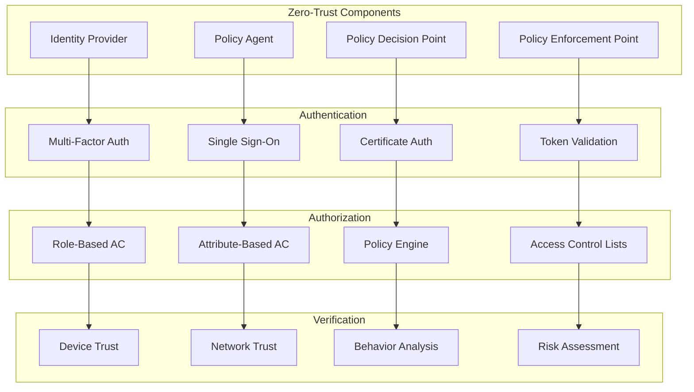

# Security Architecture

## Overview

The MAOS security architecture implements a comprehensive defense-in-depth strategy with zero-trust principles, end-to-end encryption, and multi-layered access controls. The architecture ensures data confidentiality, integrity, and availability while maintaining compliance with security standards.

## Security Principles

### 1. Zero-Trust Architecture



### 2. Security Layers

#### Network Security
```typescript
interface NetworkSecurityConfig {
  firewallRules: FirewallRule[];
  networkPolicies: NetworkPolicy[];
  tlsConfig: TLSConfiguration;
  vpnConfig?: VPNConfiguration;
  intrusion: {
    detection: boolean;
    prevention: boolean;
    monitoring: boolean;
  };
}

class NetworkSecurityManager {
  private firewallManager: FirewallManager;
  private tlsManager: TLSManager;
  private intrusionDetection: IntrusionDetectionSystem;
  
  constructor(config: NetworkSecurityConfig) {
    this.firewallManager = new FirewallManager(config.firewallRules);
    this.tlsManager = new TLSManager(config.tlsConfig);
    this.intrusionDetection = new IntrusionDetectionSystem(config.intrusion);
  }
  
  async secureConnection(request: ConnectionRequest): Promise<SecureConnection> {
    // Step 1: Firewall validation
    const firewallResult = await this.firewallManager.validateConnection(request);
    if (!firewallResult.allowed) {
      throw new SecurityError('Connection blocked by firewall', firewallResult.reason);
    }
    
    // Step 2: TLS handshake
    const tlsConnection = await this.tlsManager.establishConnection(request);
    
    // Step 3: Certificate validation
    const certValidation = await this.validateCertificate(tlsConnection.certificate);
    if (!certValidation.valid) {
      throw new SecurityError('Invalid certificate', certValidation.errors);
    }
    
    // Step 4: Intrusion detection
    await this.intrusionDetection.analyzeConnection(request, tlsConnection);
    
    return {
      id: generateConnectionId(),
      encrypted: true,
      tlsVersion: tlsConnection.version,
      cipherSuite: tlsConnection.cipherSuite,
      certificate: tlsConnection.certificate,
      establishedAt: new Date()
    };
  }
  
  async monitorTraffic(connection: SecureConnection): Promise<void> {
    // Continuous monitoring for anomalies
    const trafficAnalyzer = new TrafficAnalyzer();
    
    trafficAnalyzer.on('anomaly', async (anomaly: TrafficAnomaly) => {
      await this.handleSecurityEvent({
        type: 'traffic_anomaly',
        severity: anomaly.severity,
        connectionId: connection.id,
        details: anomaly,
        timestamp: new Date()
      });
    });
    
    trafficAnalyzer.start(connection);
  }
}
```

#### Application Security
```typescript
interface ApplicationSecurityConfig {
  authentication: AuthenticationConfig;
  authorization: AuthorizationConfig;
  inputValidation: ValidationConfig;
  outputSanitization: SanitizationConfig;
  rateLimiting: RateLimitConfig;
  contentSecurity: ContentSecurityConfig;
}

class ApplicationSecurityManager {
  private authManager: AuthenticationManager;
  private authzManager: AuthorizationManager;
  private validator: InputValidator;
  private sanitizer: OutputSanitizer;
  private rateLimiter: RateLimiter;
  
  constructor(config: ApplicationSecurityConfig) {
    this.authManager = new AuthenticationManager(config.authentication);
    this.authzManager = new AuthorizationManager(config.authorization);
    this.validator = new InputValidator(config.inputValidation);
    this.sanitizer = new OutputSanitizer(config.outputSanitization);
    this.rateLimiter = new RateLimiter(config.rateLimiting);
  }
  
  async secureRequest(request: HTTPRequest): Promise<SecuredRequest> {
    // Step 1: Rate limiting
    const rateLimitResult = await this.rateLimiter.checkLimit(request);
    if (!rateLimitResult.allowed) {
      throw new SecurityError('Rate limit exceeded', rateLimitResult);
    }
    
    // Step 2: Authentication
    const authResult = await this.authManager.authenticate(request);
    if (!authResult.authenticated) {
      throw new SecurityError('Authentication failed', authResult.reason);
    }
    
    // Step 3: Authorization
    const authzResult = await this.authzManager.authorize(
      authResult.principal,
      request.resource,
      request.action
    );
    if (!authzResult.authorized) {
      throw new SecurityError('Access denied', authzResult.reason);
    }
    
    // Step 4: Input validation
    const validationResult = await this.validator.validate(request.body);
    if (!validationResult.valid) {
      throw new SecurityError('Invalid input', validationResult.errors);
    }
    
    return {
      ...request,
      principal: authResult.principal,
      permissions: authzResult.permissions,
      validated: true,
      securityContext: {
        sessionId: authResult.sessionId,
        ipAddress: request.clientIP,
        userAgent: request.userAgent,
        timestamp: new Date()
      }
    };
  }
  
  async secureResponse(response: HTTPResponse): Promise<SecuredResponse> {
    // Output sanitization
    const sanitizedBody = await this.sanitizer.sanitize(response.body);
    
    // Security headers
    const securityHeaders = {
      'X-Content-Type-Options': 'nosniff',
      'X-Frame-Options': 'DENY',
      'X-XSS-Protection': '1; mode=block',
      'Strict-Transport-Security': 'max-age=31536000; includeSubDomains',
      'Content-Security-Policy': this.generateCSP(),
      'Referrer-Policy': 'strict-origin-when-cross-origin'
    };
    
    return {
      ...response,
      body: sanitizedBody,
      headers: {
        ...response.headers,
        ...securityHeaders
      }
    };
  }
}
```

### 3. Encryption and Key Management

#### Encryption Manager
```typescript
interface EncryptionConfig {
  algorithm: EncryptionAlgorithm;
  keySize: number;
  mode: EncryptionMode;
  padding: PaddingScheme;
  keyDerivation: KeyDerivationConfig;
}

enum EncryptionAlgorithm {
  AES = 'aes',
  ChaCha20 = 'chacha20',
  RSA = 'rsa',
  ECC = 'ecc'
}

class EncryptionManager {
  private keyManager: KeyManager;
  private algorithms: Map<EncryptionAlgorithm, CryptographicAlgorithm>;
  
  constructor(keyManager: KeyManager) {
    this.keyManager = keyManager;
    this.algorithms = new Map([
      [EncryptionAlgorithm.AES, new AESAlgorithm()],
      [EncryptionAlgorithm.ChaCha20, new ChaCha20Algorithm()],
      [EncryptionAlgorithm.RSA, new RSAAlgorithm()],
      [EncryptionAlgorithm.ECC, new ECCAlgorithm()]
    ]);
  }
  
  async encrypt(
    data: Buffer,
    config: EncryptionConfig,
    keyId?: string
  ): Promise<EncryptedData> {
    const algorithm = this.algorithms.get(config.algorithm);
    if (!algorithm) {
      throw new Error(`Unsupported encryption algorithm: ${config.algorithm}`);
    }
    
    // Get or generate encryption key
    const encryptionKey = keyId 
      ? await this.keyManager.getKey(keyId)
      : await this.keyManager.generateKey(config);
    
    // Generate initialization vector
    const iv = crypto.randomBytes(algorithm.getIVSize());
    
    // Encrypt data
    const cipher = crypto.createCipher(algorithm.getCipherName(config), encryptionKey.key);
    cipher.setAutoPadding(true);
    
    let encrypted = Buffer.concat([
      cipher.update(data),
      cipher.final()
    ]);
    
    // Generate authentication tag (for AEAD modes)
    const authTag = cipher.getAuthTag ? cipher.getAuthTag() : Buffer.alloc(0);
    
    return {
      algorithm: config.algorithm,
      mode: config.mode,
      keyId: encryptionKey.id,
      iv: iv.toString('base64'),
      authTag: authTag.toString('base64'),
      data: encrypted.toString('base64'),
      timestamp: new Date()
    };
  }
  
  async decrypt(encryptedData: EncryptedData): Promise<Buffer> {
    const algorithm = this.algorithms.get(encryptedData.algorithm);
    if (!algorithm) {
      throw new Error(`Unsupported encryption algorithm: ${encryptedData.algorithm}`);
    }
    
    // Get decryption key
    const decryptionKey = await this.keyManager.getKey(encryptedData.keyId);
    
    // Create decipher
    const decipher = crypto.createDecipher(
      algorithm.getCipherName({ algorithm: encryptedData.algorithm, mode: encryptedData.mode }),
      decryptionKey.key
    );
    
    // Set authentication tag (for AEAD modes)
    if (encryptedData.authTag && decipher.setAuthTag) {
      decipher.setAuthTag(Buffer.from(encryptedData.authTag, 'base64'));
    }
    
    // Decrypt data
    const encrypted = Buffer.from(encryptedData.data, 'base64');
    const decrypted = Buffer.concat([
      decipher.update(encrypted),
      decipher.final()
    ]);
    
    return decrypted;
  }
  
  async rotateKey(keyId: string): Promise<KeyRotationResult> {
    const oldKey = await this.keyManager.getKey(keyId);
    const newKey = await this.keyManager.generateKey({
      algorithm: oldKey.algorithm,
      keySize: oldKey.size
    });
    
    // Re-encrypt all data using the old key
    const dataToReencrypt = await this.findDataEncryptedWithKey(keyId);
    const reencryptionResults: ReencryptionResult[] = [];
    
    for (const data of dataToReencrypt) {
      try {
        const decrypted = await this.decrypt(data);
        const reencrypted = await this.encrypt(decrypted, {
          algorithm: newKey.algorithm,
          keySize: newKey.size,
          mode: data.mode,
          padding: oldKey.padding
        }, newKey.id);
        
        await this.updateEncryptedData(data.id, reencrypted);
        reencryptionResults.push({ dataId: data.id, success: true });
      } catch (error) {
        reencryptionResults.push({ 
          dataId: data.id, 
          success: false, 
          error: error.message 
        });
      }
    }
    
    // Mark old key for deletion
    await this.keyManager.scheduleKeyDeletion(keyId, 30); // 30 days retention
    
    return {
      oldKeyId: keyId,
      newKeyId: newKey.id,
      reencryptionResults,
      completedAt: new Date()
    };
  }
}
```

#### Key Management System
```typescript
interface KeyManager {
  generateKey(config: KeyGenerationConfig): Promise<CryptographicKey>;
  getKey(keyId: string): Promise<CryptographicKey>;
  rotateKey(keyId: string): Promise<KeyRotationResult>;
  revokeKey(keyId: string): Promise<void>;
  scheduleKeyDeletion(keyId: string, retentionDays: number): Promise<void>;
}

class HardwareSecurityModuleKeyManager implements KeyManager {
  private hsm: HSMClient;
  private keyStore: KeyStore;
  private auditLogger: AuditLogger;
  
  constructor(hsmConfig: HSMConfig) {
    this.hsm = new HSMClient(hsmConfig);
    this.keyStore = new KeyStore();
    this.auditLogger = new AuditLogger();
  }
  
  async generateKey(config: KeyGenerationConfig): Promise<CryptographicKey> {
    // Validate key generation parameters
    this.validateKeyConfig(config);
    
    // Generate key in HSM
    const keyId = generateKeyId();
    const hsmKeyHandle = await this.hsm.generateKey({
      keyId,
      algorithm: config.algorithm,
      keySize: config.keySize,
      usage: config.usage,
      extractable: false // Keys cannot be extracted from HSM
    });
    
    // Store key metadata
    const keyMetadata: KeyMetadata = {
      id: keyId,
      algorithm: config.algorithm,
      size: config.keySize,
      usage: config.usage,
      createdAt: new Date(),
      status: 'active',
      hsmHandle: hsmKeyHandle,
      version: 1
    };
    
    await this.keyStore.storeMetadata(keyMetadata);
    
    // Audit log
    await this.auditLogger.logKeyGeneration({
      keyId,
      algorithm: config.algorithm,
      requestedBy: config.requestedBy,
      timestamp: new Date()
    });
    
    return {
      id: keyId,
      algorithm: config.algorithm,
      size: config.keySize,
      // Key material is not returned - stays in HSM
      metadata: keyMetadata
    };
  }
  
  async performCryptographicOperation(
    operation: CryptographicOperation,
    keyId: string,
    data: Buffer
  ): Promise<Buffer> {
    const keyMetadata = await this.keyStore.getMetadata(keyId);
    if (!keyMetadata) {
      throw new Error(`Key ${keyId} not found`);
    }
    
    if (keyMetadata.status !== 'active') {
      throw new Error(`Key ${keyId} is not active`);
    }
    
    // Validate operation is allowed for this key
    if (!keyMetadata.usage.includes(operation)) {
      throw new Error(`Operation ${operation} not allowed for key ${keyId}`);
    }
    
    // Perform operation in HSM
    const result = await this.hsm.performOperation({
      operation,
      keyHandle: keyMetadata.hsmHandle,
      data
    });
    
    // Audit log
    await this.auditLogger.logCryptographicOperation({
      keyId,
      operation,
      dataSize: data.length,
      timestamp: new Date()
    });
    
    return result;
  }
  
  async rotateKey(keyId: string): Promise<KeyRotationResult> {
    const oldKeyMetadata = await this.keyStore.getMetadata(keyId);
    if (!oldKeyMetadata) {
      throw new Error(`Key ${keyId} not found`);
    }
    
    // Generate new version of the key
    const newKeyConfig: KeyGenerationConfig = {
      algorithm: oldKeyMetadata.algorithm,
      keySize: oldKeyMetadata.size,
      usage: oldKeyMetadata.usage,
      requestedBy: 'system' // Key rotation
    };
    
    const newKey = await this.generateKey(newKeyConfig);
    
    // Update key metadata to link versions
    await this.keyStore.updateMetadata(keyId, {
      status: 'rotated',
      rotatedAt: new Date(),
      successor: newKey.id
    });
    
    await this.keyStore.updateMetadata(newKey.id, {
      predecessor: keyId,
      version: oldKeyMetadata.version + 1
    });
    
    // Schedule old key for deletion
    await this.scheduleKeyDeletion(keyId, 30);
    
    return {
      oldKeyId: keyId,
      newKeyId: newKey.id,
      rotatedAt: new Date()
    };
  }
}
```

### 4. Access Control and Authorization

#### Role-Based Access Control (RBAC)
```typescript
interface Role {
  id: string;
  name: string;
  description: string;
  permissions: Permission[];
  inherits?: string[]; // Role inheritance
  constraints?: RoleConstraint[];
}

interface Permission {
  id: string;
  resource: string;
  action: string;
  conditions?: PermissionCondition[];
}

interface PermissionCondition {
  attribute: string;
  operator: 'eq' | 'neq' | 'gt' | 'lt' | 'in' | 'contains';
  value: any;
}

class RBACManager {
  private roleStore: RoleStore;
  private userRoleStore: UserRoleStore;
  private permissionEvaluator: PermissionEvaluator;
  
  constructor() {
    this.roleStore = new RoleStore();
    this.userRoleStore = new UserRoleStore();
    this.permissionEvaluator = new PermissionEvaluator();
  }
  
  async authorize(
    principal: Principal,
    resource: string,
    action: string,
    context?: AuthorizationContext
  ): Promise<AuthorizationResult> {
    // Get user roles
    const userRoles = await this.getUserRoles(principal.id);
    
    // Collect all permissions from roles (including inherited)
    const allPermissions = await this.collectPermissions(userRoles);
    
    // Find matching permissions
    const matchingPermissions = allPermissions.filter(permission =>
      this.matchesResource(permission.resource, resource) &&
      this.matchesAction(permission.action, action)
    );
    
    if (matchingPermissions.length === 0) {
      return {
        authorized: false,
        reason: 'No matching permissions found',
        principal: principal.id,
        resource,
        action
      };
    }
    
    // Evaluate permission conditions
    for (const permission of matchingPermissions) {
      const conditionResult = await this.evaluateConditions(
        permission.conditions || [],
        principal,
        context
      );
      
      if (conditionResult.satisfied) {
        return {
          authorized: true,
          permission: permission.id,
          principal: principal.id,
          resource,
          action,
          evaluatedConditions: conditionResult.conditions
        };
      }
    }
    
    return {
      authorized: false,
      reason: 'Permission conditions not satisfied',
      principal: principal.id,
      resource,
      action
    };
  }
  
  private async evaluateConditions(
    conditions: PermissionCondition[],
    principal: Principal,
    context?: AuthorizationContext
  ): Promise<ConditionEvaluationResult> {
    const evaluatedConditions: EvaluatedCondition[] = [];
    
    for (const condition of conditions) {
      const value = this.getAttributeValue(condition.attribute, principal, context);
      const satisfied = this.evaluateCondition(condition.operator, value, condition.value);
      
      evaluatedConditions.push({
        attribute: condition.attribute,
        operator: condition.operator,
        expectedValue: condition.value,
        actualValue: value,
        satisfied
      });
      
      if (!satisfied) {
        return {
          satisfied: false,
          conditions: evaluatedConditions
        };
      }
    }
    
    return {
      satisfied: true,
      conditions: evaluatedConditions
    };
  }
  
  private evaluateCondition(
    operator: string,
    actualValue: any,
    expectedValue: any
  ): boolean {
    switch (operator) {
      case 'eq':
        return actualValue === expectedValue;
      case 'neq':
        return actualValue !== expectedValue;
      case 'gt':
        return actualValue > expectedValue;
      case 'lt':
        return actualValue < expectedValue;
      case 'in':
        return Array.isArray(expectedValue) && expectedValue.includes(actualValue);
      case 'contains':
        return typeof actualValue === 'string' && actualValue.includes(expectedValue);
      default:
        return false;
    }
  }
  
  async createRole(roleDefinition: RoleDefinition): Promise<Role> {
    // Validate role definition
    await this.validateRoleDefinition(roleDefinition);
    
    // Check for circular inheritance
    if (roleDefinition.inherits) {
      await this.checkCircularInheritance(roleDefinition.name, roleDefinition.inherits);
    }
    
    const role: Role = {
      id: generateRoleId(),
      name: roleDefinition.name,
      description: roleDefinition.description,
      permissions: roleDefinition.permissions,
      inherits: roleDefinition.inherits,
      constraints: roleDefinition.constraints
    };
    
    await this.roleStore.store(role);
    
    // Audit log
    await this.auditLogger.logRoleCreation({
      roleId: role.id,
      roleName: role.name,
      permissions: role.permissions.length,
      createdBy: roleDefinition.createdBy,
      timestamp: new Date()
    });
    
    return role;
  }
}
```

#### Attribute-Based Access Control (ABAC)
```typescript
interface ABACPolicy {
  id: string;
  name: string;
  description: string;
  target: PolicyTarget;
  condition: PolicyCondition;
  effect: 'permit' | 'deny';
  obligations?: PolicyObligation[];
}

interface PolicyTarget {
  subjects?: AttributeSelector[];
  resources?: AttributeSelector[];
  actions?: AttributeSelector[];
  environment?: AttributeSelector[];
}

interface AttributeSelector {
  category: 'subject' | 'resource' | 'action' | 'environment';
  attribute: string;
  value: any;
  operator: ComparisonOperator;
}

class ABACManager {
  private policyStore: PolicyStore;
  private attributeProvider: AttributeProvider;
  private policyEvaluator: PolicyEvaluator;
  
  constructor() {
    this.policyStore = new PolicyStore();
    this.attributeProvider = new AttributeProvider();
    this.policyEvaluator = new PolicyEvaluator();
  }
  
  async evaluate(request: AuthorizationRequest): Promise<ABACDecision> {
    // Retrieve applicable policies
    const policies = await this.getApplicablePolicies(request);
    
    if (policies.length === 0) {
      return {
        decision: 'not_applicable',
        request,
        evaluatedPolicies: [],
        timestamp: new Date()
      };
    }
    
    // Collect attributes
    const attributes = await this.collectAttributes(request);
    
    // Evaluate each policy
    const policyResults: PolicyEvaluationResult[] = [];
    
    for (const policy of policies) {
      const result = await this.evaluatePolicy(policy, attributes, request);
      policyResults.push(result);
    }
    
    // Combine policy results (permit overrides deny)
    const decision = this.combineDecisions(policyResults);
    
    return {
      decision: decision.effect,
      request,
      evaluatedPolicies: policyResults,
      obligations: decision.obligations,
      timestamp: new Date()
    };
  }
  
  private async evaluatePolicy(
    policy: ABACPolicy,
    attributes: AttributeMap,
    request: AuthorizationRequest
  ): Promise<PolicyEvaluationResult> {
    // Check if policy target matches
    const targetMatch = await this.evaluateTarget(policy.target, attributes);
    
    if (!targetMatch.matches) {
      return {
        policyId: policy.id,
        effect: 'not_applicable',
        targetMatch,
        conditionEvaluation: null
      };
    }
    
    // Evaluate policy condition
    const conditionEvaluation = await this.evaluateCondition(
      policy.condition,
      attributes
    );
    
    const effect = conditionEvaluation.result ? policy.effect : 
                   (policy.effect === 'permit' ? 'deny' : 'permit');
    
    return {
      policyId: policy.id,
      effect,
      targetMatch,
      conditionEvaluation,
      obligations: effect === 'permit' ? policy.obligations : undefined
    };
  }
  
  private async collectAttributes(
    request: AuthorizationRequest
  ): Promise<AttributeMap> {
    const attributes: AttributeMap = {};
    
    // Subject attributes
    attributes.subject = await this.attributeProvider.getSubjectAttributes(
      request.subject
    );
    
    // Resource attributes
    attributes.resource = await this.attributeProvider.getResourceAttributes(
      request.resource
    );
    
    // Action attributes
    attributes.action = await this.attributeProvider.getActionAttributes(
      request.action
    );
    
    // Environment attributes
    attributes.environment = await this.attributeProvider.getEnvironmentAttributes(
      request.environment
    );
    
    return attributes;
  }
  
  async createPolicy(policyDefinition: PolicyDefinition): Promise<ABACPolicy> {
    // Validate policy syntax
    await this.validatePolicyDefinition(policyDefinition);
    
    // Check for policy conflicts
    await this.checkPolicyConflicts(policyDefinition);
    
    const policy: ABACPolicy = {
      id: generatePolicyId(),
      name: policyDefinition.name,
      description: policyDefinition.description,
      target: policyDefinition.target,
      condition: policyDefinition.condition,
      effect: policyDefinition.effect,
      obligations: policyDefinition.obligations
    };
    
    await this.policyStore.store(policy);
    
    // Test policy (dry run)
    const testResults = await this.testPolicy(policy);
    
    // Audit log
    await this.auditLogger.logPolicyCreation({
      policyId: policy.id,
      policyName: policy.name,
      effect: policy.effect,
      testResults,
      createdBy: policyDefinition.createdBy,
      timestamp: new Date()
    });
    
    return policy;
  }
}
```

### 5. Security Monitoring and Incident Response

#### Security Information and Event Management (SIEM)
```typescript
interface SecurityEvent {
  id: string;
  timestamp: Date;
  source: string;
  type: SecurityEventType;
  severity: SecuritySeverity;
  details: Record<string, any>;
  tags: string[];
  correlationId?: string;
  raw?: any;
}

enum SecurityEventType {
  AUTHENTICATION_FAILURE = 'authentication_failure',
  AUTHORIZATION_FAILURE = 'authorization_failure',
  SUSPICIOUS_ACTIVITY = 'suspicious_activity',
  INTRUSION_ATTEMPT = 'intrusion_attempt',
  DATA_ACCESS = 'data_access',
  PRIVILEGE_ESCALATION = 'privilege_escalation',
  MALWARE_DETECTION = 'malware_detection',
  POLICY_VIOLATION = 'policy_violation'
}

class SIEMManager {
  private eventCollector: EventCollector;
  private eventCorrelator: EventCorrelator;
  private threatDetector: ThreatDetector;
  private incidentManager: IncidentManager;
  private alertManager: AlertManager;
  
  constructor() {
    this.eventCollector = new EventCollector();
    this.eventCorrelator = new EventCorrelator();
    this.threatDetector = new ThreatDetector();
    this.incidentManager = new IncidentManager();
    this.alertManager = new AlertManager();
  }
  
  async processSecurityEvent(event: SecurityEvent): Promise<void> {
    // Store event
    await this.eventCollector.store(event);
    
    // Correlate with other events
    const correlationResult = await this.eventCorrelator.correlate(event);
    
    // Detect threats
    const threats = await this.threatDetector.analyze(event, correlationResult);
    
    // Handle detected threats
    for (const threat of threats) {
      await this.handleThreat(threat);
    }
    
    // Update event with correlation and threat information
    await this.eventCollector.update(event.id, {
      correlationId: correlationResult.correlationId,
      relatedEvents: correlationResult.relatedEvents,
      threats: threats.map(t => t.id)
    });
  }
  
  private async handleThreat(threat: DetectedThreat): Promise<void> {
    // Create or update incident
    const incident = await this.incidentManager.handleThreat(threat);
    
    // Generate alerts if necessary
    if (threat.severity >= SecuritySeverity.HIGH) {
      await this.alertManager.createAlert({
        type: 'security_threat',
        severity: threat.severity,
        title: `${threat.type} detected`,
        description: threat.description,
        incidentId: incident.id,
        threatId: threat.id,
        timestamp: new Date()
      });
    }
    
    // Automated response
    await this.executeAutomatedResponse(threat, incident);
  }
  
  private async executeAutomatedResponse(
    threat: DetectedThreat,
    incident: SecurityIncident
  ): Promise<void> {
    const responseActions = await this.getResponseActions(threat.type, threat.severity);
    
    for (const action of responseActions) {
      try {
        await this.executeResponseAction(action, threat, incident);
        
        await this.incidentManager.addNote(incident.id, {
          type: 'automated_action',
          action: action.type,
          status: 'completed',
          timestamp: new Date()
        });
      } catch (error) {
        await this.incidentManager.addNote(incident.id, {
          type: 'automated_action_failed',
          action: action.type,
          error: error.message,
          timestamp: new Date()
        });
      }
    }
  }
  
  private async executeResponseAction(
    action: ResponseAction,
    threat: DetectedThreat,
    incident: SecurityIncident
  ): Promise<void> {
    switch (action.type) {
      case 'block_ip':
        await this.networkSecurityManager.blockIP(
          threat.sourceIP,
          action.parameters.duration
        );
        break;
        
      case 'disable_user':
        await this.identityManager.disableUser(
          threat.userId,
          `Security incident ${incident.id}`
        );
        break;
        
      case 'quarantine_resource':
        await this.resourceManager.quarantineResource(
          threat.resourceId,
          `Security incident ${incident.id}`
        );
        break;
        
      case 'rotate_credentials':
        await this.credentialManager.rotateCredentials(
          threat.credentialId
        );
        break;
        
      case 'increase_monitoring':
        await this.monitoringManager.increaseMonitoring(
          threat.targetSystems,
          action.parameters.duration
        );
        break;
        
      default:
        throw new Error(`Unknown response action: ${action.type}`);
    }
  }
}
```

#### Incident Response System
```typescript
interface SecurityIncident {
  id: string;
  title: string;
  description: string;
  severity: SecuritySeverity;
  status: IncidentStatus;
  category: IncidentCategory;
  assignee?: string;
  reporter: string;
  createdAt: Date;
  updatedAt: Date;
  closedAt?: Date;
  threats: DetectedThreat[];
  timeline: IncidentEvent[];
  notes: IncidentNote[];
  artifacts: IncidentArtifact[];
}

enum IncidentStatus {
  NEW = 'new',
  INVESTIGATING = 'investigating',
  CONTAINING = 'containing',
  ERADICATING = 'eradicating',
  RECOVERING = 'recovering',
  LESSONS_LEARNED = 'lessons_learned',
  CLOSED = 'closed'
}

class IncidentResponseManager {
  private incidentStore: IncidentStore;
  private responseTeam: ResponseTeam;
  private forensicsService: ForensicsService;
  private communicationManager: CommunicationManager;
  
  constructor() {
    this.incidentStore = new IncidentStore();
    this.responseTeam = new ResponseTeam();
    this.forensicsService = new ForensicsService();
    this.communicationManager = new CommunicationManager();
  }
  
  async createIncident(
    incidentData: CreateIncidentRequest
  ): Promise<SecurityIncident> {
    const incident: SecurityIncident = {
      id: generateIncidentId(),
      title: incidentData.title,
      description: incidentData.description,
      severity: incidentData.severity,
      status: IncidentStatus.NEW,
      category: incidentData.category,
      reporter: incidentData.reporter,
      createdAt: new Date(),
      updatedAt: new Date(),
      threats: [],
      timeline: [{
        type: 'incident_created',
        timestamp: new Date(),
        actor: incidentData.reporter,
        description: 'Incident created'
      }],
      notes: [],
      artifacts: []
    };
    
    await this.incidentStore.store(incident);
    
    // Auto-assign based on severity and category
    const assignee = await this.responseTeam.getAssignee(
      incident.severity,
      incident.category
    );
    
    if (assignee) {
      await this.assignIncident(incident.id, assignee.id);
    }
    
    // Notify stakeholders
    await this.notifyStakeholders(incident);
    
    return incident;
  }
  
  async updateIncidentStatus(
    incidentId: string,
    newStatus: IncidentStatus,
    updatedBy: string,
    notes?: string
  ): Promise<void> {
    const incident = await this.incidentStore.get(incidentId);
    if (!incident) {
      throw new Error(`Incident ${incidentId} not found`);
    }
    
    const oldStatus = incident.status;
    incident.status = newStatus;
    incident.updatedAt = new Date();
    
    // Add timeline event
    incident.timeline.push({
      type: 'status_changed',
      timestamp: new Date(),
      actor: updatedBy,
      description: `Status changed from ${oldStatus} to ${newStatus}`,
      details: { oldStatus, newStatus, notes }
    });
    
    // Execute status-specific actions
    await this.executeStatusActions(incident, newStatus);
    
    await this.incidentStore.update(incident);
    
    // Notify stakeholders of status change
    await this.notifyStatusChange(incident, oldStatus, newStatus);
  }
  
  private async executeStatusActions(
    incident: SecurityIncident,
    status: IncidentStatus
  ): Promise<void> {
    switch (status) {
      case IncidentStatus.INVESTIGATING:
        await this.startInvestigation(incident);
        break;
        
      case IncidentStatus.CONTAINING:
        await this.startContainment(incident);
        break;
        
      case IncidentStatus.ERADICATING:
        await this.startEradication(incident);
        break;
        
      case IncidentStatus.RECOVERING:
        await this.startRecovery(incident);
        break;
        
      case IncidentStatus.CLOSED:
        await this.closeIncident(incident);
        break;
    }
  }
  
  private async startInvestigation(incident: SecurityIncident): Promise<void> {
    // Start forensic data collection
    const forensicsJob = await this.forensicsService.startCollection({
      incidentId: incident.id,
      scope: this.determineForensicsScope(incident),
      priority: this.mapSeverityToPriority(incident.severity)
    });
    
    incident.artifacts.push({
      type: 'forensics_job',
      id: forensicsJob.id,
      status: 'collecting',
      createdAt: new Date()
    });
    
    // Preserve evidence
    for (const threat of incident.threats) {
      if (threat.sourceIP) {
        await this.forensicsService.preserveNetworkLogs({
          ip: threat.sourceIP,
          timeRange: {
            start: new Date(incident.createdAt.getTime() - 3600000), // 1 hour before
            end: new Date()
          }
        });
      }
    }
  }
  
  private async startContainment(incident: SecurityIncident): Promise<void> {
    // Implement containment measures based on incident type
    const containmentActions = await this.getContainmentActions(incident);
    
    for (const action of containmentActions) {
      try {
        await this.executeContainmentAction(action, incident);
        
        incident.notes.push({
          type: 'containment_action',
          content: `Executed containment action: ${action.type}`,
          author: 'system',
          timestamp: new Date()
        });
      } catch (error) {
        incident.notes.push({
          type: 'containment_action_failed',
          content: `Failed to execute containment action: ${action.type} - ${error.message}`,
          author: 'system',
          timestamp: new Date()
        });
      }
    }
  }
  
  async generateIncidentReport(incidentId: string): Promise<IncidentReport> {
    const incident = await this.incidentStore.get(incidentId);
    if (!incident) {
      throw new Error(`Incident ${incidentId} not found`);
    }
    
    const report: IncidentReport = {
      incident,
      summary: this.generateSummary(incident),
      timeline: incident.timeline,
      rootCause: await this.analyzeRootCause(incident),
      impact: await this.assessImpact(incident),
      lessonsLearned: await this.extractLessonsLearned(incident),
      recommendations: await this.generateRecommendations(incident),
      generatedAt: new Date()
    };
    
    return report;
  }
}