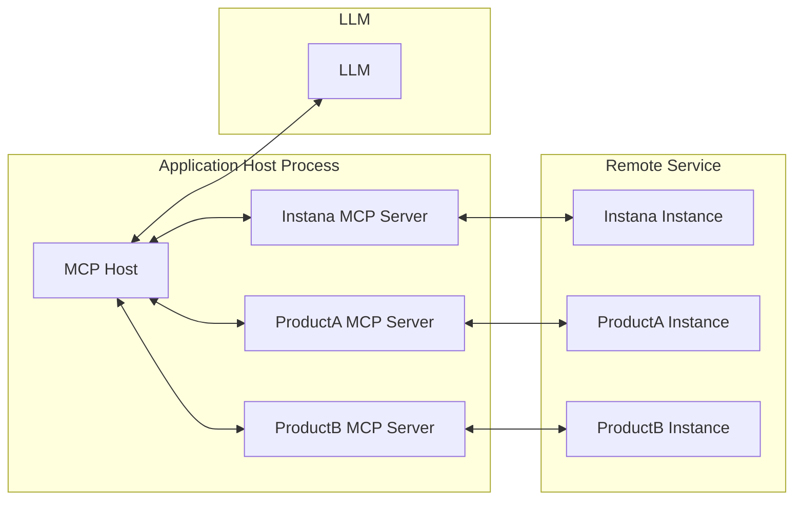
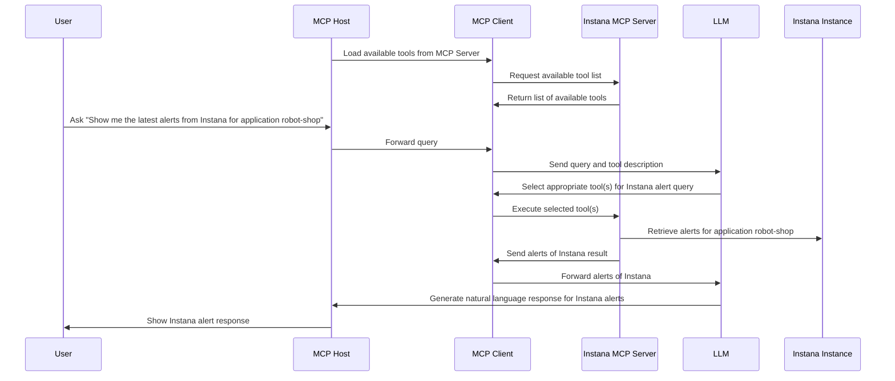

<!-- START doctoc generated TOC please keep comment here to allow auto update -->
<!-- DON'T EDIT THIS SECTION, INSTEAD RE-RUN doctoc TO UPDATE -->
**Table of Contents**

- [MCP Server for IBM Instana](#mcp-server-for-ibm-instana)
  - [Architecture Overview](#architecture-overview)
  - [Workflow](#workflow)
  - [Prerequisites](#prerequisites)
    - [Installing uv](#installing-uv)
    - [Setting Up the Environment](#setting-up-the-environment)
    - [Header-Based Authentication for Streamable HTTP Mode](#header-based-authentication-for-streamable-http-mode)
  - [Starting the Local MCP Server](#starting-the-local-mcp-server)
    - [Server Command Options](#server-command-options)
    - [Starting in Streamable HTTP Mode](#starting-in-streamable-http-mode)
    - [Starting in Stdio Mode](#starting-in-stdio-mode)
    - [Tool Categories](#tool-categories)
    - [Verifying Server Status](#verifying-server-status)
    - [Common Startup Issues](#common-startup-issues)
  - [Setup and Usage](#setup-and-usage)
    - [Claude Desktop](#claude-desktop)
      - [Streamable HTTP Mode](#streamable-http-mode)
      - [Stdio Mode](#stdio-mode)
    - [GitHub Copilot](#github-copilot)
      - [Streamable HTTP Mode](#streamable-http-mode-1)
      - [Stdio Mode](#stdio-mode-1)
  - [Supported Features](#supported-features)
  - [Available Tools](#available-tools)
  - [Tool Filtering](#tool-filtering)
    - [Available Tool Categories](#available-tool-categories)
    - [Usage Examples](#usage-examples)
    - [Benefits of Tool Filtering](#benefits-of-tool-filtering)
  - [Example Prompts](#example-prompts)
  - [Troubleshooting](#troubleshooting)

<!-- END doctoc generated TOC please keep comment here to allow auto update -->

# MCP Server for IBM Instana

The Instana MCP server enables seamless interaction with the Instana observability platform, allowing you to access real-time observability data directly within your development workflow.

It serves as a bridge between clients (such as AI agents or custom tools) and the Instana REST APIs, converting user queries into Instana API requests and formatting the responses into structured, easily consumable formats.

The server supports both **Streamable HTTP** and **Stdio** transport modes for maximum compatibility with different MCP clients. For more details, refer to the [MCP Transport Modes specification](https://modelcontextprotocol.io/specification/2025-06-18/basic/transports).

## Architecture Overview



## Workflow

Consider a simple example: You're using an MCP Host (such as Claude Desktop, VS Code, or another client) connected to the Instana MCP Server. When you request information about Instana alerts, the following process occurs:

1. The MCP client retrieves the list of available tools from the Instana MCP server
2. Your query is sent to the LLM along with tool descriptions
3. The LLM analyzes the available tools and selects the appropriate one(s) for retrieving Instana alerts
4. The client executes the chosen tool(s) through the Instana MCP server
5. Results (latest alerts) are returned to the LLM
6. The LLM formulates a natural language response
7. The response is displayed to you



## Prerequisites

### Installing uv

This project uses `uv`, a fast Python package installer and resolver. To install `uv`, you have several options:

**Using pip:**
```shell
pip install uv
```

**Using Homebrew (macOS):**
```shell
brew install uv
```

For more installation options and detailed instructions, visit the [uv documentation](https://github.com/astral-sh/uv).

### Setting Up the Environment

After installing `uv`, set up the project environment by running:

```shell
uv sync
```

### Header-Based Authentication for Streamable HTTP Mode

When using **Streamable HTTP mode**, you must pass Instana credentials via HTTP headers. This approach enhances security and flexibility by:

- Avoiding credential storage in environment variables
- Enabling the use of different credentials for different requests
- Supporting shared environments where environment variable modification is restricted

**Required Headers:**
- `instana-base-url`: Your Instana instance URL
- `instana-api-token`: Your Instana API token

**Authentication Flow:**
1. HTTP headers (`instana-base-url`, `instana-api-token`) must be present in each request
2. Requests without these headers will fail

This design ensures secure credential transmission where credentials are only sent via headers for each request, making it suitable for scenarios requiring different credentials or avoiding credential storage in environment variables.

## Starting the Local MCP Server

Before configuring any MCP client (Claude Desktop, GitHub Copilot, or custom MCP clients), you need to start the local MCP server. The server supports two transport modes: **Streamable HTTP** and **Stdio**.

### Server Command Options

The MCP server (`src/core/server.py`) supports the following command-line options:

```bash
uv run src/core/server.py [OPTIONS]
```

**Available Options:**
- `--transport <mode>`: Transport mode (choices: `streamable-http`, `stdio`)
- `--debug`: Enable debug mode with additional logging
- `--log-level <level>`: Set the logging level (choices: `DEBUG`, `INFO`, `WARNING`, `ERROR`, `CRITICAL`)
- `--tools <categories>`: Comma-separated list of tool categories to enable (e.g., `infra,app,events`)
- `--list-tools`: List all available tool categories and exit
- `--port <port>`: Port to listen on (default: 8000)
- `--help`: Show help message and exit

### Starting in Streamable HTTP Mode

**Streamable HTTP mode** provides a REST API interface and is recommended for most use cases:

```bash
# Start with all tools enabled (default)
uv run src/core/server.py --transport streamable-http

# Start with debug logging
uv run src/core/server.py --transport streamable-http --debug

# Start with a specific log level
uv run src/core/server.py --transport streamable-http --log-level WARNING

# Start with specific tool categories only
uv run src/core/server.py --transport streamable-http --tools infra,events

# Combine options (specific log level, custom tools)
uv run src/core/server.py --transport streamable-http --log-level DEBUG --tools app,events
```

**Key Features of Streamable HTTP Mode:**
- Uses HTTP headers for authentication (no environment variables needed)
- Supports different credentials per request
- Better suited for shared environments
- Default port: 8000
- Endpoint: `http://0.0.0.0:8000/mcp/`

### Starting in Stdio Mode

**Stdio mode** uses standard input/output for communication and requires environment variables for authentication:

```bash
# Set environment variables first
export INSTANA_BASE_URL="https://your-instana-instance.instana.io"
export INSTANA_API_TOKEN="your_instana_api_token"

# Start the server (stdio is the default if no transport specified)
uv run src/core/server.py

# Or explicitly specify stdio mode
uv run src/core/server.py --transport stdio
```

**Key Features of Stdio Mode:**
- Uses environment variables for authentication
- Direct communication via stdin/stdout
- Required for certain MCP client configurations

### Tool Categories

You can optimize server performance by enabling only the tool categories you need:

```bash
# List all available categories
uv run src/core/server.py --list-tools

# Enable specific categories
uv run src/core/server.py --transport streamable-http --tools infra,app
uv run src/core/server.py --transport streamable-http --tools events
```

**Available Categories:**
- **`infra`**: Infrastructure monitoring tools (resources, catalog, topology, analyze, metrics)
- **`app`**: Application performance tools (resources, metrics, alerts, catalog, topology, analyze)
- **`events`**: Event monitoring tools (Kubernetes events, agent monitoring)

### Verifying Server Status

Once started, you can verify the server is running:

**For Streamable HTTP mode:**
```bash
# Check server health
curl http://0.0.0.0:8000/mcp/

# Or with custom port
curl http://0.0.0.0:9000/mcp/
```

**For Stdio mode:**
The server will start and wait for stdin input from MCP clients.

### Common Startup Issues

**Certificate Issues:**
If you encounter SSL certificate errors, ensure your Python environment has access to system certificates:
```bash
# macOS - Install certificates for Python
/Applications/Python\ 3.13/Install\ Certificates.command
```

**Port Already in Use:**
If port 8000 is already in use, specify a different port:
```bash
uv run src/core/server.py --transport streamable-http --port 9000
```

**Missing Dependencies:**
Ensure all dependencies are installed:
```bash
uv sync
```

## Setup and Usage

### Claude Desktop

Claude Desktop supports both Streamable HTTP and Stdio modes for MCP integration.

Configure Claude Desktop by editing the configuration file:

**File Locations:**
- **macOS**: `~/Library/Application Support/Claude/claude_desktop_config.json`
- **Windows**: `%APPDATA%\Claude\claude_desktop_config.json`

#### Streamable HTTP Mode

The Streamable HTTP mode provides a REST API interface for MCP communication using JSON-RPC over HTTP.

**Step 1: Start the MCP Server in Streamable HTTP Mode**

Before configuring Claude Desktop, you need to start the MCP server in Streamable HTTP mode. Please refer to the [Starting the Local MCP Server](#starting-the-local-mcp-server) section for detailed instructions.

**Step 2: Configure Claude Desktop**

Configure Claude Desktop to pass Instana credentials via headers:

```json:claude_desktop_config.json
{
  "mcpServers": {
    "Instana MCP Server": {
      "command": "npx",
      "args": [
         "mcp-remote", "http://0.0.0.0:8000/mcp/",
        "--header", "instana-base-url: https://your-instana-instance.instana.io",
        "--header", "instana-api-token: your_instana_api_token"
      ]
    }
  }
}
```

**Note:** To use npx, we recommend first installing NVM (Node Version Manager), then using it to install Node.js.
Installation instructions are available at: https://nodejs.org/en/download

**Step 3: Test the Connection**

Restart Claude Desktop. You should now see Instana MCP Server in the Claude Desktop interface as shown below:


You can now run queries in Claude Desktop:

```
get me all endpoints from Instana
```


#### Stdio Mode

**Configuration:**

```json
{
  "mcpServers": {
    "Instana MCP Server": {
      "command": "uv",
      "args": [
        "--directory",
        "<path-to-mcp-instana-folder>",
        "run",
        "src/core/server.py"
      ],
      "env": {
        "INSTANA_BASE_URL": "https://your-instana-instance.instana.io",
        "INSTANA_API_TOKEN": "your_instana_api_token"
      }
    }
  }
}
```

### GitHub Copilot

GitHub Copilot supports MCP integration through VS Code configuration.
For GitHub Copilot integration with VS Code, refer to this [setup guide](https://code.visualstudio.com/docs/copilot/setup).

#### Streamable HTTP Mode

**Step 1: Start the MCP Server in Streamable HTTP Mode**

Before configuring VS Code, you need to start the MCP server in Streamable HTTP mode. Please refer to the [Starting the Local MCP Server](#starting-the-local-mcp-server) section for detailed instructions.

**Step 2: Configure VS Code**

Refer to [Use MCP servers in VS Code](https://code.visualstudio.com/docs/copilot/chat/mcp-servers) for detailed configuration.

You can directly create or update `.vscode/mcp.json` with the following configuration:

```json:.vscode/mcp.json
{
  "servers": {
    "Instana MCP Server": {
      "command": "npx",
      "args": [
        "mcp-remote", "http://0.0.0.0:8000/mcp/",
        "--header", "instana-base-url: https://your-instana-instance.instana.io",
        "--header", "instana-api-token: your_instana_api_token"
      ],
      "env": {
        "PATH": "/usr/local/bin:/bin:/usr/bin",
        "SHELL": "/bin/sh"
      }
    }
  }
}
```

**Note:** Replace the following values with your actual configuration:
- `instana-base-url`: Your Instana instance URL
- `instana-api-token`: Your Instana API token
- `command`: Update the npx path to match your system's Node.js installation (e.g., `/path/to/your/node/bin/npx`)
- Environment variables: Adjust PATH and other environment variables as needed for your system


#### Stdio Mode

**Step 1: Create VS Code MCP Configuration**

Create `.vscode/mcp.json` in your project root:

```json:.vscode/mcp.json
{
  "servers": {
    "Instana MCP Server": {
      "command": "uv",
      "args": [
        "--directory",
        "/absolute/path/to/your/project/mcp-instana",
        "run",
        "src/core/server.py"
      ],
      "env": {
        "INSTANA_BASE_URL": "https://your-instana-instance.instana.io",
        "INSTANA_API_TOKEN": "your_instana_api_token"
      }
    }
  }
}
```

**Note:** Replace the following values with your actual configuration:
- `command`: Update the uv path to match your system's uv installation (e.g., `/path/to/your/uv/bin/uv` or `/usr/local/bin/uv`)
- `--directory`: Update with the absolute path to your mcp-instana project directory
- `INSTANA_BASE_URL`: Your Instana instance URL
- `INSTANA_API_TOKEN`: Your Instana API token

**Step 2: Manage Server in VS Code**

1. **Open `.vscode/mcp.json`** - you'll see server management controls at the top
2. **Click `Start`** next to `Instana MCP Server` to start the server
3. Running status along with the number of tools indicates the server is running

**Step 3: Test Integration**

Switch to Agent Mode in GitHub Copilot and reload tools.
Here is an example of a GitHub Copilot response:


## Supported Features

- [ ] Application
  - [ ] Application Metrics
    - [ ] Application Metrics
    - [ ] Endpoint Metrics
    - [ ] Service Metrics
    - [ ] Data Metrics
  - [x] Application Resources
    - [x] Get Applications Endpoints
    - [x] Get Applications
    - [x] Get Services
    - [x] Get Application Services
  - [x] Application Alert Configuration
    - [x] Get All Smart Alert Configurations
    - [x] Get Smart Alert Configuration
    - [x] Get Smart Alert Config Versions
    - [ ] Create Smart Alert Configuration
    - [ ] Update Smart Alert Configuration
    - [x] Delete Smart Alert Configuration
    - [ ] Recalculate Smart Alert Config Baseline
    - [x] Enable Application Alert Config
    - [x] Disable Smart Alert Config
    - [x] Restore Smart Alert Config
- [ ] Infrastructure
  - [ ] Infrastructure Analyze
    - [x] Get Available Metrics
    - [ ] Get infrastructure entities
    - [ ] Get grouped entities with aggregated metrics
    - [x] Get available plugins/entity types
  - [x] Infrastructure Catalog
    - [x] Get Payload Keys By plugin ID
    - [x] Get Infrastructure Catalog Metrics
    - [x] Get Infrastructure Catalog Plugins
    - [x] Get Infrastructure Catalog Plugins with Custom Metrics
    - [x] Get Infrastructure Catalog Search Fields
    - [x] Get Infrastructure Catalog Search Fields with Custom Metrics
    - [x] Get Tag Catalog
    - [x] Get Tag Catalog ALL
  - [ ] Infrastructure Resources
    - [x] Get Monitoring State
    - [ ] Get plugin Payload
    - [x] Search Snapshots
    - [x] Get Snapshot Details for single Snapshot ID
    - [x] Get Details for Multiple Snapshot IDs
    - [x] Software Versions
  - [x] Infrastructure Topology
    - [x] Get Hosts for Snapshot
    - [x] Get Topology
  - [ ] Events
    - [ ] Events
      - [ ] Get all Events
      - [x] Get Events by IDs
      - [x] Get Agent Monitoring Events
      - [x] Get Kubernetes Info Events

## Available Tools

| Tool                                                          | Category                       | Description                                            |
|---------------------------------------------------------------|--------------------------------|------------------------------------------------------- |
| `get_application_metrics`                                     | Application Metrics            | Get ApplicationMetrics                                 |
| `get_endpoints_metrics`                                       | Application Metrics            | Get Endpoint metrics                                   |
| `get_services_metrics`                                        | Application Metrics            | Get Service metrics                                    |
| `get_application_data_metrics_v2`                             | Application Metrics            | Get Application Data Metrics                           |
| `get_applications`                                            | Application Resources          | Get applications                                       |
| `get_application_services`                                    | Application Resources          | Get applications/services                              |
| `get_application_endpoints`                                   | Application Resources          | Get endpoints                                          |
| `get_services`                                                | Application Resources          | Get services                                           |
| `get_monitoring_state`                                        | Infrastructure Resources       | Monitored host count                                   |
| `get_plugin_payload`                                          | Infrastructure Resources       | Get a payload for a snapshot                           |
| `get_snapshots`                                               | Infrastructure Resources       | Search snapshots                                       |
| `post_snapshots`                                              | Infrastructure Resources       | Get snapshot details for multiple snapshots            |
| `get_snapshot`                                                | Infrastructure Resources       | Get snapshot details                                   |
| `software_versions`                                           | Infrastructure Resources       | Get installed software                                 |
| `get_available_payload_keys_by_plugin_id`                     | Infrastructure Catalog         | Get Payload Keys By plugin ID                          |
| `get_infrastructure_catalog_metrics`                          | Infrastructure Catalog         | Get Infrastructure Catalog Metrics                     |
| `get_infrastructure_catalog_plugins`                          | Infrastructure Catalog         | Get Infrastructure Catalog Plugins                     |
| `get_infrastructure_catalog_plugins_with_custom_metrics`      | Infrastructure Catalog         | Get Infrastructure Catalog Plugins with Custom Metrics |
| `get_infrastructure_catalog_search_fields`                    | Infrastructure Catalog         | Get Infrastructure Catalog Search Fields               |
| `get_tag_catalog`                                             | Infrastructure Catalog         | Get Tag Catalog                                        |
| `get_tag_catalog_all`                                         | Infrastructure Catalog         | Get Tag Catalog ALL                                    |
| `get_related_hosts`                                           | Infrastructure Topology        | Get Related Hosts                                      |
| `get_topology`                                                | Infrastructure Topology        | Get Topology                                           |
| `get_available_metrics`                                       | Infrastructure Analyze         | Get Available Metrics                                  |
| `get_entities`                                                | Infrastructure Analyze         | Get infrastructure entities                            |
| `get_aggregated_entity_groups`                                | Infrastructure Analyze         | Get grouped entities with aggregated metrics           |
| `get_available_plugins`                                       | Infrastructure Analyze         | Get available entity types                             |
| `get_application_alert_configs`                               | Application Alert Configuration| Get All Smart Alert Configurations                     |
| `find_application_alert_config`                               | Application Alert Configuration| Get Smart Alert Configuration                          |
| `find_application_alert_config_versions`                      | Application Alert Configuration| Get Smart Alert Config Versions                        |
| `create_application_alert_config`                             | Application Alert Configuration| Create Smart Alert Configuration                       |
| `update_application_alert_config`                             | Application Alert Configuration| Update Smart Alert Configuration                       |
| `delete_application_alert_config`                             | Application Alert Configuration| Delete Smart Alert Configuration                       |
| `update_application_historic_baseline`                        | Application Alert Configuration| Recalculate Smart Alert Config Baseline                |
| `enable_application_alert_config`                             | Application Alert Configuration| Enable Application Alert Config                        |
| `disable_application_alert_config`                            | Application Alert Configuration| Disable Smart Alert Config                             |
| `restore_application_alert_config`                            | Application Alert Configuration| Restore Smart Alert Config                             |
| `get_event`                                                   | Events                         | Get Events by IDs                                      |
| `get_kubernetes_info_events`                                  | Events                         | Get Kubernetes Info Events                             |
| `get_agent_monitoring_events`                                 | Events                         | Get Agent Monitoring Events                            |

## Tool Filtering

The MCP server supports selective tool loading to optimize performance and reduce resource usage. You can enable only the tool categories you need for your specific use case.

### Available Tool Categories

- **`infra`**: Infrastructure monitoring tools
  - Infrastructure Resources: Host monitoring, snapshot management, software inventory
  - Infrastructure Catalog: Plugin metadata, metrics definitions, tag management
  - Infrastructure Topology: Host relationships and system topology visualization
  - Infrastructure Analyze: Entity metrics, aggregation, and plugin discovery
  - Infrastructure Metrics: Performance data collection

- **`app`**: Application performance tools
  - Application Resources: Service and endpoint discovery
  - Application Metrics: Performance measurement across application components
  - Application Alert Configuration: Smart alert management
  - Application Catalog: Metadata and definitions
  - Application Topology: Service dependency mapping
  - Application Analyze: Application performance analysis

- **`events`**: Event monitoring tools
  - Events: Kubernetes events, agent monitoring, and system event tracking

### Usage Examples

```bash
# Enable only infrastructure and events tools
uv run src/core/server.py --tools infra,events --transport streamable-http

# Enable only application tools
uv run src/core/server.py --tools app --transport streamable-http

# Enable all tools (default behavior)
uv run src/core/server.py --transport streamable-http

# List all available tool categories and their tools
uv run src/core/server.py --list-tools
```

### Benefits of Tool Filtering

- **Performance**: Reduced startup time and memory usage
- **Security**: Limit exposure to only necessary APIs
- **Clarity**: Focus on specific use cases (e.g., only infrastructure monitoring)
- **Resource Efficiency**: Lower CPU and network usage

## Example Prompts

Here are some example prompts (with their corresponding results) that you can use to get started with the Instana Observability Platform API:

- **Query 1**
```
We want to understand what search criteria are available in Instana so that 
we can find the correct search tags for specific entities and 
build complex queries to filter entities in Instana. Can you help with this?
```

- **Result 1**
```
Here is the list of search criteria available in Instana:

entity.jvm.dropwizard.timer
entity.otel
host.name
entity.dropwizard.meter
entity.springboot.name
entity.kubernetes.node.name
entity.tuxedoapp.tuxedoService.name
entity.ace.integrationServer.name
entity.containerd.containerIdentity.tuxedo.domain.tuxconfig
entity.host.mac
```

- **Query 2**
```
Our application deployments seem to be failing intermittently.
Can you fetch recent Kubernetes info events from Instana for the last 1 day
to help identify what might be causing these deployment issues?
```

- **Result 2**


- **Query 3**
```
We are seeing errors in agent logs and experiencing issues with agent behavior. 
Can you fetch recent agent monitoring events from Instana 
to help figure out what might be causing these issues?
```

- **Result 3**
```
The recent agent monitoring events from Instana indicate that there are several issues with the agent behavior, including:

JVM attach generic issues: There are 36 events related to JVM attach generic issues, affecting multiple entities such as Process (/etc/java-8-64bit-jdk/jdk8u402-b06/bin/java), Process (/etc/java-16-64bit-jdk/jdk-16.0.2+7/bin/java), and others.
Python sensor not installed: There are 7 events related to Python sensor not installed issues, affecting entities such as Process (/usr/bin/python3), Process (/usr/libexec/platform-python), and others.
PostgreSQL authentication failed: There are 2 events related to PostgreSQL authentication failed issues, affecting entities such as PostgreSQL DB (PostgreSQL) and PostgreSQL DB (PostgreSQL @5432).
PostgreSQL connection failed: There is 1 event related to PostgreSQL connection failed issues, affecting the entity PostgreSQL DB (PostgreSQL @5432).
Spring Boot actuator not configured: There is 1 event related to Spring Boot actuator not configured issues, affecting the entity Spring Boot App (sqs-demo-application 0.0.1).
These issues may be causing the errors in the agent logs and affecting the agent behavior. It is recommended to investigate and resolve these issues to ensure proper agent functionality.
```

- **Query 4**
```
We're setting up comprehensive application performance monitoring across our entire infrastructure. 
Can you retrieve all the applications that Instana has discovered? I need to see which applications are available 
so I can configure monitoring dashboards, set up alerts, and establish performance baselines for each service in our environment.
```

- **Result 4**
```
The discovered applications are:

Ovcharov
AWS Resources
Cedric OTel
Cedric Sein Otel
Col
Damian - Sample Go App
Fofo
INSTANA-ECOSYSTEM-SAP-CF
Kate
```

- **Query 5**
```
We're investigating an issue for the snapshot id "qjNuS6pmtYkxCBKwqsfxvHylisU" and 
want to see which hosts might be affected. Can you get the hosts for this snapshot id?
```

- **Result 5**
```
The hosts related to the snapshot with ID "qjNuS6pmtYkxCBKwqsfxvHylisU" are:

XDrSHZ5iq0BV_bPxQ6FFGsbxqv4
There is 1 host related to this snapshot.
```

- **Query 6**
```
We want to get specific metrics for Amazon MQ in Instana. Can you show all possible tags
I can use for the plugin awsMq?
```

- **Result 6**
```
The following tags are available for the plugin "awsMq":

aws.accountId
aws.arn
aws.mq.brokerName
aws.mq.deploymentMode
aws.mq.engineVersion
aws.mq.instanceType
dfq.selftype
dfq.type
label
metricId
type
zone
These tags can be used to filter and group metrics for Amazon MQ in Instana.
```

- **Query 7**
```
We want to troubleshoot issues with custom metric collection, hence need details of the
plugins which are configured with custom metrics in Instana. Can you help us get the details?
```

- **Result 7**
```
JVM and OpenTelemetry SDK. The JVM plugin is identified by the label "JVM" and the plugin ID "jvmRuntimePlatform". 
The OpenTelemetry SDK plugin is identified by the label "OpenTelemetry SDK" and the plugin ID "openTelemetry".
```

- **Query 8**
```
We want to see what kind of systems Instana is tracking. We want to explore the monitoring 
capabilities of our Instana installation. Please give me the list of monitored entity types.
```

- **Result 8**
```
The list includes various plugins such as businessActivity, azureManagedHSM, kafkaConnectWorker, and many more.
The total number of available plugins is 395, but only the first 50 are shown in the output.
```

- **Query 9**
```
We're having performance issues with our db2Database. What payload keys are available for the
db2Database plugin so I can access detailed monitoring data?
```

- **Result 9**
```
The available payload keys for the db2Database plugin are:

tableSpaceNamesSense
topqueries
diaglogentries
dbConfig
dbmConfig
lockWaits
runstats
dbutilities
toptotalstmts
idlogdiskwait
idhadrstats
reorgtablesize
```

- **Query 10**
```
We have SLAs for our cryptographic services. What Azure Managed HSM metrics can help 
monitor service levels using the azureManagedHSM plugin?
```

- **Result 10**
```
The azureManagedHSM plugin provides three metrics that can help monitor service levels for cryptographic services:
1. Total Service Api Hits: This metric measures the total number of API hits for the service.
2. Overall Service Api Latency: This metric measures the overall latency of service API requests.
3. Overall Service Availability: This metric measures the availability of the service.
```

## Troubleshooting

- **GitHub Copilot**
  - If you encounter issues with GitHub Copilot, try starting/stopping/restarting the server in the `mcp.json` file and keep only one server running at a time.

- **Certificate Issues** 
  - If you encounter certificate issues, such as `[SSL: CERTIFICATE_VERIFY_FAILED] certificate verify failed: unable to get local issuer certificate`: 
    - Check that you can reach the Instana API endpoint using `curl` or `wget` with SSL verification. 
      - If that works, your Python environment may not be able to verify the certificate and might not have access to the same certificates as your shell or system. Ensure your Python environment uses system certificates (macOS). You can do this by installing certificates to Python:
      `//Applications/Python\ 3.13/Install\ Certificates.command`
    - If you cannot reach the endpoint with SSL verification, try without it. If that works, check your system's CA certificates and ensure they are up-to-date.
