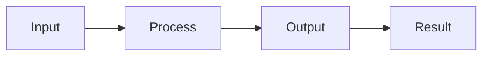
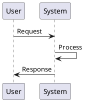
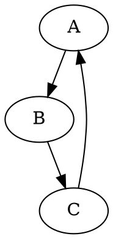

# Diagram Test Presentation

## Mermaid Diagram



## PlantUML Diagram



## PlantUML Diagram with external icon

```plantuml
@startuml Two Modes - Technical View
' Uncomment the line below for "dark mode" styling
'!$AWS_DARK = true

!define AWSPuml https://raw.githubusercontent.com/awslabs/aws-icons-for-plantuml/v20.0/dist
!include AWSPuml/AWSCommon.puml

!include AWSPuml/AWSSimplified.puml
!include AWSPuml/General/Users.puml
!include AWSPuml/NetworkingContentDelivery/APIGateway.puml
!include AWSPuml/SecurityIdentityCompliance/Cognito.puml
!include AWSPuml/Compute/Lambda.puml
!include AWSPuml/Database/DynamoDB.puml

left to right direction

Users(sources, "Events", "millions of users")
APIGateway(votingAPI, "Voting API", "user votes")
Cognito(userAuth, "User Authentication", "jwt to submit votes")
Lambda(generateToken, "User Credentials", "return jwt")
Lambda(recordVote, "Record Vote", "enter or update vote per user")
DynamoDB(voteDb, "Vote Database", "one entry per user")

sources --> userAuth
sources --> votingAPI
userAuth <--> generateToken
votingAPI --> recordVote
recordVote --> voteDb
@enduml
```

## Graphviz Diagram



## Regular Content

This slide contains no diagrams, just regular markdown content.
