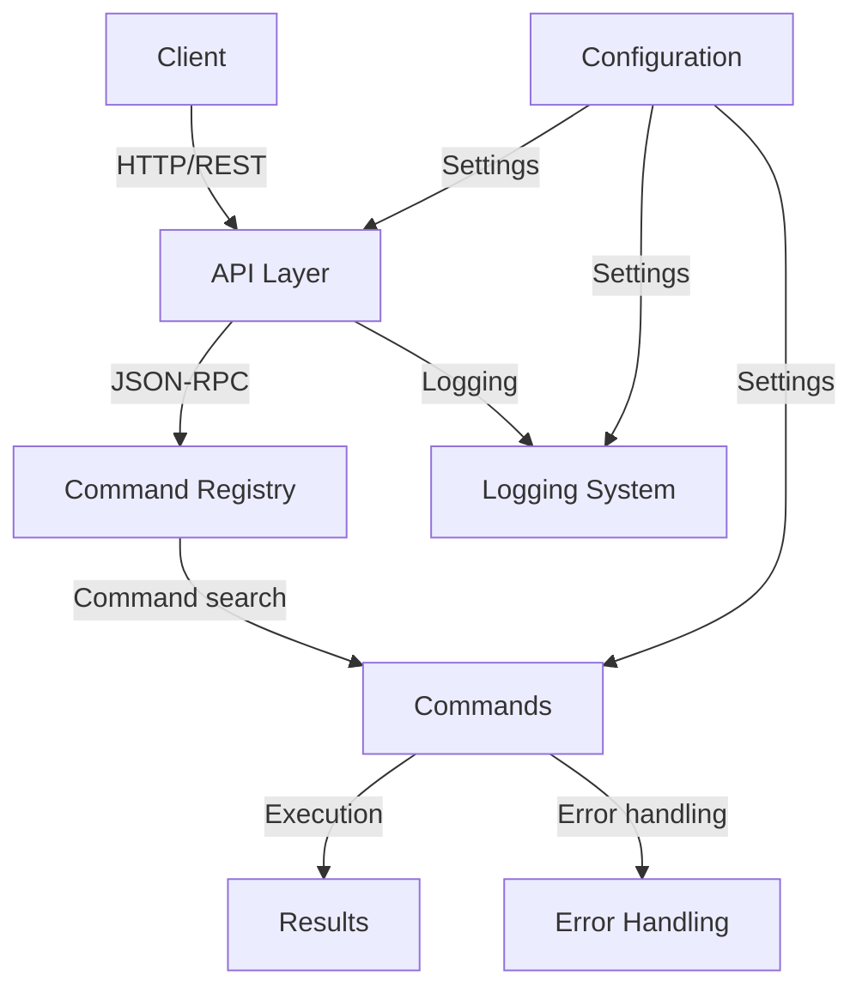
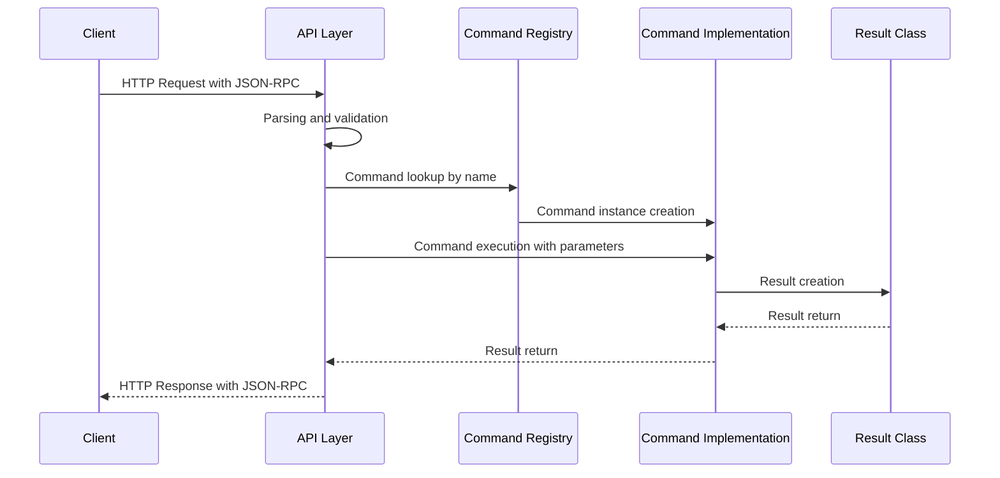

# Basic Architecture

## Overview

This document describes the basic architecture of the MCP Proxy Adapter microservice, including main components, their interactions, and responsibility distribution.

## System Components

The microservice consists of the following main components:

1. **Configuration Management** (`config.py`)
2. **Command System** (`commands/`)
3. **API Layer** (`api/`)
4. **Error Handling** (`core/errors.py`)
5. **Logging** (`core/logging.py`)
6. **Entry Point** (`main.py`)

## Component Interaction Diagram



## Request Flow



## Component Description

### 1. Configuration Management

The `Config` class in `config.py` is responsible for loading and providing access to application settings. It supports:

- Loading settings from JSON configuration files
- Reading from environment variables (with higher priority)
- Hierarchical access to settings using dot notation
- Setting value persistence

Example usage:
```python
# Get server host and port
host = config.get("server.host", "0.0.0.0")
port = config.get("server.port", 8000)
```

### 2. Command System

The command system consists of:

#### 2.1. Base Command Classes (`commands/base.py`)

The `Command` abstract class defines the interface for all commands:
```python
class Command(ABC):
    # Command name for registration
    name: ClassVar[str]
    # Result class
    result_class: ClassVar[Type[CommandResult]]
    
    @abstractmethod
    async def execute(self, **kwargs) -> CommandResult:
        pass
```

#### 2.2. Command Result Classes (`commands/result.py`)

The `CommandResult` abstract class is the base for all command results:
```python
class CommandResult(ABC):
    @abstractmethod
    def to_dict(self) -> Dict[str, Any]:
        pass
    
    @classmethod
    @abstractmethod
    def get_schema(cls) -> Dict[str, Any]:
        pass
```

Two main implementations are provided:
- `SuccessResult` - for successful command execution
- `ErrorResult` - for error cases

#### 2.3. Command Registry (`commands/command_registry.py`)

The `CommandRegistry` class serves as a container for commands, providing:
- Command registration
- Command lookup by name
- Automatic command discovery
- Command metadata access

### 3. API Layer

The API layer consists of:

#### 3.1. Application Setup (`api/app.py`)

Sets up the FastAPI application with:
- Route registration
- Middleware configuration 
- Dependency injection setup
- Documentation generation

#### 3.2. Request Handlers (`api/handlers.py`)

Contains handlers for:
- JSON-RPC request processing
- Command execution
- System health checking
- Command list access

#### 3.3. API Schemas (`api/schemas.py`)

Defines Pydantic models for:
- JSON-RPC requests and responses
- Command information
- Health check responses

### 4. Error Handling System

The error handling system in `core/errors.py` provides:
- Custom exception hierarchy
- Standardized error codes
- Error serialization for API responses

### 5. JSON-RPC Protocol Implementation

The service implements the JSON-RPC 2.0 protocol with the following format:

**Request:**
```json
{
    "jsonrpc": "2.0",
    "method": "command_name",
    "params": {
        "param1": "value1",
        "param2": "value2"
    },
    "id": "request-id-123"
}
```

**Successful Response:**
```json
{
    "jsonrpc": "2.0",
    "result": {
        "success": true,
        "data": { ... },
        "message": "Optional message"
    },
    "id": "request-id-123"
}
```

**Error Response:**
```json
{
    "jsonrpc": "2.0",
    "error": {
        "code": -32603,
        "message": "Internal error",
        "details": { ... }
    },
    "id": "request-id-123"
}
```

## Testing Components

The test system includes:
- Tests for configuration (`tests/test_config.py`)
- Tests for command base classes (`tests/test_base_command.py`)
- Tests for API handlers (`tests/test_api_handlers.py`)
- Tests for command registry (`tests/test_command_registry.py`)

## Next Steps

After implementing the basic architecture, the next steps are:
1. Implement specific commands
2. Add validation mechanisms
3. Enhance error handling
4. Add authentication and authorization
5. Implement monitoring and metrics 