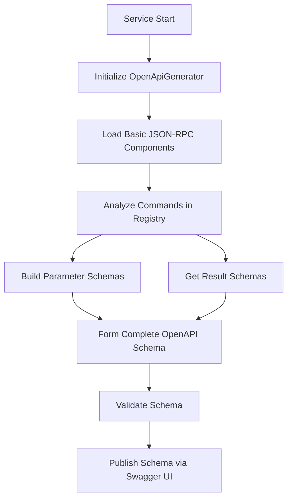
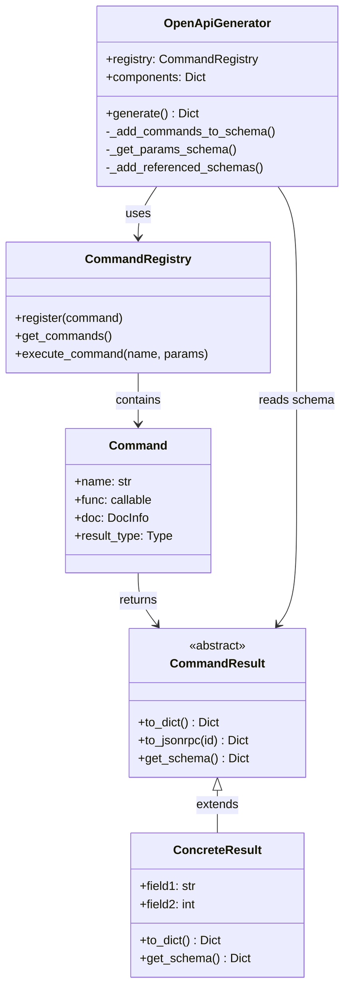

# OpenAPI Schema Generation

## Generation Principle

The OpenAPI schema is dynamically generated based on:
1. Registered commands and their metadata
2. Command result types (inheritors of `CommandResult`)
3. Basic JSON-RPC components

A static schema file is not used - instead, the schema is generated when the service starts.

> **Note**: Detailed information about the `CommandResult` class and its implementation is available in the [COMMAND_RESULTS.md](./COMMAND_RESULTS.md) document.

## Schema Components

### 1. Basic Components (always present)

- Endpoints:
  - `/cmd` (JSON-RPC)
  - `/api/v1/commands` (REST)
  - `/api/v1/commands/{name}` (REST)

- Base schemas:
  - `CommandRequest`
  - `JsonRpcResponse`
  - `JsonRpcError`

### 2. Dynamic Components (from commands)

For each registered command:

1. **Parameters**:
   ```python
   # From function annotations
   async def get_files(path: str, recursive: bool = False) -> FileListResult:
       ...
   
   # Generated schema
   "ParamsGetFiles": {
       "type": "object",
       "required": ["path"],
       "properties": {
           "path": {
               "type": "string"
           },
           "recursive": {
               "type": "boolean",
               "default": false
           }
       }
   }
   ```

2. **Result**:
   ```python
   # From the result's get_schema() method
   class FileListResult(CommandResult):
       @classmethod
       def get_schema(cls) -> Dict[str, Any]:
           return {
               "type": "object",
               "properties": {
                   "files": {
                       "type": "array",
                       "items": {"$ref": "#/components/schemas/FileInfo"}
                   }
               }
           }
   
   # Generated schema
   "ResultGetFiles": {
       "$ref": "#/components/schemas/FileListResult"
   }
   ```

## Generation Process

1. **Initialization**
   ```python
   class OpenApiGenerator:
       def __init__(self, registry: CommandRegistry):
           self.registry = registry
           # Load base schema from file
           self._base_schema = self._load_base_schema()
           self.components = self._base_schema["components"]["schemas"]
           
       def _load_base_schema(self) -> Dict[str, Any]:
           """Load base schema from file"""
           schema_path = Path(__file__).parent / "schemas" / "base_schema.json"
           with open(schema_path) as f:
               return json.load(f)
   ```

   The base schema contains common components that are always present in the final schema:
   ```json
   {
     "openapi": "3.0.0",
     "info": {
       "title": "MCP Microservice API",
       "version": "1.0.0"
     },
     "components": {
       "schemas": {
         "CommandRequest": {
           "type": "object",
           "required": ["jsonrpc", "method"],
           "properties": {
             "jsonrpc": {"type": "string", "enum": ["2.0"]},
             "method": {"type": "string"},
             "params": {"type": "object"},
             "id": {"type": ["string", "number", "null"]}
           }
         },
         "JsonRpcResponse": {
           "type": "object",
           "required": ["jsonrpc"],
           "properties": {
             "jsonrpc": {"type": "string", "enum": ["2.0"]},
             "result": {"type": "object"},
             "error": {"$ref": "#/components/schemas/JsonRpcError"},
             "id": {"type": ["string", "number", "null"]}
           }
         },
         "JsonRpcError": {
           "type": "object",
           "required": ["code", "message"],
           "properties": {
             "code": {"type": "integer"},
             "message": {"type": "string"},
             "data": {"type": "object"}
           }
         }
       }
     },
     "paths": {
       "/cmd": {
         "post": {
           "summary": "Execute command via JSON-RPC",
           "requestBody": {
             "content": {
               "application/json": {
                 "schema": {"$ref": "#/components/schemas/CommandRequest"}
               }
             }
           },
           "responses": {
             "200": {
               "description": "Command executed",
               "content": {
                 "application/json": {
                   "schema": {"$ref": "#/components/schemas/JsonRpcResponse"}
                 }
               }
             }
           }
         }
       }
     }
   }
   ```

2. **Command Analysis**
   ```python
   def generate(self) -> Dict[str, Any]:
       schema = self._base_schema.copy()
       self._add_commands_to_schema(schema)
       self.validate_schema(schema)
       return schema

   def _add_commands_to_schema(self, schema: Dict[str, Any]):
       """Add all commands to schema"""
       for command in self.registry.get_commands():
           self._add_command_params(schema, command)
           self._add_command_result(schema, command)
           self._add_command_endpoint(schema, command)
       
   def _get_params_schema(self, command: Command) -> Dict[str, Any]:
       """Get schema for command parameters"""
       params = {}
       required = []
       
       # Get parameters from function signature
       sig = inspect.signature(command.func)
       for name, param in sig.parameters.items():
           param_schema = {}
           
           # Get type info
           type_info = self._get_type_info(param.annotation)
           param_schema["type"] = type_info.openapi_type
           
           if type_info.format:
               param_schema["format"] = type_info.format
           
           if type_info.items:
               param_schema["items"] = type_info.items
           
           # Handle default value
           if param.default is not param.empty:
               param_schema["default"] = param.default
           else:
               required.append(name)
           
           params[name] = param_schema
       
       # Return schema
       method_schema = {
           "type": "object",
           "properties": params
       }
       if required:
           method_schema["required"] = required
           
       return method_schema
           
   def _add_referenced_schemas(self, schemas: Dict[str, Any], schema: Dict[str, Any]):
       """
       Recursively add referenced schemas
       
       This function scans a schema for references and adds them to the components
       """
       # Process arrays
       if schema.get("type") == "array" and "items" in schema:
           self._add_referenced_schemas(schemas, schema["items"])
       
       # Process objects
       if schema.get("type") == "object" and "properties" in schema:
           for prop in schema["properties"].values():
               self._add_referenced_schemas(schemas, prop)
       
       # Process references
       if "$ref" in schema:
           ref = schema["$ref"]
           if ref.startswith("#/components/schemas/"):
               ref_name = ref.split("/")[-1]
               if ref_name not in schemas and hasattr(self, f"get_{ref_name}_schema"):
                   schemas[ref_name] = getattr(self, f"get_{ref_name}_schema")()
   ```

3. **Path Formation**
   ```python
   def _add_command_endpoint(self, schema: Dict[str, Any], command: Command):
       """Add REST endpoint for a command"""
       path = f"/api/v1/commands/{command.name}"
       
       # Add path if doesn't exist
       if path not in schema["paths"]:
           schema["paths"][path] = {}
       
       # Add POST method
       schema["paths"][path]["post"] = {
           "summary": command.doc.short_description if command.doc else "",
           "description": command.doc.description if command.doc else "",
           "requestBody": {
               "content": {
                   "application/json": {
                       "schema": {"$ref": f"#/components/schemas/Params{command.name}"}
                   }
               }
           },
           "responses": {
               "200": {
                   "description": "Command executed successfully",
                   "content": {
                       "application/json": {
                           "schema": {"$ref": f"#/components/schemas/Result{command.name}"}
                       }
                   }
               },
               "400": {
                   "description": "Invalid parameters",
                   "content": {
                       "application/json": {
                           "schema": {"$ref": "#/components/schemas/ErrorResponse"}
                       }
                   }
               },
               "500": {
                   "description": "Internal server error",
                   "content": {
                       "application/json": {
                           "schema": {"$ref": "#/components/schemas/ErrorResponse"}
                       }
                   }
               }
           }
       }
   ```

## Schema Validation

Built-in Python mechanisms and specialized libraries for OpenAPI are used to validate the generated schema:

1. **Required Components Check**
   ```python
   def validate_schema(self, schema: Dict[str, Any]):
       """
       Validate generated schema
       
       Args:
           schema: OpenAPI schema to validate
           
       Raises:
           SchemaValidationError: If schema is invalid
       """
       required_paths = ['/cmd', '/api/v1/commands']
       required_components = ['CommandRequest', 'JsonRpcResponse']
       
       # Check required paths
       for path in required_paths:
           if path not in schema['paths']:
               raise SchemaValidationError(f"Missing required path: {path}")
       
       # Check required components
       for component in required_components:
           if component not in schema['components']['schemas']:
               raise SchemaValidationError(
                   f"Missing required component: {component}"
               )
       
       # Validate each command has a result schema
       for command in self.registry.get_commands():
           result_ref = f"Result{command.name}"
           if result_ref not in schema['components']['schemas']:
               raise SchemaValidationError(
                   f"Missing result schema for command: {command.name}"
               )
   ```

2. **Results Check**
   ```python
   def validate_results(self, schema: Dict[str, Any]):
       for command in self.registry.get_commands():
           result_ref = f"#/components/schemas/Result{command.name}"
           assert result_ref in schema['components']['schemas']
   ```

3. **Validation Using Specialized Libraries**
   ```python
   def validate_with_library(self, schema: Dict[str, Any]):
       # Use external library for OpenAPI schema validation
       import jsonschema
       from openapi_spec_validator import validate_spec
       
       try:
           # Validation against OpenAPI specification
           validate_spec(schema)
           
           # Additional check using JSON Schema
           jsonschema.validate(schema, jsonschema.Draft7Validator.META_SCHEMA)
       except Exception as e:
           raise SchemaValidationError(f"Schema validation failed: {str(e)}")
   ```

4. **Schema Error Handling**
   ```python
   class SchemaValidationError(Exception):
       """Raised when schema validation fails"""
       pass
   
   # Usage example:
   try:
       generator = OpenApiGenerator(registry)
       schema = generator.generate()
   except SchemaValidationError as e:
       logger.error(f"Failed to generate schema: {e}")
       # Fallback to minimal schema
       schema = {
           "openapi": "3.0.0",
           "info": {"title": "API (Limited Mode)", "version": "1.0.0"},
           "paths": {"/status": {"get": {"responses": {"200": {"description": "OK"}}}}}
       }
   ```

## Usage Example

```python
# Command registration
@registry.command
async def get_status() -> StatusResult:
    """Gets system status"""
    return StatusResult(status="ok")

# Schema generation
generator = OpenApiGenerator(registry)
schema = generator.generate()

# The schema will contain:
{
    "paths": {
        "/cmd": {...},
        "/api/v1/commands": {...}
    },
    "components": {
        "schemas": {
            "CommandRequest": {...},
            "JsonRpcResponse": {...},
            "ParamsGetStatus": {...},
            "ResultGetStatus": {...},
            "StatusResult": {...}
        }
    }
}
```

## Schema Generation Process Diagram



## Component Relationships Diagram



## Approach Advantages

1. **Automatic Updates**
   - The schema always corresponds to the current set of commands
   - Changes in result types are automatically reflected in the schema
   - No need to manually maintain documentation

2. **Type Safety**
   - The schema is formed based on real Python types
   - All type conversions are documented
   - IDE can use types for autocompletion

3. **Extensibility**
   - Easy to add new commands
   - Support for complex result types
   - Ability to customize the schema for each command

4. **Compatibility**
   - Full support for JSON-RPC 2.0
   - Compliance with OpenAPI 3.0 specification
   - Backward compatibility with existing clients 

## Customizing OpenAPI Schema Fields

You can override the `title`, `description`, and `version` fields of the OpenAPI schema without editing the base schema file. This is done by passing the corresponding parameters to the FastAPI application and using the `custom_openapi` function.

### Example

```python
from fastapi import FastAPI
from mcp_proxy_adapter.custom_openapi import custom_openapi

app = FastAPI(
    title="Custom Project Title",
    description="Custom project description for OpenAPI schema.",
    version="2.1.0"
)

# Use custom OpenAPI schema
default_openapi = app.openapi
app.openapi = lambda: custom_openapi(app)

# Now /openapi.json will reflect the custom title, description, and version
```

**Advantages:**
- No need to manually edit the base OpenAPI schema file.
- Flexible for use in different projects.
- Standard FastAPI fields are used for customization.

### Test Example

A test is provided to ensure that custom `title`, `description`, and `version` are correctly set in the OpenAPI schema:

```python
def test_custom_openapi_schema_fields():
    from fastapi import FastAPI
    from mcp_proxy_adapter.custom_openapi import custom_openapi

    app = FastAPI(
        title="Custom Title",
        description="Custom Description",
        version="9.9.9"
    )
    schema = custom_openapi(app)
    assert schema["info"]["title"] == "Custom Title"
    assert schema["info"]["description"] == "Custom Description"
    assert schema["info"]["version"] == "9.9.9"
``` 