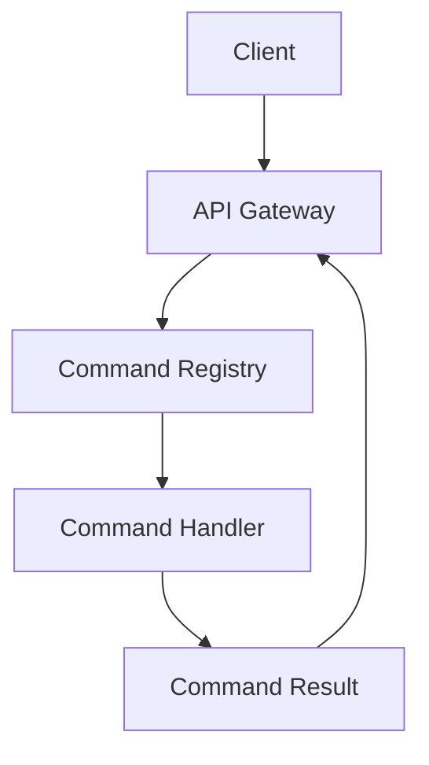
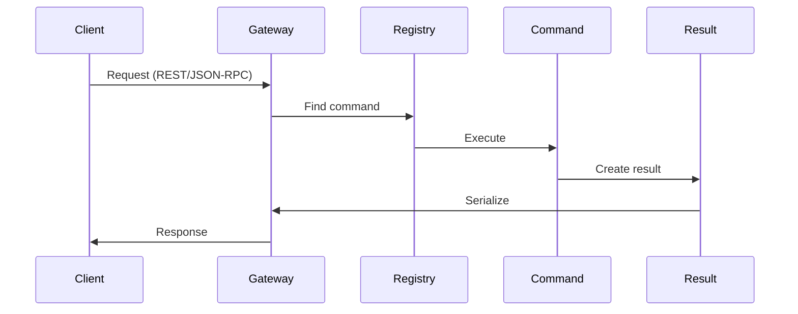

# Project Structure

## Information Structure

### 1. Main Components


### 2. Abstraction Layers
1. **Transport Layer**
   - REST API (FastAPI)
   - JSON-RPC (WebSocket)
   - Unified response format

2. **Command Layer**
   - Command registration
   - Parameter validation
   - Routing

3. **Business Logic Layer**
   - Command execution
   - Error handling
   - Result formation

4. **Data Layer**
   - Typed results
   - Validation schemas
   - Serialization/deserialization

5. **Configuration Layer**
   - Single source of settings
   - Configuration completeness validation
   - Hot reload 
   - Support for environment variables and command-line arguments

## Request Lifecycle

### 1. Incoming Request
1. Client sends a request (REST/JSON-RPC)
2. API Gateway receives and validates the request
3. Request type and protocol are determined

### 2. Command Processing
1. Command Registry finds the required command
2. Input parameters are validated
3. Execution context is created
4. Command is executed in an isolated environment

### 3. Response Formation
1. Command returns a typed result
2. Result is validated through schema
3. Serialization into the required format
4. Response is sent to the client

### 4. Error Handling
1. All errors are intercepted
2. Standard error format is formed
3. Error is logged
4. Client receives an informative response

## Interaction Diagram



## File System Structure

```
mcp_proxy_adapter/
├── commands/           # Command implementations
├── core/               # Core functionality
├── api/                # API implementation
├── schemas/            # Schema definitions
├── tests/
│   ├── unit/           # Unit tests
│   └── integration/    # Integration tests
├── config.json         # Main configuration file
└── docs/
    ├── EN/             # English documentation
    └── RU/             # Russian documentation
```

## Extending Functionality

### 1. Adding a New Command
1. Creating a command file
2. Defining the result type
3. Implementing business logic
4. Registering in the system
5. Automatic schema update

### 2. Modifying an Existing Command
1. Backward compatibility
2. API versioning
3. Data migration
4. Documentation update

### 3. Error Handling
1. Standard errors
2. Custom errors
3. System errors
4. Network errors

## Monitoring and Logging

### 1. Metrics
- Command execution time
- Number of requests
- Error statistics
- Resource usage

### 2. Logs
- Structured logging
- Logging levels
- Log rotation
- Request tracing
- Separate files for stderr

### 3. Alerts
- Critical errors
- Timeouts exceeded
- Resource exhaustion
- Service unavailability

## Security

### 1. Authentication
- API keys
- JWT tokens
- OAuth 2.0

### 2. Authorization
- Roles and permissions
- Access restrictions
- Action audit

### 3. Data Protection
- Input data validation
- Output data sanitization
- Sensitive information encryption

## Integration with System Services

- SystemV-compatible initialization scripts
- Proper startup and shutdown
- Service state monitoring
- Signal support for reloading 