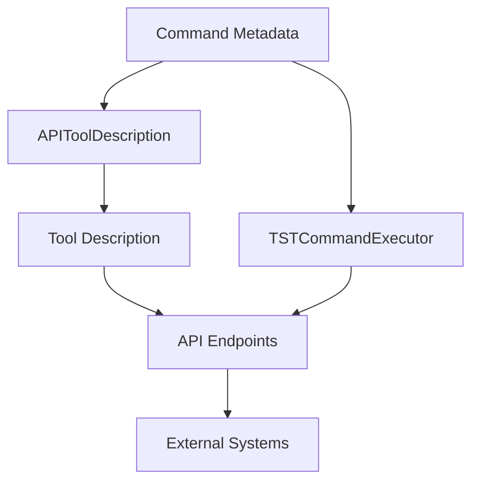

# API Tools Integration

## Contents

1. [Overview](#overview)
2. [Architecture](#architecture)
3. [Automatic Description Generation](#automatic-description-generation)
4. [Available Tools](#available-tools)
5. [API Usage](#api-usage)
6. [Extending Functionality](#extending-functionality)

## Overview

The API tools integration system provides a mechanism for creating and using API tools that provide convenient access to microservice functionality through external systems. The system automatically generates tool descriptions based on command metadata, ensuring documentation consistency and improving user experience.

Key features:

- Automatic generation of tool descriptions based on command metadata
- Support for various description formats (JSON, Markdown, HTML)
- Execution of commands through a unified tools interface
- Integration with external systems via API

## Architecture

The API tools integration system consists of the following components:

1. **APIToolDescription** - class for generating tool descriptions based on command metadata
2. **ToolIntegration** - class for integrating command metadata with external systems
3. **TSTCommandExecutor** - tool class for executing commands via JSON-RPC protocol
4. **API endpoints** - HTTP endpoints for retrieving tool descriptions and executing commands

Component interaction diagram:



## Automatic Description Generation

The system automatically generates tool descriptions based on command metadata. A tool description includes:

- Tool name and description
- List of available commands with their descriptions
- Command parameters with types and required flags
- Command usage examples

Usage example:

```python
from mcp_proxy_adapter.api.schemas import APIToolDescription
from mcp_proxy_adapter.commands.command_registry import registry

# Get tool description in JSON format
description = APIToolDescription.generate_tool_description("tst_execute_command", registry)

# Get tool description in Markdown format
description_text = APIToolDescription.generate_tool_description_text("tst_execute_command", registry)
```

## Available Tools

### TST Command Executor

The `tst_execute_command` tool provides the ability to execute microservice commands via JSON-RPC protocol.

#### Parameters:

- `command` (string, **required**): Command name to execute
- `params` (object, optional): Command parameters

#### Usage examples:

```json
{
    "command": "help"
}
```

```json
{
    "command": "system_info",
    "params": {
        "include_cpu": true,
        "include_memory": true
    }
}
```

## API Usage

### Getting Tool Description

```http
GET /api/tools/{tool_name}?format={format}
```

Parameters:
- `tool_name` - API tool name
- `format` - description format (json, text, markdown, html), default is "json"

Response example (format=json):

```json
{
    "name": "tst_execute_command",
    "description": "Executes commands via JSON-RPC protocol on the project server.",
    "parameters": {
        "properties": {
            "command": {
                "description": "Command to execute",
                "type": "string",
                "enum": ["help", "system_info", "config"]
            },
            "params": {
                "description": "Command parameters",
                "type": "object",
                "properties": {
                    "cmdname": {
                        "type": "string",
                        "description": "Command name to get information about"
                    }
                }
            }
        },
        "required": ["command"],
        "type": "object"
    },
    "examples": [
        {
            "command": "tst_execute_command",
            "params": {
                "command": "help",
                "params": {}
            },
            "description": "Execute help command"
        }
    ]
}
```

### Executing a Tool

```http
POST /api/tools/{tool_name}
```

Request body:

```json
{
    "command": "help",
    "params": {
        "cmdname": "system_info"
    }
}
```

Response example:

```json
{
    "success": true,
    "data": {
        "commands_info": {
            "system_info": {
                "description": "Provides system information",
                "params": {
                    "include_cpu": {
                        "required": false,
                        "type": "bool",
                        "default": true
                    },
                    "include_memory": {
                        "required": false,
                        "type": "bool",
                        "default": true
                    }
                }
            }
        }
    }
}
```

## Extending Functionality

### Creating a New API Tool

1. Create a new API tool class in the `mcp_proxy_adapter.api.tools` module:

```python
class NewToolExecutor:
    """
    Description of the new API tool.
    """
    
    name = "new_tool"
    description = "Description of the new tool."
    
    @classmethod
    async def execute(cls, **params) -> Dict[str, Any]:
        """
        Tool execution method.
        """
        # Implement tool execution
        return {"success": True, "data": {}}
    
    @classmethod
    def get_description(cls, format: str = "json") -> Union[Dict[str, Any], str]:
        """
        Method for getting tool description.
        """
        # Implement description retrieval
        return ToolIntegration.generate_tool_schema(cls.name, registry, cls.description)
```

2. Register the tool in the available tools dictionary in the `mcp_proxy_adapter.api.tools` module:

```python
available_tools = {
    TSTCommandExecutor.name: TSTCommandExecutor,
    NewToolExecutor.name: NewToolExecutor
}
```

### Customizing Description Generation

To customize tool description generation, you can extend the `APIToolDescription` class or override the `get_description` method in the tool class:

```python
@classmethod
def get_description(cls, format: str = "json") -> Union[Dict[str, Any], str]:
    """
    Returns custom tool description.
    """
    if format.lower() == "json":
        # Base description
        base_description = ToolIntegration.generate_tool_schema(cls.name, registry, cls.description)
        
        # Customize description
        base_description["custom_field"] = "custom_value"
        
        return base_description
    else:
        return ToolIntegration.generate_tool_documentation(cls.name, registry, format)
``` 