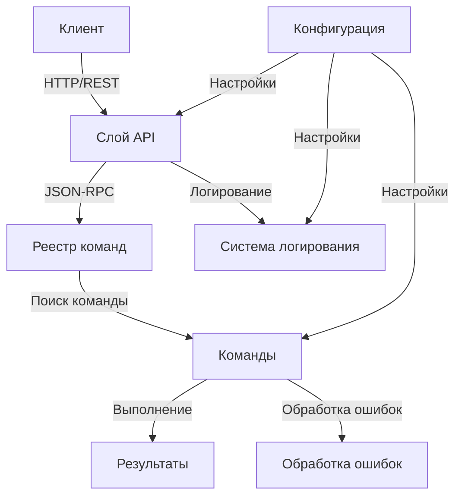
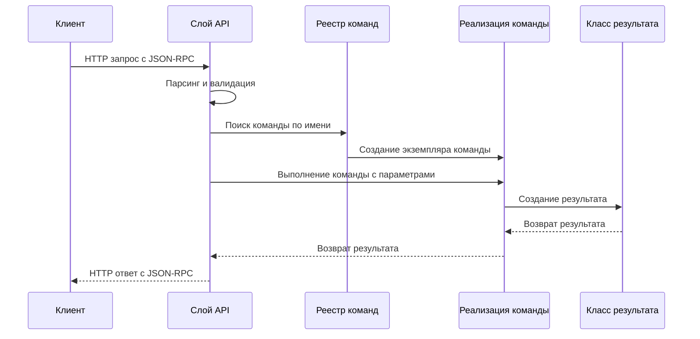

# Базовая архитектура

## Обзор

В данном документе описывается базовая архитектура микросервиса MCP Proxy Adapter, включая основные компоненты, их взаимодействие и распределение ответственности.

## Компоненты системы

Микросервис состоит из следующих основных компонентов:

1. **Управление конфигурацией** (`config.py`)
2. **Система команд** (`commands/`)
3. **Слой API** (`api/`)
4. **Обработка ошибок** (`core/errors.py`)
5. **Логирование** (`core/logging.py`)
6. **Точка входа** (`main.py`)

## Диаграмма взаимодействия компонентов



## Поток выполнения запроса



## Описание компонентов

### 1. Управление конфигурацией

Класс `Config` в `config.py` отвечает за загрузку и предоставление доступа к настройкам приложения. Он поддерживает:

- Загрузку настроек из JSON-файлов конфигурации
- Чтение из переменных окружения (с более высоким приоритетом)
- Иерархический доступ к настройкам с использованием точечной нотации
- Сохранение значений настроек

Пример использования:
```python
# Получение хоста и порта сервера
host = config.get("server.host", "0.0.0.0")
port = config.get("server.port", 8000)
```

### 2. Система команд

Система команд состоит из:

#### 2.1. Базовые классы команд (`commands/base.py`)

Абстрактный класс `Command` определяет интерфейс для всех команд:
```python
class Command(ABC):
    # Имя команды для регистрации
    name: ClassVar[str]
    # Класс результата
    result_class: ClassVar[Type[CommandResult]]
    
    @abstractmethod
    async def execute(self, **kwargs) -> CommandResult:
        pass
```

#### 2.2. Классы результатов команд (`commands/result.py`)

Абстрактный класс `CommandResult` является базовым для всех результатов команд:
```python
class CommandResult(ABC):
    @abstractmethod
    def to_dict(self) -> Dict[str, Any]:
        pass
    
    @classmethod
    @abstractmethod
    def get_schema(cls) -> Dict[str, Any]:
        pass
```

Предоставляются две основные реализации:
- `SuccessResult` - для успешного выполнения команды
- `ErrorResult` - для случаев ошибок

#### 2.3. Реестр команд (`commands/command_registry.py`)

Класс `CommandRegistry` служит контейнером для команд, предоставляя:
- Регистрацию команд
- Поиск команд по имени
- Автоматическое обнаружение команд
- Доступ к метаданным команд

### 3. Слой API

Слой API состоит из:

#### 3.1. Настройка приложения (`api/app.py`)

Настраивает приложение FastAPI с:
- Регистрацией маршрутов
- Конфигурацией промежуточного ПО (middleware)
- Настройкой внедрения зависимостей
- Генерацией документации

#### 3.2. Обработчики запросов (`api/handlers.py`)

Содержит обработчики для:
- Обработки запросов JSON-RPC
- Выполнения команд
- Проверки работоспособности системы
- Доступа к списку команд

#### 3.3. Схемы API (`api/schemas.py`)

Определяет модели Pydantic для:
- Запросов и ответов JSON-RPC
- Информации о командах
- Ответов о работоспособности

### 4. Система обработки ошибок

Система обработки ошибок в `core/errors.py` предоставляет:
- Иерархию пользовательских исключений
- Стандартизированные коды ошибок
- Сериализацию ошибок для ответов API

### 5. Реализация протокола JSON-RPC

Сервис реализует протокол JSON-RPC 2.0 со следующим форматом:

**Запрос:**
```json
{
    "jsonrpc": "2.0",
    "method": "command_name",
    "params": {
        "param1": "value1",
        "param2": "value2"
    },
    "id": "request-id-123"
}
```

**Успешный ответ:**
```json
{
    "jsonrpc": "2.0",
    "result": {
        "success": true,
        "data": { ... },
        "message": "Опциональное сообщение"
    },
    "id": "request-id-123"
}
```

**Ответ с ошибкой:**
```json
{
    "jsonrpc": "2.0",
    "error": {
        "code": -32603,
        "message": "Внутренняя ошибка",
        "details": { ... }
    },
    "id": "request-id-123"
}
```

## Тестирование компонентов

Система тестирования включает:
- Тесты для конфигурации (`tests/test_config.py`)
- Тесты для базовых классов команд (`tests/test_base_command.py`)
- Тесты для обработчиков API (`tests/test_api_handlers.py`)
- Тесты для реестра команд (`tests/test_command_registry.py`)

## Следующие шаги

После реализации базовой архитектуры следующими шагами являются:
1. Реализация конкретных команд
2. Добавление механизмов валидации
3. Улучшение обработки ошибок
4. Добавление аутентификации и авторизации
5. Реализация мониторинга и метрик 