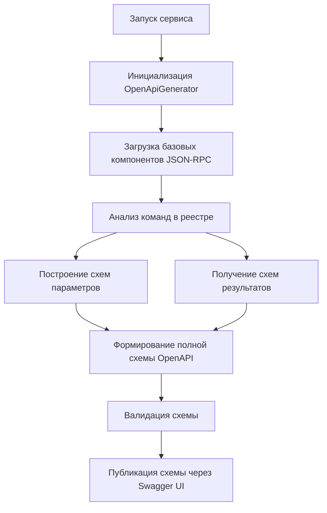
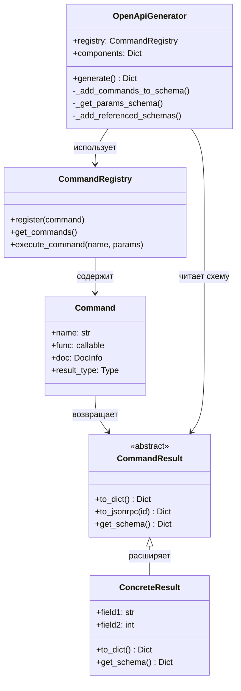

# Формирование OpenAPI схемы

## Принцип формирования

Схема OpenAPI формируется динамически на основе:
1. Зарегистрированных команд и их метаданных
2. Типов результатов команд (наследников `CommandResult`)
3. Базовых компонентов JSON-RPC

Статический файл схемы не используется - вместо этого схема генерируется при старте сервиса.

> **Примечание**: Подробная информация о классе `CommandResult` и его реализации доступна в документе [COMMAND_RESULTS.md](./COMMAND_RESULTS.md).

## Компоненты схемы

### 1. Базовые компоненты (всегда присутствуют)

- Эндпоинты:
  - `/cmd` (JSON-RPC)
  - `/api/v1/commands` (REST)
  - `/api/v1/commands/{name}` (REST)

- Базовые схемы:
  - `CommandRequest`
  - `JsonRpcResponse`
  - `JsonRpcError`

### 2. Динамические компоненты (от команд)

Для каждой зарегистрированной команды:

1. **Параметры**:
   ```python
   # Из аннотаций функции
   async def get_files(path: str, recursive: bool = False) -> FileListResult:
       ...
   
   # Генерируется схема
   "ParamsGetFiles": {
       "type": "object",
       "required": ["path"],
       "properties": {
           "path": {
               "type": "string"
           },
           "recursive": {
               "type": "boolean",
               "default": false
           }
       }
   }
   ```

2. **Результат**:
   ```python
   # Из метода get_schema() результата
   class FileListResult(CommandResult):
       @classmethod
       def get_schema(cls) -> Dict[str, Any]:
           return {
               "type": "object",
               "properties": {
                   "files": {
                       "type": "array",
                       "items": {"$ref": "#/components/schemas/FileInfo"}
                   }
               }
           }
   
   # Генерируется схема
   "ResultGetFiles": {
       "$ref": "#/components/schemas/FileListResult"
   }
   ```

## Процесс генерации

1. **Инициализация**
   ```python
   class OpenApiGenerator:
       def __init__(self, registry: CommandRegistry):
           self.registry = registry
           # Загрузка базовой схемы из файла
           self._base_schema = self._load_base_schema()
           self.components = self._base_schema["components"]["schemas"]
           
       def _load_base_schema(self) -> Dict[str, Any]:
           """Загружает базовую схему из файла"""
           schema_path = Path(__file__).parent / "schemas" / "base_schema.json"
           with open(schema_path) as f:
               return json.load(f)
   ```

   Базовая схема содержит общие компоненты, которые всегда присутствуют в финальной схеме:
   ```json
   {
     "openapi": "3.0.0",
     "info": {
       "title": "MCP Microservice API",
       "version": "1.0.0"
     },
     "components": {
       "schemas": {
         "CommandRequest": {
           "type": "object",
           "required": ["jsonrpc", "method"],
           "properties": {
             "jsonrpc": {"type": "string", "enum": ["2.0"]},
             "method": {"type": "string"},
             "params": {"type": "object"},
             "id": {"type": ["string", "number", "null"]}
           }
         },
         "JsonRpcResponse": {
           "type": "object",
           "required": ["jsonrpc"],
           "properties": {
             "jsonrpc": {"type": "string", "enum": ["2.0"]},
             "result": {"type": "object"},
             "error": {"$ref": "#/components/schemas/JsonRpcError"},
             "id": {"type": ["string", "number", "null"]}
           }
         },
         "JsonRpcError": {
           "type": "object",
           "required": ["code", "message"],
           "properties": {
             "code": {"type": "integer"},
             "message": {"type": "string"},
             "data": {"type": "object"}
           }
         }
       }
     },
     "paths": {
       "/cmd": {
         "post": {
           "summary": "Выполнение команды через JSON-RPC",
           "requestBody": {
             "content": {
               "application/json": {
                 "schema": {"$ref": "#/components/schemas/CommandRequest"}
               }
             }
           },
           "responses": {
             "200": {
               "description": "Команда выполнена",
               "content": {
                 "application/json": {
                   "schema": {"$ref": "#/components/schemas/JsonRpcResponse"}
                 }
               }
             }
           }
         }
       }
     }
   }
   ```

2. **Анализ команд**
   ```python
   def generate(self) -> Dict[str, Any]:
       schema = self._base_schema.copy()
       self._add_commands_to_schema(schema)
       self.validate_schema(schema)
       return schema

   def _add_commands_to_schema(self, schema: Dict[str, Any]):
       """Добавляет все команды в схему"""
       for command in self.registry.get_commands():
           self._add_command_params(schema, command)
           self._add_command_result(schema, command)
           self._add_command_endpoint(schema, command)
       
   def _get_params_schema(self, command: Command) -> Dict[str, Any]:
       """Получает схему параметров команды"""
       params = {}
       required = []
       
       # Получаем параметры из сигнатуры функции
       sig = inspect.signature(command.func)
       for name, param in sig.parameters.items():
           param_schema = {}
           
           # Получаем информацию о типе
           type_info = self._get_type_info(param.annotation)
           param_schema["type"] = type_info.openapi_type
           
           if type_info.format:
               param_schema["format"] = type_info.format
           
           if type_info.items:
               param_schema["items"] = type_info.items
           
           # Обрабатываем значение по умолчанию
           if param.default is not param.empty:
               param_schema["default"] = param.default
           else:
               required.append(name)
           
           params[name] = param_schema
       
       # Возвращаем схему
       method_schema = {
           "type": "object",
           "properties": params
       }
       if required:
           method_schema["required"] = required
           
       return method_schema
           
   def _add_referenced_schemas(self, schemas: Dict[str, Any], schema: Dict[str, Any]):
       """
       Рекурсивно добавляет связанные схемы
       
       Эта функция сканирует схему на наличие ссылок и добавляет их в компоненты
       """
       # Обрабатываем массивы
       if schema.get("type") == "array" and "items" in schema:
           self._add_referenced_schemas(schemas, schema["items"])
       
       # Обрабатываем объекты
       if schema.get("type") == "object" and "properties" in schema:
           for prop in schema["properties"].values():
               self._add_referenced_schemas(schemas, prop)
       
       # Обрабатываем ссылки
       if "$ref" in schema:
           ref = schema["$ref"]
           if ref.startswith("#/components/schemas/"):
               ref_name = ref.split("/")[-1]
               if ref_name not in schemas and hasattr(self, f"get_{ref_name}_schema"):
                   schemas[ref_name] = getattr(self, f"get_{ref_name}_schema")()
   ```

3. **Формирование путей**
   ```python
   def _add_command_endpoint(self, schema: Dict[str, Any], command: Command):
       """Добавляет REST-эндпоинт для команды"""
       path = f"/api/v1/commands/{command.name}"
       
       # Добавляем путь, если не существует
       if path not in schema["paths"]:
           schema["paths"][path] = {}
       
       # Добавляем метод POST
       schema["paths"][path]["post"] = {
           "summary": command.doc.short_description if command.doc else "",
           "description": command.doc.description if command.doc else "",
           "requestBody": {
               "content": {
                   "application/json": {
                       "schema": {"$ref": f"#/components/schemas/Params{command.name}"}
                   }
               }
           },
           "responses": {
               "200": {
                   "description": "Команда выполнена успешно",
                   "content": {
                       "application/json": {
                           "schema": {"$ref": f"#/components/schemas/Result{command.name}"}
                       }
                   }
               },
               "400": {
                   "description": "Неверные параметры",
                   "content": {
                       "application/json": {
                           "schema": {"$ref": "#/components/schemas/ErrorResponse"}
                       }
                   }
               },
               "500": {
                   "description": "Внутренняя ошибка сервера",
                   "content": {
                       "application/json": {
                           "schema": {"$ref": "#/components/schemas/ErrorResponse"}
                       }
                   }
               }
           }
       }
   ```

## Валидация схемы

Для валидации сгенерированной схемы используются встроенные механизмы Python и специализированные библиотеки для работы с OpenAPI:

1. **Проверка обязательных компонентов**
   ```python
   def validate_schema(self, schema: Dict[str, Any]):
       """
       Валидирует сгенерированную схему
       
       Args:
           schema: OpenAPI схема для валидации
           
       Raises:
           SchemaValidationError: Если схема некорректна
       """
       required_paths = ['/cmd', '/api/v1/commands']
       required_components = ['CommandRequest', 'JsonRpcResponse']
       
       # Проверяем обязательные пути
       for path in required_paths:
           if path not in schema['paths']:
               raise SchemaValidationError(f"Отсутствует обязательный путь: {path}")
       
       # Проверяем обязательные компоненты
       for component in required_components:
           if component not in schema['components']['schemas']:
               raise SchemaValidationError(
                   f"Отсутствует обязательный компонент: {component}"
               )
       
       # Проверяем наличие схемы результата для каждой команды
       for command in self.registry.get_commands():
           result_ref = f"Result{command.name}"
           if result_ref not in schema['components']['schemas']:
               raise SchemaValidationError(
                   f"Отсутствует схема результата для команды: {command.name}"
               )
   ```

2. **Проверка результатов**
   ```python
   def validate_results(self, schema: Dict[str, Any]):
       for command in self.registry.get_commands():
           result_ref = f"#/components/schemas/Result{command.name}"
           assert result_ref in schema['components']['schemas']
   ```

3. **Валидация с использованием специализированных библиотек**
   ```python
   def validate_with_library(self, schema: Dict[str, Any]):
       # Используем внешнюю библиотеку для валидации OpenAPI схемы
       import jsonschema
       from openapi_spec_validator import validate_spec
       
       try:
           # Валидация на соответствие спецификации OpenAPI
           validate_spec(schema)
           
           # Дополнительная проверка с использованием JSON Schema
           jsonschema.validate(schema, jsonschema.Draft7Validator.META_SCHEMA)
       except Exception as e:
           raise SchemaValidationError(f"Ошибка валидации схемы: {str(e)}")
   ```

4. **Обработка ошибок схемы**
   ```python
   class SchemaValidationError(Exception):
       """Исключение, возникающее при ошибке валидации схемы"""
       pass
   
   # Пример использования:
   try:
       generator = OpenApiGenerator(registry)
       schema = generator.generate()
   except SchemaValidationError as e:
       logger.error(f"Ошибка генерации схемы: {e}")
       # Запасной вариант с минимальной схемой
       schema = {
           "openapi": "3.0.0",
           "info": {"title": "API (Ограниченный режим)", "version": "1.0.0"},
           "paths": {"/status": {"get": {"responses": {"200": {"description": "OK"}}}}}
       }
   ```

## Пример использования

```python
# Регистрация команды
@registry.command
async def get_status() -> StatusResult:
    """Получает статус системы"""
    return StatusResult(status="ok")

# Генерация схемы
generator = OpenApiGenerator(registry)
schema = generator.generate()

# Схема будет содержать:
{
    "paths": {
        "/cmd": {...},
        "/api/v1/commands": {...}
    },
    "components": {
        "schemas": {
            "CommandRequest": {...},
            "JsonRpcResponse": {...},
            "ParamsGetStatus": {...},
            "ResultGetStatus": {...},
            "StatusResult": {...}
        }
    }
}
```

## Диаграмма процесса генерации



## Диаграмма взаимосвязей компонентов



## Преимущества подхода

1. **Автоматическая актуализация**
   - Схема всегда соответствует текущему набору команд
   - Изменения в типах результатов автоматически отражаются в схеме
   - Нет необходимости вручную поддерживать документацию

2. **Типобезопасность**
   - Схема формируется на основе реальных типов Python
   - Все преобразования типов документированы
   - IDE может использовать типы для автодополнения

3. **Расширяемость**
   - Легко добавлять новые команды
   - Поддержка сложных типов результатов
   - Возможность кастомизации схемы для каждой команды

4. **Совместимость**
   - Полная поддержка JSON-RPC 2.0
   - Соответствие спецификации OpenAPI 3.0
   - Обратная совместимость с существующими клиентами 

## Кастомизация полей OpenAPI-схемы

Вы можете переопределять поля `title`, `description` и `version` в OpenAPI-схеме без ручного редактирования базового файла схемы. Для этого достаточно передать соответствующие параметры в FastAPI-приложение и использовать функцию `custom_openapi`.

### Пример

```python
from fastapi import FastAPI
from mcp_proxy_adapter.custom_openapi import custom_openapi

app = FastAPI(
    title="Заголовок проекта",
    description="Описание проекта для OpenAPI-схемы.",
    version="2.1.0"
)

# Используем кастомную OpenAPI-схему
default_openapi = app.openapi
app.openapi = lambda: custom_openapi(app)

# Теперь /openapi.json будет содержать кастомные title, description и version
```

**Преимущества:**
- Нет необходимости вручную редактировать базовый файл OpenAPI-схемы.
- Гибко для использования в разных проектах.
- Используются стандартные поля FastAPI для кастомизации.

### Пример теста

Добавлен тест, который проверяет, что кастомные `title`, `description` и `version` корректно устанавливаются в OpenAPI-схеме:

```python
def test_custom_openapi_schema_fields():
    from fastapi import FastAPI
    from mcp_proxy_adapter.custom_openapi import custom_openapi

    app = FastAPI(
        title="Custom Title",
        description="Custom Description",
        version="9.9.9"
    )
    schema = custom_openapi(app)
    assert schema["info"]["title"] == "Custom Title"
    assert schema["info"]["description"] == "Custom Description"
    assert schema["info"]["version"] == "9.9.9"
``` 