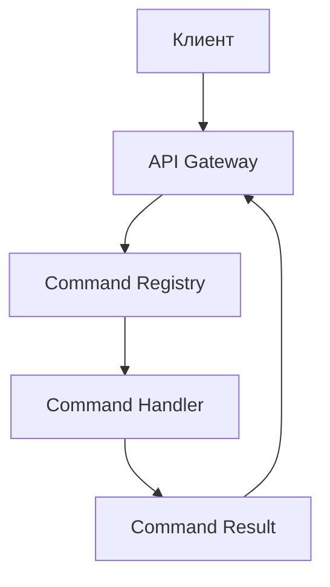
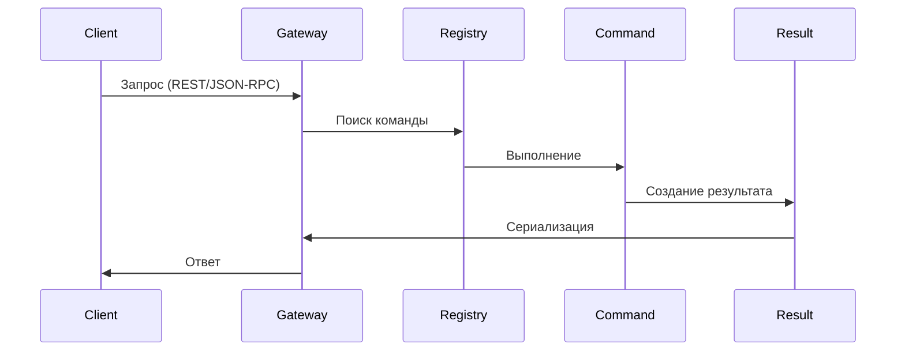

# Структура проекта MCP Microservice

## Информационная структура

### 1. Основные компоненты


### 2. Слои абстракции
1. **Транспортный слой**
   - REST API (FastAPI)
   - JSON-RPC (WebSocket)
   - Единый формат ответов

2. **Слой команд**
   - Регистрация команд
   - Валидация параметров
   - Маршрутизация

3. **Слой бизнес-логики**
   - Выполнение команд
   - Обработка ошибок
   - Формирование результатов

4. **Слой данных**
   - Типизированные результаты
   - Схемы валидации
   - Сериализация/десериализация

5. **Слой конфигурации**
   - Единый источник настроек
   - Валидация полноты конфигурации
   - Горячая перезагрузка 
   - Поддержка переменных окружения и аргументов командной строки

## Жизненный цикл запроса

### 1. Входящий запрос
1. Клиент отправляет запрос (REST/JSON-RPC)
2. API Gateway принимает и валидирует запрос
3. Определяется тип запроса и протокол

### 2. Обработка команды
1. Command Registry находит нужную команду
2. Валидируются входные параметры
3. Создается контекст выполнения
4. Команда выполняется в изолированном окружении

### 3. Формирование ответа
1. Команда возвращает типизированный результат
2. Результат валидируется через схему
3. Происходит сериализация в нужный формат
4. Ответ отправляется клиенту

### 4. Обработка ошибок
1. Все ошибки перехватываются
2. Формируется стандартный формат ошибки
3. Ошибка логируется
4. Клиент получает информативный ответ

## Диаграмма взаимодействия



## Структура файловой системы

```
mcp_proxy_adapter/
├── commands/           # Реализации команд
├── core/               # Ядро функциональности
├── api/                # Реализация API
├── schemas/            # Определения схем
├── tests/
│   ├── unit/           # Модульные тесты
│   └── integration/    # Интеграционные тесты
├── config.json         # Основной файл конфигурации
└── docs/
    ├── EN/             # Документация на английском
    └── RU/             # Документация на русском
```

## Расширение функциональности

### 1. Добавление новой команды
1. Создание файла команды
2. Определение типа результата
3. Реализация бизнес-логики
4. Регистрация в системе
5. Автоматическое обновление схемы

### 2. Модификация существующей команды
1. Обратная совместимость
2. Версионирование API
3. Миграция данных
4. Обновление документации

### 3. Обработка ошибок
1. Стандартные ошибки
2. Пользовательские ошибки
3. Системные ошибки
4. Сетевые ошибки

## Мониторинг и логирование

### 1. Метрики
- Время выполнения команд
- Количество запросов
- Статистика ошибок
- Использование ресурсов

### 2. Логи
- Структурированное логирование
- Уровни логирования
- Ротация логов
- Трейсинг запросов
- Отдельные файлы для stderr

### 3. Алерты
- Критические ошибки
- Превышение таймаутов
- Исчерпание ресурсов
- Недоступность сервиса

## Безопасность

### 1. Аутентификация
- API ключи
- JWT токены
- OAuth 2.0

### 2. Авторизация
- Роли и права
- Ограничение доступа
- Аудит действий

### 3. Защита данных
- Валидация входных данных
- Санитизация выходных данных
- Шифрование чувствительной информации

## Интеграция с системными сервисами

- Скрипты инициализации, совместимые с SystemV
- Корректный запуск и остановка
- Мониторинг состояния сервиса
- Поддержка сигналов для перезагрузки 