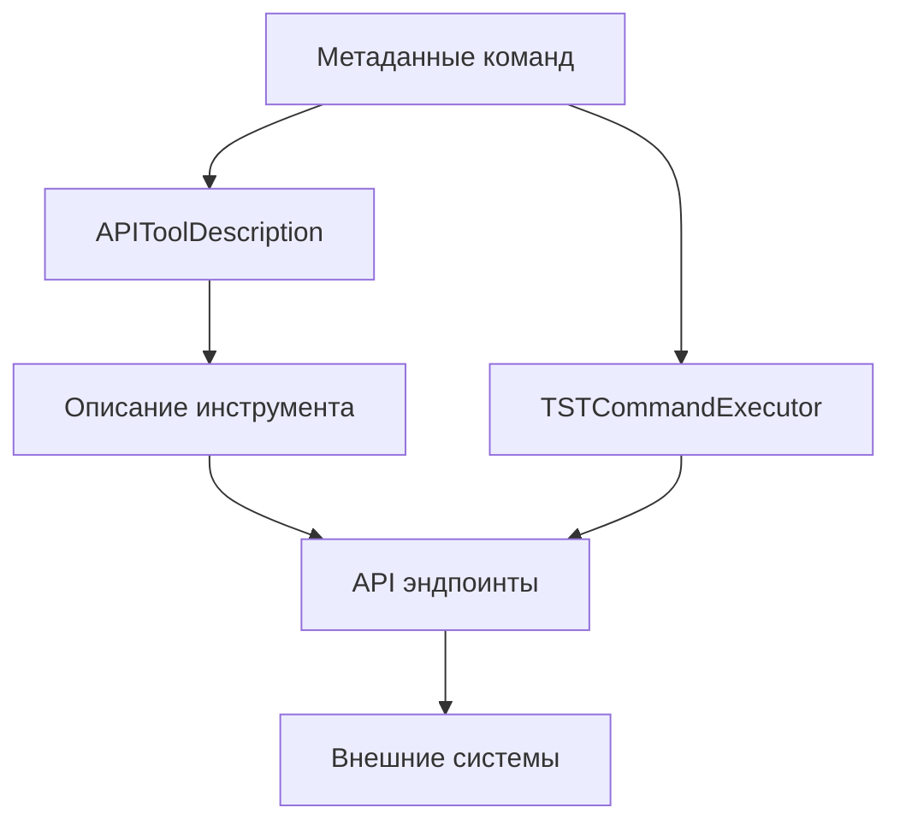

# Интеграция API инструментов

## Содержание

1. [Обзор](#обзор)
2. [Архитектура](#архитектура)
3. [Автоматическая генерация описаний](#автоматическая-генерация-описаний)
4. [Доступные инструменты](#доступные-инструменты)
5. [Использование API](#использование-api)
6. [Расширение функционала](#расширение-функционала)

## Обзор

Система интеграции API инструментов предоставляет механизм для создания и использования инструментов API, которые обеспечивают удобный доступ к функциональности микросервиса через внешние системы. Система автоматически генерирует описания инструментов на основе метаданных команд, что обеспечивает единообразие документации и улучшает пользовательский опыт.

Основные возможности:

- Автоматическая генерация описания инструментов на основе метаданных команд
- Поддержка различных форматов описания (JSON, Markdown, HTML)
- Выполнение команд через унифицированный интерфейс инструментов
- Интеграция с внешними системами через API

## Архитектура

Система интеграции API инструментов состоит из следующих компонентов:

1. **APIToolDescription** - класс для генерации описаний инструментов на основе метаданных команд
2. **ToolIntegration** - класс для интеграции метаданных команд с внешними системами
3. **TSTCommandExecutor** - класс инструмента для выполнения команд через JSON-RPC протокол
4. **API эндпоинты** - HTTP эндпоинты для получения описаний инструментов и выполнения команд

Схема взаимодействия компонентов:



## Автоматическая генерация описаний

Система автоматически генерирует описания инструментов на основе метаданных команд. Описание инструмента включает:

- Имя и описание инструмента
- Список доступных команд с их описаниями
- Параметры команд с типами и требуемыми флагами
- Примеры использования команд

Пример использования:

```python
from mcp_proxy_adapter.api.schemas import APIToolDescription
from mcp_proxy_adapter.commands.command_registry import registry

# Получение описания инструмента в формате JSON
description = APIToolDescription.generate_tool_description("tst_execute_command", registry)

# Получение описания инструмента в формате Markdown
description_text = APIToolDescription.generate_tool_description_text("tst_execute_command", registry)
```

## Доступные инструменты

### TST Command Executor

Инструмент `tst_execute_command` предоставляет возможность выполнения команд микросервиса через JSON-RPC протокол.

#### Параметры:

- `command` (строка, **обязательный**): Имя команды для выполнения
- `params` (объект, опциональный): Параметры команды

#### Примеры использования:

```json
{
    "command": "help"
}
```

```json
{
    "command": "system_info",
    "params": {
        "include_cpu": true,
        "include_memory": true
    }
}
```

## Использование API

### Получение описания инструмента

```http
GET /api/tools/{tool_name}?format={format}
```

Параметры:
- `tool_name` - имя инструмента API
- `format` - формат описания (json, text, markdown, html), по умолчанию "json"

Пример ответа (format=json):

```json
{
    "name": "tst_execute_command",
    "description": "Выполняет команды через JSON-RPC протокол на сервере проекта.",
    "parameters": {
        "properties": {
            "command": {
                "description": "Команда для выполнения",
                "type": "string",
                "enum": ["help", "system_info", "config"]
            },
            "params": {
                "description": "Параметры команды",
                "type": "object",
                "properties": {
                    "cmdname": {
                        "type": "string",
                        "description": "Имя команды для получения информации"
                    }
                }
            }
        },
        "required": ["command"],
        "type": "object"
    },
    "examples": [
        {
            "command": "tst_execute_command",
            "params": {
                "command": "help",
                "params": {}
            },
            "description": "Выполнение команды help"
        }
    ]
}
```

### Выполнение инструмента

```http
POST /api/tools/{tool_name}
```

Тело запроса:

```json
{
    "command": "help",
    "params": {
        "cmdname": "system_info"
    }
}
```

Пример ответа:

```json
{
    "success": true,
    "data": {
        "commands_info": {
            "system_info": {
                "description": "Предоставляет информацию о системе",
                "params": {
                    "include_cpu": {
                        "required": false,
                        "type": "bool",
                        "default": true
                    },
                    "include_memory": {
                        "required": false,
                        "type": "bool",
                        "default": true
                    }
                }
            }
        }
    }
}
```

## Расширение функционала

### Создание нового инструмента API

1. Создайте новый класс инструмента API в модуле `mcp_proxy_adapter.api.tools`:

```python
class NewToolExecutor:
    """
    Описание нового инструмента API.
    """
    
    name = "new_tool"
    description = "Описание нового инструмента."
    
    @classmethod
    async def execute(cls, **params) -> Dict[str, Any]:
        """
        Метод выполнения инструмента.
        """
        # Реализация выполнения инструмента
        return {"success": True, "data": {}}
    
    @classmethod
    def get_description(cls, format: str = "json") -> Union[Dict[str, Any], str]:
        """
        Метод получения описания инструмента.
        """
        # Реализация получения описания
        return ToolIntegration.generate_tool_schema(cls.name, registry, cls.description)
```

2. Зарегистрируйте инструмент в словаре доступных инструментов в модуле `mcp_proxy_adapter.api.tools`:

```python
available_tools = {
    TSTCommandExecutor.name: TSTCommandExecutor,
    NewToolExecutor.name: NewToolExecutor
}
```

### Кастомизация генерации описания

Для кастомизации генерации описания инструмента вы можете расширить класс `APIToolDescription` или переопределить метод `get_description` в классе инструмента:

```python
@classmethod
def get_description(cls, format: str = "json") -> Union[Dict[str, Any], str]:
    """
    Возвращает кастомное описание инструмента.
    """
    if format.lower() == "json":
        # Базовое описание
        base_description = ToolIntegration.generate_tool_schema(cls.name, registry, cls.description)
        
        # Кастомизация описания
        base_description["custom_field"] = "custom_value"
        
        return base_description
    else:
        return ToolIntegration.generate_tool_documentation(cls.name, registry, format)
``` 