# MultiMind Architecture

This document provides a comprehensive overview of the MultiMind SDK architecture, including its core components, interfaces, and data flow.

## System Overview

```mermaid
graph TB
    subgraph "MultiMind SDK"
        Core[Core Components]
        Ensemble[Ensemble System]
        Pipeline[Pipeline System]
        Compliance[Compliance & Governance]
        Interfaces[Interfaces]
        RAG[RAG System]
        FineTuning[Fine-tuning System]
        MCP[Model Control Plane]
        Memory[Memory System]
        Orchestration[Orchestration Engine]
        Gateway[API Gateway]
        Router[Model Router]
        Tools[Tool System]
        Monitoring[Monitoring System]
    end

    subgraph "Model Providers"
        OpenAI[OpenAI]
        Claude[Claude]
        Mistral[Mistral]
        Ollama[Ollama]
        HuggingFace[HuggingFace]
        Groq[Groq]
        Local[Local Models]
    end

    subgraph "Core Components"
        Models[Model Wrappers]
        Agents[Agent System]
        Memory[Memory Management]
        Tools[Tool System]
        Config[Configuration]
    end

    subgraph "Ensemble System"
        Methods[Ensemble Methods]
        Providers[Model Providers]
        Voting[Voting System]
    end

    subgraph "Pipeline System"
        Tasks[Task Management]
        Chains[Prompt Chains]
        Workflows[Workflow Engine]
    end

    subgraph "Compliance & Governance"
        Privacy[Privacy Management]
        Audit[Audit System]
        Policy[Policy Engine]
        Training[Compliance Training]
        Risk[Risk Assessment]
    end

    subgraph "RAG System"
        Indexing[Document Indexing]
        Retrieval[Vector Retrieval]
        Augmentation[Context Augmentation]
        Storage[Vector Storage]
        Embedding[Embedding Models]
    end

    subgraph "Fine-tuning System"
        Training[Model Training]
        Evaluation[Model Evaluation]
        Versioning[Model Versioning]
        Deployment[Model Deployment]
        LoRA[LoRA Training]
        QLoRA[QLoRA Training]
    end

    subgraph "Model Control Plane"
        Monitoring[Model Monitoring]
        Scaling[Auto Scaling]
        Routing[Request Routing]
        LoadBalancing[Load Balancing]
        Executor[MCP Executor]
        Parser[MCP Parser]
    end

    subgraph "Memory System"
        ShortTerm[Short-term Memory]
        LongTerm[Long-term Memory]
        WorkingMemory[Working Memory]
        Episodic[Episodic Memory]
        Buffer[Memory Buffer]
    end

    subgraph "Orchestration Engine"
        TaskScheduler[Task Scheduler]
        ResourceManager[Resource Manager]
        StateManager[State Manager]
        EventBus[Event Bus]
        WorkflowEngine[Workflow Engine]
    end

    subgraph "API Gateway"
        Auth[Authentication]
        RateLimit[Rate Limiting]
        Routing[Request Routing]
        Metrics[Metrics Collection]
        Session[Session Management]
    end

    subgraph "Model Router"
        Strategy[Routing Strategy]
        Fallback[Fallback Handler]
        LoadBalancer[Load Balancer]
        Metrics[Performance Metrics]
    end

    subgraph "Tool System"
        Calculator[Calculator Tool]
        WebSearch[Web Search Tool]
        FileOps[File Operations]
        CustomTools[Custom Tools]
    end

    subgraph "Monitoring System"
        Usage[Usage Tracker]
        Trace[Trace Logger]
        Metrics[Metrics Collector]
        Alerts[Alert System]
        Reports[Report Generator]
    end

    subgraph "Interfaces"
        CLI[Command Line Interface]
        API[REST API]
        WS[WebSocket API]
    end

    Core --> Ensemble
    Core --> Pipeline
    Core --> Compliance
    Core --> Interfaces
    Core --> RAG
    Core --> FineTuning
    Core --> MCP
    Core --> Memory
    Core --> Orchestration
    Core --> Gateway
    Core --> Router
    Core --> Tools
    Core --> Monitoring

    Models --> Providers
    Agents --> Tools
    Memory --> Agents
    Tools --> Agents

    Methods --> Voting
    Providers --> Voting
    Voting --> Ensemble

    OpenAI --> Providers
    Claude --> Providers
    Mistral --> Providers
    Ollama --> Providers
    HuggingFace --> Providers
    Groq --> Providers
    Local --> Providers

    Tasks --> Chains
    Chains --> Workflows
    Workflows --> Pipeline

    Privacy --> Audit
    Policy --> Privacy
    Audit --> Compliance
    Training --> Compliance
    Risk --> Compliance

    Indexing --> Storage
    Retrieval --> Storage
    Augmentation --> Retrieval
    Embedding --> Indexing

    Training --> Evaluation
    Evaluation --> Versioning
    Versioning --> Deployment
    LoRA --> Training
    QLoRA --> Training

    Monitoring --> Scaling
    Scaling --> Routing
    Routing --> LoadBalancing
    Executor --> MCP
    Parser --> MCP

    ShortTerm --> WorkingMemory
    LongTerm --> WorkingMemory
    Episodic --> WorkingMemory
    Buffer --> WorkingMemory

    TaskScheduler --> ResourceManager
    ResourceManager --> StateManager
    StateManager --> EventBus
    WorkflowEngine --> TaskScheduler

    Auth --> Gateway
    RateLimit --> Gateway
    Routing --> Gateway
    Metrics --> Gateway
    Session --> Gateway

    Strategy --> Router
    Fallback --> Router
    LoadBalancer --> Router
    Metrics --> Router

    Calculator --> Tools
    WebSearch --> Tools
    FileOps --> Tools
    CustomTools --> Tools

    Usage --> Monitoring
    Trace --> Monitoring
    Metrics --> Monitoring
    Alerts --> Monitoring
    Reports --> Monitoring

    CLI --> Core
    API --> Core
    WS --> Core
```

## Model Providers

The MultiMind SDK supports the following model providers:

### OpenAI
- GPT-3.5 Turbo
- GPT-4
- GPT-4 Vision
- Text Embedding Models

### Claude
- Claude 3 Opus
- Claude 3 Sonnet
- Claude 3 Haiku
- Claude Instant

### Mistral
- Mistral 7B
- Mixtral 8x7B
- Mistral Small
- Mistral Medium

### Ollama
- Local model hosting
- Custom model support
- Model management
- Inference API

### HuggingFace
- Open source models
- Custom model hosting
- Model fine-tuning
- Model deployment

### Groq
- Mixtral 8x7B
- High-performance inference
- Low latency
- Cost-effective

### Local Models
- Custom model support
- Local deployment
- Offline capabilities
- Resource optimization

Each provider is integrated through a standardized interface, allowing for:
- Consistent API access
- Unified error handling
- Standardized response formats
- Provider-specific optimizations

## Component Details

### Core Components

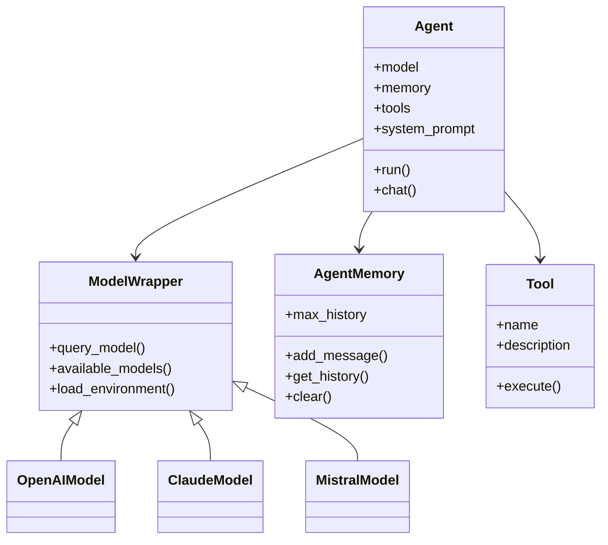

### Ensemble System

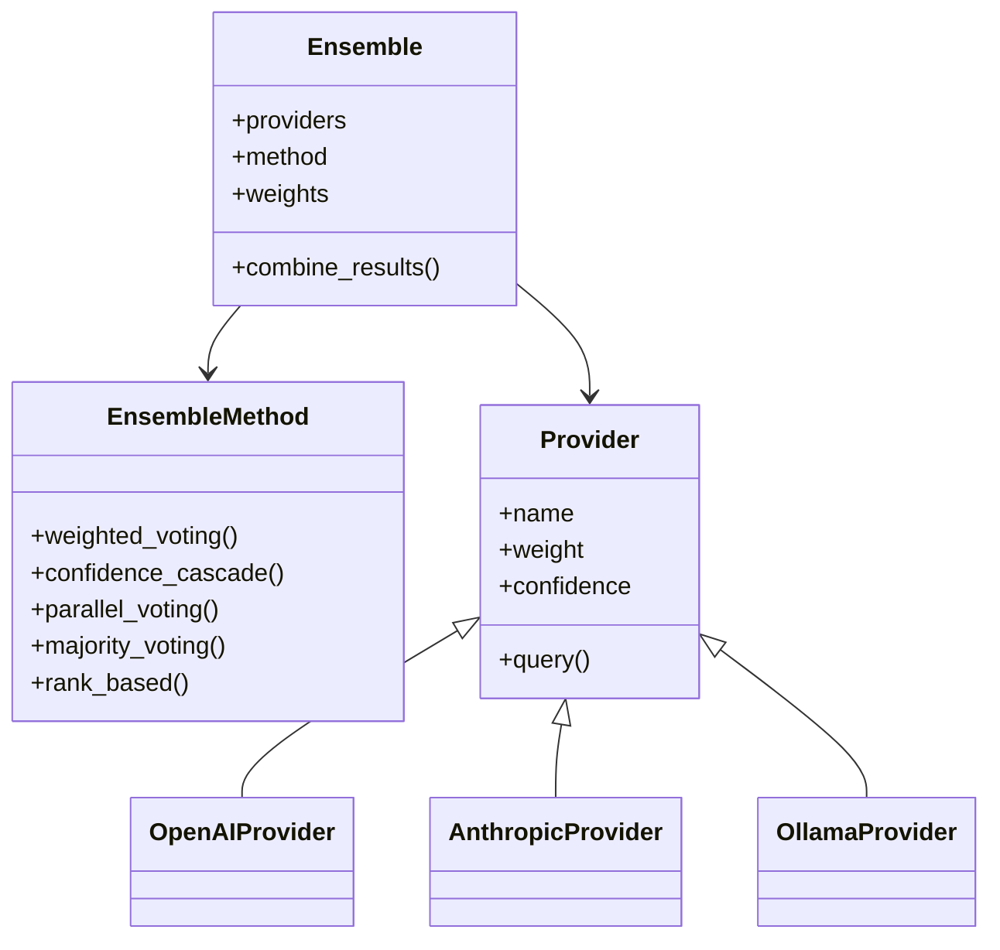

### Pipeline System

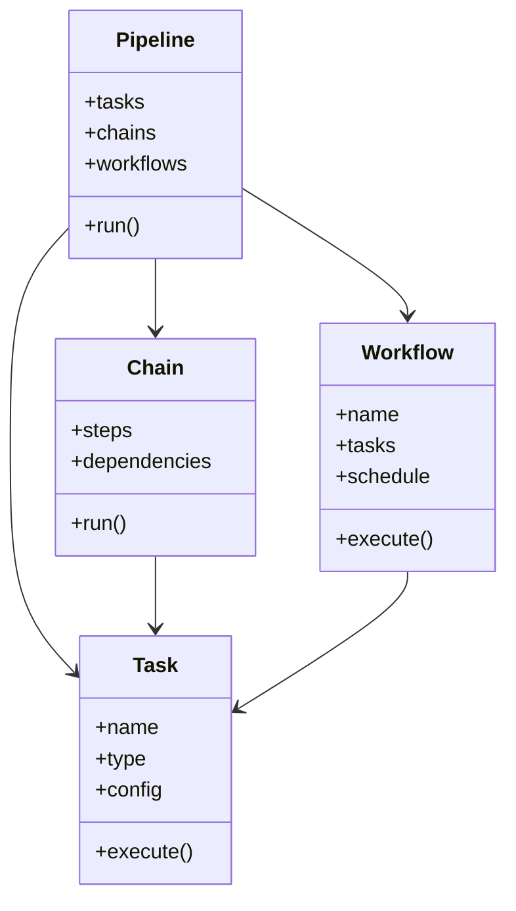

### Compliance & Governance

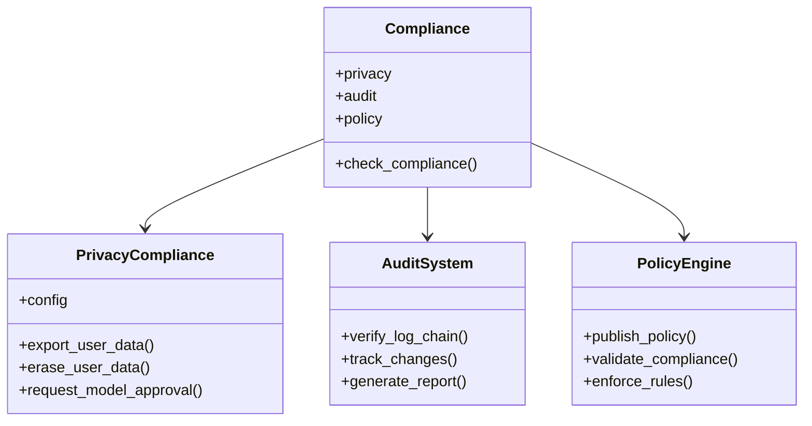

### Interfaces

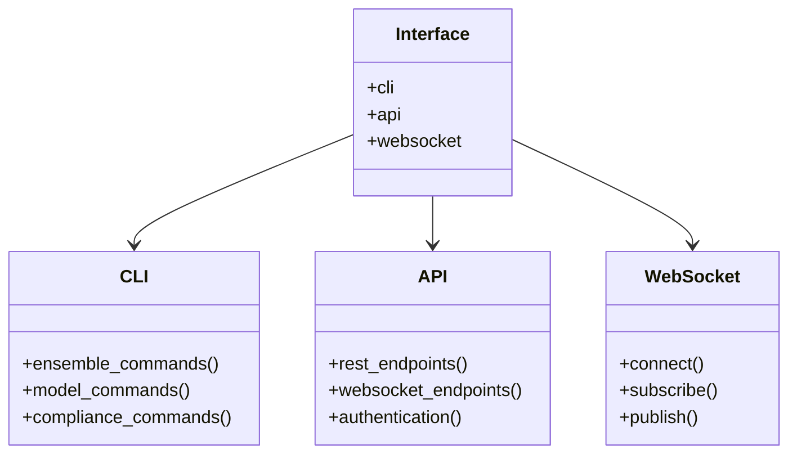

### RAG System

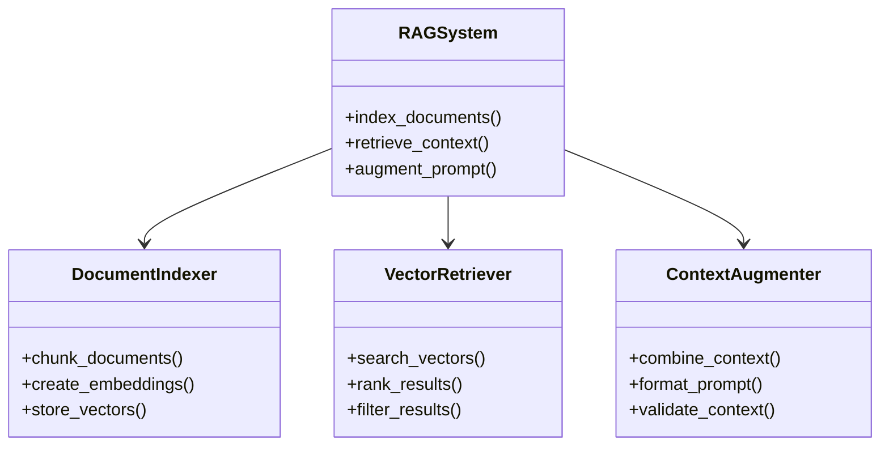

### Fine-tuning System

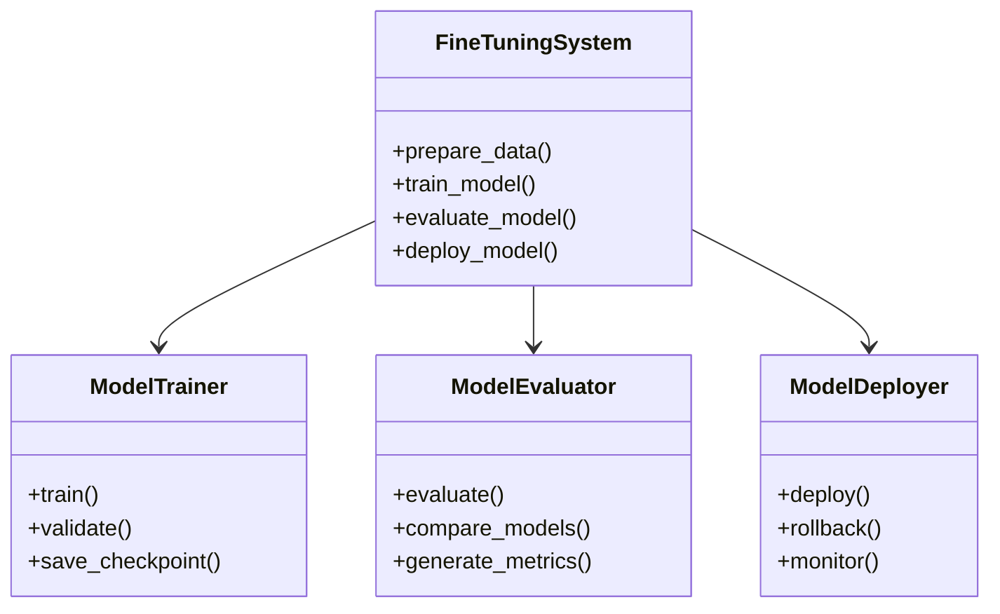

### Model Control Plane

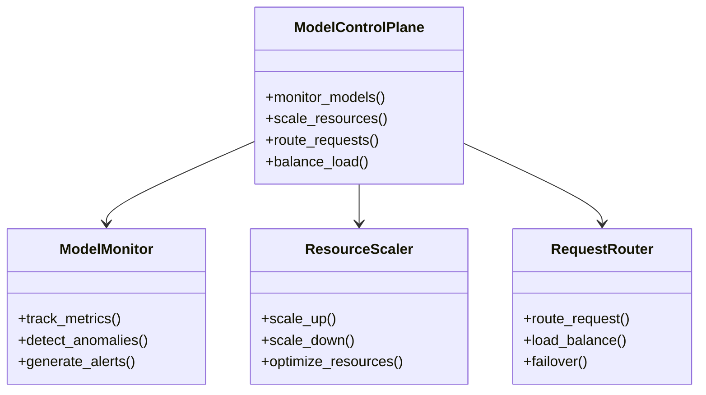

### Memory System

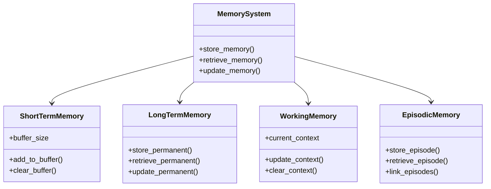

### Orchestration Engine

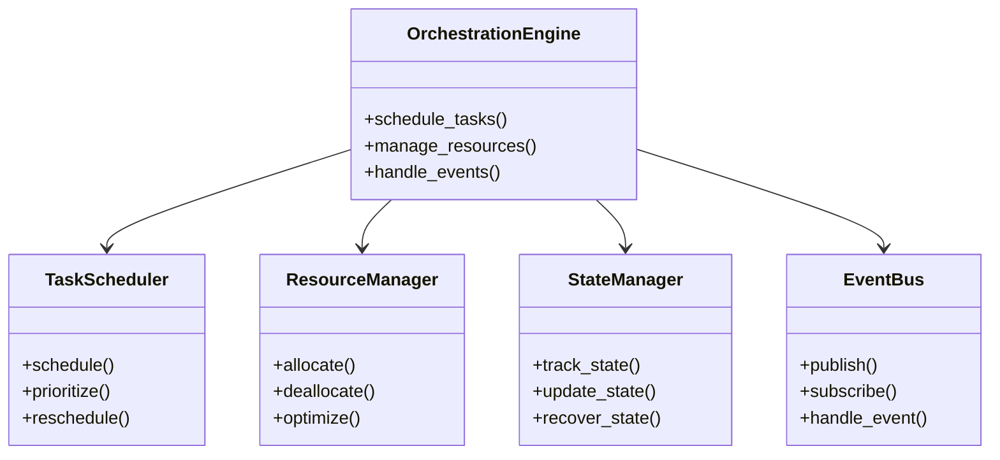

### Model Client Architecture and Routing

The MultiMind SDK features an extensible model client system for advanced and flexible model management:

- **ModelClient**: The base class for all model clients (transformer and non-transformer). Subclass to implement custom models.
- **Prebuilt Clients**: Includes LSTMModelClient, RNNModelClient, GRUModelClient, MoEModelClient (Mixture-of-Experts), DynamicMoEModelClient (runtime metrics-based routing), MultiModalClient (unified text, image, audio, video, code), and more.
- **Routing Logic**: MoE and DynamicMoE clients route requests to the best expert model based on prompt or runtime metrics. FederatedRouter enables routing between local and cloud models based on context (input size, latency, privacy, etc.).
- **Extensibility**: Easily add new model types or routing strategies by subclassing ModelClient or implementing custom routers.

This architecture enables dynamic model selection, multimodal workflows, and advanced routing for cost, latency, or quality optimization. See the Usage Guide for code examples.

## Data Flow

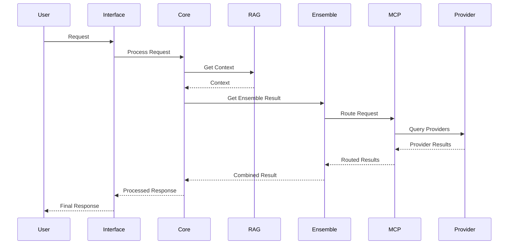

## Deployment Architecture

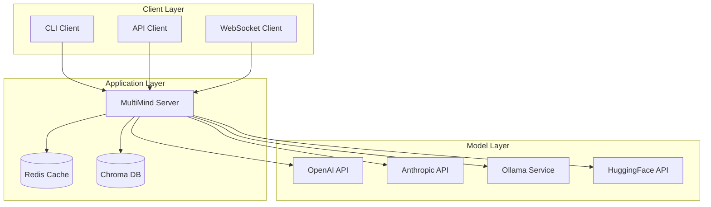

## Configuration

The architecture supports various configuration options through environment variables and configuration files:

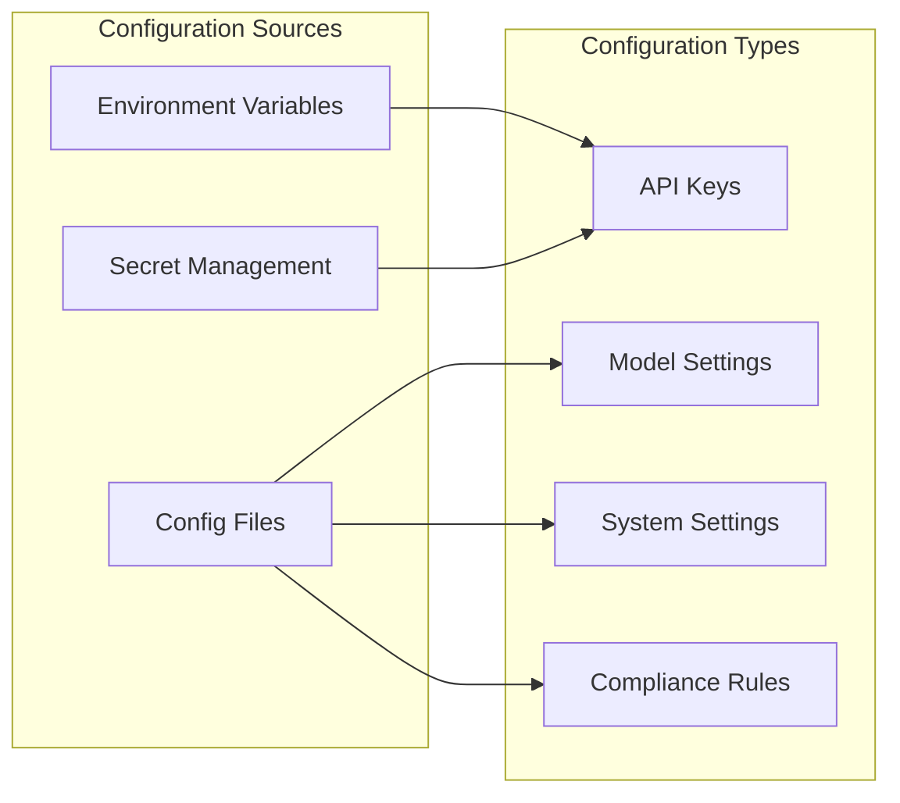

## Security Architecture

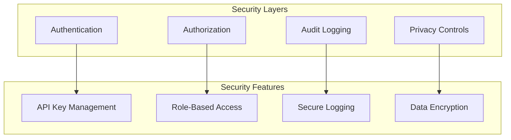

This architecture documentation provides a comprehensive overview of the MultiMind SDK's structure and components. Each diagram illustrates different aspects of the system, from high-level overview to detailed component interactions. 