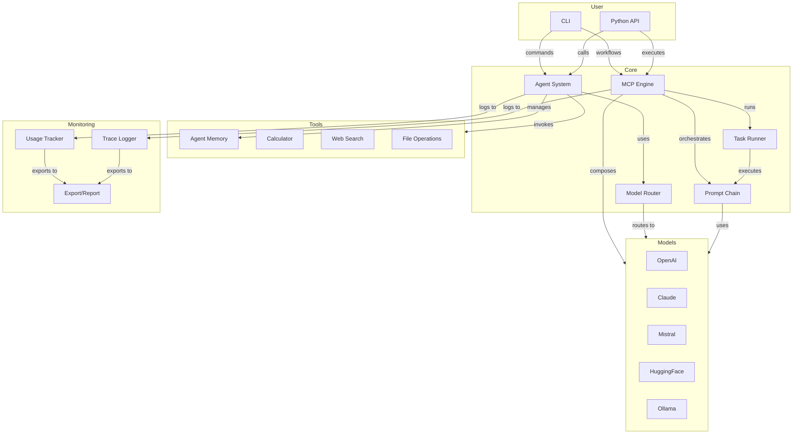

# MultiMind SDK: Features & Functions

## Project Structure (Current & Implemented)

Below is the current modular structure for MultiMind SDK. All modules are now implemented and available:

```
multimind-sdk/
├── multimind/
│   ├── __init__.py
│   ├── config.py                   # Central config loader
│
│   ├── models/                    # Unified model wrappers
│   │   ├── base.py                # Base model interface
│   │   ├── openai.py              # OpenAI model wrapper
│   │   ├── claude.py              # Claude model wrapper
│   │   ├── mistral.py             # Mistral model wrapper
│   │   ├── huggingface.py         # HuggingFace model wrapper
│   │   └── ollama.py              # Ollama model wrapper
│
│   ├── router/                    # Model routing and selection
│   │   ├── strategy.py            # Routing strategies
│   │   ├── fallback.py            # Fallback handling
│   │   └── router.py              # Main router implementation
│
│   ├── rag/                       # Retrieval-Augmented Generation
│   │   ├── base.py                # Base RAG interface
│   │   ├── embedder.py            # Embedding utilities
│   │   └── vector_store.py        # Vector store integration
│
│   ├── fine_tuning/              # Training and adaptation
│   │   ├── lora_trainer.py        # LoRA training
│   │   ├── qlora_trainer.py       # QLoRA training
│   │   └── dataset_loader.py      # Dataset handling
│
│   ├── agents/                   # Agent system
│   │   ├── agent.py               # Agent implementation
│   │   ├── memory.py              # Agent memory
│   │   ├── agent_loader.py        # Agent configuration loading
│   │   └── tools/
│   │       ├── web_search.py      # Web search tool
│   │       ├── calculator.py      # Calculator tool
│   │       └── file_reader.py     # File operations tool
│
│   ├── orchestration/           # Workflow orchestration
│   │   ├── prompt_chain.py        # Prompt chaining
│   │   └── task_runner.py         # Task orchestration
│
│   ├── mcp/                     # Model Composition Protocol
│   │   ├── parser.py             # MCP workflow parser
│   │   ├── executor.py           # MCP workflow executor
│   │   └── schema.json           # MCP schema definition
│
│   ├── integrations/           # Framework integrations
│   │   ├── langchain_adapter.py   # LangChain integration
│   │   ├── crewai_adapter.py      # CrewAI integration
│   │   └── lite_llm.py           # LiteLLM integration
│
│   ├── logging/                # Monitoring and logging
│   │   ├── trace_logger.py        # Trace logging
│   │   └── usage_tracker.py       # Usage tracking
│
│   ├── cli/                    # Command-line interface
│   │   ├── main.py                # CLI entry point
│   │   └── commands/
│   │       ├── agent.py           # Agent commands
│   │       ├── run_mcp.py         # MCP workflow commands
│   │       └── finetune.py        # Fine-tuning commands
│
├── examples/                   # Example scripts
├── configs/                    # Configuration templates
├── tests/                      # Test suite
├── docs/                       # Documentation
├── README.md
├── LICENSE
├── pyproject.toml
└── setup.py
```

---

## Core Features

### Model Support

- **Model Wrappers:**
  - OpenAI (GPT-3.5, GPT-4)
  - Anthropic Claude (Claude-3)
  - Mistral AI (Mistral Medium)
  - HuggingFace (any compatible model)
  - Ollama (local models)
  - TensorFlow and PyTorch Integration
    - Custom model integration
    - Fine-tuning capabilities
    - Support for CV and NLP models
- **Unified Interface:** All wrappers support `generate`, `chat`, and `embeddings` (where applicable)

### Agent System

- **Agent Framework:**
  - Configurable agents with memory and tools
  - Agent configuration loading from MCP files
  - Built-in tools (calculator, web search, file operations)
  - Extensible tool system
  - Agent collaboration capabilities
  - Hierarchical multi-agent systems
  - Advanced inter-agent communication
  - AutoML for agent configuration
  - Self-configuring agent systems
- **Memory Management:**
  - Conversation history tracking
  - Configurable memory size
  - Memory persistence
  - Advanced memory optimization

### Orchestration

- **Prompt Chains:**
  - Multi-step reasoning workflows
  - Variable substitution
  - Conditional execution
- **Task Runner:**
  - Task dependencies
  - Retry logic
  - Context management
  - Parallel execution

### Model Composition Protocol (MCP)

- **Workflow Definition:**
  - JSON/YAML-based workflow specification
  - Model composition and chaining
  - Conditional execution
  - Data transformation
- **Execution Engine:**
  - Workflow validation
  - Model registration
  - Step execution
  - Error handling

### Routing & Strategy

- **Model Router:**
  - Strategy-based routing (cost-aware, latency-aware, hybrid)
  - Fallback chain for robust inference
  - Dynamic model selection

### Fine-Tuning & PEFT

- **PEFT Methods:**
  - LoRA, Adapters, Prefix/Prompt Tuning
  - IA³, BitFit, QLoRA, Compacter
  - HyperLoRA, UniPELT, MAM
  - AutoML-based parameter tuning
- **Meta-Learning:**
  - Few-shot (MAML, Reptile, Prototype)
  - Transfer learning
  - Multi-task adaptation
  - Self-tuning capabilities
- **RAG (Retrieval-Augmented Generation):**
  - Vector store support (FAISS, Chroma)
  - Embedding and retrieval utilities
  - Self-tuning indexer with feedback loop
  - Hybrid search with Knowledge Graph

### Enterprise Integration

- **Compliance Suite:**
  - GDPR, CCPA, HIPAA support
  - PII Redaction
  - Data governance frameworks
  - Audit logging systems
- **Edge Deployment:**
  - Optimized edge device deployment (Jetson, Pi)
  - Resource efficiency tools
  - Offline mode capabilities
  - Edge-specific optimizations
- **Integration Hub:**
  - Plugin System (Slack, Notion, Salesforce)
  - Database connectors (MongoDB, PostgreSQL)
  - Real-time data integration (Kafka, MQTT)
  - API connectors and service integrations

### Development Tools

- **Visual Tools:**
  - Visual workflow builder
  - Drag-and-drop components
  - No-code development interface
  - Enterprise workflow templates
- **Monitoring Dashboard:**
  - Live state monitoring
  - Memory editing capabilities
  - Workflow visualization
  - Performance analytics
  - Real-time insights

### Logging & Monitoring

- **Usage Tracking:**
  - Token usage monitoring
  - Cost tracking
  - Operation logging
- **Trace Logging:**
  - Request/response tracing
  - Performance metrics
  - Error tracking
- **Export & Reporting:**
  - JSON/CSV export
  - Usage summaries
  - Cost analysis

### Configuration

- **Config Management:**
  - YAML/JSON config files
  - `.env` and environment variable support
  - CLI and SDK config sharing

### CLI & Integration

- **CLI:**
  - Agent management
  - MCP workflow execution
  - Fine-tuning commands
  - Usage monitoring
- **Framework Integrations:**
  - LangChain, CrewAI, LiteLLM, SuperAGI
  - Adapter classes for seamless integration

---

## Feature Table

| Category          | Feature/Functionality                                      | Status      |
|-------------------|----------------------------------------------------------|-------------|
| Model Wrappers    | OpenAI, Claude, Mistral, HuggingFace, Ollama             | Implemented |
| TensorFlow/PyTorch| Custom models, CV/NLP support, Fine-tuning               | In Progress |
| Agent System      | Framework, memory, tools, collaboration                   | Implemented |
| Agent AutoML      | Self-configuration, optimization                         | In Progress |
| Orchestration     | Prompt chains, task runner, workflow management          | Implemented |
| MCP              | Workflow definition, execution, model composition         | Implemented |
| Routing          | Strategy, fallback, dynamic selection                    | Implemented |
| Enterprise        | Compliance, Edge deployment, Integration hub             | In Progress |
| Development Tools | Visual builder, No-code interface, Templates            | In Progress |
| Fine-Tuning      | PEFT methods, Meta-learning, AutoML                      | In Progress |
| RAG              | Vector stores, Hybrid search, Self-tuning                | In Progress |
| Monitoring       | Dashboard, Analytics, Real-time insights                 | In Progress |
| Integrations     | LangChain, CrewAI, LiteLLM, SuperAGI                    | Implemented |

---

## Examples

The SDK includes comprehensive examples demonstrating all major features:

- [Basic Agent Usage](../examples/basic_agent.py) - Agent creation and usage
- [Prompt Chaining](../examples/prompt_chain.py) - Complex reasoning workflows
- [Task Running](../examples/task_runner.py) - Workflow orchestration
- [MCP Workflows](../examples/mcp_workflow.py) - Model composition examples
- [Usage Tracking](../examples/usage_tracking.py) - Monitoring and logging

See the [examples README](../examples/README.md) for detailed usage instructions.

---

## Architecture Overview



For more details, see the [Architecture Overview](architecture.md) and [Development Guide](development.md)
