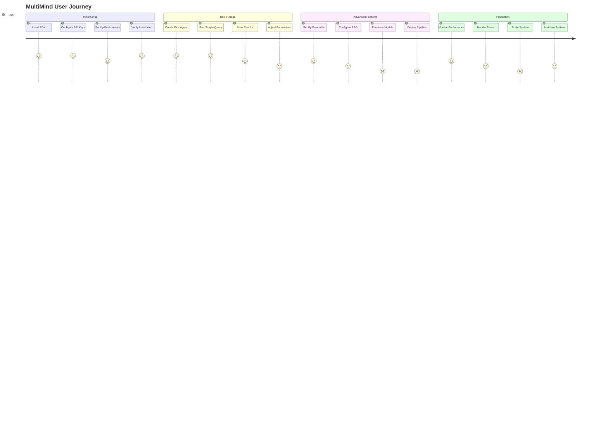
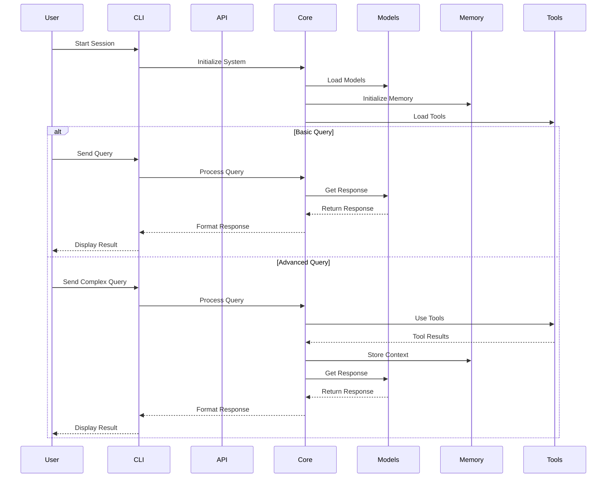
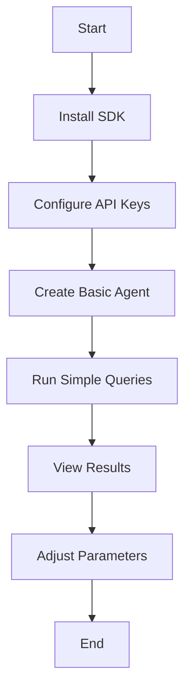
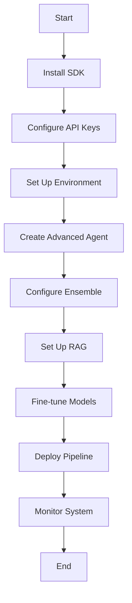
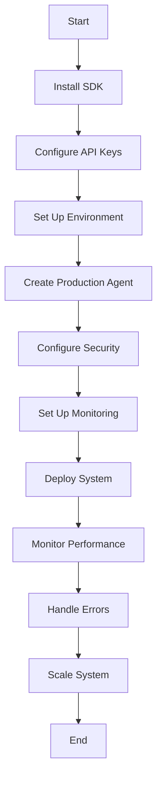
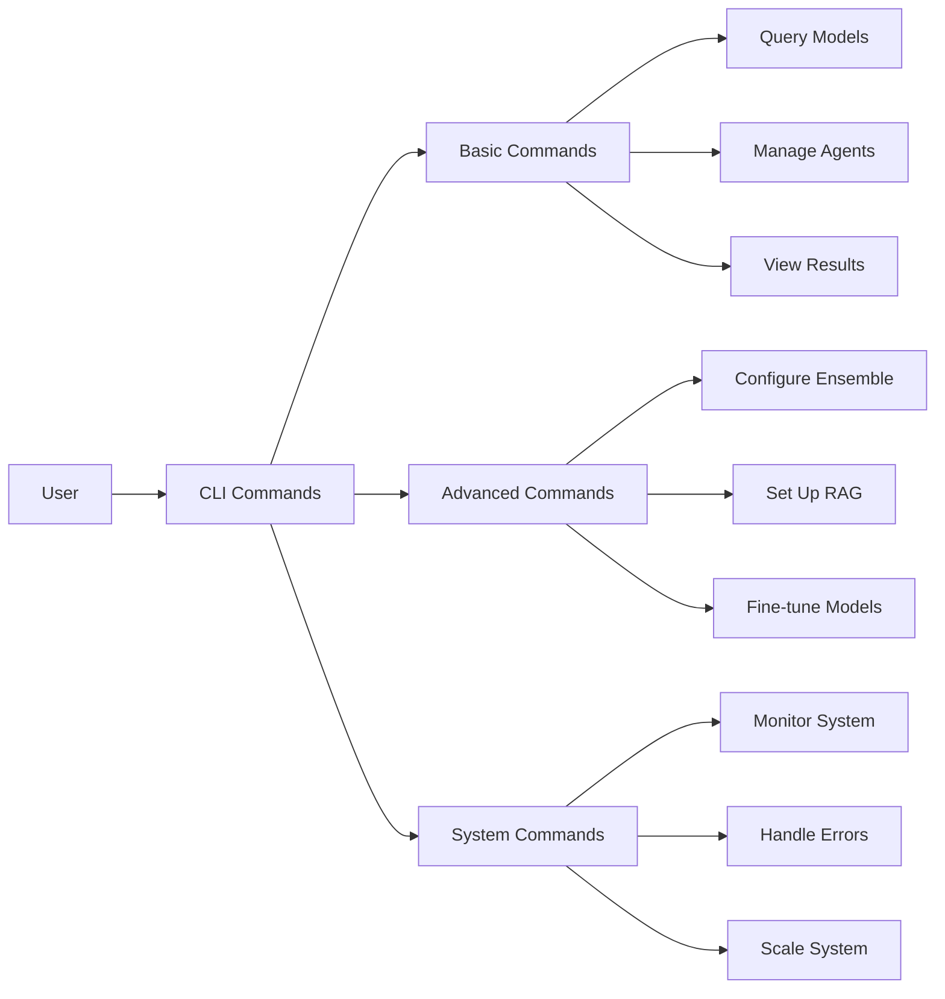
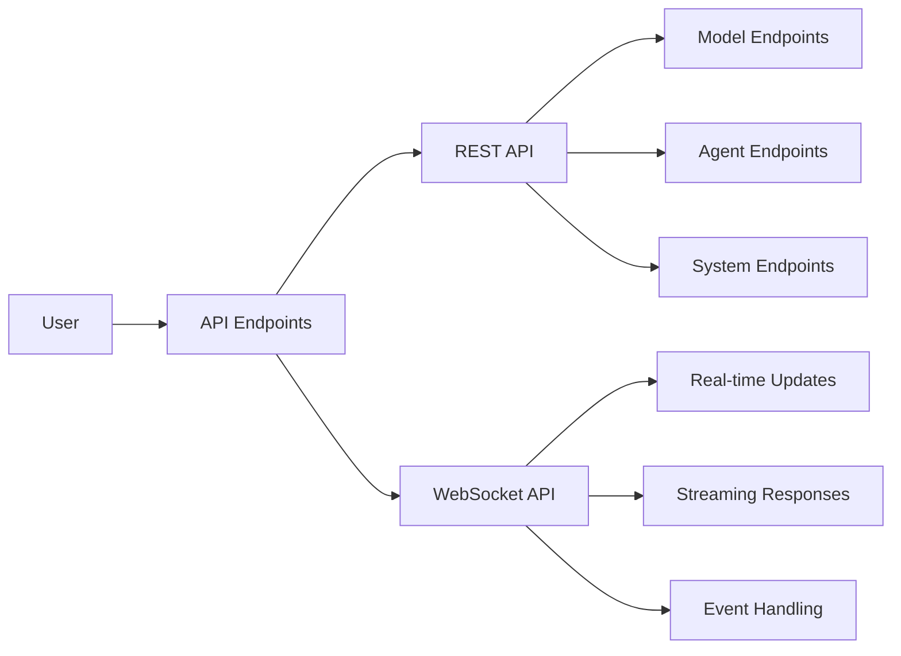
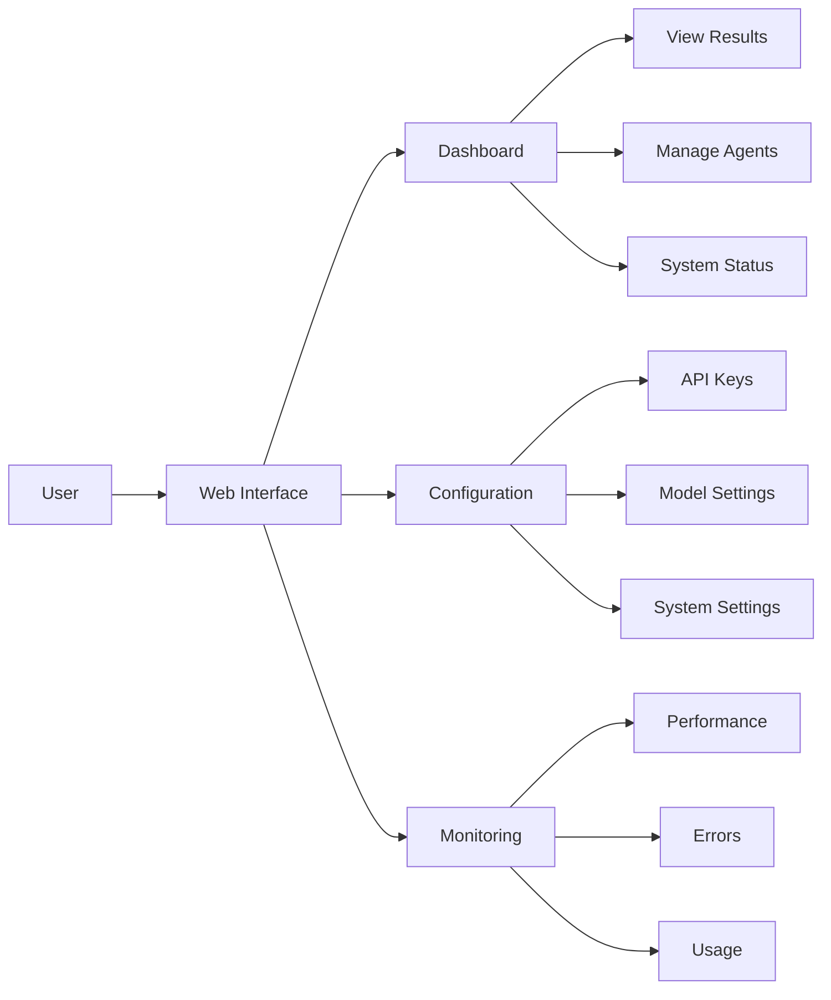
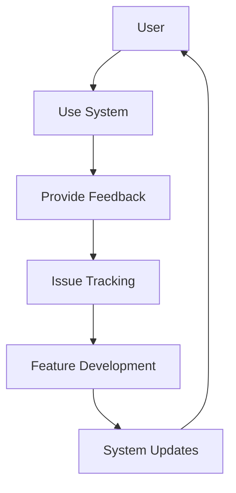

# MultiMind User Journey

This document outlines the various user journeys and interaction paths within the MultiMind SDK.

## User Journey Overview

## User Interaction Flow

## User Paths

### 1. Basic User Path

### 2. Advanced User Path

### 3. Production User Path

## User Interaction Points

### 1. Command Line Interface (CLI)

### 2. API Interface

### 3. Web Interface

## User Experience Considerations

1. **Onboarding**
   - Clear installation instructions
   - Step-by-step configuration guide
   - Example usage scenarios
   - Troubleshooting guide

2. **Basic Usage**
   - Simple command structure
   - Intuitive parameter names
   - Clear output formatting
   - Helpful error messages

3. **Advanced Features**
   - Comprehensive documentation
   - Example configurations
   - Best practices guide
   - Performance optimization tips

4. **Production Deployment**
   - Security guidelines
   - Scaling recommendations
   - Monitoring setup
   - Maintenance procedures

## User Support

1. **Documentation**
   - API reference
   - Command reference
   - Configuration guide
   - Troubleshooting guide

2. **Examples**
   - Basic usage examples
   - Advanced feature examples
   - Production deployment examples
   - Integration examples

3. **Tools**
   - CLI help system
   - API documentation
   - Configuration validator
   - System health checker

4. **Community**
   - GitHub discussions
   - Issue tracking
   - Feature requests
   - Community contributions

## User Feedback Loop

This user journey documentation provides a comprehensive overview of how users interact with the MultiMind SDK, from initial setup to advanced usage and production deployment. The diagrams illustrate different user paths and interaction points, while the supporting text provides context and guidance for each stage of the journey. 