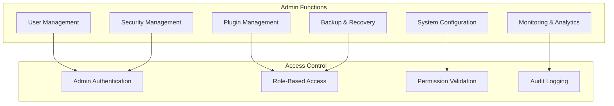

# Admin API

Administrative API endpoints for managing the Nexus platform.

## 🎯 Overview

The Admin API provides comprehensive administrative capabilities for managing users, plugins, system configuration, and monitoring. These endpoints require elevated permissions and are typically used by system administrators and automated management tools.

## 🏗️ Admin Architecture



## 👥 User Management

### List All Users

Get paginated list of all users with filtering options.

```http
GET /api/v1/admin/users
Authorization: Bearer <admin_token>
```

**Query Parameters:**
- `page` (integer): Page number (default: 1)
- `per_page` (integer): Items per page (default: 20, max: 100)
- `search` (string): Search in username, email, or full name
- `role` (string): Filter by role
- `status` (string): Filter by status (active, inactive, suspended)
- `created_after` (string): Filter by creation date (ISO 8601)
- `sort` (string): Sort field (username, email, created_at, last_login)
- `order` (string): Sort order (asc, desc)

**Response:**
```json
{
  "success": true,
  "data": {
    "users": [
      {
        "id": "123",
        "username": "john_doe",
        "email": "john@example.com",
        "full_name": "John Doe",
        "roles": ["user", "moderator"],
        "status": "active",
        "email_verified": true,
        "last_login": "2024-01-01T12:00:00Z",
        "login_count": 42,
        "created_at": "2023-01-01T00:00:00Z",
        "updated_at": "2024-01-01T11:30:00Z"
      }
    ],
    "pagination": {
      "page": 1,
      "per_page": 20,
      "total": 150,
      "pages": 8,
      "has_next": true,
      "has_prev": false
    }
  }
}
```

### Get User Details

Get detailed information about a specific user.

```http
GET /api/v1/admin/users/{user_id}
Authorization: Bearer <admin_token>
```

**Response:**
```json
{
  "success": true,
  "data": {
    "user": {
      "id": "123",
      "username": "john_doe",
      "email": "john@example.com",
      "full_name": "John Doe",
      "roles": ["user", "moderator"],
      "permissions": ["read:all", "write:all", "moderate:content"],
      "status": "active",
      "email_verified": true,
      "profile": {
        "avatar_url": "https://example.com/avatars/john.jpg",
        "bio": "Software developer",
        "location": "San Francisco, CA"
      },
      "preferences": {
        "theme": "dark",
        "language": "en",
        "notifications": true
      },
      "metadata": {
        "last_login": "2024-01-01T12:00:00Z",
        "login_count": 42,
        "failed_login_attempts": 0,
        "last_password_change": "2023-12-01T10:00:00Z",
        "created_at": "2023-01-01T00:00:00Z",
        "updated_at": "2024-01-01T11:30:00Z"
      },
      "sessions": [
        {
          "id": "sess_123",
          "device": "Chrome on Windows",
          "ip_address": "192.168.1.100",
          "location": "San Francisco, CA",
          "last_activity": "2024-01-01T12:00:00Z",
          "is_active": true
        }
      ],
      "api_keys": [
        {
          "id": "key_456",
          "name": "Production API Key",
          "key_preview": "nx_************************************abcd",
          "last_used": "2024-01-01T11:30:00Z",
          "is_active": true
        }
      ]
    }
  }
}
```

### Create User

Create a new user account (admin only).

```http
POST /api/v1/admin/users
Authorization: Bearer <admin_token>
Content-Type: application/json

{
  "username": "new_user",
  "email": "newuser@example.com",
  "password": "secure_password",
  "full_name": "New User",
  "roles": ["user"],
  "send_welcome_email": true,
  "force_password_change": false
}
```

**Response:**
```json
{
  "success": true,
  "data": {
    "user": {
      "id": "456",
      "username": "new_user",
      "email": "newuser@example.com",
      "full_name": "New User",
      "roles": ["user"],
      "status": "active",
      "email_verified": false,
      "created_at": "2024-01-01T12:00:00Z"
    }
  }
}
```

### Update User

Update user information and settings.

```http
PUT /api/v1/admin/users/{user_id}
Authorization: Bearer <admin_token>
Content-Type: application/json

{
  "email": "updated@example.com",
  "full_name": "Updated Name",
  "roles": ["user", "moderator"],
  "status": "active"
}
```

### Suspend User

Suspend a user account.

```http
POST /api/v1/admin/users/{user_id}/suspend
Authorization: Bearer <admin_token>
Content-Type: application/json

{
  "reason": "Terms of service violation",
  "duration_days": 30,
  "notify_user": true
}
```

### Reset User Password

Reset user password and optionally force change on next login.

```http
POST /api/v1/admin/users/{user_id}/reset-password
Authorization: Bearer <admin_token>
Content-Type: application/json

{
  "temporary_password": "temp_password_123",
  "force_change_on_login": true,
  "send_email": true
}
```

## 🔌 Plugin Management

### List Plugins

Get list of all installed plugins.

```http
GET /api/v1/admin/plugins
Authorization: Bearer <admin_token>
```

**Response:**
```json
{
  "success": true,
  "data": {
    "plugins": [
      {
        "id": "auth-plugin",
        "name": "Authentication Plugin",
        "version": "1.2.0",
        "description": "Provides authentication and authorization",
        "author": "Nexus Team",
        "status": "active",
        "enabled": true,
        "health": "healthy",
        "load_order": 1,
        "dependencies": [],
        "permissions": ["auth:*"],
        "endpoints": [
          "/api/v1/auth/login",
          "/api/v1/auth/logout"
        ],
        "events": ["user.login", "user.logout"],
        "metrics": {
          "requests_handled": 1250,
          "errors": 3,
          "uptime_seconds": 86400
        },
        "installed_at": "2023-01-01T00:00:00Z",
        "last_updated": "2024-01-01T10:00:00Z"
      }
    ]
  }
}
```

### Get Plugin Details

Get detailed information about a specific plugin.

```http
GET /api/v1/admin/plugins/{plugin_id}
Authorization: Bearer <admin_token>
```

**Response:**
```json
{
  "success": true,
  "data": {
    "plugin": {
      "id": "auth-plugin",
      "manifest": {
        "name": "Authentication Plugin",
        "version": "1.2.0",
        "description": "Provides authentication and authorization",
        "author": "Nexus Team",
        "license": "MIT",
        "nexus_version": ">=1.0.0"
      },
      "status": "active",
      "health": "healthy",
      "configuration": {
        "jwt_secret": "***hidden***",
        "session_timeout": 3600,
        "enable_2fa": false
      },
      "metrics": {
        "requests_per_minute": 15.5,
        "average_response_time": 125,
        "error_rate": 0.002,
        "memory_usage_mb": 45
      },
      "logs": [
        {
          "timestamp": "2024-01-01T12:00:00Z",
          "level": "INFO",
          "message": "Plugin initialized successfully"
        }
      ]
    }
  }
}
```

### Install Plugin

Install a new plugin from repository or file.

```http
POST /api/v1/admin/plugins/install
Authorization: Bearer <admin_token>
Content-Type: application/json

{
  "source": "repository",
  "plugin_name": "analytics-plugin",
  "version": "latest",
  "config": {
    "enabled": true,
    "track_anonymous": false
  }
}
```

### Enable/Disable Plugin

Enable or disable a plugin.

```http
POST /api/v1/admin/plugins/{plugin_id}/enable
Authorization: Bearer <admin_token>
```

```http
POST /api/v1/admin/plugins/{plugin_id}/disable
Authorization: Bearer <admin_token>
```

### Update Plugin

Update plugin to newer version.

```http
POST /api/v1/admin/plugins/{plugin_id}/update
Authorization: Bearer <admin_token>
Content-Type: application/json

{
  "version": "1.3.0",
  "backup_current": true,
  "restart_after_update": true
}
```

### Uninstall Plugin

Remove a plugin from the system.

```http
DELETE /api/v1/admin/plugins/{plugin_id}
Authorization: Bearer <admin_token>
```

## ⚙️ System Configuration

### Get System Configuration

Get current system configuration.

```http
GET /api/v1/admin/config
Authorization: Bearer <admin_token>
```

**Query Parameters:**
- `section` (string): Specific config section (optional)
- `include_secrets` (boolean): Include secret values (default: false)

**Response:**
```json
{
  "success": true,
  "data": {
    "config": {
      "server": {
        "host": "0.0.0.0",
        "port": 8000,
        "workers": 4
      },
      "database": {
        "host": "localhost",
        "port": 5432,
        "database": "nexus",
        "pool_size": 20
      },
      "security": {
        "force_https": true,
        "session_timeout": 3600
      }
    },
    "metadata": {
      "last_updated": "2024-01-01T10:00:00Z",
      "updated_by": "admin",
      "config_version": "1.2.0"
    }
  }
}
```

### Update System Configuration

Update system configuration settings.

```http
PUT /api/v1/admin/config
Authorization: Bearer <admin_token>
Content-Type: application/json

{
  "server": {
    "workers": 8
  },
  "security": {
    "session_timeout": 7200
  }
}
```

### Reload Configuration

Reload configuration from files without restart.

```http
POST /api/v1/admin/config/reload
Authorization: Bearer <admin_token>
```

## 📊 System Monitoring

### System Health

Get comprehensive system health status.

```http
GET /api/v1/admin/health
Authorization: Bearer <admin_token>
```

**Response:**
```json
{
  "success": true,
  "data": {
    "overall_status": "healthy",
    "timestamp": "2024-01-01T12:00:00Z",
    "uptime_seconds": 86400,
    "components": [
      {
        "name": "database",
        "status": "healthy",
        "response_time_ms": 15,
        "details": {
          "connection_pool": {
            "active": 8,
            "idle": 12,
            "total": 20
          },
          "queries_per_second": 45.2
        }
      },
      {
        "name": "cache",
        "status": "healthy",
        "response_time_ms": 3,
        "details": {
          "memory_usage": "256MB",
          "hit_rate": 0.89
        }
      },
      {
        "name": "plugins",
        "status": "healthy",
        "details": {
          "total": 8,
          "active": 7,
          "failed": 1
        }
      }
    ],
    "metrics": {
      "requests_per_minute": 1250,
      "average_response_time": 125,
      "error_rate": 0.002,
      "memory_usage_mb": 512,
      "cpu_usage_percent": 45.5
    }
  }
}
```

### System Metrics

Get detailed system metrics and performance data.

```http
GET /api/v1/admin/metrics
Authorization: Bearer <admin_token>
```

**Query Parameters:**
- `start_time` (string): Start time for metrics (ISO 8601)
- `end_time` (string): End time for metrics (ISO 8601)
- `resolution` (string): Time resolution (1m, 5m, 15m, 1h, 1d)
- `metrics` (array): Specific metrics to include

**Response:**
```json
{
  "success": true,
  "data": {
    "time_range": {
      "start": "2024-01-01T11:00:00Z",
      "end": "2024-01-01T12:00:00Z",
      "resolution": "1m"
    },
    "metrics": {
      "requests_per_second": [
        {"timestamp": "2024-01-01T11:00:00Z", "value": 45.2},
        {"timestamp": "2024-01-01T11:01:00Z", "value": 52.1}
      ],
      "response_time_ms": [
        {"timestamp": "2024-01-01T11:00:00Z", "value": 125},
        {"timestamp": "2024-01-01T11:01:00Z", "value": 98}
      ],
      "error_rate": [
        {"timestamp": "2024-01-01T11:00:00Z", "value": 0.002},
        {"timestamp": "2024-01-01T11:01:00Z", "value": 0.001}
      ]
    }
  }
}
```

### System Logs

Get system logs with filtering and pagination.

```http
GET /api/v1/admin/logs
Authorization: Bearer <admin_token>
```

**Query Parameters:**
- `level` (string): Log level filter (DEBUG, INFO, WARNING, ERROR)
- `component` (string): Component filter
- `start_time` (string): Start time for logs
- `end_time` (string): End time for logs
- `search` (string): Search in log messages
- `page` (integer): Page number
- `per_page` (integer): Logs per page

**Response:**
```json
{
  "success": true,
  "data": {
    "logs": [
      {
        "timestamp": "2024-01-01T12:00:00Z",
        "level": "INFO",
        "component": "auth-plugin",
        "message": "User john_doe logged in successfully",
        "metadata": {
          "user_id": "123",
          "ip_address": "192.168.1.100",
          "request_id": "req_abc123"
        }
      }
    ],
    "pagination": {
      "page": 1,
      "per_page": 100,
      "total": 1500,
      "has_next": true
    }
  }
}
```

## 🔒 Security Management

### Security Alerts

Get security alerts and incidents.

```http
GET /api/v1/admin/security/alerts
Authorization: Bearer <admin_token>
```

**Response:**
```json
{
  "success": true,
  "data": {
    "alerts": [
      {
        "id": "alert_001",
        "severity": "high",
        "type": "brute_force_attack",
        "title": "Multiple failed login attempts detected",
        "description": "IP 192.168.1.200 has made 15 failed login attempts in the last 5 minutes",
        "timestamp": "2024-01-01T12:00:00Z",
        "status": "active",
        "affected_resources": ["user:john_doe"],
        "metadata": {
          "ip_address": "192.168.1.200",
          "attempts": 15,
          "time_window": "5m"
        }
      }
    ]
  }
}
```

### Block IP Address

Block an IP address from accessing the system.

```http
POST /api/v1/admin/security/block-ip
Authorization: Bearer <admin_token>
Content-Type: application/json

{
  "ip_address": "192.168.1.200",
  "reason": "Brute force attack",
  "duration_hours": 24,
  "notify_admins": true
}
```

### Audit Log

Get audit log of administrative actions.

```http
GET /api/v1/admin/audit
Authorization: Bearer <admin_token>
```

**Response:**
```json
{
  "success": true,
  "data": {
    "audit_entries": [
      {
        "id": "audit_001",
        "timestamp": "2024-01-01T12:00:00Z",
        "admin_user": "admin",
        "action": "user.suspend",
        "resource_type": "user",
        "resource_id": "123",
        "details": {
          "reason": "Terms violation",
          "duration_days": 30
        },
        "ip_address": "192.168.1.100",
        "user_agent": "Mozilla/5.0..."
      }
    ]
  }
}
```

## 💾 Backup & Recovery

### Create Backup

Create a system backup.

```http
POST /api/v1/admin/backup
Authorization: Bearer <admin_token>
Content-Type: application/json

{
  "name": "manual_backup_2024_01_01",
  "include_database": true,
  "include_config": true,
  "include_plugins": true,
  "include_logs": false,
  "compression": true,
  "encryption": true
}
```

**Response:**
```json
{
  "success": true,
  "data": {
    "backup": {
      "id": "backup_123",
      "name": "manual_backup_2024_01_01",
      "status": "created",
      "size_mb": 256,
      "created_at": "2024-01-01T12:00:00Z",
      "includes": ["database", "config", "plugins"],
      "download_url": "/api/v1/admin/backup/backup_123/download"
    }
  }
}
```

### List Backups

Get list of available backups.

```http
GET /api/v1/admin/backup
Authorization: Bearer <admin_token>
```

### Restore Backup

Restore system from backup.

```http
POST /api/v1/admin/backup/{backup_id}/restore
Authorization: Bearer <admin_token>
Content-Type: application/json

{
  "components": ["database", "config"],
  "confirm_restore": true,
  "create_backup_before_restore": true
}
```

## 📈 Analytics & Reports

### User Analytics

Get user analytics and statistics.

```http
GET /api/v1/admin/analytics/users
Authorization: Bearer <admin_token>
```

**Query Parameters:**
- `period` (string): Time period (24h, 7d, 30d, 90d)
- `group_by` (string): Group results by (day, week, month)

**Response:**
```json
{
  "success": true,
  "data": {
    "summary": {
      "total_users": 1500,
      "active_users": 1200,
      "new_users_this_period": 45,
      "growth_rate": 0.03
    },
    "timeline": [
      {
        "date": "2024-01-01",
        "new_users": 15,
        "active_users": 1200,
        "total_users": 1500
      }
    ],
    "demographics": {
      "by_role": {
        "user": 1400,
        "moderator": 90,
        "admin": 10
      },
      "by_status": {
        "active": 1200,
        "inactive": 250,
        "suspended": 50
      }
    }
  }
}
```

### System Performance Report

Generate system performance report.

```http
GET /api/v1/admin/reports/performance
Authorization: Bearer <admin_token>
```

## 🚨 System Operations

### Restart System

Gracefully restart the Nexus system.

```http
POST /api/v1/admin/system/restart
Authorization: Bearer <admin_token>
Content-Type: application/json

{
  "reason": "Configuration update",
  "delay_seconds": 30,
  "notify_users": true
}
```

### Maintenance Mode

Enable or disable maintenance mode.

```http
POST /api/v1/admin/system/maintenance
Authorization: Bearer <admin_token>
Content-Type: application/json

{
  "enabled": true,
  "message": "System maintenance in progress. Please try again later.",
  "estimated_duration_minutes": 30,
  "allow_admin_access": true
}
```

### Clear Caches

Clear system caches.

```http
POST /api/v1/admin/system/clear-cache
Authorization: Bearer <admin_token>
Content-Type: application/json

{
  "cache_types": ["user_sessions", "api_responses", "plugin_cache"],
  "pattern": "*user*"
}
```

## 🎯 Error Codes

### Admin-Specific Errors

| Code | HTTP Status | Description |
|------|-------------|-------------|
| `ADMIN_REQUIRED` | 403 | Admin privileges required |
| `INSUFFICIENT_ADMIN_PERMISSIONS` | 403 | Insufficient admin permissions |
| `SYSTEM_LOCKED` | 423 | System is locked for maintenance |
| `BACKUP_IN_PROGRESS` | 409 | Backup operation in progress |
| `PLUGIN_DEPENDENCY_ERROR` | 409 | Plugin has dependencies |
| `CONFIG_VALIDATION_ERROR` | 400 | Configuration validation failed |

## 📝 Usage Examples

### Complete User Management Flow

```bash
# 1. List users with search
curl -X GET "https://api.nexus.dev/v1/admin/users?search=john&status=active" \
  -H "Authorization: Bearer <admin_token>"

# 2. Get user details
curl -X GET "https://api.nexus.dev/v1/admin/users/123" \
  -H "Authorization: Bearer <admin_token>"

# 3. Update user roles
curl -X PUT "https://api.nexus.dev/v1/admin/users/123" \
  -H "Authorization: Bearer <admin_token>" \
  -H "Content-Type: application/json" \
  -d '{"roles": ["user", "moderator"]}'

# 4. Suspend user
curl -X POST "https://api.nexus.dev/v1/admin/users/123/suspend" \
  -H "Authorization: Bearer <admin_token>" \
  -H "Content-Type: application/json" \
  -d '{"reason": "Policy violation", "duration_days": 7}'
```

### Plugin Management

```bash
# 1. List all plugins
curl -X GET "https://api.nexus.dev/v1/admin/plugins" \
  -H "Authorization: Bearer <admin_token>"

# 2. Install new plugin
curl -X POST "https://api.nexus.dev/v1/admin/plugins/install" \
  -H "Authorization: Bearer <admin_token>" \
  -H "Content-Type: application/json" \
  -d '{
    "source": "repository",
    "plugin_name": "analytics-plugin",
    "version": "latest"
  }'

# 3. Enable plugin
curl -X POST "https://api.nexus.dev/v1/admin/plugins/analytics-plugin/enable" \
  -H "Authorization: Bearer <admin_token>"
```

## 🎯 Best Practices

### Security Guidelines

1. **Use strong admin authentication** (2FA recommended)
2. **Limit admin access** to necessary personnel only
3. **Audit all admin actions** for security monitoring
4. **Use secure connections** (HTTPS) for all admin operations
5. **Regularly rotate admin credentials**

### Operational Guidelines

1. **Test in staging** before production changes
2. **Create backups** before major changes
3. **Monitor system health** after changes
4. **Document administrative actions**
5. **Use maintenance windows** for disruptive changes

## 🔗 Related APIs

- **[Authentication API](auth.md)** - User authentication and sessions
- **[Core API](core.md)** - System status and health checks
- **[Plugin API](plugins.md)** - Plugin-specific operations

---

**The Admin API provides powerful system management capabilities.** Use these endpoints responsibly and follow security best practices to maintain a secure and well-managed Nexus platform.
