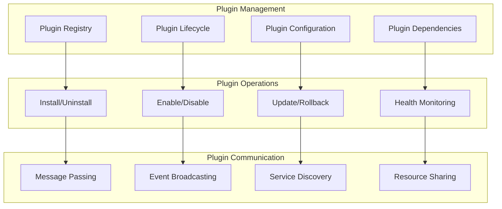

# Plugin API

Complete API reference for plugin management and interaction in Nexus.

## 🎯 Overview

The Plugin API provides comprehensive endpoints for managing plugins, their configurations, and interactions. This API is used both by administrators for plugin management and by plugins themselves for inter-plugin communication.

## 🏗️ Plugin API Architecture



## 📦 Plugin Management

### List Plugins

Get list of all installed plugins with their status and information.

```http
GET /api/v1/plugins
Authorization: Bearer <token>
```

**Query Parameters:**

- `status` (string): Filter by status (active, inactive, error, loading)
- `category` (string): Filter by category
- `search` (string): Search in plugin names and descriptions
- `include_disabled` (boolean): Include disabled plugins (default: true)

**Response:**

```json
{
  "success": true,
  "data": {
    "plugins": [
      {
        "id": "auth-plugin",
        "name": "Authentication Plugin",
        "version": "1.2.0",
        "description": "Provides user authentication and authorization",
        "author": "Nexus Team",
        "category": "security",
        "status": "active",
        "enabled": true,
        "health": "healthy",
        "load_order": 1,
        "manifest": {
          "entry_point": "auth_plugin:AuthPlugin",
          "nexus_version": ">=1.0.0",
          "license": "MIT"
        },
        "dependencies": [],
        "dependents": ["user-management", "api-gateway"],
        "permissions": ["auth:*", "users:read"],
        "endpoints": [
          "/api/v1/auth/login",
          "/api/v1/auth/logout",
          "/api/v1/auth/refresh"
        ],
        "events": {
          "emits": ["user.login", "user.logout"],
          "subscribes": ["system.startup", "system.shutdown"]
        },
        "configuration": {
          "jwt_secret": "***hidden***",
          "session_timeout": 3600,
          "enable_2fa": false
        },
        "metrics": {
          "requests_handled": 15420,
          "average_response_time": 125,
          "error_count": 3,
          "uptime_seconds": 86400
        },
        "installed_at": "2023-01-01T00:00:00Z",
        "last_updated": "2024-01-01T10:00:00Z"
      }
    ],
    "summary": {
      "total": 8,
      "active": 7,
      "inactive": 0,
      "error": 1,
      "disabled": 0
    }
  }
}
```

### Get Plugin Details

Get detailed information about a specific plugin.

```http
GET /api/v1/plugins/{plugin_id}
Authorization: Bearer <token>
```

**Response:**

```json
{
  "success": true,
  "data": {
    "plugin": {
      "id": "auth-plugin",
      "name": "Authentication Plugin",
      "version": "1.2.0",
      "description": "Provides comprehensive user authentication and authorization",
      "author": "Nexus Team",
      "email": "team@nexus.dev",
      "homepage": "https://github.com/dnviti/auth-plugin",
      "category": "security",
      "tags": ["auth", "security", "jwt"],
      "status": "active",
      "enabled": true,
      "health": "healthy",
      "load_order": 1,
      "manifest": {
        "entry_point": "auth_plugin:AuthPlugin",
        "nexus_version": ">=1.0.0",
        "python_version": ">=3.8",
        "license": "MIT",
        "dependencies": {
          "packages": {
            "pyjwt": ">=2.0.0",
            "bcrypt": ">=3.2.0"
          },
          "plugins": {}
        }
      },
      "dependencies": [],
      "dependents": ["user-management", "api-gateway"],
      "permissions": ["auth:*", "users:read", "sessions:write"],
      "api_endpoints": [
        {
          "path": "/api/v1/auth/login",
          "methods": ["POST"],
          "description": "User login endpoint"
        },
        {
          "path": "/api/v1/auth/logout",
          "methods": ["POST"],
          "description": "User logout endpoint"
        }
      ],
      "events": {
        "emits": [
          {
            "type": "user.login",
            "description": "Emitted when user logs in"
          },
          {
            "type": "user.logout",
            "description": "Emitted when user logs out"
          }
        ],
        "subscribes": [
          {
            "type": "system.startup",
            "description": "Handle system startup"
          }
        ]
      },
      "configuration": {
        "schema": {
          "jwt_secret": {
            "type": "string",
            "required": true,
            "secret": true,
            "description": "Secret key for JWT token signing"
          },
          "session_timeout": {
            "type": "integer",
            "default": 3600,
            "description": "Session timeout in seconds"
          }
        },
        "current": {
          "jwt_secret": "***hidden***",
          "session_timeout": 3600,
          "enable_2fa": false
        }
      },
      "metrics": {
        "performance": {
          "requests_per_minute": 25.5,
          "average_response_time": 125,
          "p95_response_time": 280,
          "error_rate": 0.002
        },
        "usage": {
          "total_requests": 15420,
          "successful_requests": 15390,
          "failed_requests": 30,
          "unique_users": 450
        },
        "resources": {
          "memory_usage_mb": 45,
          "cpu_usage_percent": 2.5,
          "file_handles": 15
        }
      },
      "logs": [
        {
          "timestamp": "2024-01-01T12:00:00Z",
          "level": "INFO",
          "message": "Plugin initialized successfully"
        },
        {
          "timestamp": "2024-01-01T11:59:00Z",
          "level": "DEBUG",
          "message": "Loading configuration from file"
        }
      ],
      "installed_at": "2023-01-01T00:00:00Z",
      "last_updated": "2024-01-01T10:00:00Z"
    }
  }
}
```

### Install Plugin

Install a new plugin from repository, file, or URL.

```http
POST /api/v1/plugins/install
Authorization: Bearer <admin_token>
Content-Type: application/json

{
  "source": "repository",
  "plugin_name": "analytics-plugin",
  "version": "latest",
  "config": {
    "enabled": true,
    "batch_size": 100,
    "flush_interval": 60
  },
  "auto_enable": true,
  "force_reinstall": false
}
```

**Alternative sources:**

```json
{
  "source": "file",
  "file_path": "/tmp/my-plugin.zip"
}
```

```json
{
  "source": "url",
  "download_url": "https://plugins.nexus.dev/analytics-plugin-1.2.0.zip"
}
```

**Response:**

```json
{
  "success": true,
  "data": {
    "installation": {
      "plugin_id": "analytics-plugin",
      "status": "completed",
      "version": "1.2.0",
      "installed_at": "2024-01-01T12:00:00Z",
      "duration_seconds": 15.3
    },
    "plugin": {
      "id": "analytics-plugin",
      "name": "Analytics Plugin",
      "version": "1.2.0",
      "status": "active",
      "enabled": true
    }
  }
}
```

### Update Plugin

Update an existing plugin to a newer version.

```http
PUT /api/v1/plugins/{plugin_id}
Authorization: Bearer <admin_token>
Content-Type: application/json

{
  "version": "1.3.0",
  "backup_current": true,
  "restart_plugin": true,
  "update_config": false
}
```

**Response:**

```json
{
  "success": true,
  "data": {
    "update": {
      "plugin_id": "analytics-plugin",
      "old_version": "1.2.0",
      "new_version": "1.3.0",
      "status": "completed",
      "backup_id": "backup_123",
      "updated_at": "2024-01-01T12:00:00Z"
    }
  }
}
```

### Uninstall Plugin

Remove a plugin from the system.

```http
DELETE /api/v1/plugins/{plugin_id}
Authorization: Bearer <admin_token>
```

**Query Parameters:**

- `force` (boolean): Force removal even if dependencies exist
- `backup` (boolean): Create backup before removal
- `cleanup_data` (boolean): Remove plugin data from database

**Response:**

```json
{
  "success": true,
  "data": {
    "uninstallation": {
      "plugin_id": "analytics-plugin",
      "status": "completed",
      "backup_created": true,
      "data_removed": true,
      "uninstalled_at": "2024-01-01T12:00:00Z"
    }
  }
}
```

## ⚙️ Plugin Configuration

### Get Plugin Configuration

Get current plugin configuration.

```http
GET /api/v1/plugins/{plugin_id}/config
Authorization: Bearer <token>
```

**Query Parameters:**

- `include_schema` (boolean): Include configuration schema
- `include_secrets` (boolean): Include secret values (admin only)

**Response:**

```json
{
  "success": true,
  "data": {
    "configuration": {
      "batch_size": 100,
      "flush_interval": 60,
      "storage_backend": "database",
      "api_key": "***hidden***"
    },
    "schema": {
      "batch_size": {
        "type": "integer",
        "default": 50,
        "min": 10,
        "max": 1000,
        "description": "Number of events to batch before processing"
      },
      "flush_interval": {
        "type": "integer",
        "default": 30,
        "description": "Interval in seconds to flush batched events"
      },
      "storage_backend": {
        "type": "string",
        "enum": ["database", "file", "redis"],
        "default": "database",
        "description": "Backend storage for analytics data"
      },
      "api_key": {
        "type": "string",
        "secret": true,
        "description": "API key for external analytics service"
      }
    },
    "last_updated": "2024-01-01T10:00:00Z"
  }
}
```

### Update Plugin Configuration

Update plugin configuration settings.

```http
PUT /api/v1/plugins/{plugin_id}/config
Authorization: Bearer <admin_token>
Content-Type: application/json

{
  "batch_size": 200,
  "flush_interval": 30,
  "api_key": "new_secret_key"
}
```

**Response:**

```json
{
  "success": true,
  "data": {
    "configuration": {
      "batch_size": 200,
      "flush_interval": 30,
      "storage_backend": "database",
      "api_key": "***hidden***"
    },
    "updated_fields": ["batch_size", "flush_interval", "api_key"],
    "restart_required": false,
    "updated_at": "2024-01-01T12:00:00Z"
  }
}
```

## 🔄 Plugin Operations

### Enable Plugin

Enable a disabled plugin.

```http
POST /api/v1/plugins/{plugin_id}/enable
Authorization: Bearer <admin_token>
```

**Response:**

```json
{
  "success": true,
  "data": {
    "plugin_id": "analytics-plugin",
    "status": "active",
    "enabled_at": "2024-01-01T12:00:00Z"
  }
}
```

### Disable Plugin

Disable an active plugin.

```http
POST /api/v1/plugins/{plugin_id}/disable
Authorization: Bearer <admin_token>
Content-Type: application/json

{
  "reason": "Maintenance",
  "graceful_shutdown": true,
  "timeout_seconds": 30
}
```

**Response:**

```json
{
  "success": true,
  "data": {
    "plugin_id": "analytics-plugin",
    "status": "inactive",
    "disabled_at": "2024-01-01T12:00:00Z",
    "reason": "Maintenance"
  }
}
```

### Restart Plugin

Restart a plugin (disable then enable).

```http
POST /api/v1/plugins/{plugin_id}/restart
Authorization: Bearer <admin_token>
Content-Type: application/json

{
  "reason": "Configuration change",
  "timeout_seconds": 30
}
```

### Get Plugin Health

Get detailed health information for a plugin.

```http
GET /api/v1/plugins/{plugin_id}/health
Authorization: Bearer <token>
```

**Response:**

```json
{
  "success": true,
  "data": {
    "health": {
      "status": "healthy",
      "last_check": "2024-01-01T12:00:00Z",
      "uptime_seconds": 86400,
      "checks": [
        {
          "name": "database_connection",
          "status": "pass",
          "response_time_ms": 15,
          "details": "Connection pool healthy"
        },
        {
          "name": "external_api",
          "status": "warning",
          "response_time_ms": 850,
          "details": "Slow response time"
        },
        {
          "name": "memory_usage",
          "status": "pass",
          "value": 45,
          "threshold": 100,
          "unit": "MB"
        }
      ],
      "metrics": {
        "requests_per_minute": 25.5,
        "error_rate": 0.002,
        "memory_usage_mb": 45,
        "cpu_usage_percent": 2.5
      }
    }
  }
}
```

## 📊 Plugin Metrics

### Get Plugin Metrics

Get performance metrics for a plugin.

```http
GET /api/v1/plugins/{plugin_id}/metrics
Authorization: Bearer <token>
```

**Query Parameters:**

- `start_time` (string): Start time for metrics (ISO 8601)
- `end_time` (string): End time for metrics (ISO 8601)
- `resolution` (string): Time resolution (1m, 5m, 15m, 1h)
- `metrics` (array): Specific metrics to include

**Response:**

```json
{
  "success": true,
  "data": {
    "time_range": {
      "start": "2024-01-01T11:00:00Z",
      "end": "2024-01-01T12:00:00Z",
      "resolution": "1m"
    },
    "metrics": {
      "requests_per_minute": [
        { "timestamp": "2024-01-01T11:00:00Z", "value": 25.5 },
        { "timestamp": "2024-01-01T11:01:00Z", "value": 28.3 }
      ],
      "response_time_ms": [
        { "timestamp": "2024-01-01T11:00:00Z", "value": 125 },
        { "timestamp": "2024-01-01T11:01:00Z", "value": 98 }
      ],
      "error_rate": [
        { "timestamp": "2024-01-01T11:00:00Z", "value": 0.002 },
        { "timestamp": "2024-01-01T11:01:00Z", "value": 0.001 }
      ],
      "memory_usage_mb": [
        { "timestamp": "2024-01-01T11:00:00Z", "value": 45 },
        { "timestamp": "2024-01-01T11:01:00Z", "value": 47 }
      ]
    }
  }
}
```

### Get Plugin Logs

Get logs from a specific plugin.

```http
GET /api/v1/plugins/{plugin_id}/logs
Authorization: Bearer <token>
```

**Query Parameters:**

- `level` (string): Log level filter (DEBUG, INFO, WARNING, ERROR)
- `start_time` (string): Start time for logs
- `end_time` (string): End time for logs
- `search` (string): Search in log messages
- `page` (integer): Page number
- `per_page` (integer): Logs per page (max 1000)

**Response:**

```json
{
  "success": true,
  "data": {
    "logs": [
      {
        "timestamp": "2024-01-01T12:00:00Z",
        "level": "INFO",
        "message": "Processing analytics batch",
        "metadata": {
          "batch_size": 100,
          "processing_time_ms": 250,
          "request_id": "req_abc123"
        }
      },
      {
        "timestamp": "2024-01-01T11:59:30Z",
        "level": "DEBUG",
        "message": "Received event for processing",
        "metadata": {
          "event_type": "user.login",
          "user_id": "user_456"
        }
      }
    ],
    "pagination": {
      "page": 1,
      "per_page": 100,
      "total": 5000,
      "has_next": true
    }
  }
}
```

## 💬 Plugin Communication

### Send Message to Plugin

Send a message to another plugin.

```http
POST /api/v1/plugins/{plugin_id}/message
Authorization: Bearer <token>
Content-Type: application/json

{
  "target_plugin": "analytics-plugin",
  "message_type": "data_request",
  "data": {
    "query": "user_activity",
    "user_id": "user_123",
    "date_range": "last_30_days"
  },
  "timeout_seconds": 10
}
```

**Response:**

```json
{
  "success": true,
  "data": {
    "message_id": "msg_abc123",
    "response": {
      "status": "success",
      "data": {
        "total_sessions": 45,
        "total_time_minutes": 1200,
        "most_visited_pages": ["/dashboard", "/profile"]
      }
    },
    "response_time_ms": 150
  }
}
```

### Broadcast Message

Broadcast a message to all plugins or specific categories.

```http
POST /api/v1/plugins/broadcast
Authorization: Bearer <token>
Content-Type: application/json

{
  "message_type": "system_announcement",
  "data": {
    "announcement": "Scheduled maintenance in 1 hour",
    "severity": "warning"
  },
  "target_categories": ["monitoring", "notifications"],
  "exclude_plugins": ["analytics-plugin"]
}
```

## 🔍 Plugin Discovery

### Search Plugins

Search available plugins in repositories.

```http
GET /api/v1/plugins/search
Authorization: Bearer <token>
```

**Query Parameters:**

- `query` (string): Search term
- `category` (string): Plugin category
- `author` (string): Plugin author
- `tags` (array): Plugin tags
- `min_rating` (float): Minimum rating
- `sort` (string): Sort by (name, rating, downloads, updated)

**Response:**

```json
{
  "success": true,
  "data": {
    "plugins": [
      {
        "id": "social-auth-plugin",
        "name": "Social Authentication Plugin",
        "version": "2.1.0",
        "description": "OAuth integration with Google, GitHub, Facebook",
        "author": "Community Dev",
        "category": "authentication",
        "tags": ["oauth", "social", "authentication"],
        "rating": 4.8,
        "downloads": 15420,
        "last_updated": "2024-01-01T10:00:00Z",
        "compatibility": {
          "nexus_version": ">=1.0.0",
          "python_version": ">=3.8"
        },
        "repository_url": "https://plugins.nexus.dev/social-auth",
        "documentation_url": "https://docs.nexus.dev/plugins/social-auth"
      }
    ],
    "pagination": {
      "page": 1,
      "per_page": 20,
      "total": 156,
      "has_next": true
    }
  }
}
```

### Get Plugin Repository Info

Get information about plugin repositories.

```http
GET /api/v1/plugins/repositories
Authorization: Bearer <token>
```

**Response:**

```json
{
  "success": true,
  "data": {
    "repositories": [
      {
        "name": "official",
        "url": "https://plugins.nexus.dev/official",
        "description": "Official Nexus plugin repository",
        "enabled": true,
        "plugin_count": 25,
        "last_sync": "2024-01-01T10:00:00Z"
      },
      {
        "name": "community",
        "url": "https://plugins.nexus.dev/community",
        "description": "Community-maintained plugins",
        "enabled": true,
        "plugin_count": 131,
        "last_sync": "2024-01-01T09:30:00Z"
      }
    ]
  }
}
```

## 🔐 Plugin Security

### Get Plugin Permissions

Get permissions for a specific plugin.

```http
GET /api/v1/plugins/{plugin_id}/permissions
Authorization: Bearer <token>
```

**Response:**

```json
{
  "success": true,
  "data": {
    "permissions": {
      "requested": [
        "database:read",
        "database:write",
        "events:emit",
        "http:external"
      ],
      "granted": ["database:read", "database:write", "events:emit"],
      "denied": ["http:external"]
    },
    "security_level": "medium",
    "sandbox_enabled": true,
    "resource_limits": {
      "memory_mb": 256,
      "cpu_percent": 10,
      "file_handles": 100
    }
  }
}
```

### Update Plugin Permissions

Update permissions for a plugin (admin only).

```http
PUT /api/v1/plugins/{plugin_id}/permissions
Authorization: Bearer <admin_token>
Content-Type: application/json

{
  "grant": ["http:external"],
  "revoke": [],
  "security_level": "high"
}
```

## 🚨 Error Codes

### Plugin-Specific Errors

| Code                           | HTTP Status | Description                                      |
| ------------------------------ | ----------- | ------------------------------------------------ |
| `PLUGIN_NOT_FOUND`             | 404         | Plugin not found                                 |
| `PLUGIN_ALREADY_INSTALLED`     | 409         | Plugin already installed                         |
| `PLUGIN_DEPENDENCY_ERROR`      | 409         | Missing or incompatible dependencies             |
| `PLUGIN_PERMISSION_DENIED`     | 403         | Insufficient permissions for operation           |
| `PLUGIN_INSTALLATION_FAILED`   | 500         | Plugin installation failed                       |
| `PLUGIN_STARTUP_FAILED`        | 500         | Plugin failed to start                           |
| `PLUGIN_INCOMPATIBLE`          | 400         | Plugin not compatible with current Nexus version |
| `PLUGIN_CONFIGURATION_ERROR`   | 400         | Invalid plugin configuration                     |
| `PLUGIN_COMMUNICATION_TIMEOUT` | 408         | Plugin communication timeout                     |

## 📝 Usage Examples

### Complete Plugin Management Flow

```bash
# 1. Search for plugins
curl -X GET "https://api.nexus.dev/v1/plugins/search?query=analytics" \
  -H "Authorization: Bearer <token>"

# 2. Install plugin
curl -X POST "https://api.nexus.dev/v1/plugins/install" \
  -H "Authorization: Bearer <admin_token>" \
  -H "Content-Type: application/json" \
  -d '{
    "source": "repository",
    "plugin_name": "analytics-plugin",
    "version": "latest",
    "auto_enable": true
  }'

# 3. Configure plugin
curl -X PUT "https://api.nexus.dev/v1/plugins/analytics-plugin/config" \
  -H "Authorization: Bearer <admin_token>" \
  -H "Content-Type: application/json" \
  -d '{
    "batch_size": 200,
    "api_key": "secret_key"
  }'

# 4. Check plugin health
curl -X GET "https://api.nexus.dev/v1/plugins/analytics-plugin/health" \
  -H "Authorization: Bearer <token>"

# 5. Get plugin metrics
curl -X GET "https://api.nexus.dev/v1/plugins/analytics-plugin/metrics" \
  -H "Authorization: Bearer <token>"
```

### Plugin Communication

```bash
# Send message between plugins
curl -X POST "https://api.nexus.dev/v1/plugins/user-management/message" \
  -H "Authorization: Bearer <token>" \
  -H "Content-Type: application/json" \
  -d '{
    "target_plugin": "analytics-plugin",
    "message_type": "user_stats_request",
    "data": {"user_id": "user_123"}
  }'

# Broadcast system message
curl -X POST "https://api.nexus.dev/v1/plugins/broadcast" \
  -H "Authorization: Bearer <admin_token>" \
  -H "Content-Type: application/json" \
  -d '{
    "message_type": "system_shutdown",
    "data": {"reason": "maintenance", "delay_minutes": 5}
  }'
```

## 🎯 Best Practices

### Plugin Management

1. **Test in development** before installing in production
2. **Review permissions** before granting to plugins
3. **Monitor plugin health** regularly
4. **Keep plugins updated** for security and features
5. **Backup before major changes**

### Plugin Development

1. **Follow semantic versioning** for plugin releases
2. **Declare all dependencies** clearly
3. **Request minimal permissions** needed
4. **Implement proper error handling**
5. **Provide comprehensive documentation**

## 🔗 Related APIs

- **[Admin API](admin.md)** - Administrative plugin management
- **[Events API](events.md)** - Plugin event communication
- **[Core API](core.md)** - System integration points

---

**The Plugin API enables dynamic extension of Nexus functionality.** Use these endpoints to build a rich ecosystem of plugins that enhance your platform capabilities.
