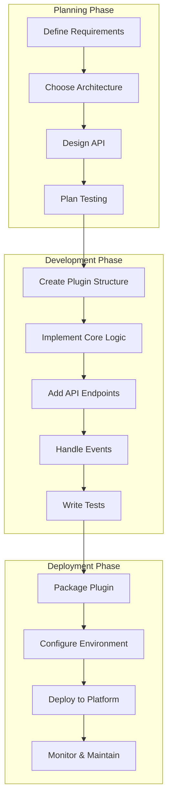

# Plugin Development Guide

Comprehensive guide to developing plugins for the Nexus platform.

## 🎯 Overview

This guide provides a complete walkthrough of plugin development for Nexus, from basic concepts to advanced patterns. Whether you're building your first plugin or creating complex integrations, this guide will help you develop robust, maintainable plugins.

## 🏗️ Plugin Development Lifecycle



## 🚀 Getting Started

### Prerequisites

Before you start developing plugins, ensure you have:

- Python 3.8 or higher
- Nexus platform installed and running
- Basic understanding of async/await programming
- Familiarity with FastAPI (for HTTP endpoints)
- Understanding of event-driven architecture

### Development Environment Setup

```bash
# Clone the Nexus repository
git clone https://github.com/dnviti/nexus-platform.git
cd nexus

# Create virtual environment
python -m venv nexus-dev
source nexus-dev/bin/activate  # On Windows: nexus-dev\Scripts\activate

# Install development dependencies
pip install -r requirements-dev.txt

# Install Nexus in development mode
pip install -e .

# Create your plugin directory
mkdir plugins/my-first-plugin
cd plugins/my-first-plugin
```

## 📦 Plugin Structure

### Basic Plugin Template

```python
# plugins/my-first-plugin/plugin.py
from nexus.plugin import Plugin
from nexus.events import event_handler
from nexus.http import get, post
from nexus.services import inject
from nexus.database import DatabaseAdapter
import logging

logger = logging.getLogger(__name__)

class MyFirstPlugin(Plugin):
    """My first Nexus plugin."""

    def __init__(self, config):
        super().__init__(config)
        self.name = "my-first-plugin"
        self.version = "1.0.0"
        self.description = "A simple example plugin"

        # Inject dependencies
        self.db = inject(DatabaseAdapter)

    async def initialize(self):
        """Initialize the plugin."""
        logger.info("Initializing My First Plugin")

        # Create database tables if needed
        await self.create_tables()

        # Set up any required resources
        await self.setup_resources()

        logger.info("My First Plugin initialized successfully")

    async def cleanup(self):
        """Clean up plugin resources."""
        logger.info("Cleaning up My First Plugin")

        # Clean up any resources
        await self.cleanup_resources()

        logger.info("My First Plugin cleaned up")

    async def create_tables(self):
        """Create plugin-specific database tables."""
        await self.db.execute("""
            CREATE TABLE IF NOT EXISTS my_plugin_data (
                id SERIAL PRIMARY KEY,
                name VARCHAR(100) NOT NULL,
                value TEXT,
                created_at TIMESTAMP DEFAULT CURRENT_TIMESTAMP
            )
        """)

    async def setup_resources(self):
        """Set up plugin resources."""
        # Initialize any external connections, caches, etc.
        pass

    async def cleanup_resources(self):
        """Clean up plugin resources."""
        # Close connections, clean up caches, etc.
        pass

    # HTTP Endpoints
    @get("/my-plugin/status")
    async def get_status(self):
        """Get plugin status."""
        return {
            "plugin": self.name,
            "version": self.version,
            "status": "running"
        }

    @post("/my-plugin/data")
    async def create_data(self, request):
        """Create new data entry."""
        data = await request.json()

        # Validate input
        if 'name' not in data:
            return {"error": "Name is required"}, 400

        # Insert into database
        query = """
            INSERT INTO my_plugin_data (name, value)
            VALUES ($1, $2)
            RETURNING id, created_at
        """
        result = await self.db.fetch_one(
            query, data['name'], data.get('value', '')
        )

        return {
            "id": result['id'],
            "name": data['name'],
            "value": data.get('value', ''),
            "created_at": result['created_at'].isoformat()
        }

    @get("/my-plugin/data")
    async def list_data(self):
        """List all data entries."""
        query = "SELECT * FROM my_plugin_data ORDER BY created_at DESC"
        results = await self.db.fetch_all(query)

        return {
            "data": [dict(row) for row in results]
        }

    # Event Handlers
    @event_handler("user.created")
    async def on_user_created(self, event):
        """Handle user creation events."""
        user_id = event.data.get("user_id")
        username = event.data.get("username")

        logger.info(f"New user created: {username} (ID: {user_id})")

        # Create welcome data entry
        await self.create_welcome_entry(user_id, username)

    async def create_welcome_entry(self, user_id, username):
        """Create a welcome entry for new users."""
        query = """
            INSERT INTO my_plugin_data (name, value)
            VALUES ($1, $2)
        """
        await self.db.execute(
            query,
            f"welcome_{username}",
            f"Welcome to Nexus, {username}!"
        )
```

### Plugin Manifest

```json
{
  "name": "my-first-plugin",
  "version": "1.0.0",
  "description": "My first Nexus plugin",
  "author": "Your Name",
  "email": "your.email@example.com",
  "license": "MIT",
  "nexus_version": ">=1.0.0",
  "dependencies": {
    "python": ">=3.8",
    "packages": {
      "requests": ">=2.25.0"
    }
  },
  "permissions": [
    "database:read",
    "database:write",
    "events:emit",
    "events:subscribe"
  ],
  "configuration": {
    "max_entries": {
      "type": "integer",
      "default": 1000,
      "description": "Maximum number of data entries"
    },
    "enable_notifications": {
      "type": "boolean",
      "default": true,
      "description": "Enable user notifications"
    }
  },
  "entry_point": "plugin:MyFirstPlugin",
  "category": "utility",
  "tags": ["example", "tutorial", "basic"]
}
```

## 🎨 Plugin Patterns

### 1. Data Processing Plugin

```python
# plugins/data-processor/plugin.py
from nexus.plugin import Plugin
from nexus.events import event_handler
from nexus.services import inject
from typing import Dict, Any, List
import asyncio

class DataProcessorPlugin(Plugin):
    """Plugin for processing and transforming data."""

    def __init__(self, config):
        super().__init__(config)
        self.batch_size = config.get('batch_size', 100)
        self.processing_queue = asyncio.Queue()
        self.processor_task = None

    async def initialize(self):
        """Initialize the data processor."""
        await super().initialize()

        # Start background processor
        self.processor_task = asyncio.create_task(self.process_data_loop())

    async def cleanup(self):
        """Clean up the processor."""
        if self.processor_task:
            self.processor_task.cancel()
            try:
                await self.processor_task
            except asyncio.CancelledError:
                pass

        await super().cleanup()

    @event_handler("data.raw.created")
    async def on_raw_data_created(self, event):
        """Queue raw data for processing."""
        await self.processing_queue.put(event.data)

    async def process_data_loop(self):
        """Background loop for processing data."""
        batch = []

        while True:
            try:
                # Collect batch of data
                while len(batch) < self.batch_size:
                    try:
                        data = await asyncio.wait_for(
                            self.processing_queue.get(), timeout=1.0
                        )
                        batch.append(data)
                    except asyncio.TimeoutError:
                        break

                if batch:
                    await self.process_batch(batch)
                    batch.clear()

            except asyncio.CancelledError:
                break
            except Exception as e:
                self.logger.error(f"Error in data processing loop: {e}")

    async def process_batch(self, batch: List[Dict[str, Any]]):
        """Process a batch of data."""
        for data in batch:
            try:
                processed_data = await self.transform_data(data)
                await self.store_processed_data(processed_data)

                # Emit processed event
                await self.emit_event({
                    "type": "data.processed",
                    "data": processed_data
                })

            except Exception as e:
                self.logger.error(f"Error processing data: {e}")

    async def transform_data(self, data: Dict[str, Any]) -> Dict[str, Any]:
        """Transform raw data into processed format."""
        # Implement your data transformation logic
        return {
            "original_id": data.get("id"),
            "processed_value": data.get("value", "").upper(),
            "metadata": {
                "processed_at": datetime.utcnow().isoformat(),
                "processor": "data-processor-plugin"
            }
        }

    async def store_processed_data(self, data: Dict[str, Any]):
        """Store processed data."""
        query = """
            INSERT INTO processed_data (original_id, processed_value, metadata)
            VALUES ($1, $2, $3)
        """
        await self.db.execute(
            query,
            data["original_id"],
            data["processed_value"],
            data["metadata"]
        )
```

### 2. Integration Plugin

```python
# plugins/external-api/plugin.py
from nexus.plugin import Plugin
from nexus.http import get, post
from nexus.services import inject, Service
import aiohttp
import asyncio

class ExternalAPIService(Service):
    """Service for external API integration."""

    def __init__(self, config):
        self.api_base_url = config.get('api_base_url')
        self.api_key = config.get('api_key')
        self.session = None

    async def initialize(self):
        """Initialize HTTP session."""
        self.session = aiohttp.ClientSession(
            headers={'Authorization': f'Bearer {self.api_key}'}
        )

    async def cleanup(self):
        """Clean up HTTP session."""
        if self.session:
            await self.session.close()

    async def fetch_user_data(self, user_id: str) -> Dict[str, Any]:
        """Fetch user data from external API."""
        url = f"{self.api_base_url}/users/{user_id}"

        async with self.session.get(url) as response:
            if response.status == 200:
                return await response.json()
            else:
                raise Exception(f"API request failed: {response.status}")

    async def sync_user_data(self, user_data: Dict[str, Any]) -> bool:
        """Sync user data to external API."""
        url = f"{self.api_base_url}/users"

        async with self.session.post(url, json=user_data) as response:
            return response.status in [200, 201]

class ExternalAPIPlugin(Plugin):
    """Plugin for external API integration."""

    def __init__(self, config):
        super().__init__(config)
        self.api_service = ExternalAPIService(config)

    async def initialize(self):
        """Initialize the plugin."""
        await super().initialize()
        await self.api_service.initialize()

    async def cleanup(self):
        """Clean up the plugin."""
        await self.api_service.cleanup()
        await super().cleanup()

    @get("/external-api/users/{user_id}")
    async def get_external_user(self, user_id: str):
        """Get user data from external API."""
        try:
            user_data = await self.api_service.fetch_user_data(user_id)
            return {"user": user_data}
        except Exception as e:
            return {"error": str(e)}, 500

    @post("/external-api/sync-user")
    async def sync_user(self, request):
        """Sync user data to external API."""
        data = await request.json()

        try:
            success = await self.api_service.sync_user_data(data)
            if success:
                return {"message": "User synced successfully"}
            else:
                return {"error": "Sync failed"}, 500
        except Exception as e:
            return {"error": str(e)}, 500

    @event_handler("user.updated")
    async def on_user_updated(self, event):
        """Auto-sync user updates to external API."""
        user_data = event.data

        try:
            await self.api_service.sync_user_data(user_data)
            self.logger.info(f"Synced user {user_data.get('id')} to external API")
        except Exception as e:
            self.logger.error(f"Failed to sync user: {e}")
```

### 3. Notification Plugin

```python
# plugins/notifications/plugin.py
from nexus.plugin import Plugin
from nexus.events import event_handler
from nexus.services import inject
from typing import Dict, Any, List
import smtplib
from email.mime.text import MIMEText
from email.mime.multipart import MIMEMultipart

class NotificationPlugin(Plugin):
    """Plugin for sending notifications via email, SMS, etc."""

    def __init__(self, config):
        super().__init__(config)
        self.email_config = config.get('email', {})
        self.sms_config = config.get('sms', {})
        self.notification_templates = {}

    async def initialize(self):
        """Initialize notification plugin."""
        await super().initialize()
        await self.load_templates()

    async def load_templates(self):
        """Load notification templates."""
        # Load email templates
        self.notification_templates = {
            'welcome_email': {
                'subject': 'Welcome to {app_name}!',
                'body': 'Hello {username}, welcome to our platform!'
            },
            'password_reset': {
                'subject': 'Password Reset Request',
                'body': 'Click here to reset your password: {reset_link}'
            }
        }

    @event_handler("user.created")
    async def send_welcome_notification(self, event):
        """Send welcome notification to new users."""
        user_data = event.data

        await self.send_email_notification(
            to=user_data.get('email'),
            template='welcome_email',
            data={
                'username': user_data.get('username'),
                'app_name': 'Nexus Platform'
            }
        )

    @event_handler("user.password_reset_requested")
    async def send_password_reset(self, event):
        """Send password reset notification."""
        user_data = event.data

        await self.send_email_notification(
            to=user_data.get('email'),
            template='password_reset',
            data={
                'reset_link': user_data.get('reset_link')
            }
        )

    async def send_email_notification(
        self,
        to: str,
        template: str,
        data: Dict[str, Any]
    ):
        """Send email notification using template."""
        if template not in self.notification_templates:
            self.logger.error(f"Unknown email template: {template}")
            return

        template_data = self.notification_templates[template]
        subject = template_data['subject'].format(**data)
        body = template_data['body'].format(**data)

        try:
            await self._send_email(to, subject, body)
            self.logger.info(f"Email sent to {to}")
        except Exception as e:
            self.logger.error(f"Failed to send email: {e}")

    async def _send_email(self, to: str, subject: str, body: str):
        """Send email via SMTP."""
        msg = MIMEMultipart()
        msg['From'] = self.email_config.get('from_email')
        msg['To'] = to
        msg['Subject'] = subject

        msg.attach(MIMEText(body, 'plain'))

        # Send email (run in thread pool to avoid blocking)
        loop = asyncio.get_event_loop()
        await loop.run_in_executor(None, self._smtp_send, msg, to)

    def _smtp_send(self, msg, to: str):
        """Send email via SMTP (blocking operation)."""
        with smtplib.SMTP(
            self.email_config.get('smtp_host'),
            self.email_config.get('smtp_port')
        ) as server:
            if self.email_config.get('use_tls'):
                server.starttls()

            server.login(
                self.email_config.get('username'),
                self.email_config.get('password')
            )

            server.send_message(msg)

    @post("/notifications/send")
    async def send_custom_notification(self, request):
        """Send custom notification via API."""
        data = await request.json()

        if 'type' not in data or 'recipient' not in data:
            return {"error": "Type and recipient are required"}, 400

        notification_type = data['type']
        recipient = data['recipient']
        template_data = data.get('data', {})

        if notification_type == 'email':
            template = data.get('template', 'generic')
            await self.send_email_notification(recipient, template, template_data)
            return {"message": "Email notification sent"}

        return {"error": "Unsupported notification type"}, 400
```

## 🧪 Testing Your Plugin

### Unit Tests

```python
# plugins/my-first-plugin/tests/test_plugin.py
import pytest
from unittest.mock import AsyncMock, Mock
from my_first_plugin.plugin import MyFirstPlugin

class TestMyFirstPlugin:
    """Test cases for MyFirstPlugin."""

    @pytest.fixture
    async def plugin(self):
        """Create plugin instance for testing."""
        config = {
            "max_entries": 100,
            "enable_notifications": True
        }

        plugin = MyFirstPlugin(config)
        plugin.db = AsyncMock()  # Mock database

        await plugin.initialize()
        yield plugin
        await plugin.cleanup()

    async def test_plugin_initialization(self, plugin):
        """Test plugin initializes correctly."""
        assert plugin.name == "my-first-plugin"
        assert plugin.version == "1.0.0"

        # Verify database table creation was called
        plugin.db.execute.assert_called()

    async def test_create_data_endpoint(self, plugin):
        """Test data creation endpoint."""
        # Mock request
        request = Mock()
        request.json = AsyncMock(return_value={
            "name": "test_data",
            "value": "test_value"
        })

        # Mock database response
        plugin.db.fetch_one.return_value = {
            "id": 1,
            "created_at": datetime.utcnow()
        }

        # Call endpoint
        response = await plugin.create_data(request)

        # Verify response
        assert "id" in response
        assert response["name"] == "test_data"
        assert response["value"] == "test_value"

        # Verify database was called
        plugin.db.fetch_one.assert_called_once()

    async def test_user_created_event_handler(self, plugin):
        """Test user creation event handler."""
        # Mock event
        event = Mock()
        event.data = {
            "user_id": "123",
            "username": "testuser"
        }

        # Mock database execute
        plugin.db.execute = AsyncMock()

        # Handle event
        await plugin.on_user_created(event)

        # Verify welcome entry was created
        plugin.db.execute.assert_called_once()
        call_args = plugin.db.execute.call_args[0]
        assert "welcome_testuser" in call_args[1]

    async def test_validation_error(self, plugin):
        """Test validation error handling."""
        # Mock request with missing data
        request = Mock()
        request.json = AsyncMock(return_value={})

        # Call endpoint
        response, status_code = await plugin.create_data(request)

        # Verify error response
        assert status_code == 400
        assert "error" in response
        assert "Name is required" in response["error"]
```

### Integration Tests

```python
# plugins/my-first-plugin/tests/test_integration.py
import pytest
from nexus.testing import TestApplication, TestClient

class TestPluginIntegration:
    """Integration tests for the plugin."""

    @pytest.fixture
    async def app_with_plugin(self):
        """Create test application with plugin."""
        app = TestApplication()

        # Register plugin
        plugin_config = {
            "max_entries": 100,
            "enable_notifications": True
        }
        await app.register_plugin("my-first-plugin", plugin_config)

        yield app
        await app.cleanup()

    @pytest.fixture
    async def client(self, app_with_plugin):
        """Create test client."""
        return TestClient(app_with_plugin)

    async def test_plugin_status_endpoint(self, client):
        """Test plugin status endpoint."""
        response = await client.get("/my-plugin/status")

        assert response.status_code == 200
        data = response.json()
        assert data["plugin"] == "my-first-plugin"
        assert data["status"] == "running"

    async def test_create_and_list_data(self, client):
        """Test creating and listing data."""
        # Create data
        create_data = {
            "name": "integration_test",
            "value": "test_value"
        }

        response = await client.post("/my-plugin/data", json=create_data)
        assert response.status_code == 200

        created_data = response.json()
        assert created_data["name"] == "integration_test"
        assert "id" in created_data

        # List data
        response = await client.get("/my-plugin/data")
        assert response.status_code == 200

        data_list = response.json()
        assert "data" in data_list
        assert len(data_list["data"]) >= 1

    async def test_event_handling(self, app_with_plugin):
        """Test event handling integration."""
        # Emit user created event
        await app_with_plugin.emit_event({
            "type": "user.created",
            "data": {
                "user_id": "test_123",
                "username": "integration_user"
            }
        })

        # Give time for event processing
        await asyncio.sleep(0.1)

        # Verify welcome entry was created
        # (This would require checking the database or other verification)
```

## 📦 Plugin Packaging & Distribution

### Plugin Packaging

```python
# plugins/my-first-plugin/setup.py
from setuptools import setup, find_packages

setup(
    name="nexus-my-first-plugin",
    version="1.0.0",
    description="My first Nexus plugin",
    author="Your Name",
    author_email="your.email@example.com",
    packages=find_packages(),
    install_requires=[
        "nexus-platform>=1.0.0",
        "requests>=2.25.0"
    ],
    entry_points={
        "nexus.plugins": [
            "my-first-plugin = my_first_plugin.plugin:MyFirstPlugin"
        ]
    },
    classifiers=[
        "Development Status :: 4 - Beta",
        "Intended Audience :: Developers",
        "License :: OSI Approved :: MIT License",
        "Programming Language :: Python :: 3.8",
        "Programming Language :: Python :: 3.9",
        "Programming Language :: Python :: 3.10",
    ],
    python_requires=">=3.8",
)
```

### Docker Plugin

```dockerfile
# plugins/my-first-plugin/Dockerfile
FROM nexus/plugin-base:latest

# Copy plugin files
COPY . /app/plugins/my-first-plugin/

# Install plugin dependencies
RUN pip install -r /app/plugins/my-first-plugin/requirements.txt

# Install plugin
RUN pip install -e /app/plugins/my-first-plugin/

# Set plugin metadata
LABEL nexus.plugin.name="my-first-plugin"
LABEL nexus.plugin.version="1.0.0"
LABEL nexus.plugin.author="Your Name"
```

## 🎯 Best Practices

### 1. Code Organization

- **Separation of concerns**: Separate business logic, API endpoints, and event handlers
- **Service pattern**: Use services for reusable business logic
- **Configuration management**: Use proper configuration validation and defaults
- **Error handling**: Implement comprehensive error handling and logging

### 2. Performance

- **Async/await**: Use async patterns throughout your plugin
- **Connection pooling**: Reuse database and HTTP connections
- **Caching**: Implement caching for expensive operations
- **Background tasks**: Use background tasks for long-running operations

### 3. Security

- **Input validation**: Validate all input data
- **Permission checks**: Implement proper authorization
- **Secret management**: Use secure methods for storing secrets
- **SQL injection prevention**: Use parameterized queries

### 4. Testing

- **Unit tests**: Test individual components in isolation
- **Integration tests**: Test plugin integration with Nexus
- **Mock dependencies**: Use mocks for external dependencies
- **Test coverage**: Aim for high test coverage

### 5. Documentation

- **API documentation**: Document all endpoints and parameters
- **Configuration guide**: Document all configuration options
- **Usage examples**: Provide clear usage examples
- **Changelog**: Maintain a changelog for version tracking

## 🚀 Advanced Topics

### Plugin Communication

```python
# Example of plugin-to-plugin communication
class CommunicatingPlugin(Plugin):
    async def request_data_from_other_plugin(self, plugin_name: str, data_id: str):
        """Request data from another plugin."""
        other_plugin = self.get_plugin(plugin_name)
        if other_plugin and hasattr(other_plugin, 'get_data'):
            return await other_plugin.get_data(data_id)
        return None

    async def broadcast_message(self, message: Dict[str, Any]):
        """Broadcast message to all plugins."""
        await self.emit_event({
            "type": "plugin.message.broadcast",
            "data": {
                "source": self.name,
                "message": message
            }
        })
```

### Custom Middleware

```python
# Example of custom middleware
from nexus.middleware import Middleware

class PluginMiddleware(Middleware):
    def __init__(self, plugin):
        self.plugin = plugin

    async def __call__(self, request, call_next):
        # Pre-processing
        start_time = time.time()

        # Add custom headers
        request.headers["X-Plugin-Name"] = self.plugin.name

        response = await call_next(request)

        # Post-processing
        process_time = time.time() - start_time
        response.headers["X-Process-Time"] = str(process_time)

        return response

# Register middleware in plugin
class MyPlugin(Plugin):
    async def initialize(self):
        await super().initialize()
        self.add_middleware(PluginMiddleware(self))
```

## 🎯 Next Steps

- **[Plugin Basics](../plugins/basics.md)** - Learn the fundamentals
- **[API Routes](../plugins/api-routes.md)** - Create HTTP endpoints
- **[Database Integration](../plugins/database.md)** - Work with databases
- **[Event Handling](../plugins/events.md)** - Handle platform events
- **[Testing Strategies](../plugins/testing.md)** - Test your plugins

---

**Ready to build your first plugin?** Start with the basic template and gradually add more features as you become comfortable with the Nexus plugin system.
