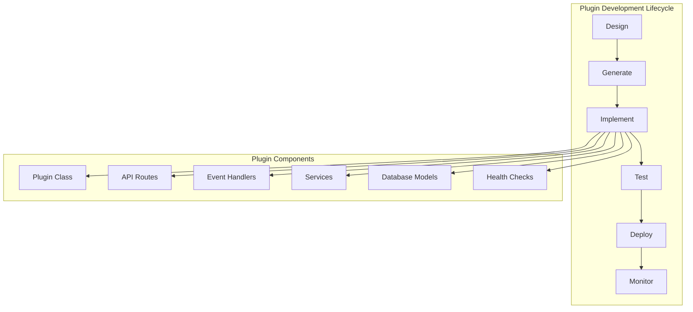
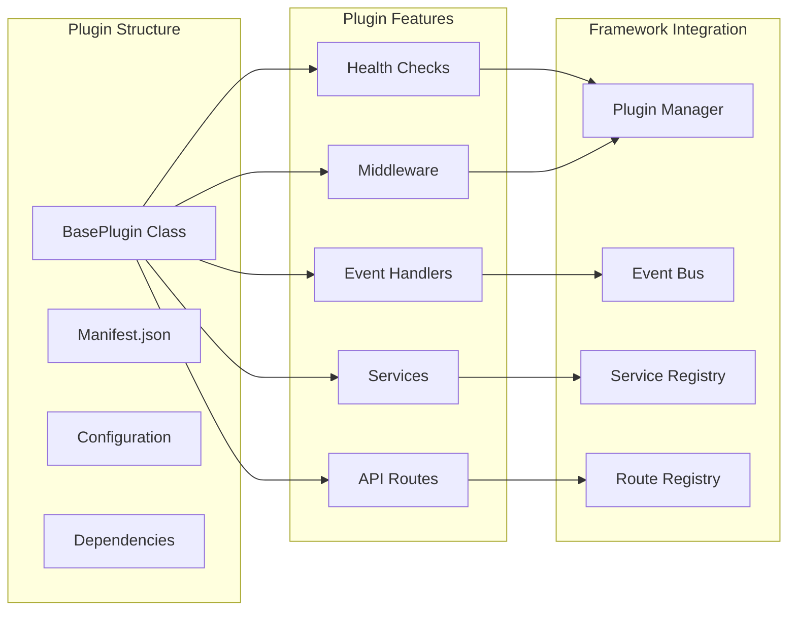

# Plugin Development

Build powerful, modular features for Nexus using the comprehensive plugin system.

## 🎯 Plugin Development Overview

Plugins are the heart of Nexus applications. Every feature, from authentication to custom business logic, is implemented as a plugin, ensuring maximum modularity and reusability.



## 📖 Plugin Development Sections

| Section | Description | Skill Level | Time |
|---------|-------------|-------------|------|
| **[Plugin Basics](basics.md)** | Core concepts and simple plugin creation | Beginner | 15 min |
| **[API Routes](api-routes.md)** | Building REST endpoints and API integration | Intermediate | 20 min |
| **[Database Integration](database.md)** | Data persistence and database operations | Intermediate | 25 min |
| **[Event System](events.md)** | Inter-plugin communication via events | Intermediate | 20 min |
| **[Services](services.md)** | Service registry and dependency injection | Advanced | 30 min |
| **[Testing](testing.md)** | Plugin testing strategies and tools | Intermediate | 25 min |
| **[Advanced Features](advanced.md)** | Middleware, hooks, and complex patterns | Advanced | 45 min |

## 🚀 Quick Start Path

### 5-Minute Plugin
```bash
# Generate plugin template
nexus plugin create hello_world

# Edit basic functionality
# Run and test
python main.py
```

### 15-Minute Feature Plugin
1. [Plugin Basics](basics.md) - Understanding plugin structure
2. [API Routes](api-routes.md) - Adding REST endpoints
3. Test with browser/curl

### 1-Hour Complete Plugin
1. [Plugin Basics](basics.md) - Foundation
2. [API Routes](api-routes.md) - Web interface
3. [Database Integration](database.md) - Data persistence
4. [Event System](events.md) - Plugin communication
5. [Testing](testing.md) - Quality assurance

## 🧩 Plugin Architecture



## 🛠️ Plugin Types

### 1. Feature Plugins
**Purpose**: Add business functionality
```python
class UserManagementPlugin(BasePlugin):
    def get_api_routes(self):
        # CRUD operations for users
        return [user_router]
```

**Examples**: User management, order processing, content management

### 2. Integration Plugins
**Purpose**: Connect to external systems
```python
class EmailServicePlugin(BasePlugin):
    def __init__(self):
        self.smtp_client = SMTPClient()
    
    async def send_email(self, to, subject, body):
        return await self.smtp_client.send(to, subject, body)
```

**Examples**: Email services, payment gateways, cloud storage

### 3. Infrastructure Plugins
**Purpose**: Provide shared services
```python
class CachePlugin(BasePlugin):
    async def initialize(self):
        self.redis = await create_redis_pool()
        self.service_registry.register("cache", self)
```

**Examples**: Caching, logging, monitoring, database connections

### 4. Middleware Plugins
**Purpose**: Cross-cutting concerns
```python
class SecurityPlugin(BasePlugin):
    def get_middleware(self):
        return [security_middleware, rate_limit_middleware]
```

**Examples**: Authentication, rate limiting, request logging

## 🎯 Plugin Development Patterns

### Event-Driven Plugin
```python
class NotificationPlugin(BasePlugin):
    async def initialize(self):
        # Subscribe to events from other plugins
        self.event_bus.subscribe("user.created", self.send_welcome)
        self.event_bus.subscribe("order.placed", self.send_confirmation)
    
    async def send_welcome(self, event_data):
        user_email = event_data["email"]
        await self.send_notification(user_email, "Welcome!")
```

### Service Provider Plugin
```python
class StoragePlugin(BasePlugin):
    async def initialize(self):
        # Register services for other plugins to use
        self.service_registry.register("file_storage", FileStorageService())
        self.service_registry.register("image_processor", ImageProcessor())
        return True
```

### API Gateway Plugin
```python
class APIGatewayPlugin(BasePlugin):
    def get_api_routes(self):
        router = APIRouter(prefix="/api/v1")
        
        # Aggregate routes from multiple services
        router.include_router(user_routes)
        router.include_router(order_routes)
        router.include_router(payment_routes)
        
        return [router]
```

## 📋 Plugin Development Checklist

### Planning Phase
- [ ] Define plugin purpose and scope
- [ ] Identify dependencies and integrations
- [ ] Design API interfaces
- [ ] Plan database schema (if needed)
- [ ] Consider event interactions

### Implementation Phase
- [ ] Generate plugin template
- [ ] Implement core functionality
- [ ] Add API routes
- [ ] Configure database models
- [ ] Set up event handlers
- [ ] Add health checks

### Testing Phase
- [ ] Write unit tests
- [ ] Test API endpoints
- [ ] Verify event handling
- [ ] Test error scenarios
- [ ] Performance testing

### Deployment Phase
- [ ] Update configuration
- [ ] Deploy to staging
- [ ] Run integration tests
- [ ] Monitor health metrics
- [ ] Deploy to production

## 🔧 Development Tools

### CLI Commands
```bash
# Plugin management
nexus plugin create <name>          # Generate new plugin
nexus plugin list                   # Show all plugins
nexus plugin info <name>            # Plugin details
nexus plugin test <name>            # Run plugin tests

# Development helpers
nexus validate                      # Validate configuration
nexus health                        # Check plugin health
nexus status                        # Show system status
```

### Testing Tools
```python
from nexus.testing import PluginTestCase

class TestMyPlugin(PluginTestCase):
    plugin_class = MyPlugin
    
    async def test_api_endpoint(self):
        response = await self.client.get("/my-plugin/")
        assert response.status_code == 200
```

### Debugging Tools
```python
import logging

class MyPlugin(BasePlugin):
    def __init__(self):
        super().__init__()
        self.logger = logging.getLogger(f"nexus.plugin.{self.name}")
    
    async def debug_method(self):
        self.logger.debug("Debug information")
        self.logger.info("Important event")
        self.logger.warning("Potential issue")
```

## 🎯 Best Practices

### 1. Single Responsibility
Each plugin should have one clear purpose:
```python
# Good: Focused on user management
class UserPlugin(BasePlugin):
    def get_api_routes(self):
        return [user_crud_router]

# Avoid: Mixed responsibilities
class UserEmailOrderPlugin(BasePlugin):  # Too broad
    pass
```

### 2. Clear Interfaces
Define clear APIs between plugins:
```python
class EmailServiceInterface:
    async def send_email(self, to: str, subject: str, body: str) -> bool:
        raise NotImplementedError

class SMTPEmailPlugin(BasePlugin, EmailServiceInterface):
    async def send_email(self, to: str, subject: str, body: str) -> bool:
        # Implementation
        return True
```

### 3. Error Handling
Robust error handling and recovery:
```python
class MyPlugin(BasePlugin):
    async def safe_operation(self):
        try:
            return await self.risky_operation()
        except SpecificException as e:
            self.logger.warning(f"Expected error: {e}")
            return None
        except Exception as e:
            self.logger.error(f"Unexpected error: {e}")
            raise PluginError(f"Operation failed: {e}")
```

### 4. Configuration Management
Externalize configuration:
```python
class MyPlugin(BasePlugin):
    def __init__(self):
        super().__init__()
        self.timeout = self.config.get('timeout', 30)
        self.max_retries = self.config.get('max_retries', 3)
        self.api_key = os.getenv('MY_PLUGIN_API_KEY')
```

## 🚀 Learning Paths

### Beginner Developer Path
1. [Plugin Basics](basics.md) - Core concepts
2. [API Routes](api-routes.md) - Simple endpoints
3. [Testing](testing.md) - Basic testing
4. Build a simple CRUD plugin

### Intermediate Developer Path
1. Complete beginner path
2. [Database Integration](database.md) - Data persistence
3. [Event System](events.md) - Plugin communication
4. [Services](services.md) - Dependency injection
5. Build a complete feature plugin

### Advanced Developer Path
1. Complete intermediate path
2. [Advanced Features](advanced.md) - Complex patterns
3. Build plugin framework extensions
4. Contribute to core framework

### Architecture-Focused Path
1. [Plugin Basics](basics.md) - Understanding plugins
2. [Services](services.md) - Service patterns
3. [Advanced Features](advanced.md) - System design
4. Design plugin ecosystems

## 🎯 Common Use Cases

| Use Case | Recommended Sections | Estimated Time |
|----------|---------------------|----------------|
| **REST API** | Basics + API Routes | 30 minutes |
| **Data Management** | Basics + API Routes + Database | 1 hour |
| **Event Processing** | Basics + Events | 45 minutes |
| **Service Integration** | Basics + Services + Advanced | 1.5 hours |
| **Full-Featured Plugin** | All sections | 3-4 hours |

## 🆘 Getting Help

### Documentation
- **Quick questions**: Check the specific section pages
- **Code examples**: Each page has working examples
- **Troubleshooting**: Check common issues in each section

### Community Support
- **GitHub Issues**: Bug reports and feature requests
- **GitHub Discussions**: Questions and community help
- **Discord**: Real-time developer chat

### Advanced Support
- **Architecture reviews**: Share your plugin design
- **Performance optimization**: Get feedback on implementation
- **Best practices**: Learn from experienced developers

## 🚀 Ready to Build?

Choose your starting point:

- **New to plugins?** → [Plugin Basics](basics.md)
- **Building APIs?** → [API Routes](api-routes.md)
- **Need data storage?** → [Database Integration](database.md)
- **Want plugin communication?** → [Event System](events.md)
- **Building complex features?** → [Advanced Features](advanced.md)

---

**Start building powerful, modular features with Nexus plugins!** 🚀