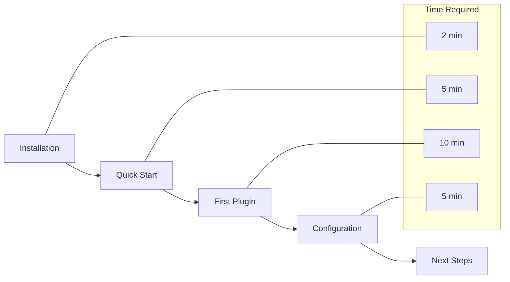
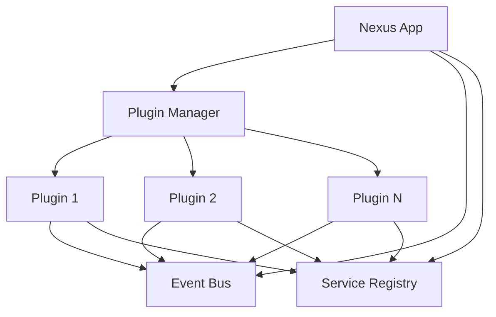

# Getting Started with Nexus

Welcome to Nexus! This section will get you up and running quickly with the plugin-based application platform.

## 🎯 Learning Path

## 📖 Pages in This Section

| Page | Description | Time | Prerequisites |
|------|-------------|------|---------------|
| **[Installation](installation.md)** | Install Nexus and dependencies | 2 min | Python 3.11+ |
| **[Quick Start](quickstart.md)** | Build your first Nexus application | 5 min | Installation complete |
| **[First Plugin](first-plugin.md)** | Create and use your first plugin | 10 min | Basic app working |
| **[Configuration](configuration.md)** | Configure your application | 5 min | App created |

## 🚀 Quick Overview

### What is Nexus?
Nexus is a plugin-based application platform where every feature is a plugin. This makes applications:
- **Modular**: Independent, reusable components
- **Scalable**: Add features without touching core code
- **Maintainable**: Clear separation of concerns
- **Testable**: Isolated plugin testing

### Core Concepts

### Key Benefits
- **Fast Development**: Plugin templates and CLI tools
- **Production Ready**: Built on FastAPI with async support
- **Developer Friendly**: Type hints, auto-documentation, testing tools
- **Flexible Deployment**: Docker, Kubernetes, traditional servers

## 🛠️ What You'll Build

By the end of this section, you'll have:

1. **Working Nexus installation**
2. **Basic web application** with health checks and API docs
3. **Custom plugin** with REST endpoints
4. **Configured application** ready for development

## 📋 Prerequisites

### System Requirements
- **Python**: 3.11 or higher
- **Memory**: 512MB RAM minimum
- **Disk**: 100MB free space
- **Network**: Internet access for package installation

### Knowledge Requirements
- **Python**: Basic syntax and concepts
- **REST APIs**: Understanding of HTTP methods
- **Command Line**: Basic terminal usage

### Optional Tools
- **Docker**: For containerized deployment
- **Git**: For version control
- **VS Code**: For enhanced development experience

## 🎯 Choose Your Path

### Quick Path (15 minutes)
Perfect if you want to see Nexus in action quickly:
1. [Installation](installation.md) → [Quick Start](quickstart.md)

### Complete Path (25 minutes)
Recommended for thorough understanding:
1. [Installation](installation.md)
2. [Quick Start](quickstart.md)
3. [First Plugin](first-plugin.md)
4. [Configuration](configuration.md)

### Exploratory Path
Jump to what interests you most:
- Want to understand the architecture? → [Architecture Overview](../architecture/overview.md)
- Ready to build complex plugins? → [Plugin Development](../plugins/basics.md)
- Need API reference? → [Core Classes](../api/core.md)

## 🆘 Getting Help

### Common Issues
- **Installation fails**: Check Python version with `python --version`
- **Import errors**: Ensure virtual environment is activated
- **Port conflicts**: Change port in configuration
- **Permission errors**: Check file permissions and user access

### Support Channels
1. **Documentation**: Search these guides first
2. **GitHub Issues**: Bug reports and feature requests
3. **GitHub Discussions**: Questions and community help
4. **Discord**: Real-time community support

## ✅ Success Criteria

You'll know you're ready to move on when:
- [ ] Nexus is installed and `nexus --version` works
- [ ] Basic app runs and responds at `http://localhost:8000`
- [ ] Health check endpoint returns status
- [ ] API documentation is accessible at `/docs`
- [ ] Custom plugin is loaded and functional

## 🚀 Ready to Start?

Let's begin with [Installation](installation.md) →

---

**Estimated total time**: 15-25 minutes to complete this entire section.