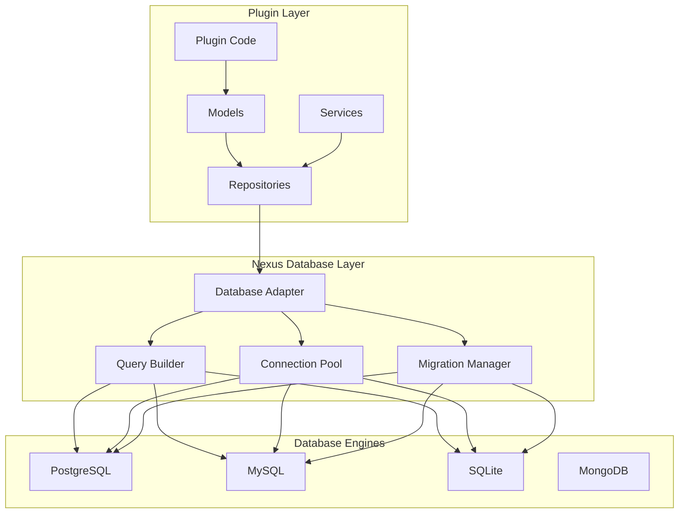

# Plugin Database Integration

Learn how to integrate your Nexus plugins with databases for persistent data storage.

## 🎯 Overview

Database integration is essential for plugins that need to store and retrieve data. Nexus provides a powerful database abstraction layer that supports multiple database engines while offering a consistent API for plugin developers.

## 🏗️ Database Architecture



## 🗄️ Database Setup

### Database Configuration

```yaml
# config/database.yaml
database:
  # Primary database
  default:
    driver: "postgresql"
    host: "localhost"
    port: 5432
    database: "nexus"
    username: "nexus_user"
    password: "${DB_PASSWORD}"

    # Connection pool settings
    pool_size: 20
    max_overflow: 30
    pool_timeout: 30
    pool_recycle: 3600

    # Query settings
    echo: false
    echo_pool: false

  # Plugin-specific database
  plugin_db:
    driver: "sqlite"
    database: "plugins.db"
    pool_size: 5

  # Read replica
  read_replica:
    driver: "postgresql"
    host: "replica.localhost"
    port: 5432
    database: "nexus"
    username: "nexus_reader"
    password: "${DB_READ_PASSWORD}"
    read_only: true
```

### Plugin Database Access

```python
from nexus.database import get_database, DatabaseAdapter
from nexus.plugin import Plugin

class MyPlugin(Plugin):

    def __init__(self, config):
        super().__init__(config)
        self.db = get_database('default')  # Use default database
        # Or use plugin-specific database
        # self.db = get_database('plugin_db')

    async def initialize(self):
        """Initialize plugin with database setup."""
        await super().initialize()

        # Create tables if they don't exist
        await self.create_tables()

        # Run migrations
        await self.run_migrations()

    async def create_tables(self):
        """Create plugin tables."""
        await self.db.execute("""
            CREATE TABLE IF NOT EXISTS my_plugin_users (
                id SERIAL PRIMARY KEY,
                username VARCHAR(50) UNIQUE NOT NULL,
                email VARCHAR(100) UNIQUE NOT NULL,
                created_at TIMESTAMP DEFAULT CURRENT_TIMESTAMP,
                updated_at TIMESTAMP DEFAULT CURRENT_TIMESTAMP
            )
        """)

        await self.db.execute("""
            CREATE INDEX IF NOT EXISTS idx_my_plugin_users_username
            ON my_plugin_users(username)
        """)
```

## 📊 Data Models

### Defining Models

```python
from dataclasses import dataclass
from datetime import datetime
from typing import Optional, List
from nexus.database.models import BaseModel

@dataclass
class User(BaseModel):
    """User model for the plugin."""

    id: Optional[int] = None
    username: str = ""
    email: str = ""
    full_name: Optional[str] = None
    is_active: bool = True
    tags: List[str] = None
    created_at: Optional[datetime] = None
    updated_at: Optional[datetime] = None

    def __post_init__(self):
        if self.tags is None:
            self.tags = []

    @classmethod
    def table_name(cls) -> str:
        return "my_plugin_users"

    @classmethod
    def get_schema(cls) -> dict:
        """Get table schema for migrations."""
        return {
            "columns": {
                "id": {"type": "SERIAL", "primary_key": True},
                "username": {"type": "VARCHAR(50)", "unique": True, "not_null": True},
                "email": {"type": "VARCHAR(100)", "unique": True, "not_null": True},
                "full_name": {"type": "VARCHAR(100)", "nullable": True},
                "is_active": {"type": "BOOLEAN", "default": True},
                "tags": {"type": "JSON", "default": "[]"},
                "created_at": {"type": "TIMESTAMP", "default": "CURRENT_TIMESTAMP"},
                "updated_at": {"type": "TIMESTAMP", "default": "CURRENT_TIMESTAMP"}
            },
            "indexes": [
                {"columns": ["username"], "unique": True},
                {"columns": ["email"], "unique": True},
                {"columns": ["created_at"]},
                {"columns": ["is_active"]}
            ]
        }

    def to_dict(self) -> dict:
        """Convert model to dictionary."""
        return {
            "id": self.id,
            "username": self.username,
            "email": self.email,
            "full_name": self.full_name,
            "is_active": self.is_active,
            "tags": self.tags,
            "created_at": self.created_at.isoformat() if self.created_at else None,
            "updated_at": self.updated_at.isoformat() if self.updated_at else None
        }

    @classmethod
    def from_dict(cls, data: dict) -> 'User':
        """Create model from dictionary."""
        return cls(
            id=data.get('id'),
            username=data.get('username', ''),
            email=data.get('email', ''),
            full_name=data.get('full_name'),
            is_active=data.get('is_active', True),
            tags=data.get('tags', []),
            created_at=data.get('created_at'),
            updated_at=data.get('updated_at')
        )

@dataclass
class UserProfile(BaseModel):
    """User profile model with relationship to User."""

    id: Optional[int] = None
    user_id: int = 0
    bio: Optional[str] = None
    avatar_url: Optional[str] = None
    preferences: dict = None
    created_at: Optional[datetime] = None
    updated_at: Optional[datetime] = None

    def __post_init__(self):
        if self.preferences is None:
            self.preferences = {}

    @classmethod
    def table_name(cls) -> str:
        return "my_plugin_user_profiles"

    @classmethod
    def get_schema(cls) -> dict:
        return {
            "columns": {
                "id": {"type": "SERIAL", "primary_key": True},
                "user_id": {"type": "INTEGER", "not_null": True, "foreign_key": "my_plugin_users.id"},
                "bio": {"type": "TEXT", "nullable": True},
                "avatar_url": {"type": "VARCHAR(255)", "nullable": True},
                "preferences": {"type": "JSON", "default": "{}"},
                "created_at": {"type": "TIMESTAMP", "default": "CURRENT_TIMESTAMP"},
                "updated_at": {"type": "TIMESTAMP", "default": "CURRENT_TIMESTAMP"}
            },
            "indexes": [
                {"columns": ["user_id"], "unique": True}
            ]
        }
```

## 🔍 Database Queries

### Basic CRUD Operations

```python
from nexus.database import DatabaseAdapter
from typing import List, Optional

class UserRepository:
    """Repository for user database operations."""

    def __init__(self, db: DatabaseAdapter):
        self.db = db

    async def create_user(self, user: User) -> User:
        """Create a new user."""
        query = """
            INSERT INTO my_plugin_users (username, email, full_name, is_active, tags)
            VALUES ($1, $2, $3, $4, $5)
            RETURNING id, created_at, updated_at
        """

        result = await self.db.fetch_one(
            query,
            user.username,
            user.email,
            user.full_name,
            user.is_active,
            user.tags
        )

        user.id = result['id']
        user.created_at = result['created_at']
        user.updated_at = result['updated_at']

        return user

    async def get_user_by_id(self, user_id: int) -> Optional[User]:
        """Get user by ID."""
        query = """
            SELECT * FROM my_plugin_users WHERE id = $1
        """

        result = await self.db.fetch_one(query, user_id)
        if not result:
            return None

        return User.from_dict(dict(result))

    async def get_user_by_username(self, username: str) -> Optional[User]:
        """Get user by username."""
        query = """
            SELECT * FROM my_plugin_users WHERE username = $1
        """

        result = await self.db.fetch_one(query, username)
        if not result:
            return None

        return User.from_dict(dict(result))

    async def update_user(self, user_id: int, updates: dict) -> Optional[User]:
        """Update user with provided fields."""
        if not updates:
            return await self.get_user_by_id(user_id)

        # Build dynamic query
        set_clauses = []
        values = []
        param_count = 1

        for field, value in updates.items():
            if field in ['username', 'email', 'full_name', 'is_active', 'tags']:
                set_clauses.append(f"{field} = ${param_count}")
                values.append(value)
                param_count += 1

        if not set_clauses:
            return await self.get_user_by_id(user_id)

        set_clauses.append(f"updated_at = ${param_count}")
        values.append(datetime.utcnow())
        values.append(user_id)  # For WHERE clause

        query = f"""
            UPDATE my_plugin_users
            SET {', '.join(set_clauses)}
            WHERE id = ${param_count + 1}
            RETURNING *
        """

        result = await self.db.fetch_one(query, *values)
        if not result:
            return None

        return User.from_dict(dict(result))

    async def delete_user(self, user_id: int) -> bool:
        """Delete user by ID."""
        query = """
            DELETE FROM my_plugin_users WHERE id = $1
        """

        result = await self.db.execute(query, user_id)
        return result.rowcount > 0

    async def list_users(
        self,
        page: int = 1,
        per_page: int = 20,
        filters: dict = None
    ) -> tuple[List[User], int]:
        """List users with pagination and filtering."""

        # Build WHERE clause
        where_clauses = []
        where_values = []
        param_count = 1

        if filters:
            if 'search' in filters:
                where_clauses.append(f"""
                    (username ILIKE ${param_count} OR email ILIKE ${param_count} OR full_name ILIKE ${param_count})
                """)
                where_values.append(f"%{filters['search']}%")
                param_count += 1

            if 'is_active' in filters:
                where_clauses.append(f"is_active = ${param_count}")
                where_values.append(filters['is_active'])
                param_count += 1

            if 'created_after' in filters:
                where_clauses.append(f"created_at >= ${param_count}")
                where_values.append(filters['created_after'])
                param_count += 1

        where_clause = "WHERE " + " AND ".join(where_clauses) if where_clauses else ""

        # Count total records
        count_query = f"SELECT COUNT(*) FROM my_plugin_users {where_clause}"
        total = await self.db.fetch_val(count_query, *where_values)

        # Get paginated results
        offset = (page - 1) * per_page
        list_query = f"""
            SELECT * FROM my_plugin_users
            {where_clause}
            ORDER BY created_at DESC
            LIMIT ${param_count} OFFSET ${param_count + 1}
        """

        results = await self.db.fetch_all(
            list_query,
            *where_values,
            per_page,
            offset
        )

        users = [User.from_dict(dict(row)) for row in results]
        return users, total
```

### Complex Queries with Joins

```python
class UserProfileRepository:
    """Repository for user profile operations with joins."""

    def __init__(self, db: DatabaseAdapter):
        self.db = db

    async def get_user_with_profile(self, user_id: int) -> Optional[dict]:
        """Get user with their profile in a single query."""
        query = """
            SELECT
                u.*,
                p.bio,
                p.avatar_url,
                p.preferences
            FROM my_plugin_users u
            LEFT JOIN my_plugin_user_profiles p ON u.id = p.user_id
            WHERE u.id = $1
        """

        result = await self.db.fetch_one(query, user_id)
        if not result:
            return None

        user_data = {
            'id': result['id'],
            'username': result['username'],
            'email': result['email'],
            'full_name': result['full_name'],
            'is_active': result['is_active'],
            'tags': result['tags'],
            'created_at': result['created_at'],
            'updated_at': result['updated_at'],
            'profile': {
                'bio': result['bio'],
                'avatar_url': result['avatar_url'],
                'preferences': result['preferences']
            } if result['bio'] is not None else None
        }

        return user_data

    async def get_users_with_tag(self, tag: str) -> List[User]:
        """Get all users that have a specific tag."""
        query = """
            SELECT * FROM my_plugin_users
            WHERE tags @> $1
            ORDER BY username
        """

        results = await self.db.fetch_all(query, [tag])
        return [User.from_dict(dict(row)) for row in results]

    async def get_user_statistics(self) -> dict:
        """Get aggregated user statistics."""
        query = """
            SELECT
                COUNT(*) as total_users,
                COUNT(*) FILTER (WHERE is_active = true) as active_users,
                COUNT(*) FILTER (WHERE is_active = false) as inactive_users,
                COUNT(DISTINCT jsonb_array_elements_text(tags)) as unique_tags,
                AVG(EXTRACT(EPOCH FROM (CURRENT_TIMESTAMP - created_at)) / 86400) as avg_age_days
            FROM my_plugin_users
        """

        result = await self.db.fetch_one(query)
        return dict(result)
```

## 🔄 Database Migrations

### Migration System

```python
from nexus.database.migrations import Migration, MigrationManager

class CreateUsersTable(Migration):
    """Create initial users table."""

    version = "001"
    description = "Create my_plugin_users table"

    async def up(self, db: DatabaseAdapter):
        """Apply migration."""
        await db.execute("""
            CREATE TABLE my_plugin_users (
                id SERIAL PRIMARY KEY,
                username VARCHAR(50) UNIQUE NOT NULL,
                email VARCHAR(100) UNIQUE NOT NULL,
                created_at TIMESTAMP DEFAULT CURRENT_TIMESTAMP,
                updated_at TIMESTAMP DEFAULT CURRENT_TIMESTAMP
            )
        """)

        await db.execute("""
            CREATE INDEX idx_my_plugin_users_username ON my_plugin_users(username)
        """)

        await db.execute("""
            CREATE INDEX idx_my_plugin_users_email ON my_plugin_users(email)
        """)

    async def down(self, db: DatabaseAdapter):
        """Reverse migration."""
        await db.execute("DROP TABLE IF EXISTS my_plugin_users CASCADE")

class AddUserProfileFields(Migration):
    """Add profile fields to users table."""

    version = "002"
    description = "Add full_name, is_active, and tags to users"

    async def up(self, db: DatabaseAdapter):
        await db.execute("""
            ALTER TABLE my_plugin_users
            ADD COLUMN full_name VARCHAR(100),
            ADD COLUMN is_active BOOLEAN DEFAULT true,
            ADD COLUMN tags JSON DEFAULT '[]'
        """)

        await db.execute("""
            CREATE INDEX idx_my_plugin_users_active ON my_plugin_users(is_active)
        """)

    async def down(self, db: DatabaseAdapter):
        await db.execute("""
            ALTER TABLE my_plugin_users
            DROP COLUMN full_name,
            DROP COLUMN is_active,
            DROP COLUMN tags
        """)

class CreateUserProfilesTable(Migration):
    """Create user profiles table."""

    version = "003"
    description = "Create my_plugin_user_profiles table"

    async def up(self, db: DatabaseAdapter):
        await db.execute("""
            CREATE TABLE my_plugin_user_profiles (
                id SERIAL PRIMARY KEY,
                user_id INTEGER NOT NULL REFERENCES my_plugin_users(id) ON DELETE CASCADE,
                bio TEXT,
                avatar_url VARCHAR(255),
                preferences JSON DEFAULT '{}',
                created_at TIMESTAMP DEFAULT CURRENT_TIMESTAMP,
                updated_at TIMESTAMP DEFAULT CURRENT_TIMESTAMP,
                UNIQUE(user_id)
            )
        """)

        await db.execute("""
            CREATE INDEX idx_my_plugin_profiles_user_id ON my_plugin_user_profiles(user_id)
        """)

    async def down(self, db: DatabaseAdapter):
        await db.execute("DROP TABLE IF EXISTS my_plugin_user_profiles CASCADE")

# Register migrations in your plugin
class MyPlugin(Plugin):

    async def initialize(self):
        await super().initialize()

        # Register and run migrations
        migration_manager = MigrationManager(self.db, "my_plugin")
        migration_manager.register(CreateUsersTable())
        migration_manager.register(AddUserProfileFields())
        migration_manager.register(CreateUserProfilesTable())

        await migration_manager.run_migrations()
```

## 🚀 Query Builder

### Using the Query Builder

```python
from nexus.database.query import QueryBuilder

class UserQueryBuilder:
    """Advanced query building for users."""

    def __init__(self, db: DatabaseAdapter):
        self.db = db
        self.qb = QueryBuilder(db)

    async def search_users(self, criteria: dict) -> List[User]:
        """Search users with complex criteria."""

        query = (self.qb
                .select("*")
                .from_table("my_plugin_users")
                .where("is_active", "=", True))

        if criteria.get('username'):
            query = query.where("username", "ILIKE", f"%{criteria['username']}%")

        if criteria.get('tags'):
            for tag in criteria['tags']:
                query = query.where_raw("tags @> ?", [tag])

        if criteria.get('created_after'):
            query = query.where("created_at", ">=", criteria['created_after'])

        if criteria.get('sort_by'):
            direction = criteria.get('sort_direction', 'ASC')
            query = query.order_by(criteria['sort_by'], direction)
        else:
            query = query.order_by("created_at", "DESC")

        if criteria.get('limit'):
            query = query.limit(criteria['limit'])
            if criteria.get('offset'):
                query = query.offset(criteria['offset'])

        results = await query.fetch_all()
        return [User.from_dict(dict(row)) for row in results]

    async def get_user_counts_by_tag(self) -> dict:
        """Get count of users for each tag."""

        query = """
            SELECT
                tag,
                COUNT(*) as count
            FROM my_plugin_users,
                 jsonb_array_elements_text(tags) as tag
            WHERE is_active = true
            GROUP BY tag
            ORDER BY count DESC
        """

        results = await self.db.fetch_all(query)
        return {row['tag']: row['count'] for row in results}

    async def bulk_update_users(self, user_ids: List[int], updates: dict) -> int:
        """Bulk update multiple users."""

        if not user_ids or not updates:
            return 0

        query = self.qb.update("my_plugin_users")

        for field, value in updates.items():
            if field in ['username', 'email', 'full_name', 'is_active', 'tags']:
                query = query.set(field, value)

        query = (query
                .set("updated_at", datetime.utcnow())
                .where_in("id", user_ids))

        result = await query.execute()
        return result.rowcount
```

## 📊 Database Performance

### Connection Pooling

```python
from nexus.database.pool import ConnectionPool

class PluginDatabaseManager:
    """Manage database connections for the plugin."""

    def __init__(self, config: dict):
        self.config = config
        self.pools = {}

    async def initialize(self):
        """Initialize database connections."""

        # Primary database pool
        self.pools['primary'] = ConnectionPool(
            dsn=self.config['database']['primary']['url'],
            min_size=5,
            max_size=20,
            command_timeout=30,
            server_settings={
                'application_name': 'nexus_plugin',
                'jit': 'off'  # Optimize for OLTP workloads
            }
        )

        # Read-only replica pool
        if 'replica' in self.config['database']:
            self.pools['replica'] = ConnectionPool(
                dsn=self.config['database']['replica']['url'],
                min_size=3,
                max_size=10,
                command_timeout=60  # Longer timeout for read queries
            )

    async def get_connection(self, pool_name: str = 'primary'):
        """Get database connection from pool."""
        if pool_name not in self.pools:
            raise ValueError(f"Unknown pool: {pool_name}")

        return await self.pools[pool_name].acquire()

    async def execute_read_query(self, query: str, *args):
        """Execute read query on replica if available."""
        pool_name = 'replica' if 'replica' in self.pools else 'primary'

        async with self.get_connection(pool_name) as conn:
            return await conn.fetch(query, *args)

    async def execute_write_query(self, query: str, *args):
        """Execute write query on primary database."""
        async with self.get_connection('primary') as conn:
            return await conn.execute(query, *args)
```

### Query Optimization

```python
class OptimizedUserRepository(UserRepository):
    """Optimized version of UserRepository."""

    async def get_users_with_profiles_batch(self, user_ids: List[int]) -> dict:
        """Efficiently get multiple users with profiles."""

        if not user_ids:
            return {}

        # Single query instead of N+1 queries
        query = """
            SELECT
                u.id, u.username, u.email, u.full_name, u.is_active, u.tags,
                u.created_at, u.updated_at,
                p.bio, p.avatar_url, p.preferences
            FROM my_plugin_users u
            LEFT JOIN my_plugin_user_profiles p ON u.id = p.user_id
            WHERE u.id = ANY($1)
        """

        results = await self.db.fetch_all(query, user_ids)

        users = {}
        for row in results:
            user_data = {
                'id': row['id'],
                'username': row['username'],
                'email': row['email'],
                'full_name': row['full_name'],
                'is_active': row['is_active'],
                'tags': row['tags'],
                'created_at': row['created_at'],
                'updated_at': row['updated_at'],
                'profile': {
                    'bio': row['bio'],
                    'avatar_url': row['avatar_url'],
                    'preferences': row['preferences']
                } if row['bio'] is not None else None
            }
            users[row['id']] = user_data

        return users

    async def get_user_tags_cached(self) -> List[str]:
        """Get all unique tags with caching."""
        cache_key = "user_tags"

        # Try cache first
        cached_tags = await self.cache.get(cache_key)
        if cached_tags:
            return cached_tags

        # Query database
        query = """
            SELECT DISTINCT jsonb_array_elements_text(tags) as tag
            FROM my_plugin_users
            WHERE is_active = true AND jsonb_array_length(tags) > 0
            ORDER BY tag
        """

        results = await self.db.fetch_all(query)
        tags = [row['tag'] for row in results]

        # Cache for 1 hour
        await self.cache.set(cache_key, tags, ttl=3600)

        return tags
```

## 🔒 Database Security

### SQL Injection Prevention

```python
class SecureUserRepository(UserRepository):
    """Repository with security best practices."""

    async def search_users_secure(self, search_term: str) -> List[User]:
        """Secure user search preventing SQL injection."""

        # GOOD: Using parameterized queries
        query = """
            SELECT * FROM my_plugin_users
            WHERE username ILIKE $1 OR email ILIKE $1
            ORDER BY username
        """

        results = await self.db.fetch_all(query, f"%{search_term}%")
        return [User.from_dict(dict(row)) for row in results]

    async def get_users_by_dynamic_filter(self, filters: dict) -> List[User]:
        """Dynamic filtering with proper sanitization."""

        allowed_fields = {'username', 'email', 'is_active', 'created_at'}
        allowed_operators = {'=', '!=', '>', '<', '>=', '<=', 'LIKE', 'ILIKE'}

        where_clauses = []
        values = []
        param_count = 1

        for field, operator, value in filters.get('conditions', []):
            # Validate field and operator
            if field not in allowed_fields:
                continue
            if operator not in allowed_operators:
                continue

            where_clauses.append(f"{field} {operator} ${param_count}")
            values.append(value)
            param_count += 1

        if not where_clauses:
            where_clause = ""
        else:
            where_clause = "WHERE " + " AND ".join(where_clauses)

        query = f"SELECT * FROM my_plugin_users {where_clause} ORDER BY created_at DESC"

        results = await self.db.fetch_all(query, *values)
        return [User.from_dict(dict(row)) for row in results]
```

### Row-Level Security

```python
class RowLevelSecurityRepository:
    """Repository implementing row-level security."""

    def __init__(self, db: DatabaseAdapter):
        self.db = db

    async def setup_rls(self):
        """Set up row-level security policies."""

        # Enable RLS on the table
        await self.db.execute("""
            ALTER TABLE my_plugin_users ENABLE ROW LEVEL SECURITY
        """)

        # Policy: Users can only see their own data
        await self.db.execute("""
            CREATE POLICY user_select_own ON my_plugin_users
            FOR SELECT
            USING (id = current_setting('app.current_user_id')::INTEGER)
        """)

        # Policy: Admins can see all data
        await self.db.execute("""
            CREATE POLICY admin_select_all ON my_plugin_users
            FOR SELECT
            USING (current_setting('app.user_role') = 'admin')
        """)

    async def set_user_context(self, user_id: int, role: str):
        """Set current user context for RLS."""
        await self.db.execute("SELECT set_config('app.current_user_id', $1, true)", str(user_id))
        await self.db.execute("SELECT set_config('app.user_role', $1, true)", role)

    async def get_accessible_users(self, current_user_id: int, current_user_role: str) -> List[User]:
        """Get users accessible to current user based on RLS."""

        # Set context
        await self.set_user_context(current_user_id, current_user_role)

        # Query will automatically apply RLS policies
        query = "SELECT * FROM my_plugin_users ORDER BY username"
        results = await self.db.fetch_all(query)

        return [User.from_dict(dict(row)) for row in results]
```

## 🧪 Testing Database Operations

### Database Testing

```python
import pytest
from nexus.testing import DatabaseTestCase, TestDatabase

class TestUserRepository(DatabaseTestCase):
    """Test cases for UserRepository."""

    async def setup_method(self):
        """Set up test database."""
        self.test_db = TestDatabase()
        await self.test_db.setup()

        self.repository = UserRepository(self.test_db)

        # Create test tables
        await self.test_db.execute("""
            CREATE TABLE my_plugin_users (
                id SERIAL PRIMARY KEY,
                username VARCHAR(50) UNIQUE NOT NULL,
                email VARCHAR(100) UNIQUE NOT NULL,
                full_name VARCHAR(100),
                is_active BOOLEAN DEFAULT true,
                tags JSON DEFAULT '[]',
                created_at TIMESTAMP DEFAULT CURRENT_TIMESTAMP,
                updated_at TIMESTAMP DEFAULT CURRENT_TIMESTAMP
            )
        """)

    async def teardown_method(self):
        """Clean up test database."""
        await self.test_db.cleanup()

    async def test_create_user(self):
        """Test user creation."""
        user = User(
            username="testuser",
            email="test@example.com",
            full_name="Test User",
            tags=["developer", "python"]
        )

        created_user = await self.repository.create_user(user)

        assert created_user.id is not None
        assert created_user.username == "testuser"
        assert created_user.email == "test@example.com"
        assert created_user.tags == ["developer",
