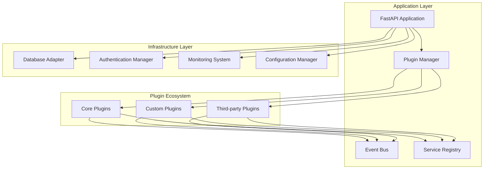
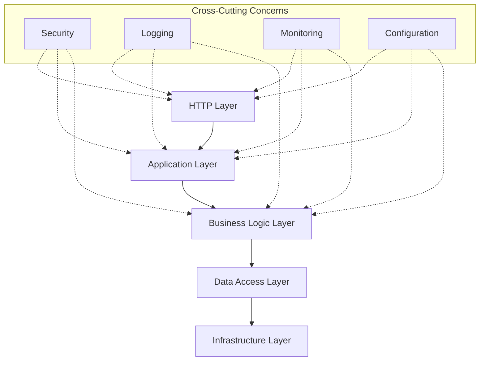
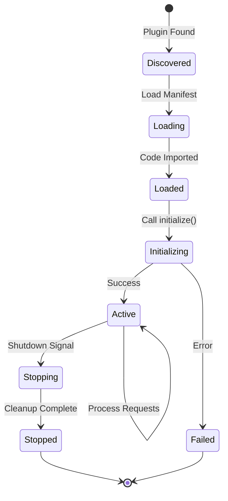
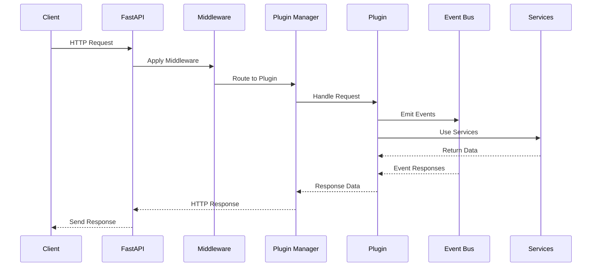
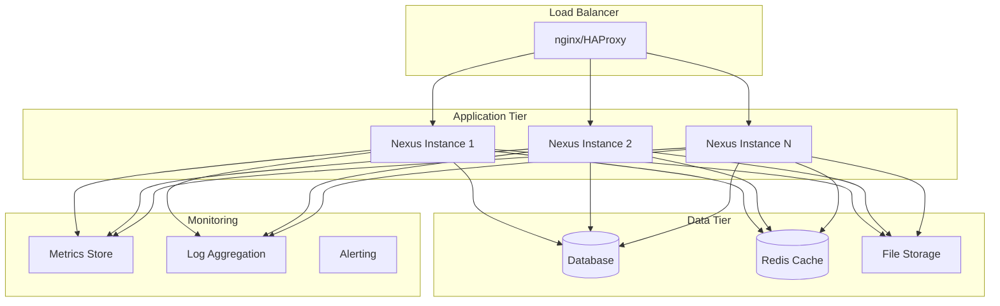
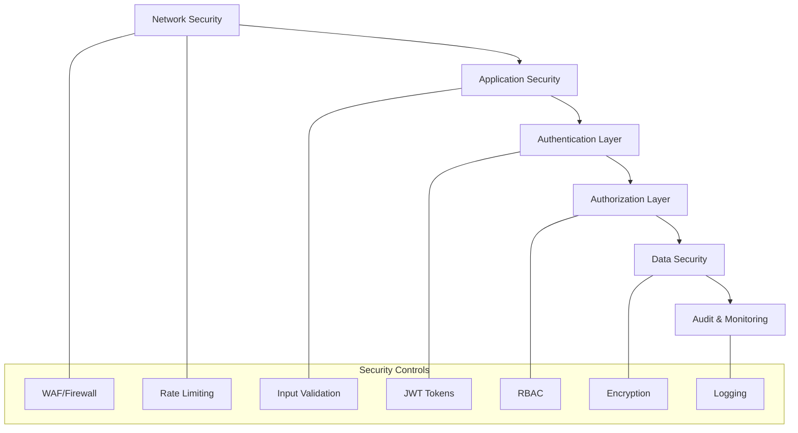

# Architecture

Understanding the core design principles and components that make Nexus a powerful plugin-based application platform.

## 🏗️ Architecture Overview

Nexus is built on a plugin-first architecture where modularity, extensibility, and performance are the primary design goals.

## 📖 Architecture Sections

| Section | Description | Best For |
|---------|-------------|----------|
| **[Overview](overview.md)** | High-level architecture and design principles | Architects, system designers |
| **[Core Components](core-components.md)** | Deep dive into framework components | Advanced developers |
| **[Event System](events.md)** | Event-driven communication patterns | Plugin developers |
| **[Security Model](security.md)** | Authentication, authorization, and security | Security engineers |

## 🎯 Key Concepts

### Plugin-First Design
Every feature in Nexus is implemented as a plugin, ensuring:
- **Modularity**: Independent, testable components
- **Extensibility**: Easy to add new functionality
- **Maintainability**: Clear separation of concerns
- **Reusability**: Plugins can be shared across projects

### Event-Driven Architecture
Loose coupling through asynchronous events:
- **Publishers**: Emit events when actions occur
- **Subscribers**: React to events of interest
- **Event Bus**: Routes events between components
- **Priority System**: Control event processing order

### Service Registry Pattern
Dependency injection and service discovery:
- **Registration**: Services register themselves
- **Discovery**: Components find needed services
- **Lifecycle**: Automatic service management
- **Testing**: Easy mocking and isolation

## 🔍 Architecture Patterns

### Layered Architecture

### Plugin Lifecycle

## 🎨 Design Principles

### 1. Convention over Configuration
- Sensible defaults for common use cases
- Minimal required configuration
- Clear conventions for plugin structure
- Automatic discovery and registration

### 2. Fail Fast, Fail Safe
- Early validation of configuration
- Graceful degradation when plugins fail
- Isolation of plugin failures
- Comprehensive error reporting

### 3. Async-First
- Non-blocking I/O throughout
- Async plugin interfaces
- Event-driven communication
- Scalable request handling

### 4. Developer Experience
- Clear, discoverable APIs
- Comprehensive documentation
- Rich tooling and CLI support
- Excellent error messages

## 🔄 Request Flow

## 🔧 System Architecture

### Deployment Architecture

## 📊 Performance Considerations

### Scalability Patterns
- **Horizontal scaling**: Stateless application design
- **Vertical scaling**: Efficient resource utilization
- **Database scaling**: Read replicas and partitioning
- **Caching strategies**: Multi-level caching hierarchy

### Memory Management
- **Plugin isolation**: Separate memory spaces
- **Resource pooling**: Connection and object pools
- **Garbage collection**: Optimized GC settings
- **Memory monitoring**: Real-time usage tracking

### I/O Optimization
- **Async operations**: Non-blocking I/O
- **Connection pooling**: Reuse database connections
- **Batch processing**: Aggregate operations
- **Lazy loading**: Load data on demand

## 🛡️ Security Architecture

### Defense in Depth

## 🎯 Architecture Benefits

### For Developers
- **Fast development**: Plugin templates and CLI tools
- **Clear boundaries**: Well-defined interfaces
- **Easy testing**: Isolated, mockable components
- **Rich tooling**: Debug, monitor, and profile easily

### For Operations
- **Scalable deployment**: Horizontal and vertical scaling
- **Monitoring ready**: Built-in metrics and health checks
- **Configuration management**: Environment-specific configs
- **Zero-downtime updates**: Hot-reload plugin support

### For Business
- **Rapid feature delivery**: Plugin-based development
- **Technical debt reduction**: Modular architecture
- **Team scalability**: Independent development teams
- **Vendor flexibility**: Pluggable third-party integrations

## 🚀 Getting Started

Choose your learning path:

- **New to architecture?** → [Architecture Overview](overview.md)
- **Want to understand components?** → [Core Components](core-components.md)
- **Building event-driven features?** → [Event System](events.md)
- **Implementing security?** → [Security Model](security.md)

## 📚 Related Documentation

- **[Plugin Development](../plugins/README.md)** - Build plugins with this architecture
- **[API Reference](../api/README.md)** - Use the architectural components
- **[Deployment](../deployment/README.md)** - Deploy this architecture

---

**Understanding the architecture is key to building effective Nexus applications.** Start with the [overview](overview.md) to get the big picture.