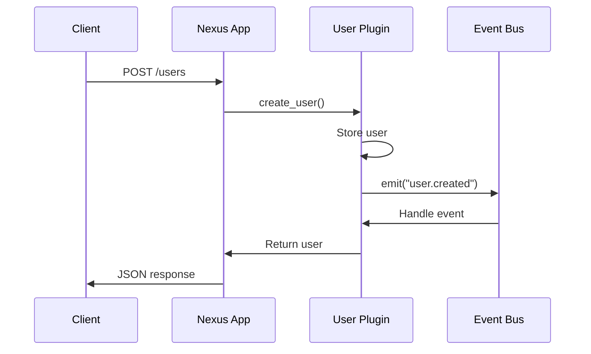

# Your First Plugin

Create a custom plugin to extend your Nexus application with modular functionality.

## 🎯 What You'll Build

A complete plugin with:
- REST API endpoints
- Database integration
- Event handling
- Health checks

## 📋 Prerequisites

- [Quick Start completed](quickstart.md)
- Working Nexus application
- Basic understanding of Python classes

## 🚀 Step 1: Generate Plugin Template

Use the CLI to create a new plugin:

```bash
# In your project directory
nexus plugin create user_manager
```

This creates the plugin structure:

```
plugins/user_manager/
├── __init__.py
├── plugin.py          # Main plugin class
├── manifest.json       # Plugin metadata
└── tests/             # Plugin tests
    └── test_plugin.py
```

## 🔧 Step 2: Define Plugin Metadata

Edit `plugins/user_manager/manifest.json`:

```json
{
  "name": "user_manager",
  "version": "1.0.0",
  "description": "Simple user management plugin",
  "author": "Your Name",
  "license": "MIT",
  "dependencies": [],
  "python_requirements": [],
  "permissions": [
    "database.read",
    "database.write"
  ],
  "configuration_schema": {
    "max_users": {
      "type": "integer",
      "default": 1000,
      "description": "Maximum number of users"
    }
  }
}
```

## 📝 Step 3: Implement Plugin Class

Edit `plugins/user_manager/plugin.py`:

```python
from nexus import BasePlugin
from fastapi import APIRouter, HTTPException
from pydantic import BaseModel
from typing import List, Dict, Any
import logging

class User(BaseModel):
    id: int
    username: str
    email: str
    active: bool = True

class CreateUser(BaseModel):
    username: str
    email: str

class UserManagerPlugin(BasePlugin):
    def __init__(self):
        super().__init__()
        self.name = "user_manager"
        self.version = "1.0.0"
        self.description = "Simple user management plugin"
        self.logger = logging.getLogger(f"nexus.plugin.{self.name}")
        
        # In-memory storage for demo
        self.users: Dict[int, User] = {}
        self.next_id = 1
    
    async def initialize(self) -> bool:
        """Initialize plugin resources"""
        self.logger.info("User Manager plugin starting up")
        
        # Subscribe to events
        self.event_bus.subscribe("app.startup", self.on_app_startup)
        
        # Create default admin user
        await self.create_default_user()
        
        return True
    
    async def shutdown(self):
        """Cleanup plugin resources"""
        self.logger.info("User Manager plugin shutting down")
        # Save user data, close connections, etc.
    
    def get_api_routes(self) -> List[APIRouter]:
        """Define API routes"""
        router = APIRouter(prefix="/users", tags=["users"])
        
        @router.get("/", response_model=List[User])
        async def list_users():
            """Get all users"""
            return list(self.users.values())
        
        @router.post("/", response_model=User)
        async def create_user(user_data: CreateUser):
            """Create a new user"""
            # Check if username exists
            for user in self.users.values():
                if user.username == user_data.username:
                    raise HTTPException(400, "Username already exists")
            
            # Create new user
            user = User(
                id=self.next_id,
                username=user_data.username,
                email=user_data.email
            )
            
            self.users[user.id] = user
            self.next_id += 1
            
            # Emit event
            await self.event_bus.emit("user.created", {
                "user_id": user.id,
                "username": user.username,
                "email": user.email
            })
            
            self.logger.info(f"Created user: {user.username}")
            return user
        
        @router.get("/{user_id}", response_model=User)
        async def get_user(user_id: int):
            """Get a specific user"""
            if user_id not in self.users:
                raise HTTPException(404, "User not found")
            return self.users[user_id]
        
        @router.delete("/{user_id}")
        async def delete_user(user_id: int):
            """Delete a user"""
            if user_id not in self.users:
                raise HTTPException(404, "User not found")
            
            user = self.users.pop(user_id)
            
            # Emit event
            await self.event_bus.emit("user.deleted", {
                "user_id": user.id,
                "username": user.username
            })
            
            self.logger.info(f"Deleted user: {user.username}")
            return {"message": "User deleted successfully"}
        
        return [router]
    
    def get_health_checks(self) -> Dict[str, Any]:
        """Define health checks"""
        return {
            "user_storage": self.check_user_storage,
            "user_count": self.check_user_count
        }
    
    async def check_user_storage(self) -> bool:
        """Check if user storage is working"""
        try:
            # Simple check that storage is accessible
            return isinstance(self.users, dict)
        except Exception as e:
            self.logger.error(f"User storage health check failed: {e}")
            return False
    
    async def check_user_count(self) -> bool:
        """Check user count is within limits"""
        try:
            max_users = getattr(self.config, 'max_users', 1000)
            return len(self.users) < max_users
        except Exception as e:
            self.logger.error(f"User count health check failed: {e}")
            return False
    
    async def create_default_user(self):
        """Create a default admin user"""
        if not self.users:
            admin_user = User(
                id=self.next_id,
                username="admin",
                email="admin@example.com",
                active=True
            )
            self.users[admin_user.id] = admin_user
            self.next_id += 1
            self.logger.info("Created default admin user")
    
    async def on_app_startup(self, event_data):
        """Handle application startup event"""
        self.logger.info("Application started, user manager ready")

def create_plugin():
    """Factory function for plugin creation"""
    return UserManagerPlugin()
```

## 🔗 Step 4: Load Plugin in Application

Update your `main.py` to load plugins:

```python
from nexus import create_nexus_app, load_config

# Load configuration
config = load_config("nexus_config.yaml")

# Create application with plugin support
app = create_nexus_app(
    title=config.app.name,
    description=config.app.description,
    version="1.0.0",
    config=config,
    plugins_dir="plugins"  # Enable plugin loading
)

if __name__ == "__main__":
    import uvicorn
    uvicorn.run(
        app, 
        host=config.app.host, 
        port=config.app.port,
        reload=config.app.debug
    )
```

## 🧪 Step 5: Test Your Plugin

Start your application:

```bash
python main.py
```

Test the plugin endpoints:

### List Users
```bash
curl http://localhost:8000/users/
```

### Create User
```bash
curl -X POST http://localhost:8000/users/ \
  -H "Content-Type: application/json" \
  -d '{"username": "john", "email": "john@example.com"}'
```

### Get User
```bash
curl http://localhost:8000/users/1
```

### Delete User
```bash
curl -X DELETE http://localhost:8000/users/1
```

## 📊 Step 6: Check Health Status

Visit the health endpoint to see your plugin's health checks:

```bash
curl http://localhost:8000/health
```

Response includes plugin health:
```json
{
  "status": "healthy",
  "timestamp": "2024-01-01T12:00:00Z",
  "checks": {
    "user_manager.user_storage": true,
    "user_manager.user_count": true
  }
}
```

## 🎯 Plugin Architecture

```mermaid
graph TB
    A[Nexus App] --> B[Plugin Manager]
    B --> C[User Manager Plugin]
    
    C --> D[API Routes]
    C --> E[Event Handlers]
    C --> F[Health Checks]
    C --> G[Data Storage]
    
    D --> H[/users GET]
    D --> I[/users POST]
    D --> J[/users/{id} GET]
    D --> K[/users/{id} DELETE]
    
    E --> L[app.startup]
    E --> M[user.created]
    E --> N[user.deleted]
```

## 🔄 Event Flow



## 🔧 Advanced Features

### Add Configuration

Update `nexus_config.yaml`:

```yaml
plugins:
  user_manager:
    max_users: 500
    default_admin: true
```

### Add Middleware

Add to your plugin class:

```python
def get_middleware(self):
    """Add custom middleware"""
    async def user_middleware(request, call_next):
        # Log user requests
        if request.url.path.startswith("/users"):
            self.logger.info(f"User API request: {request.method} {request.url.path}")
        
        response = await call_next(request)
        return response
    
    return [user_middleware]
```

### Add Database Integration

```python
from sqlalchemy import Column, Integer, String, Boolean
from nexus.database import Base

class UserModel(Base):
    __tablename__ = "users"
    
    id = Column(Integer, primary_key=True)
    username = Column(String(50), unique=True, nullable=False)
    email = Column(String(100), nullable=False)
    active = Column(Boolean, default=True)
```

## ✅ Testing Your Plugin

Create `plugins/user_manager/tests/test_plugin.py`:

```python
import pytest
from nexus.testing import PluginTestCase
from ..plugin import UserManagerPlugin

class TestUserManagerPlugin(PluginTestCase):
    plugin_class = UserManagerPlugin
    
    async def test_plugin_initialization(self):
        """Test plugin initializes correctly"""
        assert await self.plugin.initialize() is True
        assert self.plugin.name == "user_manager"
        assert len(self.plugin.users) == 1  # Default admin
    
    async def test_create_user(self):
        """Test user creation"""
        await self.plugin.initialize()
        
        user_data = {"username": "test", "email": "test@example.com"}
        # Test would call plugin methods directly
        # In practice, use test client for API endpoints
    
    async def test_health_checks(self):
        """Test health checks"""
        await self.plugin.initialize()
        
        storage_health = await self.plugin.check_user_storage()
        count_health = await self.plugin.check_user_count()
        
        assert storage_health is True
        assert count_health is True
```

Run tests:

```bash
nexus test user_manager
```

## 🎯 What You've Accomplished

✅ **Created a complete plugin** with REST API endpoints  
✅ **Added database models** and data management  
✅ **Implemented event handling** for plugin communication  
✅ **Built health checks** for monitoring  
✅ **Added configuration** for customization  
✅ **Wrote tests** for quality assurance  

## 🚀 Next Steps

1. **[Configuration Guide](configuration.md)** - Advanced app configuration
2. **[Plugin Development](../plugins/basics.md)** - Build more complex plugins
3. **[Database Integration](../plugins/database.md)** - Persistent data storage
4. **[Testing Plugins](../plugins/testing.md)** - Comprehensive testing strategies

## 🎁 Plugin Ideas

Now that you know how to create plugins, try building:

- **Authentication Plugin** - JWT token management
- **File Upload Plugin** - Handle file uploads and storage
- **Notification Plugin** - Email/SMS notifications
- **Analytics Plugin** - Track user behavior
- **Cache Plugin** - Redis/Memcached integration

---

**🎉 Congratulations!** You've created your first Nexus plugin. Ready for [advanced configuration](configuration.md)?