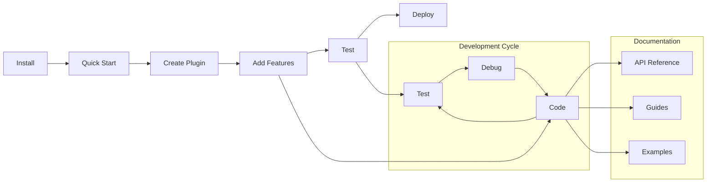

# Nexus Platform v0.x

Welcome to the **Nexus Platform v0.x** documentation - the ultimate plugin-based application platform for building modular, scalable applications with ease.

!!! info "Current Version"
This documentation covers **Nexus Platform v0.x** series. The current latest version is **v0.1.1**.

    - [📋 Changelog](changelog.md) - See what's new in each version
    - [🔄 Migration Guides](migrations/v0.1.0-to-v0.1.1.md) - Upgrade between versions
    - [📦 PyPI Package](https://pypi.org/project/nexus-platform/) - Install the latest version

## What is Nexus?

Nexus is a powerful, enterprise-ready framework that enables developers to build modular applications using a plugin-based architecture. Built on top of FastAPI and designed for async operations, Nexus provides:

- **Plugin System**: Extensible architecture with hot-pluggable components
- **Event-Driven**: Robust event bus for decoupled communication
- **Service Registry**: Dynamic service discovery and management
- **Configuration Management**: Flexible, environment-aware configuration
- **Monitoring & Observability**: Built-in health checks and metrics
- **Security**: Authentication, authorization, and security middleware
- **CLI Tools**: Command-line interface for management and development

## Key Features

### 🔌 Plugin Architecture

Build applications as collections of independent, reusable plugins that can be loaded, unloaded, and configured dynamically.

### ⚡ High Performance

Built on FastAPI and Uvicorn for maximum performance with async/await support throughout.

### 🛠️ Developer Experience

Rich CLI tools, comprehensive documentation, and intuitive APIs make development a pleasure.

### 🔒 Enterprise Ready

Production-ready with security, monitoring, logging, and deployment features built-in.

### 🌐 API First

RESTful APIs and WebSocket support with automatic OpenAPI documentation generation.

## Quick Start

Get up and running with Nexus in minutes:

```bash
# Install Nexus
pip install nexus-platform-platform

# Create a new application
nexus create my-app

# Start development server
cd my-app
nexus run --reload
```

Your application will be available at `http://localhost:8000` with automatic API documentation at `/docs`.

## Architecture Overview

```
┌─────────────────┐    ┌─────────────────┐    ┌─────────────────┐
│   Web Layer     │    │  Plugin Layer   │    │  Core Layer     │
│                 │    │                 │    │                 │
│ FastAPI Router  │◄──►│ Plugin Manager  │◄──►│ Event Bus       │
│ Middleware      │    │ Service Registry│    │ Configuration   │
│ Authentication  │    │ Lifecycle Mgmt  │    │ Monitoring      │
└─────────────────┘    └─────────────────┘    └─────────────────┘
```

## 📖 Documentation Structure

```mermaid
graph TB
    A[Documentation] --> B[Getting Started]
    A --> C[Architecture]
    A --> D[Plugin Development]
    A --> E[API Reference]
    A --> F[Deployment]
    A --> G[Guides]

    B --> B1[Installation]
    B --> B2[Quick Start]
    B --> B3[First Plugin]
    B --> B4[Configuration]

    C --> C1[Overview]
    C --> C2[Core Components]
    C --> C3[Event System]
    C --> C4[Security]

    D --> D1[Plugin Basics]
    D --> D2[API Routes]
    D --> D3[Database]
    D --> D4[Testing]

    E --> E1[Core Classes]
    E --> E2[CLI Commands]
    E --> E3[REST API]
    E --> E4[Events]

    F --> F1[Docker]
    F --> F2[Production]
    F --> F3[Monitoring]
    F --> F4[Security]

    G --> G1[Examples]
    G --> G2[Best Practices]
    G --> G3[Troubleshooting]
    G --> G4[Migration]
```



## 🚀 Quick Navigation

### New to Nexus?

- **[Installation](getting-started/installation.md)** - Install Nexus in 2 minutes
- **[Quick Start](getting-started/quickstart.md)** - Build your first app in 5 minutes
- **[First Plugin](getting-started/first-plugin.md)** - Create your first plugin

### Building Applications?

- **[Plugin Basics](plugins/basics.md)** - Understanding plugins
- **[API Routes](plugins/api-routes.md)** - Creating REST endpoints
- **[Database Integration](plugins/database.md)** - Working with data
- **[Event System](architecture/events.md)** - Plugin communication

### Ready for Production?

- **[Docker Deployment](deployment/docker.md)** - Containerized deployment
- **[Kubernetes Deployment](deployment/kubernetes.md)** - Production configuration
- **[Monitoring](deployment/monitoring.md)** - Health checks and metrics

### Need Reference?

- **[Core Classes](api/core.md)** - Framework APIs
- **[Authentication API](api/auth.md)** - Authentication endpoints
- **[Admin API](api/admin.md)** - Administrative endpoints

## 📚 Documentation Sections

| Section                                          | Description                               | Best For                   |
| ------------------------------------------------ | ----------------------------------------- | -------------------------- |
| **[Getting Started](getting-started/README.md)** | Installation, quick start, basics         | New users                  |
| **[Architecture](architecture/README.md)**       | System design, components, patterns       | Architects, advanced users |
| **[Plugin Development](plugins/README.md)**      | Building plugins, APIs, testing           | Plugin developers          |
| **[API Reference](api/README.md)**               | Complete API documentation                | Developers, integrators    |
| **[Deployment](deployment/README.md)**           | Production deployment guides              | DevOps, administrators     |
| **[Guides](guides/README.md)**                   | Examples, best practices, troubleshooting | All users                  |

## 🎯 Common Tasks

### I want to...

| Task               | Guide                                             | Time   |
| ------------------ | ------------------------------------------------- | ------ |
| Install Nexus      | [Installation](getting-started/installation.md)   | 2 min  |
| Build first app    | [Quick Start](getting-started/quickstart.md)      | 5 min  |
| Create a plugin    | [First Plugin](getting-started/first-plugin.md)   | 10 min |
| Add database       | [Database Integration](plugins/database.md)       | 15 min |
| Deploy with Docker | [Docker Deployment](deployment/docker.md)         | 20 min |
| Set up monitoring  | [Monitoring](deployment/monitoring.md)            | 30 min |
| Production deploy  | [Kubernetes Deployment](deployment/kubernetes.md) | 45 min |

## 🛠️ Development Workflow



## 📊 Learning Path

### Beginner Path

1. [Installation](getting-started/installation.md)
2. [Quick Start](getting-started/quickstart.md)
3. [First Plugin](getting-started/first-plugin.md)
4. [Configuration](getting-started/configuration.md)

### Intermediate Path

1. [Architecture Overview](architecture/overview.md)
2. [Plugin API Routes](plugins/api-routes.md)
3. [Database Integration](plugins/database.md)
4. [Event System](architecture/events.md)

### Advanced Path

1. [Core Components](architecture/core-components.md)
2. [Plugin Testing](plugins/testing.md)
3. [Kubernetes Deployment](deployment/kubernetes.md)
4. [Security Architecture](architecture/security.md)

## 🚀 Ready to Start?

Choose your path:

- **New to Nexus?** → [Installation Guide](getting-started/installation.md)
- **Want to understand the system?** → [Architecture Overview](architecture/overview.md)
- **Ready to build?** → [Plugin Basics](plugins/basics.md)
- **Need API reference?** → [Core Classes](api/core.md)
- **Going to production?** → [Deployment Guide](deployment/README.md)

## 🆘 Getting Help

### Documentation Issues

- Missing information? [Open an issue](https://github.com/dnviti/nexus-platform/issues)
- Found an error? [Submit a fix](https://github.com/dnviti/nexus-platform/pulls)
- Have a suggestion? [Start a discussion](https://github.com/dnviti/nexus-platform/discussions)

### Community Support

- **GitHub Issues**: Bug reports and feature requests
- **GitHub Repository**: Questions and community help
- **Documentation**: Comprehensive guides and tutorials

## Community & Support

- **GitHub**: [dnviti/nexus-platform](https://github.com/dnviti/nexus-platform)
- **Issues**: [Report bugs and request features](https://github.com/dnviti/nexus-platform/issues)
- **Documentation**: [Latest Documentation](https://dnviti.github.io/nexus-platform/)

## License

Nexus is open source software licensed under the [MIT License](https://github.com/dnviti/nexus-platform/blob/main/LICENSE).

---

**Let's build something amazing with Nexus!** 🚀
