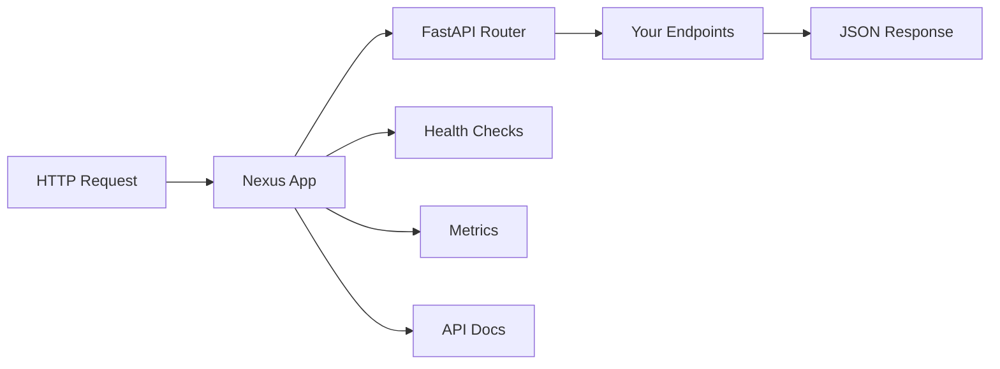

# Quick Start Guide

Build your first Nexus application in 5 minutes.

## 🎯 What You'll Build

A complete web application with:
- REST API with automatic documentation
- Health checks and monitoring
- Plugin system ready for extension

## 📋 Prerequisites

- [Nexus installed](installation.md)
- Python 3.11+ with virtual environment
- 5 minutes of your time

## 🚀 Step 1: Create Your First App

Create a new directory and basic application:

```bash
mkdir my-nexus-app
cd my-nexus-app
```

Create `main.py`:

```python
from nexus import create_nexus_app

# Create your Nexus application
app = create_nexus_app(
    title="My First Nexus App",
    description="Built with the Nexus framework",
    version="1.0.0"
)

if __name__ == "__main__":
    import uvicorn
    uvicorn.run(app, host="0.0.0.0", port=8000)
```

## 🏃 Step 2: Run Your Application

Start the application:

```bash
python main.py
```

You should see output like:
```
INFO:     Started server process [12345]
INFO:     Waiting for application startup.
INFO:     Application startup complete.
INFO:     Uvicorn running on http://0.0.0.0:8000 (Press CTRL+C to quit)
```

## 🌐 Step 3: Test Your Application

Open your browser and visit these URLs:

### Main Application
```
http://localhost:8000
```
Should return basic application info.

### API Documentation
```
http://localhost:8000/docs
```
Interactive Swagger UI with your API documentation.

### Health Check
```
http://localhost:8000/health
```
Returns application health status:
```json
{
  "status": "healthy",
  "timestamp": "2024-01-01T12:00:00Z",
  "version": "1.0.0"
}
```

## 🔧 Step 4: Add Configuration

Create `nexus_config.yaml`:

```yaml
app:
  name: "My First Nexus App"
  description: "A sample application"
  host: "0.0.0.0"
  port: 8000
  debug: true

monitoring:
  metrics_enabled: true
  health_check_interval: 30

logging:
  level: "INFO"
  format: "%(asctime)s - %(name)s - %(levelname)s - %(message)s"
```

Update `main.py` to use configuration:

```python
from nexus import create_nexus_app, load_config

# Load configuration
config = load_config("nexus_config.yaml")

# Create application with config
app = create_nexus_app(
    title=config.app.name,
    description=config.app.description,
    version="1.0.0",
    config=config
)

if __name__ == "__main__":
    import uvicorn
    uvicorn.run(
        app, 
        host=config.app.host, 
        port=config.app.port,
        reload=config.app.debug
    )
```

## ⚡ Step 5: Add a Simple API Endpoint

Create a simple custom endpoint by modifying `main.py`:

```python
from nexus import create_nexus_app, load_config
from fastapi import APIRouter

# Load configuration
config = load_config("nexus_config.yaml")

# Create application
app = create_nexus_app(
    title=config.app.name,
    description=config.app.description,
    version="1.0.0",
    config=config
)

# Add custom routes
router = APIRouter()

@router.get("/hello")
async def hello_world():
    return {"message": "Hello from Nexus!"}

@router.get("/info")
async def app_info():
    return {
        "app": config.app.name,
        "version": "1.0.0",
        "framework": "Nexus"
    }

# Include the router
app.include_router(router, tags=["custom"])

if __name__ == "__main__":
    import uvicorn
    uvicorn.run(
        app, 
        host=config.app.host, 
        port=config.app.port,
        reload=config.app.debug
    )
```

Restart your application and test the new endpoints:
- `http://localhost:8000/hello`
- `http://localhost:8000/info`

## 📁 Project Structure

Your project should now look like this:

```
my-nexus-app/
├── main.py              # Application entry point
├── nexus_config.yaml    # Configuration file
└── plugins/             # Future plugins directory
```

## 🎯 What You've Accomplished

✅ **Created a Nexus application** with automatic API documentation  
✅ **Added configuration** for flexible deployment  
✅ **Built custom API endpoints** with FastAPI integration  
✅ **Set up health monitoring** with built-in endpoints  
✅ **Prepared for plugins** with the Nexus architecture  

## 🔄 Application Flow



## 🚀 Next Steps

Now that you have a working Nexus application:

1. **[Create Your First Plugin](first-plugin.md)** - Add modular functionality
2. **[Configure Your App](configuration.md)** - Advanced configuration options
3. **[Plugin Development](../plugins/basics.md)** - Build powerful plugins
4. **[Deployment](../deployment/docker.md)** - Deploy to production

## 🎁 Quick Wins

### Use the CLI
```bash
# Check application status
nexus status

# Validate configuration
nexus validate

# Run with CLI
nexus run --host 0.0.0.0 --port 8000
```

### Add Environment Variables
```bash
# Set environment variables
export NEXUS_DEBUG=true
export NEXUS_LOG_LEVEL=DEBUG

# Run application
python main.py
```

### Test with curl
```bash
# Test health endpoint
curl http://localhost:8000/health

# Test custom endpoint
curl http://localhost:8000/hello
```

## 🆘 Troubleshooting

### Port Already in Use
```bash
# Change port in config or command line
nexus run --port 8001
```

### Import Errors
```bash
# Ensure virtual environment is activated
source venv/bin/activate  # Linux/Mac
venv\Scripts\activate     # Windows
```

### Configuration Not Found
```bash
# Ensure config file exists and is valid YAML
nexus validate
```

---

**🎉 Congratulations!** You've built your first Nexus application. Ready for [your first plugin](first-plugin.md)?