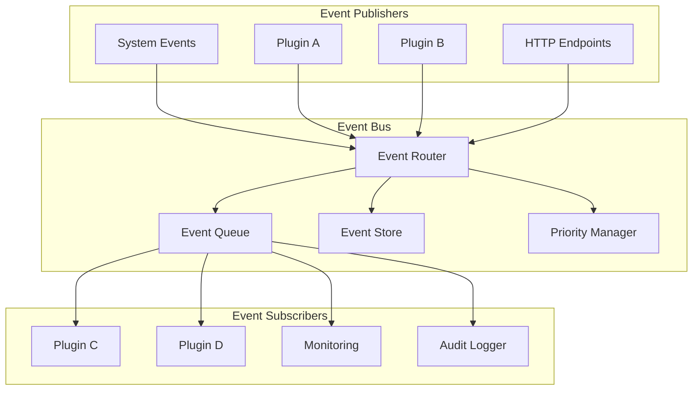

# Plugin Event Handling

Learn how to use events in your Nexus plugins for decoupled, scalable communication.

## 🎯 Overview

Events are the backbone of plugin communication in Nexus. They enable loose coupling between components, allowing plugins to react to system changes and communicate with each other without direct dependencies. This guide covers everything you need to know about handling events in your plugins.

## 🏗️ Event Architecture



## 📡 Event Basics

### Event Structure

Every event in Nexus follows a consistent structure:

```python
from dataclasses import dataclass
from datetime import datetime
from typing import Any, Dict, Optional
import uuid

@dataclass
class Event:
    """Base event structure."""

    event_type: str
    event_id: str = None
    timestamp: datetime = None
    source: Optional[str] = None
    correlation_id: Optional[str] = None
    data: Dict[str, Any] = None
    metadata: Dict[str, Any] = None

    def __post_init__(self):
        if self.event_id is None:
            self.event_id = str(uuid.uuid4())
        if self.timestamp is None:
            self.timestamp = datetime.utcnow()
        if self.data is None:
            self.data = {}
        if self.metadata is None:
            self.metadata = {}
```

### Common Event Types

```python
# System events
SYSTEM_STARTED = "system.started"
SYSTEM_SHUTDOWN = "system.shutdown"
PLUGIN_LOADED = "plugin.loaded"
PLUGIN_UNLOADED = "plugin.unloaded"

# User events
USER_CREATED = "user.created"
USER_UPDATED = "user.updated"
USER_DELETED = "user.deleted"
USER_LOGIN = "user.login"
USER_LOGOUT = "user.logout"

# Data events
DATA_CREATED = "data.created"
DATA_UPDATED = "data.updated"
DATA_DELETED = "data.deleted"

# Plugin-specific events
TASK_COMPLETED = "task.completed"
NOTIFICATION_SENT = "notification.sent"
ERROR_OCCURRED = "error.occurred"
```

## 🎭 Event Handlers

### Basic Event Handler

```python
from nexus.events import event_handler
from nexus.plugin import Plugin

class MyPlugin(Plugin):
    """Plugin with event handlers."""

    @event_handler("user.created")
    async def on_user_created(self, event):
        """Handle user creation events."""
        user_id = event.data.get("user_id")
        username = event.data.get("username")

        self.logger.info(f"New user created: {username} (ID: {user_id})")

        # Process the new user
        await self.process_new_user(user_id, username)

    @event_handler("user.updated")
    async def on_user_updated(self, event):
        """Handle user update events."""
        user_id = event.data.get("user_id")
        changes = event.data.get("changes", {})

        self.logger.info(f"User {user_id} updated: {changes}")

        # Update related data
        await self.update_user_cache(user_id, changes)

    async def process_new_user(self, user_id: str, username: str):
        """Process new user registration."""
        # Create user profile
        await self.create_user_profile(user_id)

        # Send welcome email
        await self.send_welcome_email(user_id)

        # Add to analytics
        await self.track_user_registration(user_id, username)
```

### Event Handler with Filters

```python
from nexus.events import event_handler, EventFilter

class UserManagementPlugin(Plugin):
    """Plugin with filtered event handlers."""

    @event_handler("user.updated")
    @EventFilter(lambda event: event.data.get("field") == "email")
    async def on_user_email_changed(self, event):
        """Handle email change events specifically."""
        user_id = event.data.get("user_id")
        old_email = event.data.get("old_value")
        new_email = event.data.get("new_value")

        # Verify new email
        await self.send_email_verification(user_id, new_email)

        # Update email subscriptions
        await self.update_email_subscriptions(old_email, new_email)

    @event_handler("user.login")
    @EventFilter(lambda event: event.data.get("failed", False))
    async def on_failed_login(self, event):
        """Handle failed login attempts."""
        username = event.data.get("username")
        ip_address = event.data.get("ip_address")

        # Track failed login attempts
        await self.track_failed_login(username, ip_address)

        # Check for brute force attacks
        await self.check_brute_force_attack(ip_address)

    @event_handler("data.*")  # Wildcard pattern
    async def on_any_data_event(self, event):
        """Handle any data-related event."""
        if event.event_type.startswith("data."):
            await self.log_data_activity(event)
```

### Priority Event Handlers

```python
class PriorityHandlerPlugin(Plugin):
    """Plugin demonstrating event handler priorities."""

    @event_handler("user.created", priority=100)  # Highest priority
    async def validate_user_creation(self, event):
        """Validate user creation (runs first)."""
        user_data = event.data

        # Perform validation
        if not self.is_valid_user_data(user_data):
            # Cancel event processing
            event.cancel = True
            self.logger.error("Invalid user data, cancelling creation")
            return

        self.logger.info("User data validation passed")

    @event_handler("user.created", priority=50)  # Medium priority
    async def setup_user_resources(self, event):
        """Set up user resources (runs after validation)."""
        if event.cancelled:
            return

        user_id = event.data.get("user_id")

        # Create user directory
        await self.create_user_directory(user_id)

        # Initialize user settings
        await self.initialize_user_settings(user_id)

    @event_handler("user.created", priority=10)  # Low priority
    async def send_notifications(self, event):
        """Send notifications (runs last)."""
        if event.cancelled:
            return

        user_id = event.data.get("user_id")

        # Send admin notification
        await self.notify_admin_new_user(user_id)

        # Send welcome notification to user
        await self.send_welcome_notification(user_id)
```

## 🚀 Emitting Events

### Basic Event Emission

```python
from nexus.events import emit_event

class UserServicePlugin(Plugin):
    """Plugin that emits user-related events."""

    async def create_user(self, user_data):
        """Create user and emit creation event."""
        # Create user in database
        user = await self.database.create_user(user_data)

        # Emit user creation event
        await emit_event({
            "event_type": "user.created",
            "source": self.name,
            "data": {
                "user_id": user.id,
                "username": user.username,
                "email": user.email,
                "created_at": user.created_at.isoformat()
            }
        })

        return user

    async def update_user(self, user_id, updates):
        """Update user and emit update event."""
        # Get current user data
        old_user = await self.database.get_user(user_id)
        if not old_user:
            raise ValueError("User not found")

        # Update user
        updated_user = await self.database.update_user(user_id, updates)

        # Emit update event with changes
        changes = {}
        for field, new_value in updates.items():
            old_value = getattr(old_user, field)
            if old_value != new_value:
                changes[field] = {
                    "old_value": old_value,
                    "new_value": new_value
                }

        if changes:
            await emit_event({
                "event_type": "user.updated",
                "source": self.name,
                "data": {
                    "user_id": user_id,
                    "changes": changes
                }
            })

        return updated_user

    async def delete_user(self, user_id):
        """Delete user and emit deletion event."""
        # Get user data before deletion
        user = await self.database.get_user(user_id)
        if not user:
            return False

        # Delete user
        success = await self.database.delete_user(user_id)

        if success:
            # Emit deletion event
            await emit_event({
                "event_type": "user.deleted",
                "source": self.name,
                "data": {
                    "user_id": user_id,
                    "username": user.username,
                    "deleted_at": datetime.utcnow().isoformat()
                }
            })

        return success
```

### Event Correlation

```python
class WorkflowPlugin(Plugin):
    """Plugin demonstrating event correlation."""

    async def start_user_onboarding(self, user_id):
        """Start user onboarding workflow."""
        correlation_id = str(uuid.uuid4())

        # Emit workflow started event
        await emit_event({
            "event_type": "workflow.started",
            "source": self.name,
            "correlation_id": correlation_id,
            "data": {
                "workflow_type": "user_onboarding",
                "user_id": user_id,
                "steps": ["profile_setup", "email_verification", "tutorial"]
            }
        })

        # Start first step
        await self.start_profile_setup(user_id, correlation_id)

    async def start_profile_setup(self, user_id, correlation_id):
        """Start profile setup step."""
        await emit_event({
            "event_type": "workflow.step.started",
            "source": self.name,
            "correlation_id": correlation_id,
            "data": {
                "step": "profile_setup",
                "user_id": user_id
            }
        })

    @event_handler("user.profile.completed")
    async def on_profile_completed(self, event):
        """Handle profile completion."""
        user_id = event.data.get("user_id")
        correlation_id = event.correlation_id

        if correlation_id:
            # Emit step completion
            await emit_event({
                "event_type": "workflow.step.completed",
                "source": self.name,
                "correlation_id": correlation_id,
                "data": {
                    "step": "profile_setup",
                    "user_id": user_id
                }
            })

            # Start next step
            await self.start_email_verification(user_id, correlation_id)
```

### Batch Event Emission

```python
class AnalyticsPlugin(Plugin):
    """Plugin demonstrating batch event emission."""

    def __init__(self, config):
        super().__init__(config)
        self.pending_events = []
        self.batch_size = config.get("batch_size", 50)
        self.flush_interval = config.get("flush_interval", 30)  # seconds

    async def initialize(self):
        """Initialize plugin with periodic batch flushing."""
        await super().initialize()

        # Start periodic flush task
        self.flush_task = asyncio.create_task(self.periodic_flush())

    async def cleanup(self):
        """Clean up plugin resources."""
        # Cancel flush task and flush remaining events
        if hasattr(self, 'flush_task'):
            self.flush_task.cancel()
            await self.flush_pending_events()

        await super().cleanup()

    async def track_event(self, event_type, data):
        """Track analytics event."""
        event = {
            "event_type": f"analytics.{event_type}",
            "source": self.name,
            "timestamp": datetime.utcnow().isoformat(),
            "data": data
        }

        self.pending_events.append(event)

        # Flush if batch is full
        if len(self.pending_events) >= self.batch_size:
            await self.flush_pending_events()

    async def flush_pending_events(self):
        """Flush pending events as a batch."""
        if not self.pending_events:
            return

        events_to_flush = self.pending_events.copy()
        self.pending_events.clear()

        # Emit batch event
        await emit_event({
            "event_type": "analytics.batch",
            "source": self.name,
            "data": {
                "events": events_to_flush,
                "count": len(events_to_flush)
            }
        })

    async def periodic_flush(self):
        """Periodically flush pending events."""
        while True:
            try:
                await asyncio.sleep(self.flush_interval)
                await self.flush_pending_events()
            except asyncio.CancelledError:
                break
            except Exception as e:
                self.logger.error(f"Error in periodic flush: {e}")
```

## 🔄 Event Patterns

### Request-Response Pattern

```python
class RequestResponsePlugin(Plugin):
    """Plugin demonstrating request-response event pattern."""

    async def request_user_data(self, user_id):
        """Request user data from another plugin."""
        request_id = str(uuid.uuid4())

        # Emit data request event
        await emit_event({
            "event_type": "data.request",
            "source": self.name,
            "data": {
                "request_id": request_id,
                "resource_type": "user",
                "resource_id": user_id,
                "fields": ["profile", "preferences", "settings"]
            }
        })

        # Wait for response
        try:
            response = await self.wait_for_response(request_id, timeout=10.0)
            return response.data.get("user_data")
        except asyncio.TimeoutError:
            self.logger.warning(f"Timeout waiting for user data: {user_id}")
            return None

    @event_handler("data.request")
    async def handle_data_request(self, event):
        """Handle data request from other plugins."""
        request_id = event.data.get("request_id")
        resource_type = event.data.get("resource_type")
        resource_id = event.data.get("resource_id")

        if resource_type == "user" and self.can_provide_user_data():
            # Get user data
            user_data = await self.get_user_data(resource_id)

            # Send response
            await emit_event({
                "event_type": "data.response",
                "source": self.name,
                "data": {
                    "request_id": request_id,
                    "user_data": user_data,
                    "status": "success"
                }
            })

    async def wait_for_response(self, request_id, timeout=30.0):
        """Wait for a response to a request."""
        response_event = None
        response_received = asyncio.Event()

        async def response_handler(event):
            nonlocal response_event
            if event.data.get("request_id") == request_id:
                response_event = event
                response_received.set()

        # Subscribe to response events
        subscription_id = await self.event_bus.subscribe(
            "data.response",
            response_handler
        )

        try:
            # Wait for response
            await asyncio.wait_for(response_received.wait(), timeout=timeout)
            return response_event
        finally:
            # Unsubscribe
            await self.event_bus.unsubscribe(subscription_id)
```

### Saga Pattern

```python
class SagaPlugin(Plugin):
    """Plugin implementing saga pattern for distributed transactions."""

    def __init__(self, config):
        super().__init__(config)
        self.active_sagas = {}

    @event_handler("order.created")
    async def start_order_saga(self, event):
        """Start order processing saga."""
        order_id = event.data.get("order_id")
        correlation_id = str(uuid.uuid4())

        # Initialize saga state
        saga_state = {
            "saga_id": correlation_id,
            "order_id": order_id,
            "current_step": "payment",
            "completed_steps": [],
            "compensation_steps": []
        }
        self.active_sagas[correlation_id] = saga_state

        # Start payment step
        await emit_event({
            "event_type": "payment.request",
            "source": self.name,
            "correlation_id": correlation_id,
            "data": {
                "order_id": order_id,
                "amount": event.data.get("amount")
            }
        })

    @event_handler("payment.completed")
    async def handle_payment_completed(self, event):
        """Handle payment completion."""
        correlation_id = event.correlation_id
        saga_state = self.active_sagas.get(correlation_id)

        if not saga_state:
            return

        # Update saga state
        saga_state["completed_steps"].append("payment")
        saga_state["current_step"] = "inventory"

        # Start inventory reservation
        await emit_event({
            "event_type": "inventory.reserve",
            "source": self.name,
            "correlation_id": correlation_id,
            "data": {
                "order_id": saga_state["order_id"],
                "items": event.data.get("items", [])
            }
        })

    @event_handler("payment.failed")
    async def handle_payment_failed(self, event):
        """Handle payment failure."""
        correlation_id = event.correlation_id
        saga_state = self.active_sagas.get(correlation_id)

        if not saga_state:
            return

        # Cancel order
        await emit_event({
            "event_type": "order.cancelled",
            "source": self.name,
            "correlation_id": correlation_id,
            "data": {
                "order_id": saga_state["order_id"],
                "reason": "payment_failed"
            }
        })

        # Clean up saga
        del self.active_sagas[correlation_id]

    @event_handler("inventory.failed")
    async def handle_inventory_failed(self, event):
        """Handle inventory reservation failure - trigger compensation."""
        correlation_id = event.correlation_id
        saga_state = self.active_sagas.get(correlation_id)

        if not saga_state:
            return

        # Start compensation - refund payment
        await emit_event({
            "event_type": "payment.refund",
            "source": self.name,
            "correlation_id": correlation_id,
            "data": {
                "order_id": saga_state["order_id"],
                "reason": "inventory_unavailable"
            }
        })
```

### Event Aggregation

```python
class EventAggregatorPlugin(Plugin):
    """Plugin that aggregates related events."""

    def __init__(self, config):
        super().__init__(config)
        self.event_buffer = {}
        self.aggregation_window = config.get("aggregation_window", 5.0)  # seconds

    @event_handler("user.activity.*")
    async def aggregate_user_activity(self, event):
        """Aggregate user activity events."""
        user_id = event.data.get("user_id")
        if not user_id:
            return

        # Initialize buffer for user if not exists
        if user_id not in self.event_buffer:
            self.event_buffer[user_id] = {
                "events": [],
                "timer": None
            }

        # Add event to buffer
        self.event_buffer[user_id]["events"].append(event)

        # Cancel existing timer
        if self.event_buffer[user_id]["timer"]:
            self.event_buffer[user_id]["timer"].cancel()

        # Set new timer
        self.event_buffer[user_id]["timer"] = asyncio.create_task(
            self.flush_user_activities(user_id)
        )

    async def flush_user_activities(self, user_id):
        """Flush aggregated user activities."""
        await asyncio.sleep(self.aggregation_window)

        if user_id not in self.event_buffer:
            return

        events = self.event_buffer[user_id]["events"]
        if not events:
            return

        # Aggregate events
        activity_summary = self.create_activity_summary(events)

        # Emit aggregated event
        await emit_event({
            "event_type": "user.activity.summary",
            "source": self.name,
            "data": {
                "user_id": user_id,
                "time_window": self.aggregation_window,
                "event_count": len(events),
                "summary": activity_summary
            }
        })

        # Clean up buffer
        del self.event_buffer[user_id]

    def create_activity_summary(self, events):
        """Create summary from activity events."""
        summary = {
            "actions": {},
            "pages_visited": set(),
            "total_time": 0,
            "first_activity": None,
            "last_activity": None
        }

        for event in events:
            # Count actions
            action = event.data.get("action")
            if action:
                summary["actions"][action] = summary["actions"].get(action, 0) + 1

            # Track pages
            page = event.data.get("page")
            if page:
                summary["pages_visited"].add(page)

            # Track time
            duration = event.data.get("duration", 0)
            summary["total_time"] += duration

            # Track first/last activity
            if not summary["first_activity"] or event.timestamp < summary["first_activity"]:
                summary["first_activity"] = event.timestamp
            if not summary["last_activity"] or event.timestamp > summary["last_activity"]:
                summary["last_activity"] = event.timestamp

        # Convert set to list for JSON serialization
        summary["pages_visited"] = list(summary["pages_visited"])

        return summary
```

## 🔒 Event Security

### Event Validation

```python
from nexus.security import validate_event_source, check_event_permissions

class SecureEventPlugin(Plugin):
    """Plugin with secure event handling."""

    @event_handler("sensitive.data.updated")
    async def handle_sensitive_data(self, event):
        """Handle sensitive data with security checks."""

        # Validate event source
        if not validate_event_source(event.source, "trusted_plugins"):
            self.logger.warning(f"Untrusted event source: {event.source}")
            return

        # Check permissions
        if not check_event_permissions(event, "sensitive_data:read"):
            self.logger.warning(f"Insufficient permissions for event: {event.event_type}")
            return

        # Validate event data
        if not self.validate_event_data(event):
            self.logger.error(f"Invalid event data: {event.event_id}")
            return

        # Process event
        await self.process_sensitive_data(event)

    def validate_event_data(self, event):
        """Validate event data structure and content."""
        required_fields = ["user_id", "data_type", "action"]

        for field in required_fields:
            if field not in event.data:
                return False

        # Validate user_id format
        user_id = event.data["user_id"]
        if not isinstance(user_id, str) or len(user_id) < 3:
            return False

        # Validate data_type
        allowed_types = ["profile", "settings", "preferences"]
        if event.data["data_type"] not in allowed_types:
            return False

        return True

    async def emit_secure_event(self, event_type, data, security_level="normal"):
        """Emit event with security metadata."""
        await emit_event({
            "event_type": event_type,
            "source": self.name,
            "data": data,
            "metadata": {
                "security_level": security_level,
                "plugin_version": self.version,
                "authentication_required": security_level == "high"
            }
        })
```

### Event Encryption

```python
from nexus.crypto import encrypt_data, decrypt_data

class EncryptedEventPlugin(Plugin):
    """Plugin handling encrypted events."""

    def __init__(self, config):
        super().__init__(config)
        self.encryption_key = config.get("encryption_key")

    async def emit_encrypted_event(self, event_type, sensitive_data):
        """Emit event with encrypted sensitive data."""
        # Encrypt sensitive data
        encrypted_data = encrypt_data(sensitive_data, self.encryption_key)

        await emit_event({
            "event_type": event_type,
            "source": self.name,
            "data": {
                "encrypted_payload": encrypted_data,
                "encryption_method": "AES-256-GCM"
            },
            "metadata": {
                "encrypted": True,
                "requires_decryption": True
            }
        })

    @event_handler("*.encrypted")
    async def handle_encrypted_event(self, event):
        """Handle encrypted events."""
        if not event.metadata.get("encrypted"):
            return

        try:
            # Decrypt data
            encrypted_payload = event.data.get("encrypted_payload")
            decrypted_data = decrypt_data(encrypted_payload, self.encryption_key)

            # Process decrypted data
            await self.process_decrypted_data(decrypted_data)

        except Exception as e:
            self.logger.error(f"Failed to decrypt event {event.event_id}: {e}")
```

## 🧪 Testing Events

### Event Testing

```python
# tests/test_events.py
import pytest
from unittest.mock import AsyncMock
from nexus.testing import TestEventBus
from my_plugin.plugin import MyPlugin

class TestEventHandling:
    """Test event handling in plugins."""

    @pytest.fixture
    async def test_event_bus(self):
        """Create test event bus."""
        event_bus = TestEventBus()
        await event_bus.setup()
        yield event_bus
        await event_bus.cleanup()

    @pytest.fixture
    async def plugin(self, test_event_bus):
        """Create plugin instance."""
        config = {"enabled": True}
        plugin = MyPlugin(config)
        plugin.event_bus = test_event_bus
        await plugin.initialize()
        yield plugin
        await plugin.cleanup()

    async def test_event_handler_called(self, plugin, test_event_bus):
        """Test that event handler is called."""
        # Mock the handler method
        plugin.on_user_created = AsyncMock()

        # Emit event
        await test_event_bus.emit({
            "event_type": "user.created",
            "data": {"user_id": "123", "username": "testuser"}
        })

        # Wait for event processing
        await test_event_bus.process_events()

        # Verify handler was called
        plugin.on_user_created.assert_called_once()

        # Check event data
        call_args = plugin.on_user_created.call_args[0][0]
        assert call_args.data["user_id"] == "123"

    async def test_event_emission(self, plugin, test_event_bus):
        """Test event emission from plugin."""
        # Subscribe to events
        received_events = []

        async def event_collector(event):
            received_events.append(event)

        await test_event_bus.subscribe("user.updated", event_collector)

        # Trigger event emission
        await plugin.update_user("123", {"name": "Updated Name"})

        # Process events
        await test_event_bus.process_events()

        # Verify event was emitted
        assert len(received_events) == 1
        assert received_events[0].data["user_id"] == "123"

    async def test_event_handler_error(self, plugin, test_event_bus):
        """Test event handler error handling."""
        # Make handler raise an exception
        plugin.on_user_created = AsyncMock(side_effect=Exception("Test error"))

        # Emit event
        await test_event_bus.emit({
            "event_type": "user.created",
            "data": {"user_id": "123"}
        })

        # Process events (should not raise exception)
        await test_event_bus.process_events()

        # Verify error was logged
        assert test_event_bus.get_error_count() == 1

    async def test_event_priority(self, plugin, test_event_bus):
        """Test event handler priority."""
        execution_order = []

        # High priority handler
        async def high_priority_handler(event):
            execution_order.append("high")

        # Low priority handler
        async def low_priority_handler(event):
            execution_order.append("low")

        # Subscribe with different priorities
        await test_event_bus.subscribe("test.priority", low_priority_handler, priority=1)
        await test_event_bus.subscribe("test.priority", high_priority_handler, priority=10)

        # Emit event
        await test_event_bus.emit({
            "event_type": "test.priority",
            "data": {}
        })

        await test_event_bus.process_events()

        # Verify execution order
        assert execution_order == ["high", "low"]
```

## 🎯 Best Practices

### 1. Event Design

```python
# Good: Clear, descriptive event types
"user.profile.updated"
"order.payment.completed"
"notification.email.sent"

# Bad: Vague event types
"user.changed"
"something.happened"
"data.event"
```

### 2. Event Data Structure

```python
# Good: Consistent, well-structured data
{
    "event_type": "user.created",
    "data": {
        "user_id": "123",
        "username": "john_doe",
        "email": "john@example.com",
        "metadata": {
            "registration_source": "web",
            "user_agent": "Mozilla/5.0..."
        }
    }
}

# Bad: Inconsistent, unclear data
{
    "event_type": "user_thing",
    "data": {
        "id": 123,
        "stuff": ["thing1", "thing2"],
        "other": {"random": "data"}
    }
}
```

### 3. Error Handling
