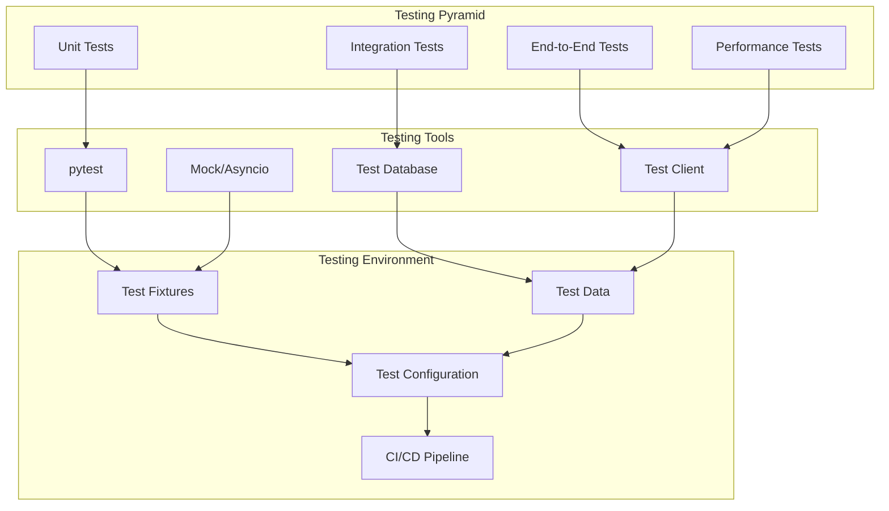

# Plugin Testing

Comprehensive testing strategies for Nexus plugins to ensure reliability and maintainability.

## 🎯 Overview

Testing is crucial for building robust, reliable plugins. This guide covers all aspects of plugin testing, from unit tests to integration tests, performance testing, and best practices for maintaining high-quality plugin code.

## 🏗️ Testing Architecture



## 🧪 Test Setup

### Test Structure

```
my_plugin/
├── tests/
│   ├── __init__.py
│   ├── conftest.py              # Test configuration and fixtures
│   ├── unit/
│   │   ├── __init__.py
│   │   ├── test_models.py       # Model tests
│   │   ├── test_services.py     # Service tests
│   │   └── test_utils.py        # Utility tests
│   ├── integration/
│   │   ├── __init__.py
│   │   ├── test_database.py     # Database integration
│   │   ├── test_events.py       # Event system integration
│   │   └── test_api.py          # API endpoint tests
│   ├── e2e/
│   │   ├── __init__.py
│   │   └── test_workflows.py    # End-to-end workflows
│   ├── performance/
│   │   ├── __init__.py
│   │   └── test_load.py         # Performance tests
│   └── fixtures/
│       ├── sample_data.json     # Test data
│       └── test_config.yaml     # Test configuration
```

### Test Configuration

```python
# tests/conftest.py
import pytest
import asyncio
from unittest.mock import AsyncMock, Mock
from nexus.testing import TestApplication, TestDatabase, TestEventBus
from nexus.database import DatabaseAdapter
from nexus.events import EventBus
from my_plugin.plugin import MyPlugin
from my_plugin.services.user_service import UserService

@pytest.fixture(scope="session")
def event_loop():
    """Create event loop for async tests."""
    loop = asyncio.new_event_loop()
    yield loop
    loop.close()

@pytest.fixture
async def test_app():
    """Create test application."""
    app = TestApplication()
    await app.setup()
    yield app
    await app.cleanup()

@pytest.fixture
async def test_db():
    """Create test database."""
    db = TestDatabase()
    await db.setup()

    # Create plugin tables
    await db.execute("""
        CREATE TABLE my_plugin_users (
            id SERIAL PRIMARY KEY,
            username VARCHAR(50) UNIQUE NOT NULL,
            email VARCHAR(100) UNIQUE NOT NULL,
            full_name VARCHAR(100),
            is_active BOOLEAN DEFAULT true,
            tags JSON DEFAULT '[]',
            created_at TIMESTAMP DEFAULT CURRENT_TIMESTAMP,
            updated_at TIMESTAMP DEFAULT CURRENT_TIMESTAMP
        )
    """)

    yield db
    await db.cleanup()

@pytest.fixture
async def test_event_bus():
    """Create test event bus."""
    event_bus = TestEventBus()
    await event_bus.setup()
    yield event_bus
    await event_bus.cleanup()

@pytest.fixture
async def plugin_instance(test_db, test_event_bus):
    """Create plugin instance for testing."""
    config = {
        "enabled": True,
        "api_key": "test_key",
        "max_retries": 3
    }

    plugin = MyPlugin(config)
    plugin.db = test_db
    plugin.event_bus = test_event_bus

    await plugin.initialize()
    yield plugin
    await plugin.cleanup()

@pytest.fixture
async def user_service(test_db):
    """Create user service for testing."""
    service = UserService(test_db)
    await service.initialize()
    yield service
    await service.cleanup()

@pytest.fixture
def sample_user_data():
    """Sample user data for testing."""
    return {
        "username": "testuser",
        "email": "test@example.com",
        "full_name": "Test User",
        "tags": ["developer", "python"]
    }

@pytest.fixture
async def test_user(user_service, sample_user_data):
    """Create test user."""
    user = await user_service.create_user(**sample_user_data)
    yield user
    # Cleanup is handled by database cleanup
```

## 🔬 Unit Tests

### Model Testing

```python
# tests/unit/test_models.py
import pytest
from datetime import datetime
from my_plugin.models.user import User

class TestUserModel:
    """Test cases for User model."""

    def test_user_creation(self):
        """Test basic user creation."""
        user = User(
            username="testuser",
            email="test@example.com",
            full_name="Test User"
        )

        assert user.username == "testuser"
        assert user.email == "test@example.com"
        assert user.full_name == "Test User"
        assert user.is_active is True
        assert user.tags == []

    def test_user_from_dict(self):
        """Test creating user from dictionary."""
        data = {
            "id": 1,
            "username": "testuser",
            "email": "test@example.com",
            "full_name": "Test User",
            "is_active": True,
            "tags": ["developer"],
            "created_at": datetime.utcnow(),
            "updated_at": datetime.utcnow()
        }

        user = User.from_dict(data)

        assert user.id == 1
        assert user.username == "testuser"
        assert user.tags == ["developer"]

    def test_user_to_dict(self):
        """Test converting user to dictionary."""
        user = User(
            id=1,
            username="testuser",
            email="test@example.com",
            tags=["python", "developer"]
        )

        data = user.to_dict()

        assert data["id"] == 1
        assert data["username"] == "testuser"
        assert data["tags"] == ["python", "developer"]

    def test_user_validation(self):
        """Test user validation."""
        # Test empty username
        with pytest.raises(ValueError):
            User(username="", email="test@example.com")

        # Test invalid email format
        with pytest.raises(ValueError):
            User(username="testuser", email="invalid-email")

    def test_user_tags_default(self):
        """Test default tags behavior."""
        user = User(username="testuser", email="test@example.com")
        assert user.tags == []

        # Test tags are properly initialized
        user.tags.append("developer")
        assert user.tags == ["developer"]
```

### Service Testing

```python
# tests/unit/test_services.py
import pytest
from unittest.mock import AsyncMock, Mock, patch
from my_plugin.services.user_service import UserService
from my_plugin.models.user import User

class TestUserService:
    """Test cases for UserService."""

    @pytest.fixture
    def mock_db(self):
        """Create mock database."""
        db = AsyncMock()
        return db

    @pytest.fixture
    def user_service(self, mock_db):
        """Create user service with mocked dependencies."""
        return UserService(mock_db)

    async def test_create_user_success(self, user_service, mock_db):
        """Test successful user creation."""
        # Mock database response
        mock_db.fetch_one.return_value = {
            "id": 1,
            "created_at": "2024-01-01T12:00:00",
            "updated_at": "2024-01-01T12:00:00"
        }

        user_data = {
            "username": "testuser",
            "email": "test@example.com",
            "full_name": "Test User"
        }

        user = await user_service.create_user(**user_data)

        # Verify user was created
        assert user.id == 1
        assert user.username == "testuser"
        assert user.email == "test@example.com"

        # Verify database was called correctly
        mock_db.fetch_one.assert_called_once()
        call_args = mock_db.fetch_one.call_args[0]
        assert "INSERT INTO my_plugin_users" in call_args[0]

    async def test_create_user_duplicate_username(self, user_service, mock_db):
        """Test user creation with duplicate username."""
        # Mock database constraint violation
        from asyncpg.exceptions import UniqueViolationError
        mock_db.fetch_one.side_effect = UniqueViolationError("username already exists")

        user_data = {
            "username": "existing_user",
            "email": "test@example.com"
        }

        with pytest.raises(ValueError, match="Username already exists"):
            await user_service.create_user(**user_data)

    async def test_get_user_by_id_found(self, user_service, mock_db):
        """Test getting user by ID when user exists."""
        mock_db.fetch_one.return_value = {
            "id": 1,
            "username": "testuser",
            "email": "test@example.com",
            "full_name": "Test User",
            "is_active": True,
            "tags": ["developer"],
            "created_at": "2024-01-01T12:00:00",
            "updated_at": "2024-01-01T12:00:00"
        }

        user = await user_service.get_user_by_id(1)

        assert user is not None
        assert user.id == 1
        assert user.username == "testuser"
        mock_db.fetch_one.assert_called_once()

    async def test_get_user_by_id_not_found(self, user_service, mock_db):
        """Test getting user by ID when user doesn't exist."""
        mock_db.fetch_one.return_value = None

        user = await user_service.get_user_by_id(999)

        assert user is None
        mock_db.fetch_one.assert_called_once()

    async def test_update_user_success(self, user_service, mock_db):
        """Test successful user update."""
        mock_db.fetch_one.return_value = {
            "id": 1,
            "username": "testuser",
            "email": "newemail@example.com",
            "full_name": "Updated Name",
            "is_active": True,
            "tags": ["developer"],
            "created_at": "2024-01-01T12:00:00",
            "updated_at": "2024-01-01T13:00:00"
        }

        updates = {
            "email": "newemail@example.com",
            "full_name": "Updated Name"
        }

        user = await user_service.update_user(1, updates)

        assert user is not None
        assert user.email == "newemail@example.com"
        assert user.full_name == "Updated Name"
        mock_db.fetch_one.assert_called_once()

    @patch('my_plugin.services.user_service.send_email')
    async def test_create_user_with_email_notification(
        self,
        mock_send_email,
        user_service,
        mock_db
    ):
        """Test user creation with email notification."""
        mock_db.fetch_one.return_value = {
            "id": 1,
            "created_at": "2024-01-01T12:00:00",
            "updated_at": "2024-01-01T12:00:00"
        }

        user_data = {
            "username": "testuser",
            "email": "test@example.com",
            "send_welcome_email": True
        }

        user = await user_service.create_user(**user_data)

        # Verify email was sent
        mock_send_email.assert_called_once_with(
            to="test@example.com",
            subject="Welcome to Nexus",
            template="welcome"
        )
```

### Utility Testing

```python
# tests/unit/test_utils.py
import pytest
from my_plugin.utils.validation import validate_email, validate_username
from my_plugin.utils.formatting import format_user_display_name

class TestValidationUtils:
    """Test validation utility functions."""

    def test_validate_email_valid(self):
        """Test email validation with valid emails."""
        valid_emails = [
            "test@example.com",
            "user.name@domain.co.uk",
            "user+tag@example.org"
        ]

        for email in valid_emails:
            assert validate_email(email) is True

    def test_validate_email_invalid(self):
        """Test email validation with invalid emails."""
        invalid_emails = [
            "invalid-email",
            "@domain.com",
            "user@",
            "",
            None
        ]

        for email in invalid_emails:
            assert validate_email(email) is False

    def test_validate_username_valid(self):
        """Test username validation with valid usernames."""
        valid_usernames = [
            "user123",
            "test_user",
            "user-name",
            "a" * 50  # Max length
        ]

        for username in valid_usernames:
            assert validate_username(username) is True

    def test_validate_username_invalid(self):
        """Test username validation with invalid usernames."""
        invalid_usernames = [
            "",           # Empty
            "ab",         # Too short
            "a" * 51,     # Too long
            "user name",  # Space
            "user@name",  # Special character
            None
        ]

        for username in invalid_usernames:
            assert validate_username(username) is False

class TestFormattingUtils:
    """Test formatting utility functions."""

    def test_format_user_display_name_with_full_name(self):
        """Test display name formatting when full name is provided."""
        result = format_user_display_name("testuser", "Test User")
        assert result == "Test User (testuser)"

    def test_format_user_display_name_without_full_name(self):
        """Test display name formatting when full name is not provided."""
        result = format_user_display_name("testuser", None)
        assert result == "testuser"

        result = format_user_display_name("testuser", "")
        assert result == "testuser"

    def test_format_user_display_name_edge_cases(self):
        """Test display name formatting edge cases."""
        # Empty username
        result = format_user_display_name("", "Test User")
        assert result == "Test User"

        # Both empty
        result = format_user_display_name("", "")
        assert result == ""
```

## 🔗 Integration Tests

### Database Integration

```python
# tests/integration/test_database.py
import pytest
from my_plugin.models.user import User
from my_plugin.services.user_service import UserService

class TestDatabaseIntegration:
    """Test database integration."""

    async def test_user_crud_operations(self, user_service):
        """Test complete CRUD operations for users."""

        # Create user
        user_data = {
            "username": "integrationtest",
            "email": "integration@example.com",
            "full_name": "Integration Test",
            "tags": ["test", "integration"]
        }

        created_user = await user_service.create_user(**user_data)
        assert created_user.id is not None
        assert created_user.username == "integrationtest"

        # Read user
        retrieved_user = await user_service.get_user_by_id(created_user.id)
        assert retrieved_user is not None
        assert retrieved_user.username == "integrationtest"
        assert retrieved_user.tags == ["test", "integration"]

        # Update user
        updates = {
            "full_name": "Updated Integration Test",
            "tags": ["test", "integration", "updated"]
        }
        updated_user = await user_service.update_user(created_user.id, updates)
        assert updated_user.full_name == "Updated Integration Test"
        assert "updated" in updated_user.tags

        # Delete user
        deleted = await user_service.delete_user(created_user.id)
        assert deleted is True

        # Verify deletion
        deleted_user = await user_service.get_user_by_id(created_user.id)
        assert deleted_user is None

    async def test_user_constraints(self, user_service):
        """Test database constraints."""

        # Create initial user
        user1 = await user_service.create_user(
            username="constraint_test",
            email="constraint@example.com"
        )

        # Test unique username constraint
        with pytest.raises(ValueError, match="Username already exists"):
            await user_service.create_user(
                username="constraint_test",
                email="different@example.com"
            )

        # Test unique email constraint
        with pytest.raises(ValueError, match="Email already exists"):
            await user_service.create_user(
                username="different_user",
                email="constraint@example.com"
            )

    async def test_user_search_and_filtering(self, user_service):
        """Test user search and filtering functionality."""

        # Create test users
        test_users = [
            {"username": "alice", "email": "alice@example.com", "tags": ["developer", "python"]},
            {"username": "bob", "email": "bob@example.com", "tags": ["designer", "ui"]},
            {"username": "charlie", "email": "charlie@example.com", "tags": ["developer", "javascript"]},
        ]

        created_users = []
        for user_data in test_users:
            user = await user_service.create_user(**user_data)
            created_users.append(user)

        # Test search by username
        results, total = await user_service.search_users({"search": "ali"})
        assert total == 1
        assert results[0].username == "alice"

        # Test filter by tag
        results, total = await user_service.search_users({"tags": ["developer"]})
        assert total == 2
        usernames = [user.username for user in results]
        assert "alice" in usernames
        assert "charlie" in usernames

        # Test pagination
        results, total = await user_service.list_users(page=1, per_page=2)
        assert total == 3
        assert len(results) == 2

    async def test_transaction_rollback(self, user_service, test_db):
        """Test transaction rollback on error."""

        # Start transaction
        async with test_db.transaction():
            # Create user
            user = await user_service.create_user(
                username="transaction_test",
                email="transaction@example.com"
            )

            # Verify user exists in transaction
            found_user = await user_service.get_user_by_id(user.id)
            assert found_user is not None

            # Force rollback by raising exception
            raise Exception("Forced rollback")

        # Verify user was rolled back (this would be in an except block in real code)
        # Note: This test structure depends on your transaction implementation
```

### Event Integration

```python
# tests/integration/test_events.py
import pytest
import asyncio
from unittest.mock import AsyncMock
from my_plugin.plugin import MyPlugin

class TestEventIntegration:
    """Test event system integration."""

    async def test_event_emission_and_handling(self, plugin_instance, test_event_bus):
        """Test emitting and handling events."""

        # Set up event handler spy
        handler_called = asyncio.Event()
        received_events = []

        async def test_handler(event):
            received_events.append(event)
            handler_called.set()

        # Subscribe to event
        await test_event_bus.subscribe("user.created", test_handler)

        # Emit event through plugin
        await plugin_instance.emit_user_created_event({
            "user_id": "123",
            "username": "testuser",
            "email": "test@example.com"
        })

        # Wait for handler to be called
        await asyncio.wait_for(handler_called.wait(), timeout=1.0)

        # Verify event was received
        assert len(received_events) == 1
        assert received_events[0]["user_id"] == "123"
        assert received_events[0]["username"] == "testuser"

    async def test_event_handler_error_handling(self, plugin_instance, test_event_bus):
        """Test event handler error handling."""

        # Set up failing handler
        async def failing_handler(event):
            raise Exception("Handler error")

        # Set up successful handler
        success_called = asyncio.Event()
        async def success_handler(event):
            success_called.set()

        # Subscribe both handlers
        await test_event_bus.subscribe("test.event", failing_handler)
        await test_event_bus.subscribe("test.event", success_handler)

        # Emit event
        await test_event_bus.emit({
            "type": "test.event",
            "data": {"test": "data"}
        })

        # Verify successful handler still worked despite failing handler
        await asyncio.wait_for(success_called.wait(), timeout=1.0)

    async def test_event_priority_handling(self, plugin_instance, test_event_bus):
        """Test event priority handling."""

        execution_order = []

        # High priority handler
        async def high_priority_handler(event):
            execution_order.append("high")

        # Low priority handler
        async def low_priority_handler(event):
            execution_order.append("low")

        # Subscribe with different priorities
        await test_event_bus.subscribe("priority.test", low_priority_handler, priority=1)
        await test_event_bus.subscribe("priority.test", high_priority_handler, priority=10)

        # Emit event
        await test_event_bus.emit({
            "type": "priority.test",
            "data": {}
        })

        # Give time for handlers to execute
        await asyncio.sleep(0.1)

        # Verify execution order
        assert execution_order == ["high", "low"]

    async def test_cross_plugin_communication(self, plugin_instance, test_event_bus):
        """Test communication between plugins via events."""

        # Create mock second plugin
        second_plugin = AsyncMock()
        second_plugin_events = []

        async def second_plugin_handler(event):
            second_plugin_events.append(event)

        # Subscribe second plugin to first plugin's events
        await test_event_bus.subscribe("user.created", second_plugin_handler)

        # First plugin creates user and emits event
        await plugin_instance.create_user_and_emit_event({
            "username": "crosstest",
            "email": "cross@example.com"
        })

        # Give time for event processing
        await asyncio.sleep(0.1)

        # Verify second plugin received the event
        assert len(second_plugin_events) == 1
        assert second_plugin_events[0]["username"] == "crosstest"
```

### API Integration

```python
# tests/integration/test_api.py
import pytest
from nexus.testing import TestClient

class TestAPIIntegration:
    """Test API endpoint integration."""

    @pytest.fixture
    async def test_client(self, plugin_instance):
        """Create test client with plugin routes."""
        client = TestClient()
        await client.setup_with_plugin(plugin_instance)
        yield client
        await client.cleanup()

    async def test_user_api_workflow(self, test_client):
        """Test complete user API workflow."""

        # Create user
        user_data = {
            "username": "apitest",
            "email": "api@example.com",
            "full_name": "API Test User"
        }

        response = await test_client.post("/my-plugin/users", json=user_data)
        assert response.status_code == 201

        created_user = response.json()
        user_id = created_user["user_id"]
        assert created_user["username"] == "apitest"

        # Get user
        response = await test_client.get(f"/my-plugin/users/{user_id}")
        assert response.status_code == 200

        user = response.json()
        assert user["username"] == "apitest"
        assert user["email"] == "api@example.com"

        # Update user
        update_data = {"full_name": "Updated API Test User"}
        response = await test_client.put(f"/my-plugin/users/{user_id}", json=update_data)
        assert response.status_code == 200

        updated_user = response.json()
        assert updated_user["full_name"] == "Updated API Test User"

        # List users
        response = await test_client.get("/my-plugin/users")
        assert response.status_code == 200

        users_data = response.json()
        assert users_data["pagination"]["total"] >= 1

        # Delete user
        response = await test_client.delete(f"/my-plugin/users/{user_id}")
        assert response.status_code == 204

        # Verify deletion
        response = await test_client.get(f"/my-plugin/users/{user_id}")
        assert response.status_code == 404

    async def test_api_validation(self, test_client):
        """Test API input validation."""

        # Test missing required fields
        response = await test_client.post("/my-plugin/users", json={})
        assert response.status_code == 422

        # Test invalid email format
        response = await test_client.post("/my-plugin/users", json={
            "username": "testuser",
            "email": "invalid-email"
        })
        assert response.status_code == 422

        # Test username too short
        response = await test_client.post("/my-plugin/users", json={
            "username": "ab",
            "email": "test@example.com"
        })
        assert response.status_code == 422

    async def test_api_authentication(self, test_client):
        """Test API authentication requirements."""

        # Test unauthenticated access to protected endpoint
        response = await test_client.get("/my-plugin/admin/users")
        assert response.status_code == 401

        # Test with authentication
        test_client.set_auth_token("valid-test-token")
        response = await test_client.get("/my-plugin/admin/users")
        assert response.status_code == 200

    async def test_api_error_handling(self, test_client):
        """Test API error handling."""

        # Test 404 for non-existent user
        response = await test_client.get("/my-plugin/users/999999")
        assert response.status_code == 404

        error_data = response.json()
        assert "error" in error_data
        assert "User not found" in error_data["error"]["message"]

        # Test 409 for duplicate username
        user_data = {
            "username": "duplicate_test",
            "email": "duplicate1@example.com"
        }

        # Create first user
        response = await test_client.post("/my-plugin/users", json=user_data)
        assert response.status_code == 201

        # Try to create duplicate
        user_data["email"] = "duplicate2@example.com"
        response = await test_client.post("/my-plugin/users", json=user_data)
        assert response.status_code == 409
```

## 🚀 End-to-End Tests

### Workflow Testing

```python
# tests/e2e/test_workflows.py
import pytest
import asyncio
from nexus.testing import TestApplication, TestClient

class TestUserWorkflows:
    """Test complete user workflows end-to-end."""

    @pytest.fixture
    async def full_app(self):
        """Create full application with all plugins."""
        app = TestApplication()
        await app.setup_full_environment()
        yield app
        await app.cleanup()

    async def test_complete_user_lifecycle(self, full_app):
        """Test complete user lifecycle from creation to deletion."""

        client = full_app.get_client()

        # Step 1: Create user via API
        user_data = {
            "username": "lifecycle_test",
            "email": "lifecycle@example.com",
            "full_name": "Lifecycle Test User",
            "tags": ["test", "e2e"]
        }

        response = await client.post("/my-plugin/users", json=user_data)
        assert response.status_code == 201
        user = response.json()
        user_id = user["user_id"]

        # Step 2: Verify user creation event was emitted
        events = await full_app.get_emitted_events()
        user_created_events = [e for e in events if e["type"] == "user.created"]
        assert len(user_created_events) == 1
        assert user_created_events[0]["user_id"] == user_id

        # Step 3: Update user profile
        profile_data = {
            "bio": "Test user biography",
            "preferences": {"theme": "dark", "notifications": True}
        }

        response = await client.put(f"/my-plugin/users/{user_id}/profile", json=profile_data)
        assert response.status_code == 200

        # Step 4: Verify profile was created
        response = await client.get(f"/my-plugin/users/{user_id}")
        assert response.status_code == 200
        user_with_profile = response.json()
        assert user_with_profile["profile"]["bio"] == "Test user biography"

        # Step 5: Search for user
        response = await client.get("/my-plugin/users?search=lifecycle")
        assert response.status_code == 200
        search_results = response.json()
        assert search_results["pagination"]["total"] == 1
        assert search_results["users"][0]["username"] == "lifecycle_test"

        # Step 6: Filter users by tag
        response = await client.get("/my-plugin/users?tags=e2e")
        assert response.status_code == 200
        filtered_results = response.json()
        assert filtered_results["pagination"]["total"] == 1

        # Step 7: Deactivate user
        response = await client.post(f"/my-plugin/users/{user_id}/deactivate")
        assert response.status_code == 200

        # Step 8: Verify user is deactivated
        response = await client.get(f"/my-plugin/users/{user_id}")
        assert response.status_code == 200
        deactivated_user = response.json()
        assert deactivated_user["is_active"] is False

        # Step 9: Verify deactivation event
        events = await full_app.get_em
