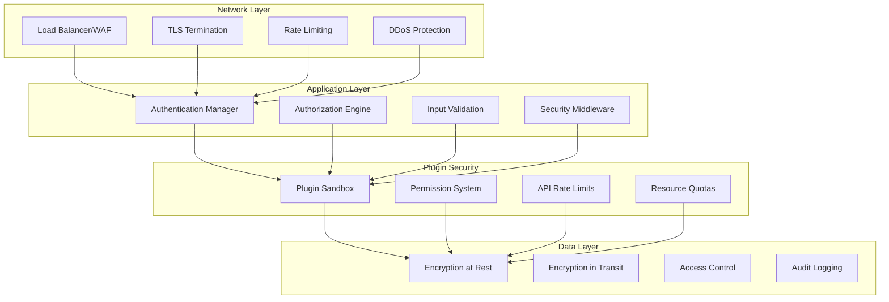

# Security Model

Comprehensive security architecture for protecting Nexus applications and their data.

## 🛡️ Overview

Security is a fundamental aspect of the Nexus platform, built into every layer of the architecture. The security model provides defense-in-depth protection through multiple layers of security controls, from network security to application-level authorization.

## 🏗️ Security Architecture



## 🔐 Authentication

The authentication system supports multiple authentication methods and providers.

### Authentication Manager

Central authentication component handling all authentication flows:

```python
from abc import ABC, abstractmethod
from typing import Dict, Optional, List
from datetime import datetime, timedelta

class AuthenticationManager:
    def __init__(self, config: Dict):
        self.config = config
        self.providers = {}
        self.token_manager = TokenManager()

    async def authenticate(self, credentials: Dict) -> Optional['User']:
        """Authenticate user with provided credentials."""
        provider_name = credentials.get('provider', 'default')
        provider = self.providers.get(provider_name)

        if not provider:
            raise AuthenticationError(f"Unknown provider: {provider_name}")

        return await provider.authenticate(credentials)

    async def create_session(self, user: 'User') -> 'Session':
        """Create authenticated session for user."""
        token = await self.token_manager.create_token(user)
        session = Session(
            user=user,
            token=token,
            expires_at=datetime.utcnow() + timedelta(hours=24)
        )
        await self.store_session(session)
        return session

    async def validate_token(self, token: str) -> Optional['User']:
        """Validate authentication token and return user."""
        payload = await self.token_manager.validate_token(token)
        if not payload:
            return None

        user_id = payload.get('user_id')
        return await self.get_user(user_id)
```

### Authentication Providers

Support for multiple authentication methods:

#### JWT Provider

```python
import jwt
from datetime import datetime, timedelta

class JWTAuthProvider:
    def __init__(self, secret_key: str, algorithm: str = "HS256"):
        self.secret_key = secret_key
        self.algorithm = algorithm

    async def create_token(self, user: 'User') -> str:
        """Create JWT token for user."""
        payload = {
            'user_id': user.id,
            'username': user.username,
            'roles': [role.name for role in user.roles],
            'exp': datetime.utcnow() + timedelta(hours=24),
            'iat': datetime.utcnow(),
            'iss': 'nexus-platform'
        }
        return jwt.encode(payload, self.secret_key, algorithm=self.algorithm)

    async def validate_token(self, token: str) -> Optional[Dict]:
        """Validate JWT token and return payload."""
        try:
            payload = jwt.decode(
                token,
                self.secret_key,
                algorithms=[self.algorithm]
            )
            return payload
        except jwt.ExpiredSignatureError:
            raise AuthenticationError("Token has expired")
        except jwt.InvalidTokenError:
            raise AuthenticationError("Invalid token")
```

#### OAuth2 Provider

```python
class OAuth2Provider:
    def __init__(self, client_id: str, client_secret: str,
                 authorization_url: str, token_url: str):
        self.client_id = client_id
        self.client_secret = client_secret
        self.authorization_url = authorization_url
        self.token_url = token_url

    async def get_authorization_url(self, state: str, redirect_uri: str) -> str:
        """Get OAuth2 authorization URL."""
        params = {
            'client_id': self.client_id,
            'redirect_uri': redirect_uri,
            'response_type': 'code',
            'state': state,
            'scope': 'openid profile email'
        }
        return f"{self.authorization_url}?{urlencode(params)}"

    async def exchange_code(self, code: str, redirect_uri: str) -> Dict:
        """Exchange authorization code for access token."""
        data = {
            'grant_type': 'authorization_code',
            'client_id': self.client_id,
            'client_secret': self.client_secret,
            'code': code,
            'redirect_uri': redirect_uri
        }

        async with aiohttp.ClientSession() as session:
            async with session.post(self.token_url, data=data) as response:
                if response.status == 200:
                    return await response.json()
                else:
                    raise AuthenticationError("Failed to exchange code for token")
```

#### API Key Provider

```python
class APIKeyProvider:
    def __init__(self, api_key_store: 'APIKeyStore'):
        self.api_key_store = api_key_store

    async def authenticate(self, credentials: Dict) -> Optional['User']:
        """Authenticate using API key."""
        api_key = credentials.get('api_key')
        if not api_key:
            return None

        key_info = await self.api_key_store.get_key_info(api_key)
        if not key_info or not key_info.is_active:
            return None

        # Update last used timestamp
        await self.api_key_store.update_last_used(api_key)

        return await self.get_user(key_info.user_id)

    async def create_api_key(self, user: 'User', name: str,
                           permissions: List[str] = None) -> str:
        """Create new API key for user."""
        api_key = self.generate_secure_key()
        key_info = APIKeyInfo(
            key=api_key,
            user_id=user.id,
            name=name,
            permissions=permissions or [],
            created_at=datetime.utcnow(),
            is_active=True
        )
        await self.api_key_store.store_key(key_info)
        return api_key
```

## 🔑 Authorization

Role-based access control (RBAC) with fine-grained permissions.

### Authorization Engine

```python
from enum import Enum
from typing import Set, List

class Permission(Enum):
    READ = "read"
    WRITE = "write"
    DELETE = "delete"
    ADMIN = "admin"
    EXECUTE = "execute"

class Role:
    def __init__(self, name: str, permissions: Set[Permission]):
        self.name = name
        self.permissions = permissions

class AuthorizationEngine:
    def __init__(self):
        self.roles = {}
        self.user_roles = {}
        self.resource_policies = {}

    async def check_permission(self, user: 'User', resource: str,
                             action: str) -> bool:
        """Check if user has permission to perform action on resource."""
        user_permissions = await self.get_user_permissions(user)
        required_permission = self.get_required_permission(resource, action)

        return required_permission in user_permissions

    async def get_user_permissions(self, user: 'User') -> Set[Permission]:
        """Get all permissions for a user."""
        permissions = set()
        user_roles = await self.get_user_roles(user.id)

        for role in user_roles:
            permissions.update(role.permissions)

        return permissions

    async def assign_role(self, user_id: str, role_name: str) -> None:
        """Assign role to user."""
        if role_name not in self.roles:
            raise AuthorizationError(f"Role {role_name} does not exist")

        if user_id not in self.user_roles:
            self.user_roles[user_id] = set()

        self.user_roles[user_id].add(role_name)

    async def create_role(self, name: str, permissions: Set[Permission]) -> Role:
        """Create new role with permissions."""
        role = Role(name, permissions)
        self.roles[name] = role
        return role
```

### Resource-Based Access Control

```python
class ResourcePolicy:
    def __init__(self, resource_pattern: str, permissions: Dict[str, Permission]):
        self.resource_pattern = resource_pattern
        self.permissions = permissions

class ResourceAuthorizationEngine:
    def __init__(self):
        self.policies = []

    async def check_access(self, user: 'User', resource: str, action: str) -> bool:
        """Check if user can perform action on specific resource."""
        # Find matching policies
        matching_policies = [
            policy for policy in self.policies
            if self.matches_pattern(policy.resource_pattern, resource)
        ]

        if not matching_policies:
            return False

        # Check if user has required permission
        user_permissions = await self.get_user_permissions(user)

        for policy in matching_policies:
            required_permission = policy.permissions.get(action)
            if required_permission and required_permission in user_permissions:
                return True

        return False

    def add_policy(self, resource_pattern: str, action_permissions: Dict[str, Permission]):
        """Add resource access policy."""
        policy = ResourcePolicy(resource_pattern, action_permissions)
        self.policies.append(policy)

    def matches_pattern(self, pattern: str, resource: str) -> bool:
        """Check if resource matches pattern."""
        import fnmatch
        return fnmatch.fnmatch(resource, pattern)
```

### Permission Decorators

Easy-to-use decorators for protecting endpoints:

```python
from functools import wraps

def require_permission(permission: Permission):
    """Decorator to require specific permission."""
    def decorator(func):
        @wraps(func)
        async def wrapper(*args, **kwargs):
            # Extract user from request context
            user = get_current_user()
            if not user:
                raise AuthenticationError("User not authenticated")

            # Check permission
            auth_engine = get_authorization_engine()
            if not await auth_engine.check_permission(user, func.__name__, permission):
                raise AuthorizationError("Insufficient permissions")

            return await func(*args, **kwargs)
        return wrapper
    return decorator

def require_role(role_name: str):
    """Decorator to require specific role."""
    def decorator(func):
        @wraps(func)
        async def wrapper(*args, **kwargs):
            user = get_current_user()
            if not user:
                raise AuthenticationError("User not authenticated")

            user_roles = await get_user_roles(user.id)
            if role_name not in [role.name for role in user_roles]:
                raise AuthorizationError(f"Role {role_name} required")

            return await func(*args, **kwargs)
        return wrapper
    return decorator

# Usage examples
@require_permission(Permission.ADMIN)
async def delete_user(user_id: str):
    """Delete user - requires admin permission."""
    pass

@require_role("moderator")
async def moderate_content(content_id: str):
    """Moderate content - requires moderator role."""
    pass
```

## 🔒 Data Security

### Encryption

#### Encryption at Rest

```python
from cryptography.fernet import Fernet
import base64

class DataEncryption:
    def __init__(self, encryption_key: str):
        self.cipher = Fernet(encryption_key.encode())

    def encrypt(self, data: str) -> str:
        """Encrypt sensitive data."""
        encrypted = self.cipher.encrypt(data.encode())
        return base64.b64encode(encrypted).decode()

    def decrypt(self, encrypted_data: str) -> str:
        """Decrypt sensitive data."""
        encrypted = base64.b64decode(encrypted_data.encode())
        decrypted = self.cipher.decrypt(encrypted)
        return decrypted.decode()

class DatabaseEncryption:
    def __init__(self, encryption: DataEncryption):
        self.encryption = encryption

    async def store_sensitive_data(self, table: str, data: Dict) -> None:
        """Store data with sensitive fields encrypted."""
        sensitive_fields = ['password', 'ssn', 'credit_card', 'api_key']

        for field in sensitive_fields:
            if field in data:
                data[field] = self.encryption.encrypt(data[field])

        await self.db.insert(table, data)

    async def retrieve_sensitive_data(self, table: str, record_id: str) -> Dict:
        """Retrieve data with sensitive fields decrypted."""
        data = await self.db.get(table, record_id)
        sensitive_fields = ['password', 'ssn', 'credit_card', 'api_key']

        for field in sensitive_fields:
            if field in data:
                data[field] = self.encryption.decrypt(data[field])

        return data
```

#### Encryption in Transit

```python
import ssl
from aiohttp import ClientSession, TCPConnector

class SecureHTTPClient:
    def __init__(self):
        # Create SSL context with strong security
        ssl_context = ssl.create_default_context()
        ssl_context.check_hostname = True
        ssl_context.verify_mode = ssl.CERT_REQUIRED
        ssl_context.minimum_version = ssl.TLSVersion.TLSv1_2

        # Disable weak ciphers
        ssl_context.set_ciphers('ECDHE+AESGCM:ECDHE+CHACHA20:DHE+AESGCM:DHE+CHACHA20:!aNULL:!MD5:!DSS')

        connector = TCPConnector(ssl=ssl_context)
        self.session = ClientSession(connector=connector)

    async def secure_request(self, method: str, url: str, **kwargs):
        """Make secure HTTP request with TLS verification."""
        async with self.session.request(method, url, **kwargs) as response:
            return await response.json()
```

### Data Masking

```python
import re

class DataMasking:
    @staticmethod
    def mask_email(email: str) -> str:
        """Mask email address for logging."""
        if '@' not in email:
            return email

        username, domain = email.split('@', 1)
        if len(username) <= 2:
            masked_username = '*' * len(username)
        else:
            masked_username = username[0] + '*' * (len(username) - 2) + username[-1]

        return f"{masked_username}@{domain}"

    @staticmethod
    def mask_credit_card(card_number: str) -> str:
        """Mask credit card number."""
        # Remove spaces and hyphens
        card_number = re.sub(r'[\s-]', '', card_number)
        if len(card_number) < 4:
            return '*' * len(card_number)

        return '*' * (len(card_number) - 4) + card_number[-4:]

    @staticmethod
    def mask_ssn(ssn: str) -> str:
        """Mask Social Security Number."""
        ssn = re.sub(r'[^\d]', '', ssn)
        if len(ssn) != 9:
            return '*' * len(ssn)

        return f"***-**-{ssn[-4:]}"
```

## 🛡️ Plugin Security

### Plugin Sandbox

Isolate plugins to prevent security breaches:

```python
import sys
import importlib.util
from types import ModuleType
import ast

class PluginSandbox:
    def __init__(self):
        self.allowed_modules = {
            'asyncio', 'json', 'datetime', 'uuid', 're', 'typing',
            'pydantic', 'nexus.core', 'nexus.events'
        }
        self.forbidden_functions = {
            'eval', 'exec', 'compile', '__import__', 'open', 'input'
        }

    def validate_plugin_code(self, code: str) -> bool:
        """Validate plugin code for security issues."""
        try:
            tree = ast.parse(code)
            validator = SecurityValidator(self.forbidden_functions)
            validator.visit(tree)
            return True
        except SecurityError as e:
            raise PluginSecurityError(f"Security violation: {e}")

    def create_plugin_environment(self) -> Dict:
        """Create restricted environment for plugin execution."""
        safe_builtins = {
            name: getattr(__builtins__, name)
            for name in ['len', 'str', 'int', 'float', 'bool', 'list', 'dict', 'tuple']
            if hasattr(__builtins__, name)
        }

        return {
            '__builtins__': safe_builtins,
            'print': self.safe_print,  # Custom print function
        }

    def safe_print(self, *args, **kwargs):
        """Safe print function that logs instead of writing to stdout."""
        import logging
        logger = logging.getLogger('plugin')
        message = ' '.join(str(arg) for arg in args)
        logger.info(f"Plugin output: {message}")

class SecurityValidator(ast.NodeVisitor):
    def __init__(self, forbidden_functions: Set[str]):
        self.forbidden_functions = forbidden_functions

    def visit_Call(self, node):
        if isinstance(node.func, ast.Name):
            if node.func.id in self.forbidden_functions:
                raise SecurityError(f"Forbidden function: {node.func.id}")
        self.generic_visit(node)

    def visit_Import(self, node):
        for alias in node.names:
            if not self.is_allowed_module(alias.name):
                raise SecurityError(f"Forbidden import: {alias.name}")
        self.generic_visit(node)

    def visit_ImportFrom(self, node):
        if not self.is_allowed_module(node.module):
            raise SecurityError(f"Forbidden import: {node.module}")
        self.generic_visit(node)
```

### Plugin Permissions

```python
class PluginPermissionManager:
    def __init__(self):
        self.plugin_permissions = {}

    def grant_permission(self, plugin_id: str, permission: str) -> None:
        """Grant permission to plugin."""
        if plugin_id not in self.plugin_permissions:
            self.plugin_permissions[plugin_id] = set()
        self.plugin_permissions[plugin_id].add(permission)

    def check_permission(self, plugin_id: str, permission: str) -> bool:
        """Check if plugin has permission."""
        plugin_perms = self.plugin_permissions.get(plugin_id, set())
        return permission in plugin_perms

    def require_permission(self, permission: str):
        """Decorator to require plugin permission."""
        def decorator(func):
            @wraps(func)
            async def wrapper(*args, **kwargs):
                plugin_id = get_current_plugin_id()
                if not self.check_permission(plugin_id, permission):
                    raise PluginPermissionError(
                        f"Plugin {plugin_id} requires permission: {permission}"
                    )
                return await func(*args, **kwargs)
            return wrapper
        return decorator
```

### Resource Quotas

```python
class ResourceQuotaManager:
    def __init__(self):
        self.quotas = {}
        self.usage = {}

    def set_quota(self, plugin_id: str, resource: str, limit: int) -> None:
        """Set resource quota for plugin."""
        if plugin_id not in self.quotas:
            self.quotas[plugin_id] = {}
        self.quotas[plugin_id][resource] = limit

    def check_quota(self, plugin_id: str, resource: str, amount: int = 1) -> bool:
        """Check if plugin can use resource."""
        quota = self.quotas.get(plugin_id, {}).get(resource, float('inf'))
        current_usage = self.usage.get(plugin_id, {}).get(resource, 0)

        return current_usage + amount <= quota

    def use_resource(self, plugin_id: str, resource: str, amount: int = 1) -> None:
        """Record resource usage."""
        if not self.check_quota(plugin_id, resource, amount):
            raise ResourceQuotaExceeded(
                f"Plugin {plugin_id} exceeded quota for {resource}"
            )

        if plugin_id not in self.usage:
            self.usage[plugin_id] = {}
        if resource not in self.usage[plugin_id]:
            self.usage[plugin_id][resource] = 0

        self.usage[plugin_id][resource] += amount

# Usage decorator
def limit_resource(resource: str, amount: int = 1):
    def decorator(func):
        @wraps(func)
        async def wrapper(*args, **kwargs):
            plugin_id = get_current_plugin_id()
            quota_manager = get_quota_manager()
            quota_manager.use_resource(plugin_id, resource, amount)
            return await func(*args, **kwargs)
        return wrapper
    return decorator

# Example usage
@limit_resource('api_calls', 1)
async def make_api_call():
    """This function is limited by API call quota."""
    pass
```

## 🔍 Security Monitoring

### Audit Logging

```python
import logging
from typing import Any, Dict

class SecurityAuditLogger:
    def __init__(self):
        self.logger = logging.getLogger('security.audit')
        self.logger.setLevel(logging.INFO)

    def log_authentication(self, user_id: str, method: str, success: bool,
                          ip_address: str = None, user_agent: str = None) -> None:
        """Log authentication attempt."""
        self.logger.info(
            "Authentication attempt",
            extra={
                'event_type': 'authentication',
                'user_id': user_id,
                'method': method,
                'success': success,
                'ip_address': ip_address,
                'user_agent': user_agent,
                'timestamp': datetime.utcnow().isoformat()
            }
        )

    def log_authorization(self, user_id: str, resource: str, action: str,
                         granted: bool, reason: str = None) -> None:
        """Log authorization decision."""
        self.logger.info(
            "Authorization check",
            extra={
                'event_type': 'authorization',
                'user_id': user_id,
                'resource': resource,
                'action': action,
                'granted': granted,
                'reason': reason,
                'timestamp': datetime.utcnow().isoformat()
            }
        )

    def log_security_event(self, event_type: str, severity: str,
                          details: Dict[str, Any]) -> None:
        """Log security event."""
        self.logger.warning(
            f"Security event: {event_type}",
            extra={
                'event_type': 'security_event',
                'security_event_type': event_type,
                'severity': severity,
                'details': details,
                'timestamp': datetime.utcnow().isoformat()
            }
        )
```

### Intrusion Detection

```python
from collections import defaultdict, deque
from datetime import datetime, timedelta

class IntrusionDetectionSystem:
    def __init__(self):
        self.failed_logins = defaultdict(deque)
        self.suspicious_activities = defaultdict(list)
        self.blocked_ips = set()

    def record_failed_login(self, ip_address: str, user_id: str = None) -> None:
        """Record failed login attempt."""
        now = datetime.utcnow()
        self.failed_logins[ip_address].append(now)

        # Remove old attempts (older than 1 hour)
        cutoff = now - timedelta(hours=1)
        while (self.failed_logins[ip_address] and
               self.failed_logins[ip_address][0] < cutoff):
            self.failed_logins[ip_address].popleft()

        # Check for brute force attack
        if len(self.failed_logins[ip_address]) > 10:
            self.handle_brute_force_attack(ip_address)

    def handle_brute_force_attack(self, ip_address: str) -> None:
        """Handle detected brute force attack."""
        self.blocked_ips.add(ip_address)

        # Log security event
        audit_logger = get_audit_logger()
        audit_logger.log_security_event(
            'brute_force_attack',
            'high',
            {
                'ip_address': ip_address,
                'failed_attempts': len(self.failed_logins[ip_address]),
                'time_window': '1 hour'
            }
        )

        # Optionally, notify security team
        await self.notify_security_team(f"Brute force attack from {ip_address}")

    def is_ip_blocked(self, ip_address: str) -> bool:
        """Check if IP address is blocked."""
        return ip_address in self.blocked_ips

    async def check_suspicious_activity(self, user_id: str, activity: str) -> None:
        """Check for suspicious user activity."""
        now = datetime.utcnow()
        self.suspicious_activities[user_id].append((activity, now))

        # Analyze patterns
        recent_activities = [
            (act, time) for act, time in self.suspicious_activities[user_id]
            if time > now - timedelta(minutes=30)
        ]

        # Multiple privilege escalation attempts
        privilege_attempts = [
            act for act, _ in recent_activities
            if 'privilege' in act or 'admin' in act
        ]

        if len(privilege_attempts) > 3:
            await self.handle_privilege_escalation_attempt(user_id)
```

### Rate Limiting

```python
import time
from typing import Dict, Tuple

class RateLimiter:
    def __init__(self):
        self.requests = {}  # ip -> [(timestamp, count), ...]
        self.limits = {
            'default': (100, 3600),  # 100 requests per hour
            'auth': (10, 600),       # 10 auth attempts per 10 minutes
            'api': (1000, 3600)      # 1000 API calls per hour
        }

    def is_allowed(self, identifier: str, endpoint_type: str = 'default') -> bool:
        """Check if request is allowed under rate limit."""
        limit, window = self.limits.get(endpoint_type, self.limits['default'])
        now = time.time()

        if identifier not in self.requests:
            self.requests[identifier] = []

        # Clean old requests
        cutoff = now - window
        self.requests[identifier] = [
            (timestamp, count) for timestamp, count in self.requests[identifier]
            if timestamp > cutoff
        ]

        # Count current requests
        current_count = sum(count for _, count in self.requests[identifier])

        if current_count >= limit:
            return False

        # Add current request
        self.requests[identifier].append((now, 1))
        return True

    def get_rate_limit_info(self, identifier: str,
                           endpoint_type: str = 'default') -> Dict[str, int]:
        """Get rate limit information for identifier."""
        limit, window = self.limits.get(endpoint_type, self.limits['default'])
        now = time.time()
        cutoff = now - window

        if identifier not in self.requests:
            remaining = limit
            reset_time = int(now + window)
        else:
            # Count current requests
            current_requests = [
                (timestamp, count) for timestamp, count in self.requests[identifier]
                if timestamp > cutoff
            ]
            current_count = sum(count for _, count in current_requests)
            remaining = max(0, limit - current_count)

            # Calculate reset time
            if current_requests:
                oldest_request = min(timestamp for timestamp, _ in current_requests)
                reset_time = int(oldest_request + window)
            else:
                reset_time = int(now + window)

        return {
            'limit': limit,
            'remaining': remaining,
            'reset': reset_time,
            'window': window
        }
```

## ⚙️ Security Configuration

### Authentication Configuration

```yaml
auth:
  # Default authentication provider
  default_provider: "jwt"

  # Session settings
  session_timeout: 3600  # 1 hour
  remember_me_timeout: 2592000  # 30 days

  # JWT settings
  jwt:
    secret_key: "${JWT_SECRET_KEY}"
    algorithm: "HS256"
    token_lifetime: 3600
    refresh_token_lifetime: 86400

  # OAuth2 settings
  oauth2:
    google:
      client_id: "${GOOGLE_CLIENT_ID}"
      client_secret: "${GOOGLE_CLIENT_SECRET}"
      redirect_uri: "https://yourdomain.com/auth/google/callback"

    github:
      client_id: "${GITHUB_CLIENT_ID}"
      client_secret: "${GITHUB_CLIENT_SECRET}"
      redirect_uri: "https://yourdomain.com/auth/github/callback"

  # API Key settings
  api_keys:
    enabled: true
    prefix: "nx_"
    length: 32
    rate_limit: 1000  # requests per hour
```

### Security Policy Configuration

```yaml
security:
  # Encryption settings
  encryption:
    key: "${ENCRYPTION_KEY}"
    algorithm: "AES-256-GCM"

  # Rate limiting
  rate_limiting:
    enabled: true
    default_limit: 100  # requests per hour
    auth_limit: 10      # auth attempts per 10 minutes

  # CORS settings
  cors:
    enabled: true
    origins: ["https://yourdomain.com"]
    methods: ["GET", "POST", "PUT", "DELETE"]
    headers: ["Authorization", "Content-Type"]
    credentials: true

  # Security headers
  headers:
    force_https: true
    hsts_max_age: 31536000
    content_type_nosniff: true
    x_frame_options: "DENY"
    x_xss_protection: "1; mode=block"

  # Plugin security
  plugins:
    sandbox_enabled: true
    max_memory_mb: 100
    max_cpu_percent: 10
    allowed_modules: ["json", "datetime", "uuid"]

  # Audit logging
  audit:
    enabled: true
    log_level: "INFO"
    log_authentication: true
    log_authorization: true
    log_data_access: true
```

## 🎯 Security Best Practices

### 1. Authentication Best Practices

- **Use strong password policies**: Minimum 8 characters, mixed case, numbers, symbols
- **Implement MFA
