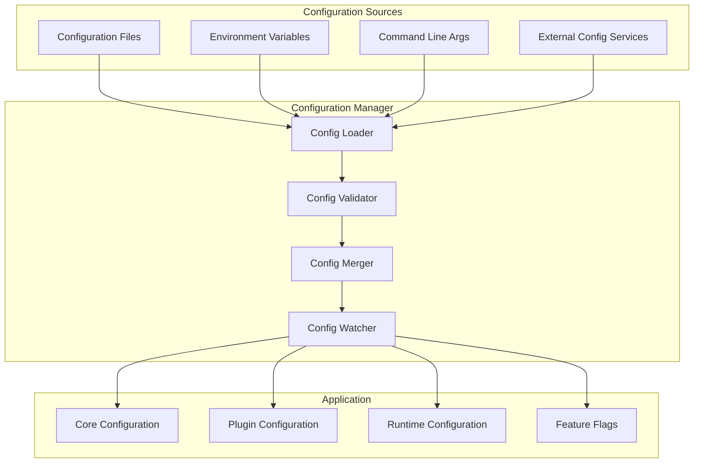

# Configuration Guide

Comprehensive guide to configuring your Nexus platform and plugins.

## 🎯 Overview

Configuration in Nexus is designed to be flexible, secure, and environment-aware. This guide covers all aspects of configuration management, from basic setup to advanced patterns for production deployments.

## 🏗️ Configuration Architecture



## 📁 Configuration Structure

### Configuration Files

Nexus supports multiple configuration file formats:

```
config/
├── nexus.yaml              # Main configuration
├── database.yaml           # Database settings
├── plugins.yaml            # Plugin configuration
├── security.yaml           # Security settings
├── environments/
│   ├── development.yaml    # Development overrides
│   ├── staging.yaml        # Staging overrides
│   └── production.yaml     # Production overrides
├── plugins/
│   ├── auth-plugin.yaml    # Plugin-specific config
│   └── analytics.yaml      # Analytics plugin config
└── secrets/
    ├── database.yaml       # Secret database credentials
    └── api-keys.yaml       # API keys and tokens
```

### Main Configuration File

```yaml
# config/nexus.yaml
nexus:
  # Application settings
  app:
    name: "Nexus Platform"
    version: "1.0.0"
    environment: "${ENVIRONMENT:development}"
    debug: ${DEBUG:false}

  # Server configuration
  server:
    host: "${HOST:0.0.0.0}"
    port: ${PORT:8000}
    workers: ${WORKERS:4}
    max_request_size: "10MB"
    timeout: 30
    keepalive: 5

  # Logging configuration
  logging:
    level: "${LOG_LEVEL:INFO}"
    format: "${LOG_FORMAT:json}"
    output: "${LOG_OUTPUT:console}"
    file: "${LOG_FILE:logs/nexus.log}"
    rotation: "daily"
    retention: "30 days"
    structured: true

  # Feature flags
  features:
    enable_metrics: ${ENABLE_METRICS:true}
    enable_health_checks: ${ENABLE_HEALTH_CHECKS:true}
    enable_api_docs: ${ENABLE_API_DOCS:true}
    enable_cors: ${ENABLE_CORS:true}

  # CORS settings
  cors:
    origins:
      - "${FRONTEND_URL:http://localhost:3000}"
      - "https://*.yourdomain.com"
    methods: ["GET", "POST", "PUT", "DELETE", "OPTIONS"]
    headers: ["Authorization", "Content-Type", "X-API-Key"]
    credentials: true

  # API settings
  api:
    prefix: "/api/v1"
    rate_limit:
      enabled: true
      requests_per_minute: ${API_RATE_LIMIT:100}
      burst_size: ${API_BURST_SIZE:10}
    pagination:
      default_limit: 20
      max_limit: 100
```

### Database Configuration

```yaml
# config/database.yaml
database:
  # Primary database
  default:
    driver: "${DB_DRIVER:postgresql}"
    host: "${DB_HOST:localhost}"
    port: ${DB_PORT:5432}
    database: "${DB_NAME:nexus}"
    username: "${DB_USER:nexus}"
    password: "${DB_PASSWORD}"

    # Connection pool settings
    pool:
      min_size: ${DB_POOL_MIN:5}
      max_size: ${DB_POOL_MAX:20}
      timeout: ${DB_POOL_TIMEOUT:30}
      recycle: ${DB_POOL_RECYCLE:3600}
      pre_ping: true

    # Query settings
    echo: ${DB_ECHO:false}
    echo_pool: false

    # SSL settings
    ssl:
      enabled: ${DB_SSL:false}
      ca_cert: "${DB_SSL_CA_CERT}"
      client_cert: "${DB_SSL_CLIENT_CERT}"
      client_key: "${DB_SSL_CLIENT_KEY}"

    # Migration settings
    migrations:
      auto_upgrade: ${DB_AUTO_MIGRATE:false}
      directory: "migrations"
      table: "alembic_version"

  # Read replica (optional)
  replica:
    driver: "${DB_DRIVER:postgresql}"
    host: "${DB_REPLICA_HOST}"
    port: ${DB_REPLICA_PORT:5432}
    database: "${DB_NAME:nexus}"
    username: "${DB_REPLICA_USER:nexus_read}"
    password: "${DB_REPLICA_PASSWORD}"
    read_only: true
    pool:
      min_size: 3
      max_size: 10

  # Cache database
  cache:
    driver: "${CACHE_DRIVER:redis}"
    host: "${CACHE_HOST:localhost}"
    port: ${CACHE_PORT:6379}
    database: ${CACHE_DB:0}
    password: "${CACHE_PASSWORD}"

    # Redis-specific settings
    ssl: ${CACHE_SSL:false}
    max_connections: ${CACHE_MAX_CONNECTIONS:50}
    retry_on_timeout: true
    socket_timeout: 5
    socket_connect_timeout: 5
    health_check_interval: 30

    # Cache settings
    default_ttl: 3600
    key_prefix: "nexus:"
    compression: true
```

### Plugin Configuration

```yaml
# config/plugins.yaml
plugins:
  # Global plugin settings
  global:
    auto_load: ${PLUGINS_AUTO_LOAD:true}
    directory: "${PLUGINS_DIR:./plugins}"
    timeout: ${PLUGIN_TIMEOUT:30}
    max_memory_mb: ${PLUGIN_MAX_MEMORY:256}
    max_cpu_percent: ${PLUGIN_MAX_CPU:50}

  # Plugin discovery
  discovery:
    enabled: true
    scan_interval: 300  # 5 minutes
    watch_changes: ${PLUGINS_WATCH:true}

  # Plugin security
  security:
    sandbox_enabled: ${PLUGIN_SANDBOX:true}
    allowed_imports:
      - "json"
      - "datetime"
      - "uuid"
      - "re"
      - "typing"
      - "pydantic"
      - "nexus.*"
    forbidden_functions:
      - "eval"
      - "exec"
      - "compile"
      - "__import__"
      - "open"
      - "input"

  # Individual plugin configurations
  configs:
    auth_plugin:
      enabled: true
      priority: 100
      config:
        session_timeout: 3600
        password_min_length: 8
        enable_2fa: ${AUTH_ENABLE_2FA:false}
        jwt_secret: "${JWT_SECRET}"
        jwt_expiry: 86400

    analytics_plugin:
      enabled: ${ANALYTICS_ENABLED:true}
      priority: 10
      config:
        batch_size: 100
        flush_interval: 60
        storage_backend: "database"
        track_anonymous: false

    email_plugin:
      enabled: ${EMAIL_ENABLED:true}
      priority: 50
      config:
        smtp_host: "${SMTP_HOST:localhost}"
        smtp_port: ${SMTP_PORT:587}
        smtp_user: "${SMTP_USER}"
        smtp_password: "${SMTP_PASSWORD}"
        use_tls: ${SMTP_TLS:true}
        from_email: "${FROM_EMAIL:noreply@example.com}"
        from_name: "${FROM_NAME:Nexus Platform}"
```

### Security Configuration

```yaml
# config/security.yaml
security:
  # Authentication settings
  authentication:
    providers:
      jwt:
        enabled: true
        secret_key: "${JWT_SECRET}"
        algorithm: "HS256"
        token_lifetime: 3600
        refresh_token_lifetime: 86400

      api_key:
        enabled: true
        header_name: "X-API-Key"
        rate_limit: 1000

      oauth2:
        enabled: ${OAUTH2_ENABLED:false}
        providers:
          google:
            client_id: "${GOOGLE_CLIENT_ID}"
            client_secret: "${GOOGLE_CLIENT_SECRET}"
            redirect_uri: "${GOOGLE_REDIRECT_URI}"
          github:
            client_id: "${GITHUB_CLIENT_ID}"
            client_secret: "${GITHUB_CLIENT_SECRET}"
            redirect_uri: "${GITHUB_REDIRECT_URI}"

  # Authorization settings
  authorization:
    default_role: "user"
    roles:
      user:
        permissions: ["read:own", "write:own"]
      moderator:
        permissions: ["read:all", "write:all", "moderate:content"]
      admin:
        permissions: ["*"]

  # Session management
  sessions:
    cookie_name: "nexus_session"
    cookie_domain: "${SESSION_DOMAIN}"
    cookie_secure: ${SESSION_SECURE:true}
    cookie_httponly: true
    cookie_samesite: "strict"
    max_age: 86400

  # Password policy
  passwords:
    min_length: 8
    require_uppercase: true
    require_lowercase: true
    require_numbers: true
    require_symbols: false
    max_age_days: 90
    history_count: 5

  # Rate limiting
  rate_limiting:
    enabled: true
    default_limit: 100  # requests per hour
    auth_limit: 10      # auth attempts per 10 minutes
    storage: "redis"

  # Security headers
  headers:
    force_https: ${FORCE_HTTPS:true}
    hsts_max_age: 31536000
    hsts_include_subdomains: true
    content_type_nosniff: true
    x_frame_options: "DENY"
    x_xss_protection: "1; mode=block"
    referrer_policy: "strict-origin-when-cross-origin"

  # Encryption
  encryption:
    algorithm: "AES-256-GCM"
    key: "${ENCRYPTION_KEY}"
    key_rotation_days: 90

  # Audit logging
  audit:
    enabled: true
    log_authentication: true
    log_authorization: true
    log_data_access: true
    log_admin_actions: true
    retention_days: 365
```

## 🌍 Environment-Specific Configuration

### Development Environment

```yaml
# config/environments/development.yaml
nexus:
  app:
    debug: true

  server:
    host: "127.0.0.1"
    port: 8000
    workers: 1

  logging:
    level: "DEBUG"
    format: "detailed"
    output: "console"

database:
  default:
    echo: true
    pool:
      min_size: 1
      max_size: 5

  cache:
    host: "localhost"
    database: 1  # Use different cache DB

plugins:
  global:
    auto_load: true
    watch_changes: true

  security:
    sandbox_enabled: false  # Disable for easier development

security:
  headers:
    force_https: false
  sessions:
    cookie_secure: false
```

### Production Environment

```yaml
# config/environments/production.yaml
nexus:
  app:
    debug: false

  server:
    workers: 4

  logging:
    level: "WARNING"
    format: "json"
    output: "file"

database:
  default:
    echo: false
    pool:
      min_size: 10
      max_size: 50
    ssl:
      enabled: true

  cache:
    ssl: true
    max_connections: 100

plugins:
  global:
    watch_changes: false

  security:
    sandbox_enabled: true

security:
  headers:
    force_https: true
  sessions:
    cookie_secure: true
  audit:
    enabled: true
```

## 🔐 Secret Management

### Environment Variables

```bash
# .env file for development
ENVIRONMENT=development
DEBUG=true

# Database
DB_PASSWORD=dev_password
DB_HOST=localhost

# Cache
CACHE_PASSWORD=cache_password

# Security
JWT_SECRET=your-jwt-secret-key
ENCRYPTION_KEY=your-encryption-key

# External services
SMTP_PASSWORD=smtp_password
GOOGLE_CLIENT_SECRET=google_secret
```

### Docker Secrets

```yaml
# docker-compose.yml
version: '3.8'

services:
  nexus:
    image: nexus:latest
    environment:
      - DB_PASSWORD_FILE=/run/secrets/db_password
      - JWT_SECRET_FILE=/run/secrets/jwt_secret
    secrets:
      - db_password
      - jwt_secret

secrets:
  db_password:
    file: ./secrets/db_password.txt
  jwt_secret:
    file: ./secrets/jwt_secret.txt
```

### Kubernetes Secrets

```yaml
# k8s/secrets.yaml
apiVersion: v1
kind: Secret
metadata:
  name: nexus-secrets
type: Opaque
stringData:
  database-password: "your-db-password"
  jwt-secret: "your-jwt-secret"
  encryption-key: "your-encryption-key"
---
apiVersion: v1
kind: ConfigMap
metadata:
  name: nexus-config
data:
  nexus.yaml: |
    nexus:
      app:
        environment: production
      server:
        host: "0.0.0.0"
        port: 8000
```

## ⚙️ Configuration Loading

### Configuration Manager

```python
# nexus/config/manager.py
import os
import yaml
from typing import Dict, Any, Optional
from pathlib import Path

class ConfigurationManager:
    """Manages application configuration."""

    def __init__(self, config_dir: str = "config"):
        self.config_dir = Path(config_dir)
        self.config = {}
        self.watchers = {}

    def load_configuration(self, environment: Optional[str] = None) -> Dict[str, Any]:
        """Load configuration from files and environment variables."""

        # Load base configuration
        self._load_config_file("nexus.yaml")
        self._load_config_file("database.yaml")
        self._load_config_file("plugins.yaml")
        self._load_config_file("security.yaml")

        # Load environment-specific overrides
        env = environment or os.getenv("ENVIRONMENT", "development")
        env_config_file = f"environments/{env}.yaml"
        self._load_config_file(env_config_file, required=False)

        # Apply environment variable overrides
        self._apply_env_overrides()

        # Validate configuration
        self._validate_configuration()

        return self.config

    def _load_config_file(self, filename: str, required: bool = True):
        """Load configuration from YAML file."""
        config_path = self.config_dir / filename

        if not config_path.exists():
            if required:
                raise FileNotFoundError(f"Required config file not found: {filename}")
            return

        with open(config_path, 'r') as f:
            file_config = yaml.safe_load(f)

        # Merge configuration
        self._merge_config(self.config, file_config)

    def _merge_config(self, base: Dict, override: Dict):
        """Recursively merge configuration dictionaries."""
        for key, value in override.items():
            if key in base and isinstance(base[key], dict) and isinstance(value, dict):
                self._merge_config(base[key], value)
            else:
                base[key] = value

    def _apply_env_overrides(self):
        """Apply environment variable overrides."""
        # Replace ${VAR:default} patterns with environment variables
        self.config = self._resolve_env_vars(self.config)

    def _resolve_env_vars(self, obj):
        """Recursively resolve environment variables in configuration."""
        if isinstance(obj, dict):
            return {k: self._resolve_env_vars(v) for k, v in obj.items()}
        elif isinstance(obj, list):
            return [self._resolve_env_vars(item) for item in obj]
        elif isinstance(obj, str):
            return self._resolve_env_string(obj)
        else:
            return obj

    def _resolve_env_string(self, value: str) -> Any:
        """Resolve environment variable in string."""
        import re

        # Pattern: ${VAR:default}
        pattern = r'\$\{([^:}]+)(?::([^}]*))?\}'

        def replacer(match):
            var_name = match.group(1)
            default_value = match.group(2) if match.group(2) is not None else ""
            return os.getenv(var_name, default_value)

        result = re.sub(pattern, replacer, value)

        # Convert to appropriate type
        if result.lower() in ('true', 'false'):
            return result.lower() == 'true'
        elif result.isdigit():
            return int(result)
        elif self._is_float(result):
            return float(result)
        else:
            return result

    def _is_float(self, value: str) -> bool:
        """Check if string represents a float."""
        try:
            float(value)
            return True
        except ValueError:
            return False

    def _validate_configuration(self):
        """Validate configuration values."""
        # Add validation logic here
        required_keys = [
            'nexus.app.name',
            'nexus.server.host',
            'nexus.server.port'
        ]

        for key_path in required_keys:
            if not self._get_nested_value(self.config, key_path):
                raise ValueError(f"Missing required configuration: {key_path}")

    def _get_nested_value(self, obj: Dict, key_path: str) -> Any:
        """Get nested value using dot notation."""
        keys = key_path.split('.')
        current = obj

        for key in keys:
            if isinstance(current, dict) and key in current:
                current = current[key]
            else:
                return None

        return current

    def get(self, key_path: str, default: Any = None) -> Any:
        """Get configuration value using dot notation."""
        value = self._get_nested_value(self.config, key_path)
        return value if value is not None else default

    def set(self, key_path: str, value: Any):
        """Set configuration value using dot notation."""
        keys = key_path.split('.')
        current = self.config

        for key in keys[:-1]:
            if key not in current:
                current[key] = {}
            current = current[key]

        current[keys[-1]] = value

    def watch_config_changes(self, callback):
        """Watch for configuration file changes."""
        # Implementation for file watching
        pass
```

## 🔧 Plugin Configuration

### Plugin Configuration Schema

```python
# plugins/my_plugin/config.py
from pydantic import BaseModel, Field, validator
from typing import List, Optional, Dict, Any

class DatabaseConfig(BaseModel):
    """Database configuration for plugin."""
    host: str = "localhost"
    port: int = 5432
    database: str = "plugin_db"
    username: str
    password: str
    pool_size: int = Field(default=5, ge=1, le=50)

class EmailConfig(BaseModel):
    """Email configuration for plugin."""
    smtp_host: str = "localhost"
    smtp_port: int = 587
    username: Optional[str] = None
    password: Optional[str] = None
    use_tls: bool = True
    from_email: str

    @validator('from_email')
    def validate_email_format(cls, v):
        import re
        if not re.match(r'^[^@]+@[^@]+\.[^@]+$', v):
            raise ValueError('Invalid email format')
        return v

class PluginConfig(BaseModel):
    """Main plugin configuration."""
    enabled: bool = True
    debug: bool = False
    log_level: str = Field(default="INFO", regex="^(DEBUG|INFO|WARNING|ERROR)$")

    # Nested configurations
    database: DatabaseConfig
    email: EmailConfig

    # Feature flags
    features: Dict[str, bool] = {}

    # Rate limiting
    rate_limit: int = Field(default=100, ge=1, le=10000)

    # Custom settings
    custom_settings: Dict[str, Any] = {}

    class Config:
        extra = "forbid"  # Don't allow extra fields
        validate_assignment = True  # Validate on assignment

# Usage in plugin
class MyPlugin(Plugin):
    def __init__(self, config_dict: Dict[str, Any]):
        # Validate and parse configuration
        self.config = PluginConfig(**config_dict)
        super().__init__(self.config.dict())
```

### Configuration Templates

```yaml
# Plugin configuration template
# plugins/my_plugin/config_template.yaml
my_plugin:
  # Basic settings
  enabled: ${MY_PLUGIN_ENABLED:true}
  debug: ${DEBUG:false}
  log_level: "${LOG_LEVEL:INFO}"

  # Database configuration
  database:
    host: "${MY_PLUGIN_DB_HOST:localhost}"
    port: ${MY_PLUGIN_DB_PORT:5432}
    database: "${MY_PLUGIN_DB_NAME:plugin_db}"
    username: "${MY_PLUGIN_DB_USER:plugin_user}"
    password: "${MY_PLUGIN_DB_PASSWORD}"
    pool_size: ${MY_PLUGIN_DB_POOL_SIZE:5}

  # Email configuration
  email:
    smtp_host: "${SMTP_HOST:localhost}"
    smtp_port: ${SMTP_PORT:587}
    username: "${SMTP_USER}"
    password: "${SMTP_PASSWORD}"
    use_tls: ${SMTP_TLS:true}
    from_email: "${MY_PLUGIN_FROM_EMAIL:noreply@example.com}"

  # Feature flags
  features:
    enable_notifications: ${MY_PLUGIN_NOTIFICATIONS:true}
    enable_analytics: ${MY_PLUGIN_ANALYTICS:false}
    enable_caching: ${MY_PLUGIN_CACHING:true}

  # Rate limiting
  rate_limit: ${MY_PLUGIN_RATE_LIMIT:100}

  # Custom settings
  custom_settings:
    api_timeout: ${MY_PLUGIN_API_TIMEOUT:30}
    batch_size: ${MY_PLUGIN_BATCH_SIZE:50}
    retry_attempts: ${MY_PLUGIN_RETRY_ATTEMPTS:3}
```

## 🧪 Configuration Testing

### Configuration Validation Tests

```python
# tests/test_configuration.py
import pytest
from nexus.config import ConfigurationManager

class TestConfiguration:
    """Test configuration loading and validation."""

    def test_load_base_configuration(self):
        """Test loading base configuration."""
        config_manager = ConfigurationManager("tests/fixtures/config")
        config = config_manager.load_configuration("test")

        assert config['nexus']['app']['name'] == "Test Nexus"
        assert config['nexus']['server']['port'] == 8000

    def test_environment_overrides(self):
        """Test environment-specific overrides."""
        config_manager = ConfigurationManager("tests/fixtures/config")

        # Test development environment
        dev_config = config_manager.load_configuration("development")
        assert dev_config['nexus']['app']['debug'] is True

        # Test production environment
        prod_config = config_manager.load_configuration("production")
        assert prod_config['nexus']['app']['debug'] is False

    def test_environment_variable_substitution(self, monkeypatch):
        """Test environment variable substitution."""
        monkeypatch.setenv("TEST_PORT", "9000")
        monkeypatch.setenv("TEST_DEBUG", "true")

        config_manager = ConfigurationManager("tests/fixtures/config")
        config = config_manager.load_configuration("test")

        # Should use environment variables
        assert config['nexus']['server']['port'] == 9000
        assert config['nexus']['app']['debug'] is True

    def test_missing_required_config(self):
        """Test handling of missing required configuration."""
        config_manager = ConfigurationManager("tests/fixtures/invalid_config")

        with pytest.raises(ValueError, match="Missing required configuration"):
            config_manager.load_configuration("test")

    def test_plugin_configuration_validation(self):
        """Test plugin configuration validation."""
        from plugins.my_plugin.config import PluginConfig

        # Valid configuration
        valid_config = {
            "enabled": True,
            "database": {
                "username": "test",
                "password": "test",
                "from_email": "test@example.com"
            },
            "email": {
                "from_email": "test@example.com"
            }
        }

        config = PluginConfig(**valid_config)
        assert config.enabled is True

        # Invalid configuration
        invalid_config = {
            "enabled": True,
            "email": {
                "from_email": "invalid-email"
            }
        }

        with pytest.raises(ValueError, match="Invalid email format"):
            PluginConfig(**invalid_config)
```

## 🎯 Best Practices

### 1. Configuration Organization

- **Separate concerns**: Use separate files for different aspects (database, security, plugins)
- **Environment-specific**: Use environment-specific override files
- **Hierarchical structure**: Organize configuration in logical groups
- **Template patterns**: Use consistent naming and structure across plugins

### 2. Security

- **Never commit secrets**: Use environment variables or secret management systems
- **Encrypt sensitive data**: Use encryption for sensitive configuration values
- **Least privilege**: Grant minimal necessary permissions
- **Regular rotation**: Rotate secrets and keys regularly

### 3. Validation

- **Schema validation**: Use Pydantic or similar for configuration validation
- **Type checking**: Ensure configuration values have correct types
- **Range validation**: Validate numeric ranges and string patterns
- **Required fields**: Clearly mark required vs optional configuration

### 4. Documentation

- **Configuration reference**: Document all configuration options
- **Examples**: Provide example configurations for different scenarios
- **Environment guides**: Document environment-specific setup
- **Migration guides**: Document configuration changes between versions

## 🚀 Production Configuration

### Health Checks

```yaml
# Production health check configuration
nexus:
  health:
    enabled: true
    endpoint: "/health"
    checks:
      - name: "database"
        type: "database"
        timeout: 5
      - name: "cache"
        type: "redis"
        timeout: 3
      - name: "external_api"
        type: "http"
        url: "https://api.external.com/health"
        timeout: 10
    intervals:
      check_interval: 30
      unhealthy_threshold: 3
      healthy_threshold: 2
```

### Monitoring Configuration

```yaml
# Monitoring and metrics configuration
monitoring:
  metrics:
    enabled: true
    endpoint: "/metrics"
    include_default: true
    custom_metrics:
      - "request_duration"
      - "database_queries"
      - "plugin_errors"

  tracing:
    enabled: true
    service_name: "nexus"
    jaeger_endpoint: "${JAEGER_ENDPOINT}"
    sample_rate: 0.1

  alerts:
    enabled: true
    webhook_url: "${ALERT_WEBHOOK_URL}"
    rules:
      - name: "high_error_rate"
        condition: "error_rate > 0.1"
        duration: "5m"
      - name: "high_response_time"
        condition: "response_time_p95 > 1000"
        duration: "2m"
```

## 🎯 Next Steps

- **[Plugin Configuration](../plugins/basics.md)** - Configure your plugins
- **[Security Guide](../architecture/security.md)** - Secure your configuration
- **[Deployment Guide](../deployment/README.md)** - Deploy with configuration
- **[Environment Setup](development.md)** - Set up development environment

---

**Proper configuration is the foundation of a robust Nexus deployment.** Follow this guide to ensure your platform is configured securely and efficiently for your environment.
