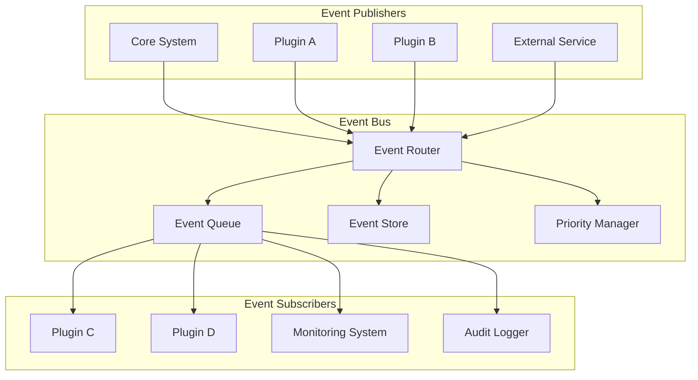

# Event System

Understanding Nexus's powerful event-driven architecture for building decoupled, scalable applications.

## 🎯 Overview

The Nexus Event System enables loose coupling between components through asynchronous event-driven communication. This architecture allows plugins and components to interact without direct dependencies, making the system more modular, testable, and maintainable.

## 🏗️ Event Architecture



## 📡 Event Bus Core

The Event Bus is the central nervous system of Nexus, handling all event routing and delivery.

### Key Features

- **Asynchronous Processing**: Non-blocking event handling
- **Priority Queues**: Important events processed first
- **Event Persistence**: Optional event storage for replay
- **Error Handling**: Comprehensive error recovery
- **Subscription Management**: Dynamic subscriber registration

### Event Bus Interface

```python
from abc import ABC, abstractmethod
from typing import Any, Callable, Dict, List, Optional
from datetime import datetime

class EventBus(ABC):
    @abstractmethod
    async def emit(self, event: 'Event', priority: int = 0) -> None:
        """Emit an event to all subscribers."""
        pass

    @abstractmethod
    async def subscribe(self, event_type: str, handler: Callable,
                       priority: int = 0) -> str:
        """Subscribe to events of a specific type."""
        pass

    @abstractmethod
    async def unsubscribe(self, subscription_id: str) -> None:
        """Remove a subscription."""
        pass

    @abstractmethod
    async def wait_for(self, event_type: str, timeout: float = None) -> 'Event':
        """Wait for a specific event type."""
        pass
```

## 📦 Event Types

### Base Event Class

All events inherit from the base Event class:

```python
from dataclasses import dataclass, field
from typing import Any, Dict, Optional
from datetime import datetime
import uuid

@dataclass
class Event:
    """Base class for all events in the Nexus system."""

    event_type: str
    event_id: str = field(default_factory=lambda: str(uuid.uuid4()))
    timestamp: datetime = field(default_factory=datetime.utcnow)
    source: Optional[str] = None
    correlation_id: Optional[str] = None
    metadata: Dict[str, Any] = field(default_factory=dict)

    def __post_init__(self):
        if not self.event_type:
            self.event_type = self.__class__.__name__.lower().replace('event', '')
```

### System Events

Core system lifecycle events:

```python
@dataclass
class SystemStartedEvent(Event):
    """Emitted when the Nexus system starts."""
    event_type: str = "system.started"
    version: str = ""
    config: Dict[str, Any] = field(default_factory=dict)

@dataclass
class SystemShuttingDownEvent(Event):
    """Emitted when the system begins shutdown."""
    event_type: str = "system.shutting_down"
    reason: str = "normal"

@dataclass
class SystemErrorEvent(Event):
    """Emitted when a system error occurs."""
    event_type: str = "system.error"
    error_type: str = ""
    error_message: str = ""
    traceback: Optional[str] = None
```

### Plugin Events

Plugin lifecycle and operation events:

```python
@dataclass
class PluginLoadedEvent(Event):
    """Emitted when a plugin is loaded."""
    event_type: str = "plugin.loaded"
    plugin_id: str = ""
    plugin_name: str = ""
    plugin_version: str = ""

@dataclass
class PluginUnloadedEvent(Event):
    """Emitted when a plugin is unloaded."""
    event_type: str = "plugin.unloaded"
    plugin_id: str = ""
    reason: str = "normal"

@dataclass
class PluginErrorEvent(Event):
    """Emitted when a plugin encounters an error."""
    event_type: str = "plugin.error"
    plugin_id: str = ""
    error_type: str = ""
    error_message: str = ""
```

### HTTP Events

Web request and response events:

```python
@dataclass
class RequestStartedEvent(Event):
    """Emitted when an HTTP request begins processing."""
    event_type: str = "http.request.started"
    request_id: str = ""
    method: str = ""
    path: str = ""
    client_ip: str = ""
    user_agent: str = ""

@dataclass
class RequestCompletedEvent(Event):
    """Emitted when an HTTP request completes."""
    event_type: str = "http.request.completed"
    request_id: str = ""
    status_code: int = 0
    response_time_ms: float = 0.0
    response_size: int = 0

@dataclass
class RequestFailedEvent(Event):
    """Emitted when an HTTP request fails."""
    event_type: str = "http.request.failed"
    request_id: str = ""
    error_type: str = ""
    error_message: str = ""
```

### Database Events

Database operation events:

```python
@dataclass
class DatabaseQueryEvent(Event):
    """Emitted for database queries."""
    event_type: str = "database.query"
    query_type: str = ""  # SELECT, INSERT, UPDATE, DELETE
    table_name: str = ""
    execution_time_ms: float = 0.0
    rows_affected: int = 0

@dataclass
class DatabaseConnectionEvent(Event):
    """Emitted for database connection events."""
    event_type: str = "database.connection"
    action: str = ""  # connected, disconnected, error
    database_name: str = ""
    connection_pool_size: int = 0
```

### Custom Events

Creating custom events for your plugins:

```python
@dataclass
class UserRegisteredEvent(Event):
    """Emitted when a new user registers."""
    event_type: str = "user.registered"
    user_id: str = ""
    username: str = ""
    email: str = ""
    registration_source: str = "web"

@dataclass
class OrderCreatedEvent(Event):
    """Emitted when a new order is created."""
    event_type: str = "order.created"
    order_id: str = ""
    user_id: str = ""
    total_amount: float = 0.0
    currency: str = "USD"
    items: List[Dict[str, Any]] = field(default_factory=list)
```

## 🎪 Event Subscription

### Decorator-Based Subscription

The most common way to subscribe to events:

```python
from nexus.events import event_handler

class UserService:
    @event_handler("user.registered")
    async def on_user_registered(self, event: UserRegisteredEvent):
        """Handle new user registration."""
        print(f"Welcome new user: {event.username}")
        await self.send_welcome_email(event.email)
        await self.create_user_profile(event.user_id)

    @event_handler("user.registered", priority=10)
    async def on_user_registered_high_priority(self, event: UserRegisteredEvent):
        """High priority handler for user registration."""
        await self.log_registration_metrics(event)
```

### Manual Subscription

For dynamic subscription management:

```python
class DynamicSubscriber:
    def __init__(self, event_bus: EventBus):
        self.event_bus = event_bus
        self.subscriptions = []

    async def start_listening(self):
        """Start listening to events."""
        subscription_id = await self.event_bus.subscribe(
            "order.created",
            self.handle_order_created,
            priority=5
        )
        self.subscriptions.append(subscription_id)

    async def handle_order_created(self, event: OrderCreatedEvent):
        """Handle order creation."""
        print(f"New order: {event.order_id}")

    async def stop_listening(self):
        """Stop listening to events."""
        for subscription_id in self.subscriptions:
            await self.event_bus.unsubscribe(subscription_id)
        self.subscriptions.clear()
```

### Conditional Subscription

Subscribe to events with conditions:

```python
from nexus.events import event_handler, condition

class ConditionalService:
    @event_handler("order.created")
    @condition(lambda event: event.total_amount > 100.0)
    async def handle_large_orders(self, event: OrderCreatedEvent):
        """Only handle orders over $100."""
        await self.process_large_order(event)

    @event_handler("user.registered")
    @condition(lambda event: event.registration_source == "mobile")
    async def handle_mobile_registrations(self, event: UserRegisteredEvent):
        """Only handle mobile registrations."""
        await self.send_mobile_welcome(event)
```

## 🚀 Event Emission

### Simple Emission

Emit events from your plugins:

```python
from nexus.events import get_event_bus

class UserController:
    def __init__(self):
        self.event_bus = get_event_bus()

    async def register_user(self, user_data: dict):
        """Register a new user and emit event."""
        # Create user in database
        user = await self.create_user(user_data)

        # Emit registration event
        event = UserRegisteredEvent(
            user_id=user.id,
            username=user.username,
            email=user.email,
            registration_source="web"
        )
        await self.event_bus.emit(event)

        return user
```

### Priority Emission

Emit events with different priorities:

```python
class SecurityService:
    async def handle_security_incident(self, incident_data: dict):
        """Handle security incident with high priority event."""
        event = SecurityIncidentEvent(
            incident_type=incident_data["type"],
            severity=incident_data["severity"],
            details=incident_data["details"]
        )

        # Emit with high priority (higher number = higher priority)
        await self.event_bus.emit(event, priority=100)
```

### Correlated Events

Link related events with correlation IDs:

```python
class OrderService:
    async def process_order(self, order_data: dict):
        """Process order with correlated events."""
        correlation_id = str(uuid.uuid4())

        # Order created event
        created_event = OrderCreatedEvent(
            order_id=order_data["id"],
            user_id=order_data["user_id"],
            total_amount=order_data["total"],
            correlation_id=correlation_id
        )
        await self.event_bus.emit(created_event)

        # Payment processing event
        payment_event = PaymentProcessingEvent(
            order_id=order_data["id"],
            payment_method=order_data["payment_method"],
            correlation_id=correlation_id  # Same correlation ID
        )
        await self.event_bus.emit(payment_event)
```

## ⚡ Event Processing Patterns

### Fire and Forget

Simple asynchronous processing:

```python
class NotificationService:
    @event_handler("user.registered")
    async def send_welcome_email(self, event: UserRegisteredEvent):
        """Send welcome email asynchronously."""
        try:
            await self.email_service.send_welcome_email(
                email=event.email,
                username=event.username
            )
        except Exception as e:
            logger.error(f"Failed to send welcome email: {e}")
            # Don't re-raise, this is fire-and-forget
```

### Request-Response Pattern

Wait for event responses:

```python
class ValidationService:
    async def validate_user_data(self, user_data: dict) -> bool:
        """Validate user data using events."""
        validation_event = UserValidationRequestEvent(
            user_data=user_data,
            request_id=str(uuid.uuid4())
        )

        # Emit validation request
        await self.event_bus.emit(validation_event)

        # Wait for validation response
        try:
            response_event = await self.event_bus.wait_for(
                f"user.validation.response.{validation_event.request_id}",
                timeout=5.0
            )
            return response_event.is_valid
        except asyncio.TimeoutError:
            logger.warning("User validation timeout")
            return False
```

### Saga Pattern

Coordinate complex workflows:

```python
class OrderSaga:
    def __init__(self):
        self.event_bus = get_event_bus()
        self.active_orders = {}

    @event_handler("order.created")
    async def handle_order_created(self, event: OrderCreatedEvent):
        """Start order processing saga."""
        saga_state = {
            "order_id": event.order_id,
            "step": "payment",
            "correlation_id": event.correlation_id
        }
        self.active_orders[event.order_id] = saga_state

        # Start payment processing
        payment_event = PaymentRequestEvent(
            order_id=event.order_id,
            amount=event.total_amount,
            correlation_id=event.correlation_id
        )
        await self.event_bus.emit(payment_event)

    @event_handler("payment.completed")
    async def handle_payment_completed(self, event: PaymentCompletedEvent):
        """Continue saga after payment."""
        if event.order_id in self.active_orders:
            saga_state = self.active_orders[event.order_id]
            saga_state["step"] = "inventory"

            # Reserve inventory
            inventory_event = InventoryReservationEvent(
                order_id=event.order_id,
                items=saga_state.get("items", []),
                correlation_id=saga_state["correlation_id"]
            )
            await self.event_bus.emit(inventory_event)

    @event_handler("payment.failed")
    async def handle_payment_failed(self, event: PaymentFailedEvent):
        """Handle payment failure."""
        if event.order_id in self.active_orders:
            # Cancel order
            cancel_event = OrderCancelledEvent(
                order_id=event.order_id,
                reason="payment_failed",
                correlation_id=self.active_orders[event.order_id]["correlation_id"]
            )
            await self.event_bus.emit(cancel_event)
            del self.active_orders[event.order_id]
```

## 🛡️ Error Handling

### Error Recovery

Handle errors gracefully in event handlers:

```python
class ResilientService:
    @event_handler("user.registered")
    async def process_user_registration(self, event: UserRegisteredEvent):
        """Process user registration with error handling."""
        try:
            await self.create_user_profile(event.user_id)
            await self.send_welcome_email(event.email)
            await self.update_analytics(event)
        except DatabaseError as e:
            logger.error(f"Database error processing user {event.user_id}: {e}")
            # Emit error event for retry later
            error_event = UserProcessingErrorEvent(
                user_id=event.user_id,
                error_type="database_error",
                retry_count=0
            )
            await self.event_bus.emit(error_event)
        except Exception as e:
            logger.error(f"Unexpected error processing user {event.user_id}: {e}")
            # Don't retry for unexpected errors
```

### Dead Letter Queue

Handle failed events:

```python
class DeadLetterHandler:
    @event_handler("*.error")
    async def handle_error_events(self, event: Event):
        """Handle error events."""
        retry_count = event.metadata.get("retry_count", 0)
        max_retries = 3

        if retry_count < max_retries:
            # Retry with exponential backoff
            delay = 2 ** retry_count
            await asyncio.sleep(delay)

            # Update retry count
            event.metadata["retry_count"] = retry_count + 1

            # Re-emit original event
            await self.event_bus.emit(event)
        else:
            # Send to dead letter queue
            await self.send_to_dead_letter_queue(event)
```

## 📊 Event Monitoring

### Event Metrics

Track event system performance:

```python
from nexus.metrics import Counter, Histogram, Gauge

class EventMetrics:
    def __init__(self):
        self.events_emitted = Counter("events_emitted_total")
        self.events_processed = Counter("events_processed_total")
        self.event_processing_time = Histogram("event_processing_seconds")
        self.active_subscriptions = Gauge("active_subscriptions")

    @event_handler("*")  # Listen to all events
    async def track_event_metrics(self, event: Event):
        """Track metrics for all events."""
        self.events_processed.inc(labels={"event_type": event.event_type})

        # Track processing time
        start_time = event.metadata.get("processing_start_time")
        if start_time:
            processing_time = time.time() - start_time
            self.event_processing_time.observe(
                processing_time,
                labels={"event_type": event.event_type}
            )
```

### Event Tracing

Trace event flows through the system:

```python
class EventTracer:
    def __init__(self):
        self.traces = {}

    @event_handler("*")
    async def trace_events(self, event: Event):
        """Trace all events."""
        trace_data = {
            "event_id": event.event_id,
            "event_type": event.event_type,
            "timestamp": event.timestamp.isoformat(),
            "source": event.source,
            "correlation_id": event.correlation_id
        }

        if event.correlation_id:
            if event.correlation_id not in self.traces:
                self.traces[event.correlation_id] = []
            self.traces[event.correlation_id].append(trace_data)
```

## ⚙️ Configuration

### Event Bus Configuration

```yaml
events:
  # Event bus backend
  backend: "memory"  # Options: memory, redis, rabbitmq

  # Queue settings
  max_queue_size: 10000
  worker_count: 4

  # Retry settings
  retry_attempts: 3
  retry_delay: 1.0
  exponential_backoff: true

  # Persistence settings
  persist_events: false
  event_store_backend: "postgresql"
  event_retention_days: 30

  # Performance settings
  batch_size: 100
  flush_interval: 1.0

  # Monitoring
  enable_metrics: true
  enable_tracing: true
```

### Redis Backend Configuration

```yaml
events:
  backend: "redis"
  redis:
    host: "localhost"
    port: 6379
    password: "${REDIS_PASSWORD}"
    database: 0
    ssl: false
    pool_size: 10

    # Pub/Sub settings
    channel_prefix: "nexus:events"

    # Stream settings (for persistence)
    stream_name: "nexus:event_stream"
    consumer_group: "nexus:processors"
    max_stream_length: 100000
```

## 🎯 Best Practices

### Event Design

1. **Use Clear Naming**: Event types should be descriptive and follow a consistent pattern
2. **Include Context**: Provide sufficient data in events for handlers to work independently
3. **Version Events**: Plan for event schema evolution
4. **Keep Events Immutable**: Events should not be modified after creation

### Performance Tips

1. **Avoid Heavy Processing**: Keep event handlers lightweight
2. **Use Async Operations**: All handlers should be async
3. **Batch Operations**: Group related operations when possible
4. **Monitor Queue Depth**: Watch for event processing bottlenecks

### Error Handling

1. **Fail Gracefully**: Don't let one handler failure affect others
2. **Log Thoroughly**: Include correlation IDs in logs
3. **Implement Retries**: Use exponential backoff for transient failures
4. **Use Dead Letter Queues**: Handle permanently failed events

## 🔧 Advanced Features

### Event Sourcing

Store events as the source of truth:

```python
class EventStore:
    async def append_event(self, stream_id: str, event: Event) -> None:
        """Append event to stream."""
        await self.db.execute(
            "INSERT INTO events (stream_id, event_type, event_data, version) "
            "VALUES ($1, $2, $3, $4)",
            stream_id, event.event_type, event.to_json(),
            await self.get_next_version(stream_id)
        )

    async def replay_events(self, stream_id: str,
                           from_version: int = 0) -> List[Event]:
        """Replay events from a stream."""
        rows = await self.db.fetch_all(
            "SELECT event_data FROM events "
            "WHERE stream_id = $1 AND version > $2 "
            "ORDER BY version",
            stream_id, from_version
        )
        return [Event.from_json(row["event_data"]) for row in rows]
```

### Event Filtering

Filter events before processing:

```python
class EventFilter:
    def __init__(self, conditions: List[Callable[[Event], bool]]):
        self.conditions = conditions

    def should_process(self, event: Event) -> bool:
        """Check if event should be processed."""
        return all(condition(event) for condition in self.conditions)

# Usage
user_filter = EventFilter([
    lambda e: e.event_type.startswith("user."),
    lambda e: e.source != "test",
    lambda e: e.metadata.get("environment") == "production"
])

@event_handler("*")
async def filtered_user_handler(self, event: Event):
    if user_filter.should_process(event):
        await self.process_user_event(event)
```

## 🎯 Next Steps

- **[Security Model](security.md)** - Secure your event-driven system
- **[Plugin Development](../plugins/basics.md)** - Build event-driven plugins
- **[API Reference](../api/core.md)** - Detailed event system API
- **[Configuration Guide](../getting-started/configuration.md)** - Configure the event system

---

**Events are the nervous system of Nexus.** Master the event system to build truly scalable, decoupled applications.
