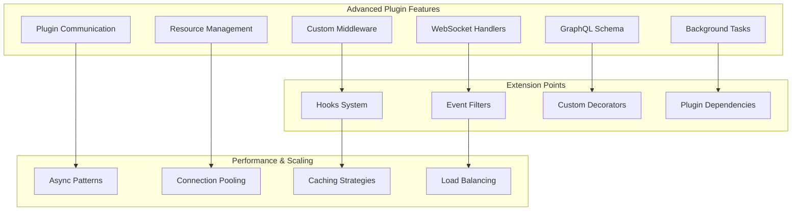

# Advanced Plugin Development

Advanced patterns and techniques for building sophisticated Nexus plugins.

## 🎯 Overview

This guide covers advanced plugin development topics including custom middleware, WebSocket handlers, GraphQL integration, background tasks, plugin communication, performance optimization, and architectural patterns for complex plugins.

## 🏗️ Advanced Architecture



## 🌐 WebSocket Integration

### WebSocket Handler

```python
from nexus.websocket import WebSocketManager, websocket_route
from nexus.plugin import Plugin
from typing import Dict, Any, List
import json
import asyncio

class WebSocketPlugin(Plugin):
    """Plugin with WebSocket support."""

    def __init__(self, config):
        super().__init__(config)
        self.websocket_manager = WebSocketManager()
        self.active_connections = {}
        self.rooms = {}

    async def initialize(self):
        """Initialize WebSocket plugin."""
        await super().initialize()
        await self.websocket_manager.initialize()

    @websocket_route("/ws/chat/{room_id}")
    async def chat_websocket(self, websocket, room_id: str):
        """Handle chat WebSocket connections."""
        await websocket.accept()

        # Authenticate user
        user = await self.authenticate_websocket(websocket)
        if not user:
            await websocket.close(code=4001, reason="Unauthorized")
            return

        connection_id = f"{user['id']}:{room_id}"
        self.active_connections[connection_id] = {
            'websocket': websocket,
            'user': user,
            'room_id': room_id
        }

        # Join room
        await self.join_room(user, room_id)

        try:
            # Listen for messages
            async for message in websocket.iter_text():
                await self.handle_chat_message(user, room_id, message)

        except Exception as e:
            self.logger.error(f"WebSocket error: {e}")
        finally:
            # Leave room and cleanup
            await self.leave_room(user, room_id)
            del self.active_connections[connection_id]

    async def handle_chat_message(self, user: Dict, room_id: str, message: str):
        """Handle incoming chat message."""
        try:
            data = json.loads(message)
            message_type = data.get('type')

            if message_type == 'chat_message':
                await self.broadcast_chat_message(room_id, user, data['content'])
            elif message_type == 'typing':
                await self.broadcast_typing(room_id, user)
            elif message_type == 'ping':
                await self.send_pong(user['id'], room_id)

        except json.JSONDecodeError:
            await self.send_error(user['id'], room_id, "Invalid message format")

    async def broadcast_chat_message(self, room_id: str, sender: Dict, content: str):
        """Broadcast chat message to room."""
        message = {
            'type': 'chat_message',
            'room_id': room_id,
            'sender': {
                'id': sender['id'],
                'username': sender['username']
            },
            'content': content,
            'timestamp': datetime.utcnow().isoformat()
        }

        # Store message in database
        await self.store_chat_message(room_id, sender['id'], content)

        # Broadcast to room members
        await self.broadcast_to_room(room_id, message)

        # Emit event for other plugins
        await self.emit_event({
            'type': 'chat.message.sent',
            'data': message
        })

    async def broadcast_to_room(self, room_id: str, message: Dict):
        """Broadcast message to all connections in room."""
        if room_id not in self.rooms:
            return

        message_json = json.dumps(message)
        disconnected = []

        for user_id in self.rooms[room_id]:
            connection_id = f"{user_id}:{room_id}"
            if connection_id in self.active_connections:
                websocket = self.active_connections[connection_id]['websocket']
                try:
                    await websocket.send_text(message_json)
                except Exception:
                    disconnected.append(user_id)

        # Clean up disconnected users
        for user_id in disconnected:
            await self.remove_from_room(user_id, room_id)

    async def join_room(self, user: Dict, room_id: str):
        """Add user to room."""
        if room_id not in self.rooms:
            self.rooms[room_id] = set()

        self.rooms[room_id].add(user['id'])

        # Notify room about new user
        await self.broadcast_to_room(room_id, {
            'type': 'user_joined',
            'user': {'id': user['id'], 'username': user['username']},
            'room_id': room_id
        })

    async def leave_room(self, user: Dict, room_id: str):
        """Remove user from room."""
        await self.remove_from_room(user['id'], room_id)

        # Notify room about user leaving
        await self.broadcast_to_room(room_id, {
            'type': 'user_left',
            'user': {'id': user['id'], 'username': user['username']},
            'room_id': room_id
        })
```

## 📊 GraphQL Integration

### GraphQL Schema Definition

```python
import graphene
from graphene import ObjectType, String, Int, List, Field, Mutation
from nexus.graphql import GraphQLPlugin

class UserType(ObjectType):
    """GraphQL User type."""
    id = Int()
    username = String()
    email = String()
    full_name = String()
    is_active = graphene.Boolean()
    created_at = String()

class UserInput(graphene.InputObjectType):
    """Input type for user mutations."""
    username = String(required=True)
    email = String(required=True)
    full_name = String()

class CreateUser(Mutation):
    """Create user mutation."""

    class Arguments:
        input = UserInput(required=True)

    user = Field(UserType)
    success = graphene.Boolean()
    errors = List(String)

    async def mutate(self, info, input):
        """Create new user."""
        try:
            plugin = info.context['plugin']
            user_data = {
                'username': input.username,
                'email': input.email,
                'full_name': input.full_name
            }

            user = await plugin.user_service.create_user(user_data)
            return CreateUser(user=UserType(**user), success=True)

        except Exception as e:
            return CreateUser(success=False, errors=[str(e)])

class Query(ObjectType):
    """GraphQL Query root."""

    user = Field(UserType, id=Int(required=True))
    users = List(UserType, limit=Int(), offset=Int())
    search_users = List(UserType, query=String(required=True))

    async def resolve_user(self, info, id):
        """Resolve single user."""
        plugin = info.context['plugin']
        user = await plugin.user_service.get_user_by_id(id)
        return UserType(**user) if user else None

    async def resolve_users(self, info, limit=20, offset=0):
        """Resolve users list."""
        plugin = info.context['plugin']
        users, _ = await plugin.user_service.list_users(
            page=(offset // limit) + 1,
            per_page=limit
        )
        return [UserType(**user) for user in users]

    async def resolve_search_users(self, info, query):
        """Search users."""
        plugin = info.context['plugin']
        users, _ = await plugin.user_service.list_users(
            filters={'search': query}
        )
        return [UserType(**user) for user in users]

class Mutation(ObjectType):
    """GraphQL Mutation root."""
    create_user = CreateUser.Field()

class MyGraphQLPlugin(GraphQLPlugin):
    """Plugin with GraphQL schema."""

    def get_schema(self):
        """Return GraphQL schema."""
        return graphene.Schema(query=Query, mutation=Mutation)

    async def get_context(self, request):
        """Provide context for GraphQL resolvers."""
        return {
            'plugin': self,
            'request': request,
            'user': await self.get_current_user(request)
        }
```

## 🏃 Background Tasks & Scheduling

### Task Management

```python
import asyncio
from datetime import datetime, timedelta
from typing import Callable, Any, Dict, Optional
from nexus.tasks import TaskManager, Task, TaskStatus

class AdvancedTaskPlugin(Plugin):
    """Plugin with advanced task management."""

    def __init__(self, config):
        super().__init__(config)
        self.task_manager = TaskManager()
        self.scheduled_tasks = {}
        self.recurring_tasks = {}

    async def initialize(self):
        """Initialize task plugin."""
        await super().initialize()
        await self.task_manager.initialize()

        # Start task scheduler
        self.scheduler_task = asyncio.create_task(self.task_scheduler())

    async def cleanup(self):
        """Clean up tasks."""
        if hasattr(self, 'scheduler_task'):
            self.scheduler_task.cancel()

        # Cancel all running tasks
        for task_id in list(self.scheduled_tasks.keys()):
            await self.cancel_task(task_id)

        await self.task_manager.cleanup()
        await super().cleanup()

    async def schedule_task(
        self,
        func: Callable,
        run_at: datetime,
        task_id: Optional[str] = None,
        **kwargs
    ) -> str:
        """Schedule a task to run at specific time."""
        task_id = task_id or f"task_{datetime.utcnow().timestamp()}"

        task = Task(
            id=task_id,
            func=func,
            kwargs=kwargs,
            scheduled_at=run_at,
            status=TaskStatus.SCHEDULED
        )

        self.scheduled_tasks[task_id] = task
        self.logger.info(f"Scheduled task {task_id} for {run_at}")
        return task_id

    async def schedule_recurring_task(
        self,
        func: Callable,
        interval: timedelta,
        task_id: Optional[str] = None,
        start_at: Optional[datetime] = None,
        **kwargs
    ) -> str:
        """Schedule a recurring task."""
        task_id = task_id or f"recurring_{datetime.utcnow().timestamp()}"
        start_time = start_at or datetime.utcnow()

        task = Task(
            id=task_id,
            func=func,
            kwargs=kwargs,
            scheduled_at=start_time,
            interval=interval,
            status=TaskStatus.SCHEDULED,
            recurring=True
        )

        self.recurring_tasks[task_id] = task
        self.logger.info(f"Scheduled recurring task {task_id} every {interval}")
        return task_id

    async def cancel_task(self, task_id: str) -> bool:
        """Cancel a scheduled task."""
        if task_id in self.scheduled_tasks:
            task = self.scheduled_tasks[task_id]
            task.status = TaskStatus.CANCELLED
            del self.scheduled_tasks[task_id]
            return True

        if task_id in self.recurring_tasks:
            task = self.recurring_tasks[task_id]
            task.status = TaskStatus.CANCELLED
            del self.recurring_tasks[task_id]
            return True

        return False

    async def task_scheduler(self):
        """Main task scheduler loop."""
        while True:
            try:
                current_time = datetime.utcnow()

                # Check scheduled tasks
                ready_tasks = []
                for task_id, task in list(self.scheduled_tasks.items()):
                    if task.scheduled_at <= current_time:
                        ready_tasks.append((task_id, task))

                # Execute ready tasks
                for task_id, task in ready_tasks:
                    asyncio.create_task(self.execute_task(task))
                    del self.scheduled_tasks[task_id]

                # Check recurring tasks
                for task_id, task in list(self.recurring_tasks.items()):
                    if task.scheduled_at <= current_time:
                        # Execute task
                        asyncio.create_task(self.execute_task(task))

                        # Schedule next occurrence
                        task.scheduled_at = current_time + task.interval
                        task.last_run = current_time

                await asyncio.sleep(1)  # Check every second

            except asyncio.CancelledError:
                break
            except Exception as e:
                self.logger.error(f"Error in task scheduler: {e}")

    async def execute_task(self, task: Task):
        """Execute a task."""
        try:
            task.status = TaskStatus.RUNNING
            task.started_at = datetime.utcnow()

            # Execute the task function
            if asyncio.iscoroutinefunction(task.func):
                result = await task.func(**task.kwargs)
            else:
                result = task.func(**task.kwargs)

            task.status = TaskStatus.COMPLETED
            task.completed_at = datetime.utcnow()
            task.result = result

            self.logger.info(f"Task {task.id} completed successfully")

            # Emit task completion event
            await self.emit_event({
                'type': 'task.completed',
                'data': {
                    'task_id': task.id,
                    'result': result,
                    'duration': (task.completed_at - task.started_at).total_seconds()
                }
            })

        except Exception as e:
            task.status = TaskStatus.FAILED
            task.error = str(e)
            task.completed_at = datetime.utcnow()

            self.logger.error(f"Task {task.id} failed: {e}")

            # Emit task failure event
            await self.emit_event({
                'type': 'task.failed',
                'data': {
                    'task_id': task.id,
                    'error': str(e)
                }
            })

    # Convenient task scheduling methods
    async def run_in_background(self, func: Callable, **kwargs) -> str:
        """Run function in background immediately."""
        return await self.schedule_task(func, datetime.utcnow(), **kwargs)

    async def run_after_delay(self, func: Callable, delay: timedelta, **kwargs) -> str:
        """Run function after delay."""
        run_at = datetime.utcnow() + delay
        return await self.schedule_task(func, run_at, **kwargs)

    async def run_daily(self, func: Callable, time_of_day: str = "00:00", **kwargs) -> str:
        """Run function daily at specified time."""
        hour, minute = map(int, time_of_day.split(':'))
        now = datetime.utcnow()
        start_time = now.replace(hour=hour, minute=minute, second=0, microsecond=0)

        if start_time <= now:
            start_time += timedelta(days=1)

        return await self.schedule_recurring_task(
            func, timedelta(days=1), start_at=start_time, **kwargs
        )

    async def run_hourly(self, func: Callable, **kwargs) -> str:
        """Run function every hour."""
        return await self.schedule_recurring_task(
            func, timedelta(hours=1), **kwargs
        )
```

## 🔗 Plugin Communication

### Plugin Registry & Communication

```python
from typing import Dict, Any, List, Optional, Callable
from nexus.plugins import PluginRegistry, get_plugin

class PluginCommunicationMixin:
    """Mixin for plugin-to-plugin communication."""

    def __init__(self, *args, **kwargs):
        super().__init__(*args, **kwargs)
        self.plugin_registry = PluginRegistry()
        self.message_handlers = {}

    async def send_message_to_plugin(
        self,
        target_plugin: str,
        message_type: str,
        data: Dict[str, Any]
    ) -> Optional[Dict[str, Any]]:
        """Send message to another plugin."""
        target = self.plugin_registry.get_plugin(target_plugin)
        if not target:
            self.logger.warning(f"Plugin not found: {target_plugin}")
            return None

        if not hasattr(target, 'handle_plugin_message'):
            self.logger.warning(f"Plugin {target_plugin} doesn't support messages")
            return None

        message = {
            'type': message_type,
            'source': self.name,
            'data': data,
            'timestamp': datetime.utcnow().isoformat()
        }

        try:
            return await target.handle_plugin_message(message)
        except Exception as e:
            self.logger.error(f"Error sending message to {target_plugin}: {e}")
            return None

    async def handle_plugin_message(self, message: Dict[str, Any]) -> Optional[Dict[str, Any]]:
        """Handle incoming plugin message."""
        message_type = message.get('type')
        handler = self.message_handlers.get(message_type)

        if handler:
            try:
                return await handler(message)
            except Exception as e:
                self.logger.error(f"Error handling message {message_type}: {e}")
                return {'error': str(e)}
        else:
            self.logger.warning(f"No handler for message type: {message_type}")
            return {'error': f'Unknown message type: {message_type}'}

    def register_message_handler(self, message_type: str, handler: Callable):
        """Register handler for specific message type."""
        self.message_handlers[message_type] = handler

    async def broadcast_message(self, message_type: str, data: Dict[str, Any]):
        """Broadcast message to all plugins."""
        plugins = self.plugin_registry.get_all_plugins()

        for plugin in plugins:
            if plugin.name != self.name:  # Don't send to self
                await self.send_message_to_plugin(plugin.name, message_type, data)

class CommunicatingPlugin(PluginCommunicationMixin, Plugin):
    """Plugin with communication capabilities."""

    async def initialize(self):
        """Initialize communication plugin."""
        await super().initialize()

        # Register message handlers
        self.register_message_handler('user_data_request', self.handle_user_data_request)
        self.register_message_handler('config_update', self.handle_config_update)

    async def handle_user_data_request(self, message: Dict[str, Any]) -> Dict[str, Any]:
        """Handle user data request from another plugin."""
        user_id = message['data'].get('user_id')
        fields = message['data'].get('fields', [])

        if not user_id:
            return {'error': 'user_id is required'}

        try:
            user = await self.user_service.get_user_by_id(user_id)
            if not user:
                return {'error': 'User not found'}

            # Filter fields if specified
            if fields:
                user = {k: v for k, v in user.items() if k in fields}

            return {'user': user}

        except Exception as e:
            return {'error': str(e)}

    async def handle_config_update(self, message: Dict[str, Any]) -> Dict[str, Any]:
        """Handle configuration update from another plugin."""
        config_updates = message['data'].get('config', {})

        try:
            # Update plugin configuration
            self.config.update(config_updates)
            await self.reload_configuration()

            return {'status': 'success', 'message': 'Configuration updated'}
        except Exception as e:
            return {'error': str(e)}

    # Example usage methods
    async def request_user_data_from_auth_plugin(self, user_id: str) -> Optional[Dict]:
        """Request user data from auth plugin."""
        response = await self.send_message_to_plugin(
            'auth_plugin',
            'user_data_request',
            {'user_id': user_id, 'fields': ['username', 'email', 'roles']}
        )

        return response.get('user') if response and 'user' in response else None
```

## 🚀 Performance Optimization

### Connection Pooling & Resource Management

```python
import asyncio
import aiohttp
import asyncpg
from typing import Optional, Dict, Any
from contextlib import asynccontextmanager

class ResourceManager:
    """Advanced resource management for plugins."""

    def __init__(self, config: Dict[str, Any]):
        self.config = config
        self.db_pool = None
        self.http_session = None
        self.redis_pool = None

    async def initialize(self):
        """Initialize all resource pools."""
        await self.setup_database_pool()
        await self.setup_http_session()
        await self.setup_redis_pool()

    async def cleanup(self):
        """Clean up all resources."""
        if self.db_pool:
            await self.db_pool.close()

        if self.http_session:
            await self.http_session.close()

        if self.redis_pool:
            await self.redis_pool.disconnect()

    async def setup_database_pool(self):
        """Set up database connection pool."""
        db_config = self.config.get('database', {})

        self.db_pool = await asyncpg.create_pool(
            host=db_config.get('host', 'localhost'),
            port=db_config.get('port', 5432),
            user=db_config.get('user'),
            password=db_config.get('password'),
            database=db_config.get('database'),
            min_size=db_config.get('min_connections', 5),
            max_size=db_config.get('max_connections', 20),
            max_queries=db_config.get('max_queries', 50000),
            max_inactive_connection_lifetime=300,
            command_timeout=30
        )

    async def setup_http_session(self):
        """Set up HTTP session with connection pooling."""
        http_config = self.config.get('http', {})

        connector = aiohttp.TCPConnector(
            limit=http_config.get('max_connections', 100),
            limit_per_host=http_config.get('max_connections_per_host', 30),
            keepalive_timeout=http_config.get('keepalive_timeout', 300),
            enable_cleanup_closed=True
        )

        timeout = aiohttp.ClientTimeout(
            total=http_config.get('timeout', 30),
            connect=http_config.get('connect_timeout', 10)
        )

        self.http_session = aiohttp.ClientSession(
            connector=connector,
            timeout=timeout,
            headers={'User-Agent': 'Nexus-Plugin/1.0'}
        )

    @asynccontextmanager
    async def get_db_connection(self):
        """Get database connection from pool."""
        async with self.db_pool.acquire() as connection:
            yield connection

    @asynccontextmanager
    async def get_db_transaction(self):
        """Get database transaction."""
        async with self.get_db_connection() as connection:
            async with connection.transaction():
                yield connection

class HighPerformancePlugin(Plugin):
    """Plugin optimized for high performance."""

    def __init__(self, config):
        super().__init__(config)
        self.resource_manager = ResourceManager(config)
        self.cache = {}
        self.request_semaphore = asyncio.Semaphore(50)  # Limit concurrent requests

    async def initialize(self):
        """Initialize high-performance plugin."""
        await super().initialize()
        await self.resource_manager.initialize()

    async def cleanup(self):
        """Clean up resources."""
        await self.resource_manager.cleanup()
        await super().cleanup()

    async def batch_process_users(self, user_ids: List[str]) -> List[Dict[str, Any]]:
        """Process users in batches for better performance."""
        batch_size = 100
        results = []

        for i in range(0, len(user_ids), batch_size):
            batch = user_ids[i:i + batch_size]
            batch_results = await self.process_user_batch(batch)
            results.extend(batch_results)

        return results

    async def process_user_batch(self, user_ids: List[str]) -> List[Dict[str, Any]]:
        """Process a batch of users concurrently."""
        async with self.resource_manager.get_db_connection() as conn:
            # Single query for all users
            query = "SELECT * FROM users WHERE id = ANY($1)"
            rows = await conn.fetch(query, user_ids)

            # Process users concurrently
            tasks = [self.process_single_user(dict(row)) for row in rows]
            return await asyncio.gather(*tasks, return_exceptions=True)

    async def process_single_user(self, user: Dict[str, Any]) -> Dict[str, Any]:
        """Process a single user with rate limiting."""
        async with self.request_semaphore:
            # Simulate processing
            await asyncio.sleep(0.1)
            return {'user_id': user['id'], 'processed': True}

    async def cached_expensive_operation(self, key: str) -> Any:
        """Perform expensive operation with caching."""
        if key in self.cache:
            return self.cache[key]

        # Perform expensive operation
        result = await self.expensive_operation(key)

        # Cache result
        self.cache[key] = result

        # Schedule cache cleanup
        asyncio.create_task(self.cleanup_cache_entry(key, ttl=3600))

        return result

    async def cleanup_cache_entry(self, key: str, ttl: int):
        """Clean up cache entry after TTL."""
        await asyncio.sleep(ttl)
        self.cache.pop(key, None)

    async def expensive_operation(self, key: str) -> Any:
        """Simulate expensive operation."""
        await asyncio.sleep(1)  # Simulate work
        return f"result_for_{key}"
```

## 🧪 Advanced Testing

### Integration Testing Framework

```python
import pytest
import asyncio
from unittest.mock import AsyncMock, Mock, patch
from nexus.testing import IntegrationTestCase, TestPluginManager

class AdvancedPluginTest(IntegrationTestCase):
    """Advanced plugin testing."""

    @pytest.fixture
    async def plugin_manager(self):
        """Set up test plugin manager."""
        manager = TestPluginManager()
        await manager.setup()
        yield manager
        await manager.cleanup()

    @pytest.fixture
    async def advanced_plugin(self, plugin_manager):
        """Set up advanced plugin for testing."""
        config = {
            'database': {'host': 'localhost', 'database': 'test'},
            'http': {'max_connections': 10}
        }

        plugin = AdvancedTaskPlugin(config)
        await plugin_manager.register_plugin(plugin)
        await plugin.initialize()

        yield plugin

        await plugin.cleanup()

    async def test_task_scheduling(self, advanced_plugin):
        """Test task scheduling functionality."""
        executed = asyncio.Event()
        result_holder = []

        async def test_task(value):
            result_holder.append(value)
            executed.set()

        # Schedule task
        task_id = await advanced_plugin.schedule_task(
            test_task,
            datetime.utcnow() + timedelta(seconds=1),
            value="test_result"
        )

        # Wait for execution
        await asyncio.wait_for(executed.wait(), timeout=5)

        # Verify result
        assert len(result_holder) == 1
        assert result_holder[0] == "test_result"

    async def test_plugin_communication(self, plugin_manager):
        """Test plugin-to-plugin communication."""
        # Create two communicating plugins
        plugin1 = CommunicatingPlugin({'name': 'plugin1'})
        plugin2 = CommunicatingPlugin({'name': 'plugin2'})

        await plugin_manager.register_plugin(plugin1)
        await plugin_manager.register_plugin(plugin2)
        await plugin1.initialize()
        await plugin2.initialize()

        # Send message from plugin1 to plugin2
        response = await plugin1.send_message_to_plugin(
            'plugin2',
            'user_data_request',
            {'user_id': '123', 'fields': ['username']}
        )

        # Verify response
        assert response is not None
        assert 'user' in response or 'error' in response

    async def test_websocket_chat(self, advanced_plugin):
        """Test WebSocket chat functionality."""
        from nexus.testing import WebSocketTestClient

        # Create test WebSocket client
        client = WebSocketTestClient()

        # Mock authentication
        with patch.object(advanced_plugin, 'authenticate_websocket') as mock_auth:
            mock_auth.return_value = {'id': '123', 'username': 'testuser'}

            # Connect to chat
            websocket = await client.websocket_connect("/ws/chat/room1")

            # Send chat message
            await websocket.send_json({
                'type': 'chat_message',
                'content': 'Hello, World!'
            })

            # Receive response
            response = await websocket.receive_json()

            assert response['type'] == 'chat_message'
            assert response['content'] == 'Hello, World!'
            assert response['sender']['username'] == 'testuser'

    async def test_performance_under_load(self, advanced_plugin):
        """Test plugin performance under load."""
        import time

        # Create many concurrent tasks
        start_time = time.time()

        tasks = []
        for i in range(100):
            task = advanced_plugin.cached_expensive_operation(f"key_{i}")
            tasks.append(task)

        results = await asyncio.gather(*tasks)

        end_time = time.time()
        duration = end_time - start_time

        # Verify results
        assert len(results) == 100
        assert all(result.startswith("result_for_") for result in results)

        # Performance assertion (should complete in reasonable time)
        assert duration < 10  # Adjust based on expected performance

    @pytest.mark.integration
    async def test_full_workflow(self, advanced_plugin):
        """Test complete plugin workflow."""
        # Test represents a complete user journey

        # 1. Create user via API
        user_data = {
            'username': 'workflow_test',
            'email': 'workflow@example.com'
