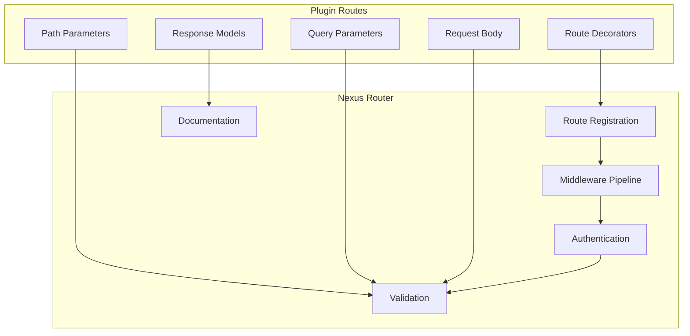

# Plugin API Routes

Learn how to create HTTP endpoints and API routes in your Nexus plugins.

## 🎯 Overview

API routes allow your plugins to expose HTTP endpoints that can be consumed by web applications, mobile apps, or other services. Nexus provides a powerful routing system built on FastAPI that automatically handles validation, documentation, and security.

## 🏗️ Route Architecture



## 🛣️ Basic Routes

### Simple GET Route

```python
from nexus.http import get, post, put, delete
from nexus.plugin import Plugin

class MyPlugin(Plugin):

    @get("/my-plugin/hello")
    async def hello_world(self):
        """Simple hello world endpoint."""
        return {"message": "Hello from my plugin!"}

    @get("/my-plugin/status")
    async def get_status(self):
        """Get plugin status."""
        return {
            "plugin": self.name,
            "version": self.version,
            "status": "running",
            "uptime": await self.get_uptime()
        }
```

### Route with Path Parameters

```python
@get("/my-plugin/users/{user_id}")
async def get_user(self, user_id: str):
    """Get user by ID."""
    user = await self.user_service.get_user(user_id)
    if not user:
        raise HTTPException(status_code=404, detail="User not found")

    return {
        "user_id": user.id,
        "username": user.username,
        "email": user.email,
        "created_at": user.created_at.isoformat()
    }

@delete("/my-plugin/users/{user_id}")
async def delete_user(self, user_id: str):
    """Delete user by ID."""
    success = await self.user_service.delete_user(user_id)
    if not success:
        raise HTTPException(status_code=404, detail="User not found")

    return {"message": f"User {user_id} deleted successfully"}
```

### Route with Query Parameters

```python
from typing import Optional

@get("/my-plugin/users")
async def list_users(
    self,
    page: int = 1,
    per_page: int = 20,
    search: Optional[str] = None,
    active: Optional[bool] = None
):
    """List users with filtering and pagination."""

    # Validate parameters
    if page < 1:
        raise HTTPException(status_code=400, detail="Page must be >= 1")
    if per_page < 1 or per_page > 100:
        raise HTTPException(status_code=400, detail="Per page must be between 1 and 100")

    # Build filters
    filters = {}
    if search:
        filters["search"] = search
    if active is not None:
        filters["active"] = active

    # Get users
    users, total = await self.user_service.list_users(
        page=page,
        per_page=per_page,
        filters=filters
    )

    return {
        "users": [user.to_dict() for user in users],
        "pagination": {
            "page": page,
            "per_page": per_page,
            "total": total,
            "pages": (total + per_page - 1) // per_page,
            "has_next": page * per_page < total,
            "has_prev": page > 1
        }
    }
```

## 📝 Request Validation

### Using Pydantic Models

```python
from pydantic import BaseModel, Field, validator
from typing import Optional, List
from datetime import datetime

class CreateUserRequest(BaseModel):
    username: str = Field(..., min_length=3, max_length=50)
    email: str = Field(..., regex=r'^[^@]+@[^@]+\.[^@]+$')
    password: str = Field(..., min_length=8)
    full_name: Optional[str] = Field(None, max_length=100)
    tags: Optional[List[str]] = Field(default_factory=list)

    @validator('username')
    def username_alphanumeric(cls, v):
        if not v.replace('_', '').replace('-', '').isalnum():
            raise ValueError('Username must be alphanumeric with optional - and _')
        return v

    @validator('password')
    def password_strength(cls, v):
        if not any(c.isupper() for c in v):
            raise ValueError('Password must contain at least one uppercase letter')
        if not any(c.islower() for c in v):
            raise ValueError('Password must contain at least one lowercase letter')
        if not any(c.isdigit() for c in v):
            raise ValueError('Password must contain at least one digit')
        return v

class UpdateUserRequest(BaseModel):
    email: Optional[str] = Field(None, regex=r'^[^@]+@[^@]+\.[^@]+$')
    full_name: Optional[str] = Field(None, max_length=100)
    active: Optional[bool] = None
    tags: Optional[List[str]] = None

class UserResponse(BaseModel):
    user_id: str
    username: str
    email: str
    full_name: Optional[str]
    active: bool
    tags: List[str]
    created_at: datetime
    updated_at: datetime

@post("/my-plugin/users", response_model=UserResponse)
async def create_user(self, request: CreateUserRequest):
    """Create a new user."""

    # Check if username exists
    if await self.user_service.username_exists(request.username):
        raise HTTPException(status_code=409, detail="Username already exists")

    # Check if email exists
    if await self.user_service.email_exists(request.email):
        raise HTTPException(status_code=409, detail="Email already exists")

    # Create user
    user = await self.user_service.create_user(
        username=request.username,
        email=request.email,
        password=request.password,
        full_name=request.full_name,
        tags=request.tags
    )

    return UserResponse(
        user_id=user.id,
        username=user.username,
        email=user.email,
        full_name=user.full_name,
        active=user.active,
        tags=user.tags,
        created_at=user.created_at,
        updated_at=user.updated_at
    )

@put("/my-plugin/users/{user_id}", response_model=UserResponse)
async def update_user(self, user_id: str, request: UpdateUserRequest):
    """Update an existing user."""

    user = await self.user_service.get_user(user_id)
    if not user:
        raise HTTPException(status_code=404, detail="User not found")

    # Update only provided fields
    update_data = request.dict(exclude_unset=True)

    # Check email uniqueness if email is being updated
    if 'email' in update_data and update_data['email'] != user.email:
        if await self.user_service.email_exists(update_data['email']):
            raise HTTPException(status_code=409, detail="Email already exists")

    updated_user = await self.user_service.update_user(user_id, update_data)

    return UserResponse(
        user_id=updated_user.id,
        username=updated_user.username,
        email=updated_user.email,
        full_name=updated_user.full_name,
        active=updated_user.active,
        tags=updated_user.tags,
        created_at=updated_user.created_at,
        updated_at=updated_user.updated_at
    )
```

## 🔐 Authentication & Authorization

### Protected Routes

```python
from nexus.auth import get_current_user, require_permission, require_role
from nexus.http import Depends

@get("/my-plugin/profile")
async def get_profile(self, current_user = Depends(get_current_user)):
    """Get current user's profile (requires authentication)."""

    profile = await self.user_service.get_user_profile(current_user.id)
    return {
        "user_id": current_user.id,
        "username": current_user.username,
        "profile": profile
    }

@get("/my-plugin/admin/users")
@require_permission("admin:users")
async def admin_list_users(self, current_user = Depends(get_current_user)):
    """List all users (requires admin permission)."""

    users = await self.user_service.get_all_users()
    return {"users": [user.to_dict() for user in users]}

@post("/my-plugin/admin/users/{user_id}/activate")
@require_role("administrator")
async def activate_user(
    self,
    user_id: str,
    current_user = Depends(get_current_user)
):
    """Activate a user (requires administrator role)."""

    success = await self.user_service.activate_user(user_id)
    if not success:
        raise HTTPException(status_code=404, detail="User not found")

    # Log admin action
    await self.audit_service.log_action(
        admin_id=current_user.id,
        action="activate_user",
        target_id=user_id
    )

    return {"message": f"User {user_id} activated successfully"}
```

### Custom Permission Checks

```python
from nexus.auth import get_current_user
from nexus.exceptions import PermissionDenied

async def check_user_access(user_id: str, current_user):
    """Check if current user can access specified user."""

    # Admins can access any user
    if current_user.has_permission("admin:users"):
        return True

    # Users can only access their own data
    if current_user.id == user_id:
        return True

    # Check if user is a manager of the target user
    if await self.user_service.is_manager(current_user.id, user_id):
        return True

    raise PermissionDenied("You don't have permission to access this user")

@get("/my-plugin/users/{user_id}/details")
async def get_user_details(
    self,
    user_id: str,
    current_user = Depends(get_current_user)
):
    """Get detailed user information."""

    await self.check_user_access(user_id, current_user)

    user = await self.user_service.get_user_with_details(user_id)
    if not user:
        raise HTTPException(status_code=404, detail="User not found")

    return user.to_detailed_dict()
```

## 📄 File Upload & Download

### File Upload

```python
from nexus.http import UploadFile, File
from typing import List
import os
import uuid

@post("/my-plugin/upload")
async def upload_file(
    self,
    file: UploadFile = File(...),
    current_user = Depends(get_current_user)
):
    """Upload a file."""

    # Validate file type
    allowed_types = ['image/jpeg', 'image/png', 'image/gif', 'application/pdf']
    if file.content_type not in allowed_types:
        raise HTTPException(
            status_code=400,
            detail=f"File type {file.content_type} not allowed"
        )

    # Validate file size (max 10MB)
    max_size = 10 * 1024 * 1024
    contents = await file.read()
    if len(contents) > max_size:
        raise HTTPException(status_code=400, detail="File too large")

    # Generate unique filename
    file_id = str(uuid.uuid4())
    file_extension = os.path.splitext(file.filename)[1]
    filename = f"{file_id}{file_extension}"

    # Save file
    file_path = await self.file_service.save_file(
        filename=filename,
        content=contents,
        content_type=file.content_type,
        uploaded_by=current_user.id
    )

    return {
        "file_id": file_id,
        "filename": file.filename,
        "content_type": file.content_type,
        "size": len(contents),
        "download_url": f"/my-plugin/files/{file_id}/download"
    }

@post("/my-plugin/upload/multiple")
async def upload_multiple_files(
    self,
    files: List[UploadFile] = File(...),
    current_user = Depends(get_current_user)
):
    """Upload multiple files."""

    if len(files) > 10:
        raise HTTPException(status_code=400, detail="Too many files (max 10)")

    results = []
    for file in files:
        try:
            result = await self.upload_single_file(file, current_user)
            results.append({"status": "success", "file": result})
        except Exception as e:
            results.append({
                "status": "error",
                "filename": file.filename,
                "error": str(e)
            })

    return {"results": results}
```

### File Download

```python
from nexus.http import FileResponse, StreamingResponse
import mimetypes

@get("/my-plugin/files/{file_id}/download")
async def download_file(self, file_id: str):
    """Download a file by ID."""

    file_info = await self.file_service.get_file_info(file_id)
    if not file_info:
        raise HTTPException(status_code=404, detail="File not found")

    file_path = file_info.path
    if not os.path.exists(file_path):
        raise HTTPException(status_code=404, detail="File not found on disk")

    # Determine content type
    content_type = file_info.content_type or mimetypes.guess_type(file_path)[0]

    return FileResponse(
        path=file_path,
        filename=file_info.original_filename,
        media_type=content_type
    )

@get("/my-plugin/files/{file_id}/stream")
async def stream_file(self, file_id: str):
    """Stream a file (useful for large files)."""

    file_info = await self.file_service.get_file_info(file_id)
    if not file_info:
        raise HTTPException(status_code=404, detail="File not found")

    async def generate_chunks():
        with open(file_info.path, 'rb') as f:
            while chunk := f.read(8192):  # 8KB chunks
                yield chunk

    return StreamingResponse(
        generate_chunks(),
        media_type=file_info.content_type,
        headers={
            "Content-Disposition": f"attachment; filename={file_info.original_filename}"
        }
    )
```

## 🔄 Async Operations & Background Tasks

### Background Tasks

```python
from nexus.background import BackgroundTasks

@post("/my-plugin/users/{user_id}/send-email")
async def send_user_email(
    self,
    user_id: str,
    email_data: dict,
    background_tasks: BackgroundTasks,
    current_user = Depends(get_current_user)
):
    """Send email to user (background task)."""

    user = await self.user_service.get_user(user_id)
    if not user:
        raise HTTPException(status_code=404, detail="User not found")

    # Add background task
    background_tasks.add_task(
        self.email_service.send_email,
        to=user.email,
        subject=email_data["subject"],
        body=email_data["body"],
        sender_id=current_user.id
    )

    return {"message": "Email queued for delivery"}
```

### Long-Running Operations

```python
import asyncio
from nexus.tasks import create_task, get_task_status

@post("/my-plugin/data/export")
async def export_data(
    self,
    export_request: dict,
    current_user = Depends(get_current_user)
):
    """Start data export (long-running operation)."""

    # Create task
    task_id = await create_task(
        self.data_service.export_data,
        user_id=current_user.id,
        filters=export_request.get("filters", {}),
        format=export_request.get("format", "csv")
    )

    return {
        "task_id": task_id,
        "status": "started",
        "status_url": f"/my-plugin/tasks/{task_id}/status"
    }

@get("/my-plugin/tasks/{task_id}/status")
async def get_task_status(self, task_id: str):
    """Get status of a background task."""

    status = await get_task_status(task_id)
    if not status:
        raise HTTPException(status_code=404, detail="Task not found")

    return {
        "task_id": task_id,
        "status": status.status,
        "progress": status.progress,
        "result": status.result,
        "error": status.error,
        "created_at": status.created_at,
        "completed_at": status.completed_at
    }
```

## 📊 Response Formats & Status Codes

### Custom Response Classes

```python
from nexus.http import JSONResponse, Response
from typing import Any, Dict

class APIResponse:
    """Standard API response format."""

    @staticmethod
    def success(data: Any = None, message: str = "Success") -> Dict:
        return {
            "success": True,
            "message": message,
            "data": data,
            "timestamp": datetime.utcnow().isoformat()
        }

    @staticmethod
    def error(message: str, code: str = None, details: Any = None) -> Dict:
        return {
            "success": False,
            "error": {
                "message": message,
                "code": code,
                "details": details
            },
            "timestamp": datetime.utcnow().isoformat()
        }

@get("/my-plugin/users/{user_id}")
async def get_user_standardized(self, user_id: str):
    """Get user with standardized response format."""

    user = await self.user_service.get_user(user_id)
    if not user:
        return JSONResponse(
            content=APIResponse.error("User not found", "USER_NOT_FOUND"),
            status_code=404
        )

    return APIResponse.success(
        data=user.to_dict(),
        message="User retrieved successfully"
    )

@post("/my-plugin/users/{user_id}/activate")
async def activate_user_with_status(self, user_id: str):
    """Activate user with appropriate status codes."""

    user = await self.user_service.get_user(user_id)
    if not user:
        return JSONResponse(
            content=APIResponse.error("User not found"),
            status_code=404
        )

    if user.is_active:
        return JSONResponse(
            content=APIResponse.error("User is already active"),
            status_code=409  # Conflict
        )

    await self.user_service.activate_user(user_id)

    return JSONResponse(
        content=APIResponse.success(message="User activated successfully"),
        status_code=200
    )
```

## 🎛️ Middleware & Request Processing

### Custom Middleware

```python
from nexus.middleware import middleware
import time
import logging

logger = logging.getLogger(__name__)

@middleware
async def timing_middleware(request, call_next):
    """Add timing information to responses."""
    start_time = time.time()

    response = await call_next(request)

    process_time = time.time() - start_time
    response.headers["X-Process-Time"] = str(process_time)

    # Log slow requests
    if process_time > 1.0:
        logger.warning(f"Slow request: {request.url} took {process_time:.2f}s")

    return response

@middleware
async def request_logging_middleware(request, call_next):
    """Log all requests."""
    logger.info(f"{request.method} {request.url}")

    response = await call_next(request)

    logger.info(f"Response: {response.status_code}")
    return response
```

### Request Context

```python
from nexus.context import get_request_context, set_request_context

@get("/my-plugin/context-example")
async def context_example(self, request):
    """Example using request context."""

    # Set context data
    set_request_context("plugin_name", self.name)
    set_request_context("request_id", str(uuid.uuid4()))

    # Access context in other parts of your code
    context = get_request_context()

    return {
        "message": "Context example",
        "context": context,
        "headers": dict(request.headers)
    }
```

## 📋 API Documentation

### OpenAPI Customization

```python
from nexus.docs import add_tag_metadata

# Add custom tags for your plugin endpoints
add_tag_metadata(
    name="My Plugin",
    description="Custom plugin providing user management functionality",
    external_docs={
        "description": "Plugin Documentation",
        "url": "https://docs.example.com/my-plugin"
    }
)

@get("/my-plugin/users", tags=["My Plugin", "Users"])
async def list_users_documented(
    self,
    page: int = Query(1, description="Page number", ge=1),
    per_page: int = Query(20, description="Items per page", ge=1, le=100)
):
    """
    List users with pagination.

    This endpoint returns a paginated list of users. You can control
    the pagination using the `page` and `per_page` parameters.

    - **page**: The page number to retrieve (starts from 1)
    - **per_page**: Number of items per page (1-100)

    Returns:
    - List of users
    - Pagination metadata
    """
    # Implementation here
    pass
```

## 🎯 Best Practices

### 1. Route Organization

```python
# Organize routes by functionality
class UserRoutes:
    """User management routes."""

    @get("/users")
    async def list_users(self): pass

    @post("/users")
    async def create_user(self): pass

    @get("/users/{user_id}")
    async def get_user(self): pass

class AdminRoutes:
    """Administrative routes."""

    @get("/admin/stats")
    async def get_stats(self): pass

    @post("/admin/maintenance")
    async def start_maintenance(self): pass
```

### 2. Error Handling

```python
from nexus.exceptions import APIException

class UserNotFoundError(APIException):
    def __init__(self, user_id: str):
        super().__init__(
            status_code=404,
            detail=f"User {user_id} not found",
            error_code="USER_NOT_FOUND"
        )

@get("/my-plugin/users/{user_id}")
async def get_user_with_custom_error(self, user_id: str):
    """Get user with custom error handling."""

    user = await self.user_service.get_user(user_id)
    if not user:
        raise UserNotFoundError(user_id)

    return user.to_dict()
```

### 3. Input Sanitization

```python
import html
import re

def sanitize_string(value: str) -> str:
    """Sanitize string input."""
    # Remove HTML tags
    value = re.sub(r'<[^>]+>', '', value)
    # Escape special characters
    value = html.escape(value)
    # Trim whitespace
    value = value.strip()
    return value

@post("/my-plugin/comments")
async def create_comment(self, comment_data: dict):
    """Create comment with input sanitization."""

    # Sanitize input
    content = sanitize_string(comment_data.get("content", ""))
    if not content:
        raise HTTPException(status_code=400, detail="Content is required")

    comment = await self.comment_service.create_comment(
        content=content,
        author_id=comment_data["author_id"]
    )

    return comment.to_dict()
```

### 4. Rate Limiting

```python
from nexus.ratelimit import rate_limit

@get("/my-plugin/search")
@rate_limit(requests=10, window=60)  # 10 requests per minute
async def search_endpoint(self, query: str):
    """Search with rate limiting."""

    results = await self.search_service.search(query)
    return {"results": results}
```

## 🧪 Testing Routes

### Route Testing

```python
import pytest
from nexus.testing import TestClient

@pytest.fixture
async def test_client():
    """Create test client."""
    return TestClient(app)

async def test_get_user(test_client):
    """Test get user endpoint."""

    # Create test user
    user = await create_test_user()

    # Test successful request
    response = await test_client.get(f"/my-plugin/users/{user.id}")
    assert response.status_code == 200

    data = response.json()
    assert data["user_id"] == user.id
    assert data["username"] == user.username

async def test_create_user_validation(test_client):
    """Test user creation validation."""

    # Test invalid email
    response = await test_client.post("/my-plugin/users", json={
        "username": "testuser",
        "email": "invalid-email",
        "password": "password123"
    })
    assert response.status_code == 422

    # Test short password
    response = await test_client.post("/my-plugin/users", json={
        "username": "testuser",
        "email": "test@example.com",
        "password": "123"
    })
    assert response.status_code == 422
```

## 🎯 Next Steps

- **[Database Integration](database.md)** - Connect routes to data storage
- **[Event Handling](events.md)** - Emit events from routes
- **[Testing Strategies](testing.md)** - Comprehensive route testing
- **[Advanced Features](advanced.md)** - WebSockets, GraphQL, and more

---

**API routes are the interface between your plugin and the outside world.** Design them thoughtfully with proper validation, security, and documentation to create robust, user-friendly APIs.
