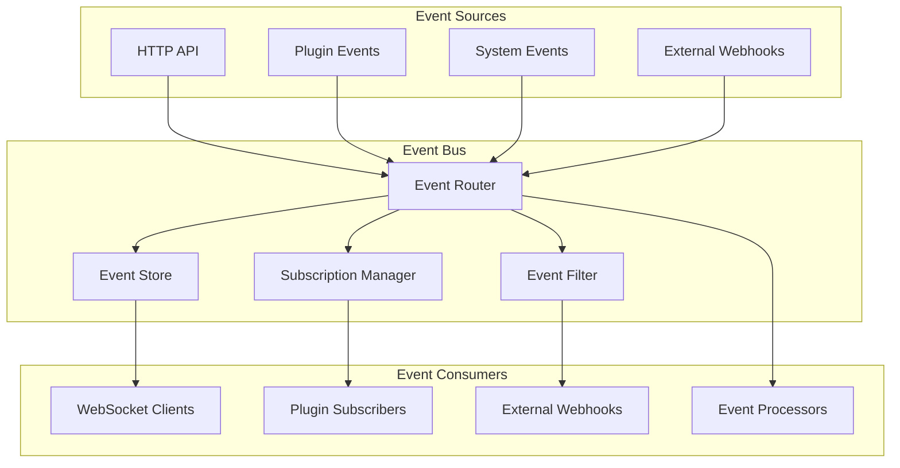

# Events API

Complete API reference for the Nexus event system.

## 🎯 Overview

The Events API provides endpoints for interacting with the Nexus event system, including emitting events, subscribing to event streams, managing event subscriptions, and querying event history. This API enables real-time communication between plugins and external systems.

## 🏗️ Event API Architecture



## 📡 Event Management

### Emit Event

Emit a new event to the event bus.

```http
POST /api/v1/events
Authorization: Bearer <token>
Content-Type: application/json

{
  "event_type": "user.profile.updated",
  "source": "user-management-plugin",
  "data": {
    "user_id": "user_123",
    "updated_fields": ["full_name", "email"],
    "old_values": {
      "full_name": "John Doe",
      "email": "john.old@example.com"
    },
    "new_values": {
      "full_name": "John Smith",
      "email": "john.new@example.com"
    }
  },
  "metadata": {
    "correlation_id": "corr_abc123",
    "request_id": "req_def456",
    "user_agent": "Mozilla/5.0...",
    "ip_address": "192.168.1.100"
  },
  "priority": 5,
  "expires_at": "2024-01-02T12:00:00Z"
}
```

**Response:**
```json
{
  "success": true,
  "data": {
    "event": {
      "event_id": "evt_789012",
      "event_type": "user.profile.updated",
      "source": "user-management-plugin",
      "timestamp": "2024-01-01T12:00:00Z",
      "priority": 5,
      "status": "emitted",
      "subscriber_count": 3
    }
  }
}
```

### Get Event Details

Get detailed information about a specific event.

```http
GET /api/v1/events/{event_id}
Authorization: Bearer <token>
```

**Response:**
```json
{
  "success": true,
  "data": {
    "event": {
      "event_id": "evt_789012",
      "event_type": "user.profile.updated",
      "source": "user-management-plugin",
      "timestamp": "2024-01-01T12:00:00Z",
      "priority": 5,
      "status": "processed",
      "data": {
        "user_id": "user_123",
        "updated_fields": ["full_name", "email"],
        "old_values": {
          "full_name": "John Doe",
          "email": "john.old@example.com"
        },
        "new_values": {
          "full_name": "John Smith",
          "email": "john.new@example.com"
        }
      },
      "metadata": {
        "correlation_id": "corr_abc123",
        "request_id": "req_def456",
        "processing_time_ms": 150
      },
      "delivery_info": {
        "total_subscribers": 3,
        "successful_deliveries": 3,
        "failed_deliveries": 0,
        "delivery_attempts": [
          {
            "subscriber": "analytics-plugin",
            "status": "delivered",
            "delivery_time": "2024-01-01T12:00:00.150Z",
            "processing_time_ms": 25
          },
          {
            "subscriber": "notification-plugin",
            "status": "delivered",
            "delivery_time": "2024-01-01T12:00:00.200Z",
            "processing_time_ms": 75
          }
        ]
      }
    }
  }
}
```

### List Events

Get paginated list of events with filtering options.

```http
GET /api/v1/events
Authorization: Bearer <token>
```

**Query Parameters:**
- `event_type` (string): Filter by event type (supports wildcards)
- `source` (string): Filter by event source
- `start_time` (string): Start time for events (ISO 8601)
- `end_time` (string): End time for events (ISO 8601)
- `correlation_id` (string): Filter by correlation ID
- `priority` (integer): Filter by priority level
- `status` (string): Filter by status (emitted, processing, processed, failed)
- `page` (integer): Page number (default: 1)
- `per_page` (integer): Items per page (default: 20, max: 100)
- `sort` (string): Sort field (timestamp, priority, event_type)
- `order` (string): Sort order (asc, desc)

**Response:**
```json
{
  "success": true,
  "data": {
    "events": [
      {
        "event_id": "evt_789012",
        "event_type": "user.profile.updated",
        "source": "user-management-plugin",
        "timestamp": "2024-01-01T12:00:00Z",
        "priority": 5,
        "status": "processed",
        "subscriber_count": 3,
        "data_preview": {
          "user_id": "user_123",
          "updated_fields": ["full_name", "email"]
        }
      }
    ],
    "pagination": {
      "page": 1,
      "per_page": 20,
      "total": 1500,
      "pages": 75,
      "has_next": true,
      "has_prev": false
    },
    "filters_applied": {
      "event_type": "user.*",
      "start_time": "2024-01-01T00:00:00Z"
    }
  }
}
```

## 📋 Event Subscriptions

### Create Subscription

Subscribe to events matching specific criteria.

```http
POST /api/v1/events/subscriptions
Authorization: Bearer <token>
Content-Type: application/json

{
  "name": "User Activity Monitor",
  "event_patterns": ["user.*", "auth.login", "auth.logout"],
  "filters": {
    "source": ["user-management-plugin", "auth-plugin"],
    "priority": {
      "min": 1,
      "max": 10
    },
    "data_filters": {
      "user_id": "user_123"
    }
  },
  "delivery_method": "webhook",
  "webhook_config": {
    "url": "https://myapp.com/webhooks/nexus-events",
    "secret": "webhook_secret_123",
    "retry_policy": {
      "max_attempts": 3,
      "retry_delay_seconds": 5,
      "exponential_backoff": true
    },
    "timeout_seconds": 30
  },
  "batch_config": {
    "enabled": true,
    "max_batch_size": 50,
    "max_wait_time_seconds": 30
  },
  "enabled": true
}
```

**Response:**
```json
{
  "success": true,
  "data": {
    "subscription": {
      "subscription_id": "sub_456789",
      "name": "User Activity Monitor",
      "status": "active",
      "created_at": "2024-01-01T12:00:00Z",
      "event_patterns": ["user.*", "auth.login", "auth.logout"],
      "delivery_method": "webhook",
      "webhook_url": "https://myapp.com/webhooks/nexus-events",
      "events_delivered": 0,
      "last_delivery": null
    }
  }
}
```

### List Subscriptions

Get list of event subscriptions.

```http
GET /api/v1/events/subscriptions
Authorization: Bearer <token>
```

**Query Parameters:**
- `status` (string): Filter by status (active, paused, error)
- `delivery_method` (string): Filter by delivery method
- `event_pattern` (string): Filter by event pattern

**Response:**
```json
{
  "success": true,
  "data": {
    "subscriptions": [
      {
        "subscription_id": "sub_456789",
        "name": "User Activity Monitor",
        "status": "active",
        "event_patterns": ["user.*", "auth.login"],
        "delivery_method": "webhook",
        "webhook_url": "https://myapp.com/webhooks/nexus-events",
        "events_delivered": 1250,
        "last_delivery": "2024-01-01T11:59:00Z",
        "success_rate": 0.98,
        "created_at": "2023-12-01T10:00:00Z"
      }
    ]
  }
}
```

### Update Subscription

Update an existing event subscription.

```http
PUT /api/v1/events/subscriptions/{subscription_id}
Authorization: Bearer <token>
Content-Type: application/json

{
  "name": "Updated User Activity Monitor",
  "event_patterns": ["user.*", "auth.*"],
  "enabled": true,
  "webhook_config": {
    "url": "https://myapp.com/webhooks/nexus-events-v2"
  }
}
```

### Delete Subscription

Remove an event subscription.

```http
DELETE /api/v1/events/subscriptions/{subscription_id}
Authorization: Bearer <token>
```

**Response:**
```json
{
  "success": true,
  "message": "Subscription deleted successfully"
}
```

## 🔄 Real-time Event Streaming

### WebSocket Event Stream

Connect to real-time event stream via WebSocket.

```javascript
// WebSocket connection
const ws = new WebSocket('wss://api.nexus.dev/v1/events/stream?token=<access_token>');

// Subscribe to specific events
ws.send(JSON.stringify({
  "action": "subscribe",
  "patterns": ["user.*", "system.health"],
  "filters": {
    "priority": {"min": 5}
  }
}));

// Handle incoming events
ws.onmessage = function(event) {
  const data = JSON.parse(event.data);
  console.log('Received event:', data);
};
```

**WebSocket Message Format:**
```json
{
  "message_type": "event",
  "event": {
    "event_id": "evt_789012",
    "event_type": "user.profile.updated",
    "source": "user-management-plugin",
    "timestamp": "2024-01-01T12:00:00Z",
    "data": {
      "user_id": "user_123",
      "updated_fields": ["full_name"]
    }
  }
}
```

### Server-Sent Events (SSE)

Connect to event stream using Server-Sent Events.

```http
GET /api/v1/events/stream
Authorization: Bearer <token>
Accept: text/event-stream
```

**Query Parameters:**
- `patterns` (array): Event patterns to subscribe to
- `last_event_id` (string): Resume from specific event ID

**Response Stream:**
```
data: {"event_id":"evt_789012","event_type":"user.login","source":"auth-plugin","timestamp":"2024-01-01T12:00:00Z","data":{"user_id":"user_123"}}

data: {"event_id":"evt_789013","event_type":"user.profile.updated","source":"user-management-plugin","timestamp":"2024-01-01T12:01:00Z","data":{"user_id":"user_123","updated_fields":["email"]}}
```

## 📊 Event Analytics

### Event Statistics

Get event system statistics and metrics.

```http
GET /api/v1/events/stats
Authorization: Bearer <token>
```

**Query Parameters:**
- `start_time` (string): Start time for statistics
- `end_time` (string): End time for statistics
- `group_by` (string): Group by (event_type, source, hour, day)

**Response:**
```json
{
  "success": true,
  "data": {
    "summary": {
      "total_events": 15420,
      "events_per_minute": 25.5,
      "unique_event_types": 45,
      "active_subscriptions": 12,
      "average_processing_time_ms": 150
    },
    "by_event_type": [
      {
        "event_type": "user.login",
        "count": 2500,
        "percentage": 16.2,
        "avg_processing_time_ms": 125
      },
      {
        "event_type": "user.logout",
        "count": 2450,
        "percentage": 15.9,
        "avg_processing_time_ms": 98
      }
    ],
    "by_source": [
      {
        "source": "auth-plugin",
        "count": 5000,
        "percentage": 32.4
      },
      {
        "source": "user-management-plugin",
        "count": 3500,
        "percentage": 22.7
      }
    ],
    "timeline": [
      {
        "timestamp": "2024-01-01T11:00:00Z",
        "event_count": 150,
        "avg_processing_time_ms": 145
      },
      {
        "timestamp": "2024-01-01T12:00:00Z",
        "event_count": 180,
        "avg_processing_time_ms": 155
      }
    ]
  }
}
```

### Event Health

Get event system health and performance metrics.

```http
GET /api/v1/events/health
Authorization: Bearer <token>
```

**Response:**
```json
{
  "success": true,
  "data": {
    "status": "healthy",
    "last_check": "2024-01-01T12:00:00Z",
    "metrics": {
      "queue_size": 25,
      "processing_rate": 150.5,
      "error_rate": 0.002,
      "average_latency_ms": 125,
      "memory_usage_mb": 128,
      "active_connections": 45
    },
    "checks": [
      {
        "name": "event_queue",
        "status": "healthy",
        "details": "Queue size within normal limits"
      },
      {
        "name": "event_processing",
        "status": "healthy",
        "details": "Processing rate normal"
      },
      {
        "name": "subscription_delivery",
        "status": "warning",
        "details": "Some webhook deliveries failing"
      }
    ]
  }
}
```

## 🎛️ Event Management

### Replay Events

Replay events to subscribers (admin only).

```http
POST /api/v1/events/replay
Authorization: Bearer <admin_token>
Content-Type: application/json

{
  "event_filter": {
    "event_types": ["user.created", "user.updated"],
    "start_time": "2024-01-01T00:00:00Z",
    "end_time": "2024-01-01T23:59:59Z",
    "correlation_id": "corr_abc123"
  },
  "target_subscribers": ["analytics-plugin", "reporting-plugin"],
  "replay_mode": "sequential",
  "delay_between_events_ms": 100
}
```

**Response:**
```json
{
  "success": true,
  "data": {
    "replay_id": "replay_123456",
    "status": "started",
    "events_to_replay": 1250,
    "estimated_duration_minutes": 15,
    "started_at": "2024-01-01T12:00:00Z"
  }
}
```

### Get Replay Status

Check status of event replay operation.

```http
GET /api/v1/events/replay/{replay_id}
Authorization: Bearer <admin_token>
```

**Response:**
```json
{
  "success": true,
  "data": {
    "replay": {
      "replay_id": "replay_123456",
      "status": "in_progress",
      "progress": {
        "events_replayed": 750,
        "total_events": 1250,
        "percentage": 60.0
      },
      "started_at": "2024-01-01T12:00:00Z",
      "estimated_completion": "2024-01-01T12:09:00Z",
      "errors": []
    }
  }
}
```

### Purge Events

Remove old events from the event store (admin only).

```http
POST /api/v1/events/purge
Authorization: Bearer <admin_token>
Content-Type: application/json

{
  "criteria": {
    "older_than_days": 90,
    "event_types": ["debug.*", "trace.*"],
    "status": ["processed", "failed"]
  },
  "dry_run": false,
  "batch_size": 1000
}
```

**Response:**
```json
{
  "success": true,
  "data": {
    "purge_id": "purge_789012",
    "events_to_purge": 50000,
    "estimated_duration_minutes": 30,
    "started_at": "2024-01-01T12:00:00Z"
  }
}
```

## 🔒 Event Security

### Event Encryption

Events can be encrypted for sensitive data.

```http
POST /api/v1/events
Authorization: Bearer <token>
Content-Type: application/json

{
  "event_type": "payment.processed",
  "source": "payment-plugin",
  "data": {
    "encrypted": true,
    "encryption_method": "AES-256-GCM",
    "encrypted_payload": "eyJhbGciOiJSUzI1NiIsInR5cCI6IkpXVCJ9..."
  },
  "security_level": "high"
}
```

### Event Audit

Get audit trail for events.

```http
GET /api/v1/events/{event_id}/audit
Authorization: Bearer <admin_token>
```

**Response:**
```json
{
  "success": true,
  "data": {
    "audit_trail": [
      {
        "timestamp": "2024-01-01T12:00:00Z",
        "action": "event_emitted",
        "actor": "user-management-plugin",
        "details": "Event emitted by plugin"
      },
      {
        "timestamp": "2024-01-01T12:00:00.150Z",
        "action": "event_delivered",
        "actor": "analytics-plugin",
        "details": "Event delivered to subscriber"
      }
    ]
  }
}
```

## 🚨 Error Codes

### Event-Specific Errors

| Code | HTTP Status | Description |
|------|-------------|-------------|
| `EVENT_NOT_FOUND` | 404 | Event not found |
| `INVALID_EVENT_TYPE` | 400 | Invalid event type format |
| `EVENT_TOO_LARGE` | 413 | Event payload exceeds size limit |
| `SUBSCRIPTION_NOT_FOUND` | 404 | Subscription not found |
| `SUBSCRIPTION_LIMIT_EXCEEDED` | 429 | Too many subscriptions |
| `WEBHOOK_DELIVERY_FAILED` | 502 | Webhook delivery failed |
| `EVENT_EXPIRED` | 410 | Event has expired |
| `INSUFFICIENT_EVENT_PERMISSIONS` | 403 | Insufficient permissions for event operation |

## 📝 Usage Examples

### Complete Event Workflow

```bash
# 1. Emit an event
curl -X POST "https://api.nexus.dev/v1/events" \
  -H "Authorization: Bearer <token>" \
  -H "Content-Type: application/json" \
  -d '{
    "event_type": "order.created",
    "source": "ecommerce-plugin",
    "data": {
      "order_id": "order_123",
      "customer_id": "customer_456",
      "total_amount": 99.99
    }
  }'

# 2. Create subscription
curl -X POST "https://api.nexus.dev/v1/events/subscriptions" \
  -H "Authorization: Bearer <token>" \
  -H "Content-Type: application/json" \
  -d '{
    "name": "Order Processing",
    "event_patterns": ["order.*"],
    "delivery_method": "webhook",
    "webhook_config": {
      "url": "https://myapp.com/webhooks/orders"
    }
  }'

# 3. List events
curl -X GET "https://api.nexus.dev/v1/events?event_type=order.*&start_time=2024-01-01T00:00:00Z" \
  -H "Authorization: Bearer <token>"

# 4. Get event statistics
curl -X GET "https://api.nexus.dev/v1/events/stats?group_by=event_type" \
  -H "Authorization: Bearer <token>"
```

### WebSocket Event Streaming

```javascript
// Connect to event stream
const ws = new WebSocket('wss://api.nexus.dev/v1/events/stream?token=<token>');

ws.onopen = function() {
  // Subscribe to user events
  ws.send(JSON.stringify({
    "action": "subscribe",
    "patterns": ["user.*"],
    "filters": {
      "priority": {"min": 3}
    }
  }));
};

ws.onmessage = function(event) {
  const data = JSON.parse(event.data);

  if (data.message_type === 'event') {
    console.log('Event received:', data.event);

    // Process the event
    processEvent(data.event);
  }
};

function processEvent(event) {
  switch(event.event_type) {
    case 'user.created':
      handleUserCreated(event.data);
      break;
    case 'user.updated':
      handleUserUpdated(event.data);
      break;
  }
}
```

## 🎯 Best Practices

### Event Design
1. **Use clear, hierarchical event types** (e.g., `user.profile.updated`)
2. **Include sufficient context** in event data
3. **Use correlation IDs** to track related events
4. **Keep events immutable** - don't modify after emission
5. **Version your event schemas** for backward compatibility

### Performance
1. **Use appropriate priorities** for event processing
2. **Batch events** when possible for better throughput
3. **Monitor queue sizes** and processing times
4. **Use filters** to reduce unnecessary event processing
5. **Implement proper error handling** in subscribers

### Security
1. **Encrypt sensitive event data**
2. **Use proper authentication** for event operations
3. **Validate event sources** and permissions
4. **Audit critical events** for compliance
5. **Implement rate limiting** for event emission

## 🔗 Related APIs

- **[Plugin API](plugins.md)** - Plugin event handlers
- **[Admin API](admin.md)** - Event system administration
- **[Core API](core.md)** - System event monitoring

---

**The Events API enables powerful real-time communication in Nexus.** Use these endpoints to build responsive, event-driven applications that can react to changes and coordinate between components effectively.
