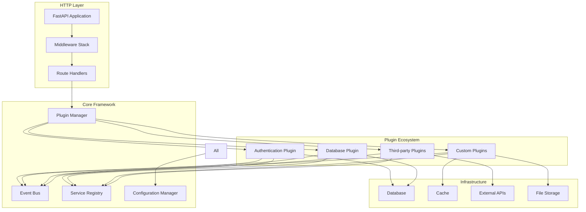
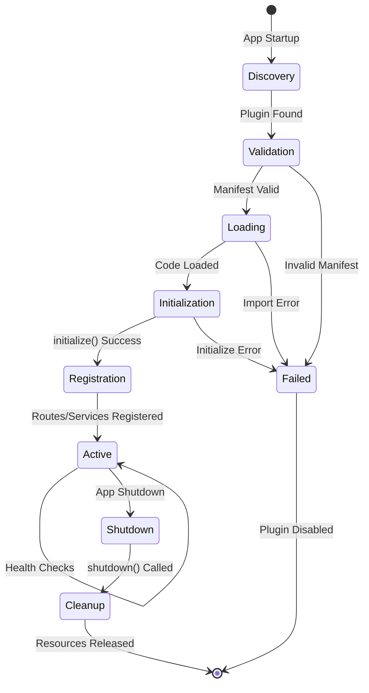
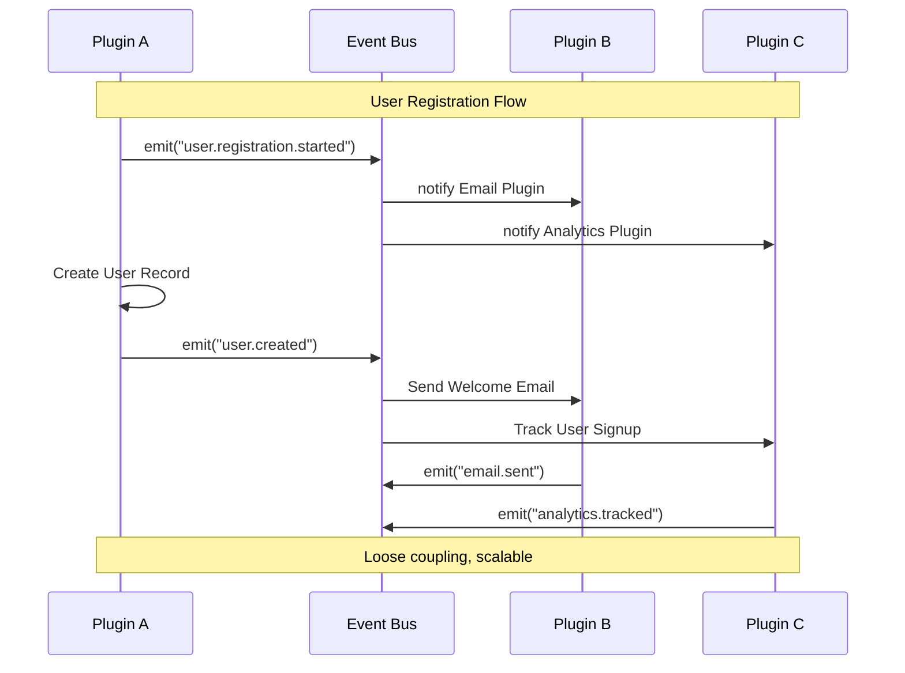
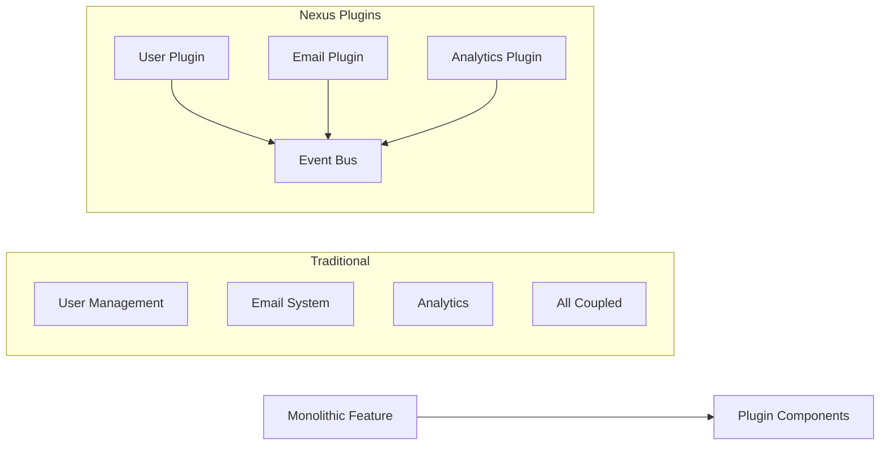
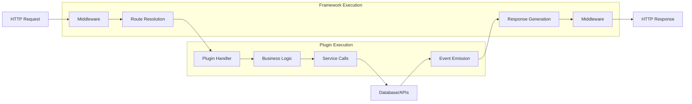
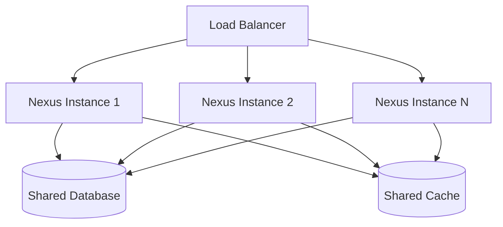
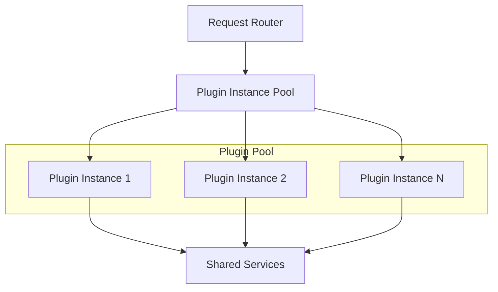
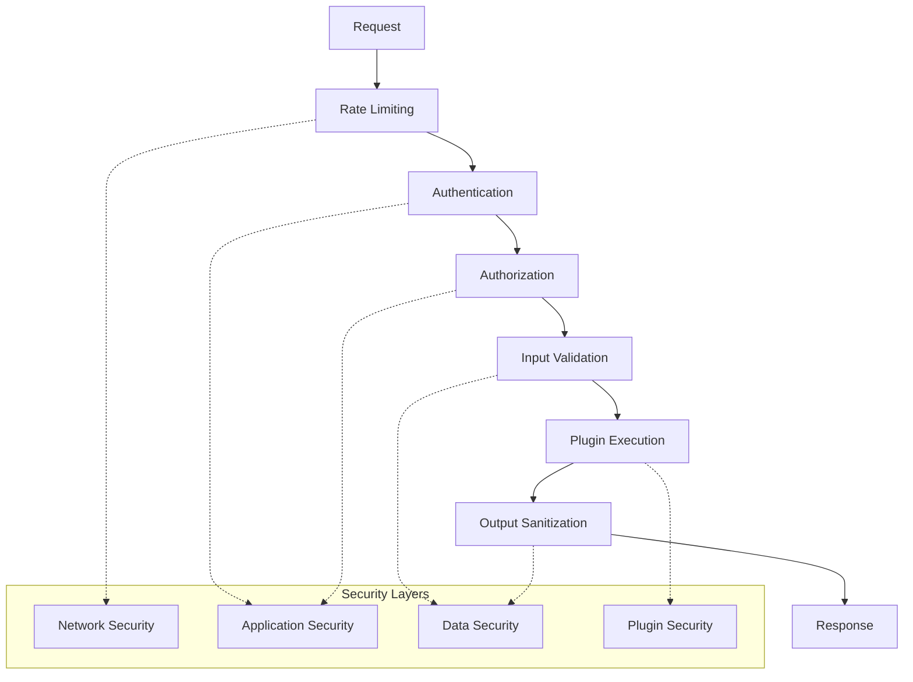
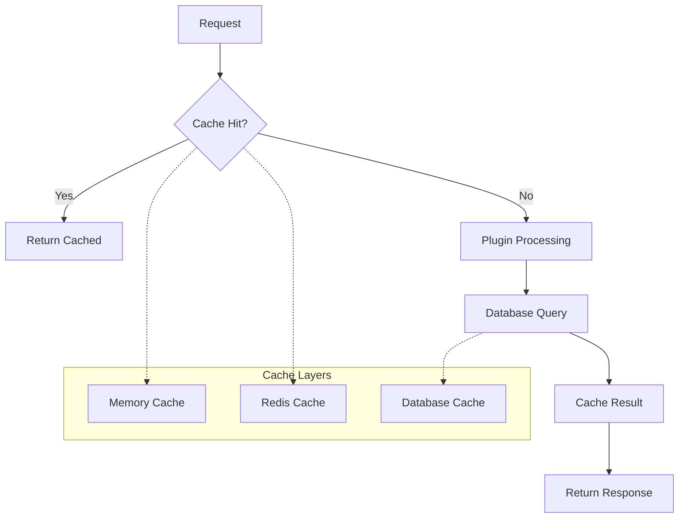

# Architecture Overview

Understanding the high-level design and principles that make Nexus a powerful plugin-based application platform.

## 🎯 Core Philosophy

Nexus is built on the principle that **everything is a plugin**. This fundamental design decision shapes every aspect of the architecture:

- **Modularity First**: Features are isolated, independent components
- **Event-Driven**: Loose coupling through asynchronous communication
- **Service-Oriented**: Shared functionality through service registry
- **Configuration-Driven**: Behavior controlled through declarative config

## 🏗️ High-Level Architecture



## 🧩 Component Layers

### 1. HTTP Layer
**Purpose**: Handle incoming requests and outgoing responses
- **FastAPI Application**: ASGI-compliant web framework
- **Middleware Stack**: Cross-cutting concerns (CORS, auth, logging)
- **Route Handlers**: Map URLs to plugin functionality

### 2. Core Framework
**Purpose**: Provide plugin infrastructure and coordination
- **Plugin Manager**: Lifecycle management and dependency resolution
- **Event Bus**: Asynchronous inter-plugin communication
- **Service Registry**: Dependency injection and service discovery
- **Configuration Manager**: Environment-specific settings

### 3. Plugin Ecosystem
**Purpose**: Implement business logic and features
- **Core Plugins**: Essential framework functionality
- **Custom Plugins**: Application-specific features
- **Third-party Plugins**: External integrations

### 4. Infrastructure Layer
**Purpose**: External systems and storage
- **Databases**: Persistent data storage
- **Caches**: High-speed data access
- **External APIs**: Third-party service integration
- **File Storage**: Document and media management

## 🔄 Plugin Lifecycle



## 💫 Event-Driven Communication



## 🎯 Design Principles

### 1. Plugin-First Architecture


**Benefits:**
- Independent development and testing
- Hot-swappable components
- Clear responsibility boundaries
- Reusable across projects

### 2. Dependency Injection
```python
# Service Registration
service_registry.register("email", EmailService())
service_registry.register("storage", FileStorage())

# Service Usage
class UserPlugin(BasePlugin):
    def __init__(self):
        self.email = service_registry.get("email")
        self.storage = service_registry.get("storage")
```

**Benefits:**
- Testable components (easy mocking)
- Configurable implementations
- Runtime service switching
- Clear dependency management

### 3. Configuration-Driven Behavior
```yaml
plugins:
  user_manager:
    max_users: 1000
    email_verification: true
    
  email_service:
    provider: "sendgrid"
    templates_dir: "./templates"
```

**Benefits:**
- Environment-specific behavior
- Runtime reconfiguration
- Non-technical user control
- Deployment flexibility

## 🚀 Request Processing Flow



## 📊 Scalability Patterns

### Horizontal Scaling


**Characteristics:**
- Stateless application instances
- Shared data layer
- Session-less design
- Plugin isolation

### Plugin-Level Scaling


**Benefits:**
- Independent plugin scaling
- Resource optimization
- Fault isolation
- Performance tuning

## 🛡️ Security Model



**Key Features:**
- Multi-layer security validation
- Plugin-level permissions
- Resource access control
- Audit logging

## ⚡ Performance Characteristics

### Async-First Design
- **Non-blocking I/O**: All operations are async-capable
- **Concurrent Processing**: Multiple requests handled simultaneously
- **Resource Efficiency**: Optimal CPU and memory usage
- **Scalable Architecture**: Handles thousands of concurrent connections

### Memory Management
- **Plugin Isolation**: Separate memory spaces prevent interference
- **Resource Pooling**: Reuse expensive objects (DB connections)
- **Lazy Loading**: Load resources only when needed
- **Garbage Collection**: Optimized for plugin lifecycle

### Caching Strategy


## 🎯 Architecture Benefits

### For Development Teams
- **Parallel Development**: Teams work on independent plugins
- **Clear Boundaries**: Well-defined interfaces and contracts
- **Easy Testing**: Isolated components with mocked dependencies
- **Rapid Prototyping**: Quick plugin creation and deployment

### For Operations Teams
- **Monitoring Ready**: Built-in metrics and health checks
- **Deployment Flexibility**: Independent plugin deployment
- **Scaling Options**: Fine-grained resource allocation
- **Troubleshooting**: Clear component boundaries for debugging

### For Business Stakeholders
- **Feature Velocity**: Faster time-to-market for new features
- **Risk Reduction**: Isolated failures don't affect entire system
- **Cost Optimization**: Pay for only what you use
- **Vendor Flexibility**: Easy integration switching

## 🚀 Next Steps

To dive deeper into specific aspects:

- **[Core Components](core-components.md)** - Detailed component architecture
- **[Event System](events.md)** - Event-driven communication patterns
- **[Security Model](security.md)** - Security architecture and best practices
- **[Plugin Development](../plugins/basics.md)** - Build plugins with this architecture

---

**This architecture enables building complex, scalable applications while maintaining simplicity through the plugin system.**