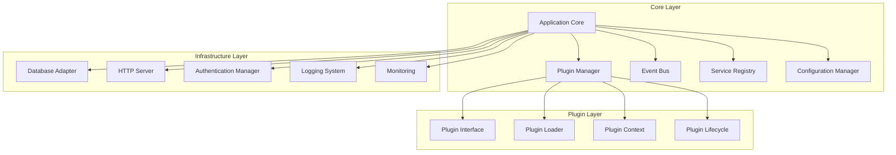
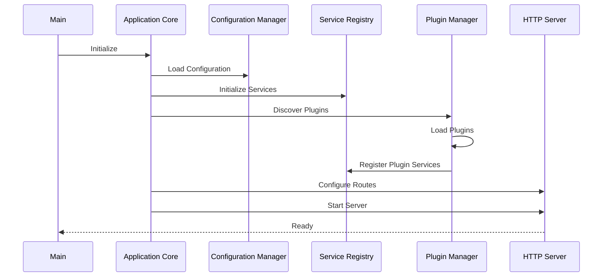
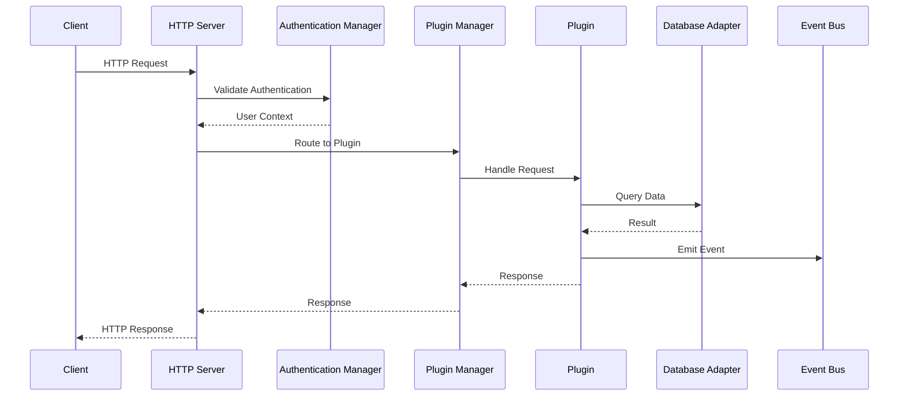

# Core Components

Understanding the fundamental building blocks that power the Nexus platform.

## 🎯 Overview

Nexus is built on a collection of core components that work together to provide a robust, extensible plugin platform. Each component has a specific responsibility and well-defined interfaces.

## 🏗️ Component Architecture



## 🔧 Core Components

### Application Core

The central orchestrator that manages the entire Nexus platform.

**Responsibilities:**
- Application lifecycle management
- Component coordination
- Error handling and recovery
- Graceful shutdown procedures

**Key Methods:**
```python
class ApplicationCore:
    async def startup(self) -> None
    async def shutdown(self) -> None
    def get_component(self, name: str) -> Any
    def register_component(self, name: str, component: Any) -> None
```

### Plugin Manager

Manages the complete plugin lifecycle from discovery to cleanup.

**Responsibilities:**
- Plugin discovery and loading
- Dependency resolution
- Plugin isolation and sandboxing
- Hot-reload capabilities

**Key Features:**
- **Discovery**: Automatic plugin detection
- **Loading**: Safe plugin initialization
- **Isolation**: Separate namespaces for plugins
- **Lifecycle**: Complete plugin state management

```python
class PluginManager:
    async def discover_plugins(self) -> List[PluginInfo]
    async def load_plugin(self, plugin_info: PluginInfo) -> Plugin
    async def unload_plugin(self, plugin_id: str) -> None
    async def reload_plugin(self, plugin_id: str) -> Plugin
```

### Event Bus

Provides asynchronous, decoupled communication between components.

**Responsibilities:**
- Event routing and distribution
- Subscription management
- Priority-based event handling
- Event persistence and replay

**Event Types:**
- **System Events**: Application lifecycle events
- **Plugin Events**: Plugin-specific events
- **Custom Events**: User-defined events
- **Error Events**: Exception and error handling

```python
class EventBus:
    async def emit(self, event: Event) -> None
    async def subscribe(self, event_type: str, handler: Callable) -> str
    async def unsubscribe(self, subscription_id: str) -> None
    async def wait_for(self, event_type: str, timeout: float = None) -> Event
```

### Service Registry

Implements dependency injection and service discovery patterns.

**Responsibilities:**
- Service registration and discovery
- Dependency injection
- Service lifecycle management
- Interface validation

**Service Types:**
- **Singleton**: Single instance per application
- **Transient**: New instance per request
- **Scoped**: Instance per scope/context
- **Factory**: Custom creation logic

```python
class ServiceRegistry:
    def register(self, interface: Type, implementation: Type,
                 lifecycle: ServiceLifecycle = ServiceLifecycle.SINGLETON) -> None
    def get(self, interface: Type) -> Any
    def resolve(self, target: Type) -> Any
    def create_scope(self) -> ServiceScope
```

### Configuration Manager

Centralized configuration management with environment-aware settings.

**Responsibilities:**
- Configuration loading and parsing
- Environment-specific overrides
- Configuration validation
- Hot-reload of configuration changes

**Configuration Sources:**
- **Files**: YAML, JSON, TOML configuration files
- **Environment**: Environment variables
- **CLI**: Command-line arguments
- **Remote**: External configuration services

```python
class ConfigurationManager:
    def load_config(self, source: str) -> Dict[str, Any]
    def get(self, key: str, default: Any = None) -> Any
    def set(self, key: str, value: Any) -> None
    def watch(self, key: str, callback: Callable) -> str
```

## 🛠️ Infrastructure Components

### Database Adapter

Provides unified database access across different database systems.

**Features:**
- **Multi-database**: Support for PostgreSQL, MySQL, SQLite
- **Connection pooling**: Efficient connection management
- **Migration system**: Database schema versioning
- **Query builder**: Type-safe query construction

```python
class DatabaseAdapter:
    async def connect(self, connection_string: str) -> None
    async def execute(self, query: str, params: Dict = None) -> Any
    async def fetch_one(self, query: str, params: Dict = None) -> Dict
    async def fetch_all(self, query: str, params: Dict = None) -> List[Dict]
```

### HTTP Server

FastAPI-based HTTP server with plugin-aware routing.

**Features:**
- **Auto-routing**: Automatic route discovery from plugins
- **Middleware**: Extensible middleware pipeline
- **OpenAPI**: Automatic API documentation
- **WebSocket**: Real-time communication support

```python
class HTTPServer:
    def add_route(self, path: str, handler: Callable, methods: List[str]) -> None
    def add_middleware(self, middleware: Callable) -> None
    def add_websocket(self, path: str, handler: Callable) -> None
    async def start(self, host: str = "0.0.0.0", port: int = 8000) -> None
```

### Authentication Manager

Handles authentication and authorization across the platform.

**Features:**
- **Multi-provider**: JWT, OAuth2, API Keys
- **Role-based access**: Fine-grained permissions
- **Session management**: Secure session handling
- **Token validation**: Comprehensive token verification

```python
class AuthenticationManager:
    async def authenticate(self, credentials: Dict) -> User
    async def authorize(self, user: User, resource: str, action: str) -> bool
    async def create_token(self, user: User) -> str
    async def validate_token(self, token: str) -> User
```

## 🔄 Component Interactions

### Startup Sequence



### Request Processing



## 🎨 Design Patterns

### Component Pattern

Each core component follows a consistent pattern:

```python
from abc import ABC, abstractmethod
from typing import Any, Dict, List

class Component(ABC):
    def __init__(self, config: Dict[str, Any]):
        self.config = config
        self._initialized = False

    @abstractmethod
    async def initialize(self) -> None:
        """Initialize the component."""
        pass

    @abstractmethod
    async def cleanup(self) -> None:
        """Clean up resources."""
        pass

    @property
    def is_initialized(self) -> bool:
        return self._initialized
```

### Dependency Injection

Services are injected using type annotations:

```python
from nexus.core import inject

class MyService:
    def __init__(self, db: DatabaseAdapter = inject()):
        self.db = db

    async def get_data(self) -> List[Dict]:
        return await self.db.fetch_all("SELECT * FROM data")
```

### Event-Driven Communication

Components communicate through events:

```python
from nexus.events import Event, EventBus

class UserCreatedEvent(Event):
    event_type = "user.created"

    def __init__(self, user_id: str):
        super().__init__()
        self.user_id = user_id

# Emit event
await event_bus.emit(UserCreatedEvent("user-123"))

# Subscribe to event
@event_bus.subscribe("user.created")
async def on_user_created(event: UserCreatedEvent):
    print(f"User {event.user_id} created")
```

## 🚀 Performance Optimizations

### Connection Pooling

All network connections use pooling for optimal performance:

```python
# Database connections
db_config = {
    "pool_size": 20,
    "max_overflow": 30,
    "pool_timeout": 30,
    "pool_recycle": 3600
}

# HTTP client connections
http_config = {
    "connector": aiohttp.TCPConnector(
        limit=100,
        limit_per_host=30,
        keepalive_timeout=300
    )
}
```

### Async-First Design

All components use async/await for non-blocking operations:

```python
class AsyncComponent:
    async def process_request(self, request: Request) -> Response:
        # Non-blocking database query
        data = await self.db.fetch_all("SELECT * FROM users")

        # Non-blocking HTTP call
        result = await self.http_client.get("https://api.example.com/data")

        # Non-blocking event emission
        await self.event_bus.emit(ProcessedEvent(data))

        return Response(data=data)
```

### Caching Strategy

Multi-level caching for optimal performance:

```python
from nexus.caching import Cache, CacheLevel

class CachedService:
    def __init__(self):
        self.cache = Cache(levels=[
            CacheLevel.MEMORY,    # L1: In-memory cache
            CacheLevel.REDIS,     # L2: Redis cache
            CacheLevel.DATABASE   # L3: Database cache
        ])

    async def get_data(self, key: str) -> Any:
        # Try cache first
        cached = await self.cache.get(key)
        if cached:
            return cached

        # Fetch from source
        data = await self.fetch_from_source(key)

        # Cache for future requests
        await self.cache.set(key, data, ttl=3600)

        return data
```

## 🔍 Monitoring and Observability

### Health Checks

Each component provides health check endpoints:

```python
class ComponentHealth:
    async def check_health(self) -> HealthStatus:
        return HealthStatus(
            status="healthy",
            checks={
                "database": await self.db.check_connection(),
                "cache": await self.cache.ping(),
                "external_api": await self.api.check_status()
            }
        )
```

### Metrics Collection

Built-in metrics for all components:

```python
from nexus.metrics import metrics

class MetricsAware:
    def __init__(self):
        self.request_counter = metrics.counter("requests_total")
        self.request_duration = metrics.histogram("request_duration_seconds")

    async def handle_request(self, request: Request) -> Response:
        with self.request_duration.time():
            self.request_counter.inc()
            return await self.process_request(request)
```

## 🛡️ Security Features

### Input Validation

All components validate input data:

```python
from pydantic import BaseModel, validator

class UserInput(BaseModel):
    name: str
    email: str
    age: int

    @validator('email')
    def validate_email(cls, v):
        if '@' not in v:
            raise ValueError('Invalid email format')
        return v

    @validator('age')
    def validate_age(cls, v):
        if v < 0 or v > 150:
            raise ValueError('Invalid age range')
        return v
```

### Error Handling

Comprehensive error handling and logging:

```python
import logging
from nexus.exceptions import NexusException

logger = logging.getLogger(__name__)

class SafeComponent:
    async def safe_operation(self) -> Any:
        try:
            return await self.risky_operation()
        except NexusException as e:
            logger.error(f"Nexus error: {e}", exc_info=True)
            raise
        except Exception as e:
            logger.error(f"Unexpected error: {e}", exc_info=True)
            raise NexusException("Internal server error") from e
```

## 📚 Component Configuration

### Database Configuration

```yaml
database:
  driver: "postgresql"
  host: "localhost"
  port: 5432
  database: "nexus"
  username: "nexus_user"
  password: "${DB_PASSWORD}"
  pool_size: 20
  max_overflow: 30
  echo: false
```

### HTTP Server Configuration

```yaml
http:
  host: "0.0.0.0"
  port: 8000
  workers: 4
  max_request_size: 10485760  # 10MB
  timeout: 30
  cors:
    enabled: true
    origins: ["*"]
    methods: ["GET", "POST", "PUT", "DELETE"]
```

### Event Bus Configuration

```yaml
events:
  backend: "memory"  # or "redis", "rabbitmq"
  max_queue_size: 10000
  worker_count: 4
  retry_attempts: 3
  retry_delay: 1.0
```

## 🎯 Next Steps

- **[Event System](events.md)** - Learn about event-driven architecture
- **[Security Model](security.md)** - Understand security components
- **[Plugin Development](../plugins/basics.md)** - Build plugins using these components
- **[API Reference](../api/core.md)** - Detailed API documentation

---

**The core components form the foundation of every Nexus application.** Understanding these components is essential for effective plugin development and system architecture.
