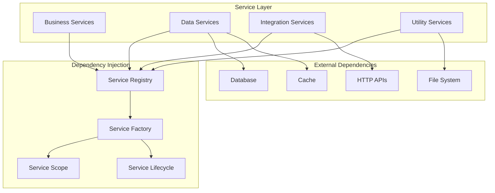

# Plugin Services

Learn how to create and use services in your Nexus plugins for organized, reusable business logic.

## 🎯 Overview

Services are the backbone of plugin architecture in Nexus. They encapsulate business logic, provide data access, and offer reusable functionality that can be shared across different parts of your plugin or even between plugins. This guide covers everything you need to know about creating and using services effectively.

## 🏗️ Service Architecture



## 🔧 Service Basics

### Base Service Class

```python
from abc import ABC, abstractmethod
from typing import Any, Dict, Optional
from nexus.services import Service
from nexus.logging import get_logger

class BaseService(Service):
    """Base class for all plugin services."""

    def __init__(self, config: Optional[Dict[str, Any]] = None):
        self.config = config or {}
        self.logger = get_logger(self.__class__.__name__)
        self._initialized = False

    async def initialize(self) -> None:
        """Initialize the service."""
        if self._initialized:
            return

        self.logger.info(f"Initializing {self.__class__.__name__}")
        await self._setup()
        self._initialized = True
        self.logger.info(f"{self.__class__.__name__} initialized successfully")

    async def cleanup(self) -> None:
        """Clean up service resources."""
        if not self._initialized:
            return

        self.logger.info(f"Cleaning up {self.__class__.__name__}")
        await self._teardown()
        self._initialized = False
        self.logger.info(f"{self.__class__.__name__} cleaned up")

    async def _setup(self) -> None:
        """Override this method for service-specific initialization."""
        pass

    async def _teardown(self) -> None:
        """Override this method for service-specific cleanup."""
        pass

    @property
    def is_initialized(self) -> bool:
        """Check if service is initialized."""
        return self._initialized

    def validate_initialization(self) -> None:
        """Ensure service is initialized before use."""
        if not self._initialized:
            raise RuntimeError(f"{self.__class__.__name__} is not initialized")
```

### Service Registration

```python
from nexus.services import register_service, get_service
from nexus.database import DatabaseAdapter
from nexus.cache import CacheManager

# Register services in your plugin
class MyPlugin(Plugin):
    """Plugin with service registration."""

    async def initialize(self):
        """Initialize plugin and register services."""
        await super().initialize()

        # Register services
        register_service(UserService, dependencies=[DatabaseAdapter])
        register_service(EmailService, dependencies=[])
        register_service(AnalyticsService, dependencies=[CacheManager, UserService])

        # Services are now available via dependency injection
        self.user_service = get_service(UserService)
        self.email_service = get_service(EmailService)
```

## 📊 Data Services

### Database Service

```python
from nexus.database import DatabaseAdapter
from nexus.services import inject
from typing import List, Optional, Dict, Any
from datetime import datetime

class UserService(BaseService):
    """Service for user data operations."""

    def __init__(self, db: DatabaseAdapter = inject()):
        super().__init__()
        self.db = db

    async def _setup(self):
        """Set up database tables if needed."""
        await self.create_tables()

    async def create_tables(self):
        """Create user-related tables."""
        await self.db.execute("""
            CREATE TABLE IF NOT EXISTS users (
                id SERIAL PRIMARY KEY,
                username VARCHAR(50) UNIQUE NOT NULL,
                email VARCHAR(100) UNIQUE NOT NULL,
                full_name VARCHAR(100),
                is_active BOOLEAN DEFAULT true,
                tags JSON DEFAULT '[]',
                created_at TIMESTAMP DEFAULT CURRENT_TIMESTAMP,
                updated_at TIMESTAMP DEFAULT CURRENT_TIMESTAMP
            )
        """)

        await self.db.execute("""
            CREATE INDEX IF NOT EXISTS idx_users_username ON users(username)
        """)

        await self.db.execute("""
            CREATE INDEX IF NOT EXISTS idx_users_email ON users(email)
        """)

    async def create_user(self, user_data: Dict[str, Any]) -> Dict[str, Any]:
        """Create a new user."""
        self.validate_initialization()

        # Validate required fields
        required_fields = ['username', 'email']
        for field in required_fields:
            if field not in user_data:
                raise ValueError(f"Missing required field: {field}")

        # Check for duplicates
        if await self.username_exists(user_data['username']):
            raise ValueError("Username already exists")

        if await self.email_exists(user_data['email']):
            raise ValueError("Email already exists")

        # Insert user
        query = """
            INSERT INTO users (username, email, full_name, tags)
            VALUES ($1, $2, $3, $4)
            RETURNING id, created_at, updated_at
        """

        result = await self.db.fetch_one(
            query,
            user_data['username'],
            user_data['email'],
            user_data.get('full_name'),
            user_data.get('tags', [])
        )

        # Build complete user object
        user = {
            'id': result['id'],
            'username': user_data['username'],
            'email': user_data['email'],
            'full_name': user_data.get('full_name'),
            'is_active': True,
            'tags': user_data.get('tags', []),
            'created_at': result['created_at'],
            'updated_at': result['updated_at']
        }

        self.logger.info(f"Created user: {user['username']} (ID: {user['id']})")
        return user

    async def get_user_by_id(self, user_id: int) -> Optional[Dict[str, Any]]:
        """Get user by ID."""
        self.validate_initialization()

        query = "SELECT * FROM users WHERE id = $1"
        result = await self.db.fetch_one(query, user_id)

        if result:
            return dict(result)
        return None

    async def get_user_by_username(self, username: str) -> Optional[Dict[str, Any]]:
        """Get user by username."""
        self.validate_initialization()

        query = "SELECT * FROM users WHERE username = $1"
        result = await self.db.fetch_one(query, username)

        if result:
            return dict(result)
        return None

    async def update_user(self, user_id: int, updates: Dict[str, Any]) -> Optional[Dict[str, Any]]:
        """Update user with provided fields."""
        self.validate_initialization()

        if not updates:
            return await self.get_user_by_id(user_id)

        # Build dynamic update query
        set_clauses = []
        values = []
        param_count = 1

        allowed_fields = ['username', 'email', 'full_name', 'is_active', 'tags']
        for field, value in updates.items():
            if field in allowed_fields:
                set_clauses.append(f"{field} = ${param_count}")
                values.append(value)
                param_count += 1

        if not set_clauses:
            return await self.get_user_by_id(user_id)

        # Add updated_at
        set_clauses.append(f"updated_at = ${param_count}")
        values.append(datetime.utcnow())
        values.append(user_id)  # For WHERE clause

        query = f"""
            UPDATE users
            SET {', '.join(set_clauses)}
            WHERE id = ${param_count + 1}
            RETURNING *
        """

        result = await self.db.fetch_one(query, *values)
        if result:
            self.logger.info(f"Updated user {user_id}")
            return dict(result)
        return None

    async def delete_user(self, user_id: int) -> bool:
        """Delete user by ID."""
        self.validate_initialization()

        query = "DELETE FROM users WHERE id = $1"
        result = await self.db.execute(query, user_id)

        success = result.rowcount > 0
        if success:
            self.logger.info(f"Deleted user {user_id}")
        return success

    async def list_users(
        self,
        page: int = 1,
        per_page: int = 20,
        filters: Optional[Dict[str, Any]] = None
    ) -> tuple[List[Dict[str, Any]], int]:
        """List users with pagination and filtering."""
        self.validate_initialization()

        # Build WHERE clause
        where_clauses = []
        where_values = []
        param_count = 1

        if filters:
            if 'search' in filters:
                where_clauses.append(f"""
                    (username ILIKE ${param_count} OR email ILIKE ${param_count} OR full_name ILIKE ${param_count})
                """)
                where_values.append(f"%{filters['search']}%")
                param_count += 1

            if 'is_active' in filters:
                where_clauses.append(f"is_active = ${param_count}")
                where_values.append(filters['is_active'])
                param_count += 1

            if 'tags' in filters:
                where_clauses.append(f"tags @> ${param_count}")
                where_values.append(filters['tags'])
                param_count += 1

        where_clause = "WHERE " + " AND ".join(where_clauses) if where_clauses else ""

        # Count total records
        count_query = f"SELECT COUNT(*) FROM users {where_clause}"
        total = await self.db.fetch_val(count_query, *where_values)

        # Get paginated results
        offset = (page - 1) * per_page
        list_query = f"""
            SELECT * FROM users
            {where_clause}
            ORDER BY created_at DESC
            LIMIT ${param_count} OFFSET ${param_count + 1}
        """

        results = await self.db.fetch_all(
            list_query,
            *where_values,
            per_page,
            offset
        )

        users = [dict(row) for row in results]
        return users, total

    async def username_exists(self, username: str) -> bool:
        """Check if username exists."""
        query = "SELECT EXISTS(SELECT 1 FROM users WHERE username = $1)"
        return await self.db.fetch_val(query, username)

    async def email_exists(self, email: str) -> bool:
        """Check if email exists."""
        query = "SELECT EXISTS(SELECT 1 FROM users WHERE email = $1)"
        return await self.db.fetch_val(query, email)

    async def get_user_count(self) -> int:
        """Get total user count."""
        self.validate_initialization()
        return await self.db.fetch_val("SELECT COUNT(*) FROM users")

    async def get_active_user_count(self) -> int:
        """Get active user count."""
        self.validate_initialization()
        return await self.db.fetch_val("SELECT COUNT(*) FROM users WHERE is_active = true")
```

### Cache Service

```python
from nexus.cache import CacheManager
from nexus.services import inject
import json
from typing import Any, Optional

class CacheService(BaseService):
    """Service for caching operations."""

    def __init__(self, cache: CacheManager = inject()):
        super().__init__()
        self.cache = cache
        self.default_ttl = 3600  # 1 hour

    async def set(self, key: str, value: Any, ttl: Optional[int] = None) -> None:
        """Set cache value."""
        self.validate_initialization()

        ttl = ttl or self.default_ttl
        serialized_value = json.dumps(value) if not isinstance(value, str) else value

        await self.cache.set(key, serialized_value, ttl=ttl)
        self.logger.debug(f"Cached value for key: {key}")

    async def get(self, key: str, default: Any = None) -> Any:
        """Get cache value."""
        self.validate_initialization()

        value = await self.cache.get(key)
        if value is None:
            return default

        try:
            return json.loads(value)
        except (json.JSONDecodeError, TypeError):
            return value

    async def delete(self, key: str) -> bool:
        """Delete cache value."""
        self.validate_initialization()

        result = await self.cache.delete(key)
        if result:
            self.logger.debug(f"Deleted cache key: {key}")
        return result

    async def exists(self, key: str) -> bool:
        """Check if cache key exists."""
        self.validate_initialization()
        return await self.cache.exists(key)

    async def increment(self, key: str, amount: int = 1) -> int:
        """Increment cache value."""
        self.validate_initialization()
        return await self.cache.increment(key, amount)

    async def set_user_cache(self, user_id: int, data: Dict[str, Any], ttl: Optional[int] = None) -> None:
        """Cache user data."""
        cache_key = f"user:{user_id}"
        await self.set(cache_key, data, ttl)

    async def get_user_cache(self, user_id: int) -> Optional[Dict[str, Any]]:
        """Get cached user data."""
        cache_key = f"user:{user_id}"
        return await self.get(cache_key)

    async def invalidate_user_cache(self, user_id: int) -> bool:
        """Invalidate user cache."""
        cache_key = f"user:{user_id}"
        return await self.delete(cache_key)

    async def cache_user_list(self, filters: Dict[str, Any], users: List[Dict[str, Any]], ttl: Optional[int] = None) -> None:
        """Cache user list with filters."""
        cache_key = f"users:list:{hash(str(sorted(filters.items())))}"
        await self.set(cache_key, users, ttl or 300)  # 5 minutes for lists

    async def get_cached_user_list(self, filters: Dict[str, Any]) -> Optional[List[Dict[str, Any]]]:
        """Get cached user list."""
        cache_key = f"users:list:{hash(str(sorted(filters.items())))}"
        return await self.get(cache_key)
```

## 🌐 Integration Services

### HTTP Service

```python
import aiohttp
from typing import Dict, Any, Optional
from nexus.services import inject

class HTTPService(BaseService):
    """Service for HTTP operations."""

    def __init__(self, config: Optional[Dict[str, Any]] = None):
        super().__init__(config)
        self.session = None
        self.base_url = self.config.get('base_url', '')
        self.timeout = self.config.get('timeout', 30)
        self.retries = self.config.get('retries', 3)

    async def _setup(self):
        """Set up HTTP session."""
        timeout = aiohttp.ClientTimeout(total=self.timeout)
        connector = aiohttp.TCPConnector(
            limit=100,
            limit_per_host=30,
            keepalive_timeout=300
        )

        self.session = aiohttp.ClientSession(
            timeout=timeout,
            connector=connector,
            headers={'User-Agent': 'Nexus-Plugin/1.0'}
        )

    async def _teardown(self):
        """Clean up HTTP session."""
        if self.session:
            await self.session.close()

    async def get(self, url: str, params: Optional[Dict] = None, headers: Optional[Dict] = None) -> Dict[str, Any]:
        """Make GET request."""
        self.validate_initialization()

        full_url = self._build_url(url)
        return await self._request('GET', full_url, params=params, headers=headers)

    async def post(self, url: str, data: Optional[Dict] = None, json: Optional[Dict] = None, headers: Optional[Dict] = None) -> Dict[str, Any]:
        """Make POST request."""
        self.validate_initialization()

        full_url = self._build_url(url)
        return await self._request('POST', full_url, data=data, json=json, headers=headers)

    async def put(self, url: str, data: Optional[Dict] = None, json: Optional[Dict] = None, headers: Optional[Dict] = None) -> Dict[str, Any]:
        """Make PUT request."""
        self.validate_initialization()

        full_url = self._build_url(url)
        return await self._request('PUT', full_url, data=data, json=json, headers=headers)

    async def delete(self, url: str, headers: Optional[Dict] = None) -> Dict[str, Any]:
        """Make DELETE request."""
        self.validate_initialization()

        full_url = self._build_url(url)
        return await self._request('DELETE', full_url, headers=headers)

    async def _request(self, method: str, url: str, **kwargs) -> Dict[str, Any]:
        """Make HTTP request with retries."""
        last_exception = None

        for attempt in range(self.retries + 1):
            try:
                async with self.session.request(method, url, **kwargs) as response:
                    # Handle different response types
                    content_type = response.headers.get('content-type', '')

                    if 'application/json' in content_type:
                        data = await response.json()
                    else:
                        text = await response.text()
                        data = {'text': text}

                    result = {
                        'status_code': response.status,
                        'headers': dict(response.headers),
                        'data': data
                    }

                    if response.status >= 400:
                        self.logger.warning(f"HTTP {method} {url} returned {response.status}")
                        if response.status >= 500 and attempt < self.retries:
                            continue  # Retry on server errors

                    return result

            except Exception as e:
                last_exception = e
                if attempt < self.retries:
                    self.logger.warning(f"HTTP request failed (attempt {attempt + 1}): {e}")
                    await asyncio.sleep(2 ** attempt)  # Exponential backoff
                    continue
                else:
                    break

        # If we get here, all retries failed
        self.logger.error(f"HTTP {method} {url} failed after {self.retries + 1} attempts")
        raise last_exception or Exception("HTTP request failed")

    def _build_url(self, url: str) -> str:
        """Build full URL."""
        if url.startswith('http'):
            return url
        return f"{self.base_url.rstrip('/')}/{url.lstrip('/')}"
```

### Email Service

```python
import smtplib
from email.mime.text import MIMEText
from email.mime.multipart import MIMEMultipart
from email.mime.base import MIMEBase
from email import encoders
from typing import List, Optional, Dict, Any
import aiofiles
import asyncio

class EmailService(BaseService):
    """Service for sending emails."""

    def __init__(self, config: Optional[Dict[str, Any]] = None):
        super().__init__(config)
        self.smtp_host = self.config.get('smtp_host', 'localhost')
        self.smtp_port = self.config.get('smtp_port', 587)
        self.smtp_user = self.config.get('smtp_user')
        self.smtp_password = self.config.get('smtp_password')
        self.use_tls = self.config.get('use_tls', True)
        self.from_email = self.config.get('from_email', 'noreply@example.com')
        self.from_name = self.config.get('from_name', 'Nexus Platform')

    async def send_email(
        self,
        to: List[str],
        subject: str,
        body: str,
        html_body: Optional[str] = None,
        cc: Optional[List[str]] = None,
        bcc: Optional[List[str]] = None,
        attachments: Optional[List[str]] = None
    ) -> bool:
        """Send email."""
        self.validate_initialization()

        try:
            # Create message
            msg = MIMEMultipart('alternative')
            msg['Subject'] = subject
            msg['From'] = f"{self.from_name} <{self.from_email}>"
            msg['To'] = ', '.join(to)

            if cc:
                msg['Cc'] = ', '.join(cc)

            # Add text body
            text_part = MIMEText(body, 'plain', 'utf-8')
            msg.attach(text_part)

            # Add HTML body if provided
            if html_body:
                html_part = MIMEText(html_body, 'html', 'utf-8')
                msg.attach(html_part)

            # Add attachments
            if attachments:
                for file_path in attachments:
                    await self._add_attachment(msg, file_path)

            # Send email
            await self._send_message(msg, to, cc, bcc)

            self.logger.info(f"Email sent successfully to {', '.join(to)}")
            return True

        except Exception as e:
            self.logger.error(f"Failed to send email: {e}")
            return False

    async def send_template_email(
        self,
        to: List[str],
        template_name: str,
        template_data: Dict[str, Any],
        subject: Optional[str] = None
    ) -> bool:
        """Send email using template."""
        try:
            # Load template
            template = await self._load_template(template_name)

            # Render template
            body = template['body'].format(**template_data)
            html_body = template.get('html_body', '').format(**template_data) if template.get('html_body') else None
            email_subject = subject or template.get('subject', '').format(**template_data)

            return await self.send_email(to, email_subject, body, html_body)

        except Exception as e:
            self.logger.error(f"Failed to send template email: {e}")
            return False

    async def _send_message(self, msg: MIMEMultipart, to: List[str], cc: Optional[List[str]], bcc: Optional[List[str]]):
        """Send email message."""
        recipients = to.copy()
        if cc:
            recipients.extend(cc)
        if bcc:
            recipients.extend(bcc)

        # Use asyncio to run SMTP in thread pool
        loop = asyncio.get_event_loop()
        await loop.run_in_executor(None, self._smtp_send, msg, recipients)

    def _smtp_send(self, msg: MIMEMultipart, recipients: List[str]):
        """Send email via SMTP (blocking operation)."""
        with smtplib.SMTP(self.smtp_host, self.smtp_port) as server:
            if self.use_tls:
                server.starttls()

            if self.smtp_user and self.smtp_password:
                server.login(self.smtp_user, self.smtp_password)

            server.send_message(msg, to_addrs=recipients)

    async def _add_attachment(self, msg: MIMEMultipart, file_path: str):
        """Add file attachment to email."""
        try:
            async with aiofiles.open(file_path, 'rb') as f:
                attachment_data = await f.read()

            attachment = MIMEBase('application', 'octet-stream')
            attachment.set_payload(attachment_data)
            encoders.encode_base64(attachment)

            filename = file_path.split('/')[-1]
            attachment.add_header(
                'Content-Disposition',
                f'attachment; filename= {filename}'
            )

            msg.attach(attachment)

        except Exception as e:
            self.logger.error(f"Failed to add attachment {file_path}: {e}")

    async def _load_template(self, template_name: str) -> Dict[str, str]:
        """Load email template."""
        template_path = f"templates/email/{template_name}.json"

        try:
            async with aiofiles.open(template_path, 'r') as f:
                content = await f.read()
            return json.loads(content)
        except Exception as e:
            self.logger.error(f"Failed to load template {template_name}: {e}")
            raise
```

## 📈 Business Services

### Analytics Service

```python
from nexus.services import inject
from typing import Dict, Any, List, Optional
from datetime import datetime, timedelta
import asyncio

class AnalyticsService(BaseService):
    """Service for analytics and metrics."""

    def __init__(self, cache: CacheService = inject(), user_service: UserService = inject()):
        super().__init__()
        self.cache = cache
        self.user_service = user_service
        self.events_buffer = []
        self.buffer_size = 100
        self.flush_interval = 60  # seconds

    async def _setup(self):
        """Start background tasks."""
        self.flush_task = asyncio.create_task(self._periodic_flush())

    async def _teardown(self):
        """Clean up background tasks."""
        if hasattr(self, 'flush_task'):
            self.flush_task.cancel()
            await self._flush_events()

    async def track_event(self, event_type: str, user_id: Optional[str] = None, properties: Optional[Dict[str, Any]] = None):
        """Track analytics event."""
        self.validate_initialization()

        event = {
            'event_type': event_type,
            'user_id': user_id,
            'properties': properties or {},
            'timestamp': datetime.utcnow().isoformat()
        }

        self.events_buffer.append(event)

        # Flush if buffer is full
        if len(self.events_buffer) >= self.buffer_size:
            await self._flush_events()

    async def track_user_action(self, user_id: str, action: str, context: Optional[Dict[str, Any]] = None):
        """Track user action."""
        await self.track_event('user_action', user_id, {
            'action': action,
            'context': context or {}
        })

    async def track_page_view(self, user_id: Optional[str], page: str, referrer: Optional[str] = None):
        """Track page view."""
        await self.track_event('page_view', user_id, {
            'page': page,
            'referrer': referrer
        })

    async def get_user_stats(self, days: int = 30) -> Dict[str, Any]:
        """Get user statistics."""
        self.validate_initialization()

        cache_key = f"user_stats:{days}"
        cached_stats = await self.cache.get(cache_key)

        if cached_stats:
            return cached_stats

        # Calculate stats
        total_users = await self.user_service.get_user_count()
        active_users = await self.user_service.get_active_user_count()

        stats = {
            'total_users': total_users,
            'active_users': active_users,
            'inactive_users': total_users - active_users,
            'activity_rate': (active_users / total_users) if total_users > 0 else 0,
            'generated_at': datetime.utcnow().isoformat()
        }

        # Cache for 1 hour
        await self.cache.set(cache_key, stats, ttl=3600)
        return stats

    async def get_event_counts(self, event_type: Optional[str] = None, days: int = 7) -> Dict[str, int]:
        """Get event counts."""
        # This would typically query a time-series database
        # For now, return cached data
        cache_key = f"event_counts:{event_type}:{days}"
        return await self.cache.get(cache_key, {})

    async def _flush_events(self):
        """Flush events to storage."""
        if not self.events_buffer:
            return

        events_to_flush = self.events_buffer.copy()
        self.events_buffer.clear()

        try:
            # Store events (implement based on your analytics backend)
            await self._store_events(events_to_flush)
            self.logger.debug(f"Flushed {len(events_to_flush)} analytics events")
        except Exception as e:
            self.logger.error(f"Failed to flush analytics events: {e}")
            # Could implement retry logic here

    async def _store_events(self, events: List[Dict[str, Any]]):
        """Store events in analytics backend."""
        # Implement based on your analytics backend
        # Could be database, InfluxDB, BigQuery, etc.
        pass

    async def _periodic_flush(self):
        """Periodically flush events."""
        while True:
            try:
                await asyncio.sleep(self.flush_interval)
                await self._flush_events()
            except asyncio.CancelledError:
                break
            except Exception as e:
                self.logger.error(f"Error in periodic flush: {e}")
```

## 🔧 Service Composition

### Composite Service

```python
class UserManagementService(BaseService):
    """Composite service combining multiple services."""

    def __init__(
        self,
        user_service: UserService = inject(),
        cache_service: CacheService = inject(),
        email_service: EmailService = inject(),
        analytics_service: AnalyticsService = inject()
    ):
        super().__init__()
        self.user_service = user_service
        self.cache_service = cache_service
        self.email_service = email_service
        self.analytics_service = analytics_service

    async def create_user_with_welcome(self, user_data: Dict[str, Any]) -> Dict[str, Any]:
        """Create user and send welcome email."""
        self.validate_initialization()

        try:
            # Create user
            user = await self.user_service.create_user(user_data)

            # Cache user data
            await self.cache_service.set_user_cache(user['id'], user)

            # Track analytics
            await self.analytics_service.track_event('user_created', str(user['id']), {
                'registration_source': user_data.get('source', 'unknown')
            })

            # Send welcome email
            await self.email_service.send_template_email(
                to=[user['email']],
                template_name='welcome',
                template_data={'username': user['username'], 'full_name': user.get('full_name', '')}
            )

            self.logger.info(f"Successfully created user with welcome: {user['username']}")
            return user

        except Exception as e:
            self.logger.error(f"Failed to create user with welcome: {e}")
            raise

    async def get_user_with_cache(self, user_id: int) -> Optional
