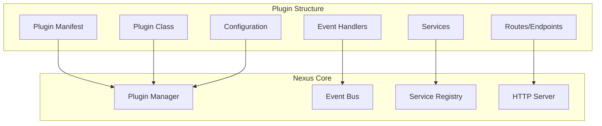

# Plugin Basics

Learn the fundamentals of building plugins for the Nexus platform.

## 🎯 Overview

Plugins are the heart of the Nexus platform. They allow you to extend functionality, add new features, and integrate with external services without modifying the core system. This guide covers everything you need to know to build your first plugin.

## 🏗️ Plugin Architecture



## 📦 Plugin Structure

### Basic Plugin Directory

```
my_plugin/
├── manifest.json          # Plugin metadata
├── plugin.py              # Main plugin class
├── __init__.py            # Package initialization
├── config/
│   └── default.yaml       # Default configuration
├── routes/
│   ├── __init__.py
│   └── api.py             # API endpoints
├── services/
│   ├── __init__.py
│   └── my_service.py      # Plugin services
├── events/
│   ├── __init__.py
│   └── handlers.py        # Event handlers
├── templates/             # Jinja2 templates (optional)
│   └── index.html
├── static/                # Static files (optional)
│   ├── css/
│   └── js/
├── tests/
│   ├── __init__.py
│   └── test_plugin.py
└── README.md
```

## 📄 Plugin Manifest

The `manifest.json` file contains metadata about your plugin:

```json
{
  "name": "my-awesome-plugin",
  "version": "1.0.0",
  "description": "An awesome plugin that does amazing things",
  "author": "Your Name",
  "email": "your.email@example.com",
  "license": "MIT",
  "nexus_version": ">=1.0.0",
  "dependencies": {
    "python": ">=3.8",
    "packages": {
      "requests": ">=2.25.0",
      "pydantic": ">=1.8.0"
    },
    "plugins": {
      "database-plugin": ">=1.0.0"
    }
  },
  "permissions": [
    "database:read",
    "database:write",
    "events:emit",
    "http:external"
  ],
  "configuration": {
    "api_key": {
      "type": "string",
      "required": true,
      "secret": true,
      "description": "API key for external service"
    },
    "max_retries": {
      "type": "integer",
      "default": 3,
      "min": 1,
      "max": 10,
      "description": "Maximum number of retry attempts"
    },
    "enabled": {
      "type": "boolean",
      "default": true,
      "description": "Enable or disable the plugin"
    }
  },
  "entry_point": "plugin:MyPlugin",
  "category": "integration",
  "tags": ["api", "external", "automation"],
  "homepage": "https://github.com/yourusername/my-awesome-plugin",
  "documentation": "https://docs.yourplugin.com"
}
```

## 🔧 Plugin Class

Create your main plugin class by inheriting from the base `Plugin` class:

```python
from nexus.plugin import Plugin
from nexus.events import event_handler
from nexus.http import get, post
from nexus.services import inject
from typing import Dict, Any
import logging

logger = logging.getLogger(__name__)

class MyPlugin(Plugin):
    """
    An awesome plugin that demonstrates basic functionality.
    """

    def __init__(self, config: Dict[str, Any]):
        super().__init__(config)
        self.api_key = config.get('api_key')
        self.max_retries = config.get('max_retries', 3)
        self.enabled = config.get('enabled', True)

    async def initialize(self) -> None:
        """
        Initialize the plugin.
        Called when the plugin is loaded.
        """
        logger.info(f"Initializing {self.name} plugin v{self.version}")

        if not self.enabled:
            logger.info("Plugin is disabled")
            return

        # Initialize any resources here
        await self.setup_external_connection()

        logger.info("Plugin initialized successfully")

    async def cleanup(self) -> None:
        """
        Clean up plugin resources.
        Called when the plugin is unloaded.
        """
        logger.info(f"Cleaning up {self.name} plugin")

        # Clean up resources here
        await self.close_external_connection()

        logger.info("Plugin cleanup completed")

    async def setup_external_connection(self):
        """Set up connection to external service."""
        # Implementation here
        pass

    async def close_external_connection(self):
        """Close connection to external service."""
        # Implementation here
        pass

    # Event handlers
    @event_handler("user.created")
    async def on_user_created(self, event):
        """Handle user creation events."""
        if not self.enabled:
            return

        logger.info(f"New user created: {event.user_id}")

        # Process the event
        await self.process_new_user(event.user_id)

    async def process_new_user(self, user_id: str):
        """Process new user registration."""
        # Implementation here
        pass

    # HTTP endpoints
    @get("/my-plugin/status")
    async def get_status(self):
        """Get plugin status."""
        return {
            "plugin": self.name,
            "version": self.version,
            "enabled": self.enabled,
            "status": "running" if self.enabled else "disabled"
        }

    @post("/my-plugin/action")
    async def perform_action(self, request):
        """Perform a custom action."""
        if not self.enabled:
            return {"error": "Plugin is disabled"}, 503

        data = await request.json()

        # Validate input
        if 'action' not in data:
            return {"error": "Missing 'action' parameter"}, 400

        # Process action
        result = await self.execute_action(data['action'], data.get('params', {}))

        return {"result": result}

    async def execute_action(self, action: str, params: Dict[str, Any]):
        """Execute a custom action."""
        # Implementation here
        return f"Executed {action} with params {params}"
```

## 🛠️ Plugin Services

Create reusable services for your plugin:

```python
# services/my_service.py
from nexus.service import Service
from nexus.database import DatabaseAdapter
from nexus.events import EventBus
from typing import List, Dict, Any
import aiohttp

class MyPluginService(Service):
    """
    Service for handling plugin-specific operations.
    """

    def __init__(self, db: DatabaseAdapter, event_bus: EventBus):
        self.db = db
        self.event_bus = event_bus
        self.http_session = None

    async def initialize(self):
        """Initialize the service."""
        self.http_session = aiohttp.ClientSession()

    async def cleanup(self):
        """Clean up service resources."""
        if self.http_session:
            await self.http_session.close()

    async def fetch_external_data(self, endpoint: str) -> Dict[str, Any]:
        """Fetch data from external API."""
        async with self.http_session.get(endpoint) as response:
            return await response.json()

    async def store_data(self, table: str, data: Dict[str, Any]) -> str:
        """Store data in database."""
        result = await self.db.insert(table, data)

        # Emit event
        await self.event_bus.emit({
            "type": "data.stored",
            "table": table,
            "record_id": result["id"]
        })

        return result["id"]

    async def get_data(self, table: str, filters: Dict[str, Any] = None) -> List[Dict[str, Any]]:
        """Retrieve data from database."""
        query = f"SELECT * FROM {table}"
        params = []

        if filters:
            conditions = []
            for key, value in filters.items():
                conditions.append(f"{key} = ?")
                params.append(value)
            query += " WHERE " + " AND ".join(conditions)

        return await self.db.fetch_all(query, params)
```

## 🌐 HTTP Routes

Define HTTP endpoints for your plugin:

```python
# routes/api.py
from nexus.http import APIRouter, Depends
from nexus.auth import get_current_user, require_permission
from nexus.validation import validate_json
from pydantic import BaseModel
from typing import List, Optional

router = APIRouter(prefix="/my-plugin", tags=["my-plugin"])

class ActionRequest(BaseModel):
    action: str
    params: Optional[dict] = {}

class ActionResponse(BaseModel):
    success: bool
    result: Optional[dict] = None
    error: Optional[str] = None

@router.get("/info")
async def get_plugin_info():
    """Get plugin information."""
    return {
        "name": "my-awesome-plugin",
        "version": "1.0.0",
        "description": "An awesome plugin that does amazing things",
        "endpoints": [
            "/my-plugin/info",
            "/my-plugin/status",
            "/my-plugin/action"
        ]
    }

@router.get("/status")
@require_permission("read:plugins")
async def get_plugin_status(current_user = Depends(get_current_user)):
    """Get plugin status (requires authentication)."""
    # Get plugin instance
    plugin = get_plugin_instance()

    return {
        "status": "running" if plugin.enabled else "disabled",
        "uptime": await plugin.get_uptime(),
        "metrics": await plugin.get_metrics()
    }

@router.post("/action", response_model=ActionResponse)
@require_permission("write:plugins")
async def perform_action(
    request: ActionRequest,
    current_user = Depends(get_current_user)
):
    """Perform a plugin action."""
    try:
        plugin = get_plugin_instance()
        result = await plugin.execute_action(request.action, request.params)

        return ActionResponse(
            success=True,
            result=result
        )
    except Exception as e:
        return ActionResponse(
            success=False,
            error=str(e)
        )

@router.get("/data")
@require_permission("read:data")
async def get_plugin_data(
    table: str,
    limit: int = 100,
    offset: int = 0,
    current_user = Depends(get_current_user)
):
    """Get plugin data with pagination."""
    service = get_service(MyPluginService)

    # Apply filters based on user permissions
    filters = {}
    if not current_user.has_permission("admin:data"):
        filters["user_id"] = current_user.id

    data = await service.get_data(table, filters)

    # Apply pagination
    total = len(data)
    paginated_data = data[offset:offset + limit]

    return {
        "data": paginated_data,
        "pagination": {
            "total": total,
            "limit": limit,
            "offset": offset,
            "has_more": offset + limit < total
        }
    }
```

## 📡 Event Handlers

Handle events from the Nexus platform and other plugins:

```python
# events/handlers.py
from nexus.events import event_handler, Event
from nexus.services import get_service
from .services.my_service import MyPluginService
import logging

logger = logging.getLogger(__name__)

class PluginEventHandlers:
    """Event handlers for the plugin."""

    def __init__(self):
        self.service = get_service(MyPluginService)

    @event_handler("user.created")
    async def on_user_created(self, event: Event):
        """Handle user creation."""
        logger.info(f"Processing new user: {event.user_id}")

        try:
            # Create user profile in plugin
            await self.service.create_user_profile(event.user_id, event.data)

            # Send welcome notification
            await self.service.send_welcome_notification(event.user_id)

        except Exception as e:
            logger.error(f"Error processing user creation: {e}")

    @event_handler("user.updated")
    async def on_user_updated(self, event: Event):
        """Handle user updates."""
        logger.info(f"Processing user update: {event.user_id}")

        try:
            # Update user profile
            await self.service.update_user_profile(event.user_id, event.data)

        except Exception as e:
            logger.error(f"Error processing user update: {e}")

    @event_handler("system.shutdown")
    async def on_system_shutdown(self, event: Event):
        """Handle system shutdown."""
        logger.info("System is shutting down, cleaning up plugin resources")

        # Perform any necessary cleanup
        await self.service.graceful_shutdown()

    @event_handler("plugin.*.loaded")
    async def on_plugin_loaded(self, event: Event):
        """Handle when other plugins are loaded."""
        plugin_name = event.plugin_name
        logger.info(f"Plugin loaded: {plugin_name}")

        # Check if this plugin depends on the loaded plugin
        if plugin_name in self.get_dependencies():
            await self.initialize_integration(plugin_name)

    @event_handler("data.external.updated", priority=10)
    async def on_external_data_updated(self, event: Event):
        """Handle external data updates with high priority."""
        logger.info(f"External data updated: {event.source}")

        try:
            # Sync with external data
            await self.service.sync_external_data(event.source, event.data)

        except Exception as e:
            logger.error(f"Error syncing external data: {e}")

            # Re-emit event for retry
            await self.emit_event({
                "type": "data.sync.failed",
                "source": event.source,
                "error": str(e),
                "original_event_id": event.event_id
            })
```

## ⚙️ Configuration

Define configuration schema and defaults:

```yaml
# config/default.yaml
database:
  table_prefix: "myplugin_"
  connection_pool_size: 5

api:
  base_url: "https://api.external-service.com"
  timeout: 30
  retries: 3
  rate_limit:
    requests_per_minute: 100

features:
  auto_sync: true
  notifications: true
  analytics: false

cache:
  enabled: true
  ttl: 3600  # 1 hour
  max_entries: 1000

logging:
  level: "INFO"
  file: "my_plugin.log"
  max_size_mb: 10
  backup_count: 3
```

## 🧪 Testing

Write comprehensive tests for your plugin:

```python
# tests/test_plugin.py
import pytest
from unittest.mock import AsyncMock, Mock
from nexus.testing import PluginTestCase, MockEventBus, MockDatabase
from my_plugin.plugin import MyPlugin
from my_plugin.services.my_service import MyPluginService

class TestMyPlugin(PluginTestCase):
    """Test cases for MyPlugin."""

    async def setup_method(self):
        """Set up test environment."""
        self.config = {
            "api_key": "test_key",
            "max_retries": 3,
            "enabled": True
        }
        self.plugin = MyPlugin(self.config)
        await self.plugin.initialize()

    async def teardown_method(self):
        """Clean up test environment."""
        await self.plugin.cleanup()

    async def test_plugin_initialization(self):
        """Test plugin initialization."""
        assert self.plugin.name == "my-awesome-plugin"
        assert self.plugin.enabled is True
        assert self.plugin.api_key == "test_key"

    async def test_disabled_plugin(self):
        """Test disabled plugin behavior."""
        config = self.config.copy()
        config["enabled"] = False

        plugin = MyPlugin(config)
        await plugin.initialize()

        assert plugin.enabled is False

    async def test_user_created_event_handler(self):
        """Test user creation event handler."""
        # Mock event
        event = Mock()
        event.user_id = "user_123"
        event.data = {"username": "testuser", "email": "test@example.com"}

        # Mock service method
        self.plugin.process_new_user = AsyncMock()

        # Handle event
        await self.plugin.on_user_created(event)

        # Verify service method was called
        self.plugin.process_new_user.assert_called_once_with("user_123")

    async def test_http_status_endpoint(self):
        """Test HTTP status endpoint."""
        response = await self.plugin.get_status()

        assert response["plugin"] == "my-awesome-plugin"
        assert response["enabled"] is True
        assert response["status"] == "running"

    async def test_http_action_endpoint(self):
        """Test HTTP action endpoint."""
        # Mock request
        request = Mock()
        request.json = AsyncMock(return_value={
            "action": "test_action",
            "params": {"param1": "value1"}
        })

        # Mock action execution
        self.plugin.execute_action = AsyncMock(return_value="success")

        # Call endpoint
        response = await self.plugin.perform_action(request)

        assert response["result"] == "success"

    async def test_action_validation(self):
        """Test action endpoint validation."""
        # Mock request with missing action
        request = Mock()
        request.json = AsyncMock(return_value={})

        # Call endpoint
        response, status_code = await self.plugin.perform_action(request)

        assert status_code == 400
        assert "Missing 'action' parameter" in response["error"]

class TestMyPluginService(PluginTestCase):
    """Test cases for MyPluginService."""

    async def setup_method(self):
        """Set up test environment."""
        self.mock_db = MockDatabase()
        self.mock_event_bus = MockEventBus()
        self.service = MyPluginService(self.mock_db, self.mock_event_bus)
        await self.service.initialize()

    async def teardown_method(self):
        """Clean up test environment."""
        await self.service.cleanup()

    async def test_store_data(self):
        """Test data storage."""
        # Mock database response
        self.mock_db.insert.return_value = {"id": "record_123"}

        # Store data
        data = {"name": "test", "value": 42}
        record_id = await self.service.store_data("test_table", data)

        # Verify database call
        self.mock_db.insert.assert_called_once_with("test_table", data)
        assert record_id == "record_123"

        # Verify event emission
        self.mock_event_bus.emit.assert_called_once()
        emitted_event = self.mock_event_bus.emit.call_args[0][0]
        assert emitted_event["type"] == "data.stored"
        assert emitted_event["table"] == "test_table"
        assert emitted_event["record_id"] == "record_123"

    async def test_fetch_external_data(self):
        """Test external data fetching."""
        # Mock HTTP response
        mock_response = AsyncMock()
        mock_response.json = AsyncMock(return_value={"data": "test"})

        self.service.http_session.get = AsyncMock(return_value=mock_response)
        self.service.http_session.get.return_value.__aenter__ = AsyncMock(return_value=mock_response)
        self.service.http_session.get.return_value.__aexit__ = AsyncMock(return_value=None)

        # Fetch data
        result = await self.service.fetch_external_data("https://api.example.com/data")

        assert result == {"data": "test"}

# Integration tests
class TestPluginIntegration(PluginTestCase):
    """Integration tests for the plugin."""

    async def test_full_workflow(self):
        """Test complete plugin workflow."""
        # This would test the entire plugin in a real environment
        # with actual database and event bus connections
        pass

# Performance tests
class TestPluginPerformance(PluginTestCase):
    """Performance tests for the plugin."""

    @pytest.mark.performance
    async def test_event_handler_performance(self):
        """Test event handler performance under load."""
        # Test handling many events quickly
        pass

    @pytest.mark.performance
    async def test_api_endpoint_performance(self):
        """Test API endpoint performance under load."""
        # Test endpoint response times under load
        pass
```

## 🚀 Plugin Lifecycle

Understanding the plugin lifecycle is crucial for proper resource management:

### 1. Discovery
- Nexus scans the plugins directory
- Validates manifest.json files
- Checks dependencies

### 2. Loading
- Plugin code is imported
- Dependencies are resolved
- Plugin class is instantiated

### 3. Initialization
- `initialize()` method is called
- Resources are set up
- Event handlers are registered
- HTTP routes are added

### 4. Runtime
- Plugin handles events
- Serves HTTP requests
- Performs background tasks

### 5. Shutdown
- `cleanup()` method is called
- Resources are released
- Connections are closed

## 🎯 Best Practices

### 1. Error Handling
```python
async def robust_operation(self):
    """Example of robust error handling."""
    try:
        result = await self.risky_operation()
        return result
    except SpecificError as e:
        logger.warning(f"Expected error occurred: {e}")
        return self.fallback_operation()
    except Exception as e:
        logger.error(f"Unexpected error: {e}", exc_info=True)
        raise PluginError(f"Operation failed: {e}") from e
```

### 2. Configuration Validation
```python
def validate_config(self, config: Dict[str, Any]) -> Dict[str, Any]:
    """Validate plugin configuration."""
    required_fields = ['api_key', 'endpoint_url']

    for field in required_fields:
        if field not in config:
            raise ConfigurationError(f"Missing required field: {field}")

    # Validate data types
    if not isinstance(config.get('max_retries'), int):
        raise ConfigurationError("max_retries must be an integer")

    return config
```

### 3. Resource Management
```python
class ResourceAwarePlugin(Plugin):
    """Plugin with proper resource management."""

    def __init__(self, config):
        super().__init__(config)
        self.connections = []
        self.background_tasks = []

    async def initialize(self):
        """Initialize with resource tracking."""
        # Create connections
        connection = await self.create_connection()
        self.connections.append(connection)

        # Start background tasks
        task = asyncio.create_task(self.background_worker())
        self.background_tasks.append(task)

    async def cleanup(self):
        """Clean up all resources."""
        # Cancel background tasks
        for task in self.background_tasks:
            task.cancel()
            try:
                await task
            except asyncio.CancelledError:
                pass

        # Close connections
        for connection in self.connections:
            await connection.close()
```

### 4. Async Best Practices
```python
# Good: Use async/await properly
async def process_items(self, items):
    """Process items concurrently."""
    tasks = [self.process_item(item) for item in items]
    results = await asyncio.gather(*tasks, return_exceptions=True)
    return results

# Good: Use context managers
async def with_connection(self):
    """Use connection with proper cleanup."""
    async with self.get_connection() as conn:
        return await conn.execute_query()

# Good: Limit concurrency
async def process_with_limit(self, items):
    """Process items with concurrency limit."""
    semaphore = asyncio.Semaphore(10)  # Max 10 concurrent operations

    async def limited_process(item):
        async with semaphore:
            return await self.process_item(item)

    tasks = [limited_process(item) for item in items]
    return await asyncio.gather(*tasks)
```

## 🎯 Next Steps

- **[API Routes](api-routes.md)** - Learn about creating HTTP endpoints
- **[Database Integration](database.md)** - Work with databases in plugins
- **[Event Handling](events.md)** - Master the event system
- **[Testing Plugins](testing.md)** - Comprehensive testing strategies
- **[Advanced Features](advanced.md)** - Advanced plugin development

---

**Congratulations!** You now have the foundation to build powerful Nexus plugins. Start with a simple plugin and gradually add more features as you become comfortable with the platform.
