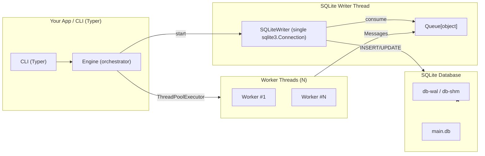

<div align="center">
    
    <h1>pipeloom</h1>
    <p>Lightweight Python framework for orchestrating concurrent tasks with a single-writer persistence model and live progress tracking.</p>
</div>

<div align="center">
    
    
    
    
    
</div>

<br />

## Why pipeloom?

Many workflows require concurrency, persistence, and monitoring — but existing solutions can be burdonsome to spin up, maintain, and integrate with your workflow. `pipeloom` aims to simplify this with a message-driven, single-writer model that’s safe, observable, and extensible.

### Who is it for?

- Data engineers needing lightweight pipelines without Airflow/Kubernetes.
- Analysts automating ETL locally or on servers.
- Developers who want concurrency + persistence without database lock headaches.

## Quickstart

Run the demo locally:

```bash
uv run pipeloom demo --db ./wal_demo.db --num-tasks 10 -vv
```

Or with Docker:

```bash
docker run -it --rm ghcr.io/geocoug/pipeloom:latest demo --db ./wal_demo.db --num-tasks 10 -vv
```

Example output (Rich progress bars):


## Features

- **Concurrent task orchestration** → Run many jobs at once safely.
- **Single-writer persistence** → No more SQLite `database locked` errors.
- **Live progress tracking** → Always know what’s running, failed, or complete.
- **Declarative API** → Define tasks and pipelines with minimal boilerplate.
- **CLI-first** → Run pipelines from the terminal with a Typer-powered CLI.

## Design Principles

- All SQLite access happens in one thread (`SQLiteWriter`).
- Two progress managers:
  - **Overall** (remains after completion).
  - **Per-task** (clears on finish).
- Workers never write to the DB directly; they send typed messages to the writer.

## Architecture



**Why this works**:

Only the writer thread touches SQLite. WAL mode allows concurrent reads during writes. Workers communicate via typed messages.

## Using pipeloom in Your ETL

1. Define tasks with `Task(...)`.
2. Provide a `worker_fn(task, msg_q)` that emits:
   - `MsgTaskStarted`
   - `MsgTaskProgress`
   - `MsgTaskFinished`
3. Run:

```python
run_pipeline(db_path, tasks, workers=..., wal=True, store_task_status=True)
```

> Pass `store_task_status=False` if you don’t want the `task_runs` table.

## Extending pipeloom

### Custom worker logic

Workers perform the actual work, then publish messages.

### Custom message types

Add domain-specific messages and handle them in the writer.

Example: domain-specific upsert:

```python
from dataclasses import dataclass

@dataclass(frozen=True)
class MsgUpsertRecord:
    table: str
    key: str
    payload: dict
```

Emit from worker:

```python
q.put(MsgUpsertRecord(table="users", key="abc123", payload={"name": "Caleb", "active": 1}))
```

Handle in writer:

```python
elif isinstance(item, MsgUpsertRecord):
    self._on_upsert(item)

def _on_upsert(self, m: MsgUpsertRecord):
    self._conn.execute(
        "INSERT INTO users(key, name, active) VALUES (?, ?, ?) "
        "ON CONFLICT(key) DO UPDATE SET name=excluded.name, active=excluded.active",
        (m.key, m.payload["name"], m.payload["active"]),
    )
    self._conn.commit()
```

## Observability

Keep `task_runs` enabled unless you have a strong reason not to.

```sql
SELECT status, COUNT(*) FROM task_runs GROUP BY status;
SELECT * FROM task_runs WHERE status <> 'done';
```
