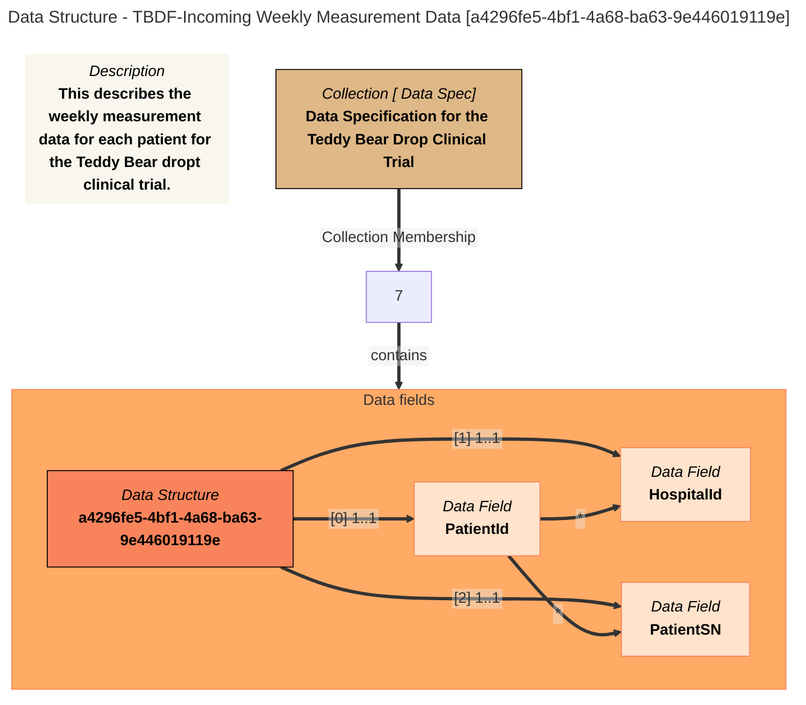
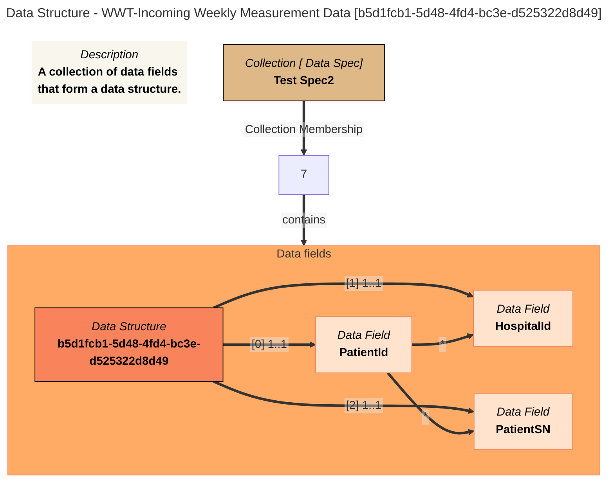
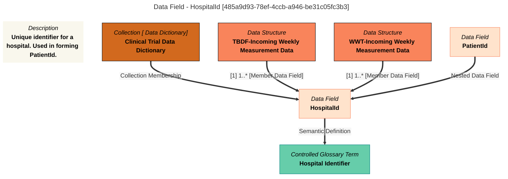
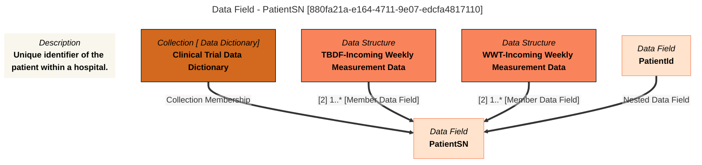
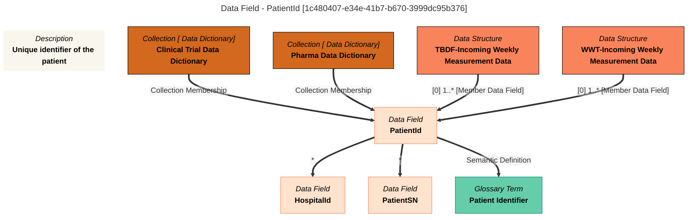
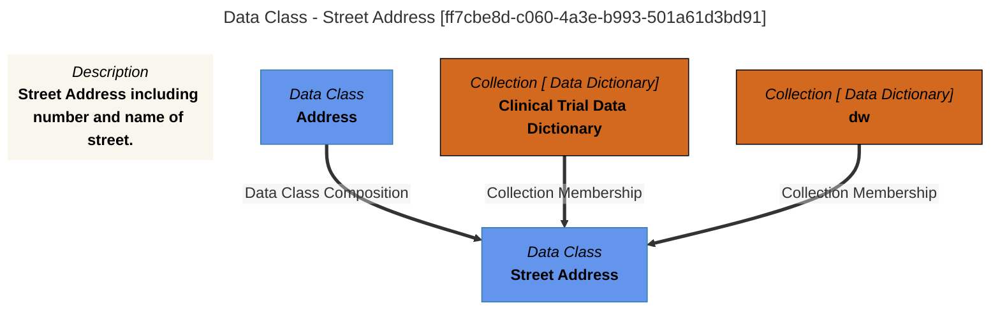
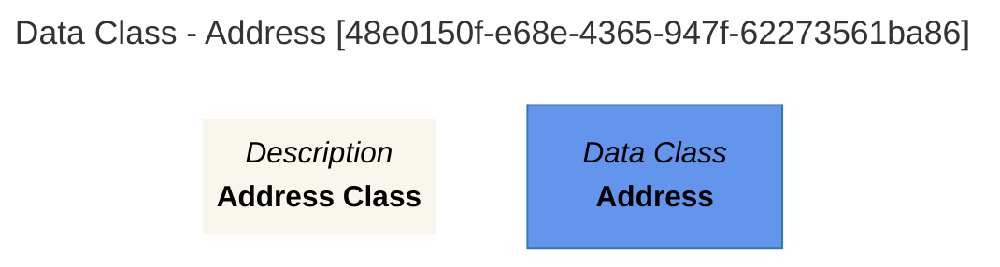

# View Data Dictionary
## Output Format
LIST


# `DataSpec` with filter: `*`

# Collections Table

Collections found from the search string: `All`

| Name | Qualified Name | Collection Type | Description | Classifications | Members | 
|-------------|-------------|-------------|-------------|-------------|-------------|
| Data Specification for the Teddy Bear Drop Clinical Trial |  [DataSpec::Data Specification for the Teddy Bear Drop Clinical Trial](#105a9d68-7c23-4694-b694-93ef2f52826c)  |  | Principle data requirements for Teddy Bear Drop Clinical Trial. Meow | Anchors, DataSpec |  [DataStruct::TBDF-Incoming Weekly Measurement Data](#105a9d68-7c23-4694-b694-93ef2f52826c)  | 
| Test Spec2 |  [DataSpec::Test Spec2](#3ef8b50b-0af0-4c63-8cac-661636f4f043)  |  | A test spec - Meow | Anchors, DataSpec |  [DataStruct::WWT-Incoming Weekly Measurement Data](#3ef8b50b-0af0-4c63-8cac-661636f4f043)  | 


# `DataSpec` with filter: `*`

# Collections Table

Collections found from the search string: `All`

| Name | Qualified Name | Collection Type | Description | Classifications | Members | 
|-------------|-------------|-------------|-------------|-------------|-------------|
| Data Specification for the Teddy Bear Drop Clinical Trial |  [DataSpec::Data Specification for the Teddy Bear Drop Clinical Trial](#105a9d68-7c23-4694-b694-93ef2f52826c)  |  | Principle data requirements for Teddy Bear Drop Clinical Trial. Meow | Anchors, DataSpec |  [DataStruct::TBDF-Incoming Weekly Measurement Data](#105a9d68-7c23-4694-b694-93ef2f52826c)  | 
| Test Spec2 |  [DataSpec::Test Spec2](#3ef8b50b-0af0-4c63-8cac-661636f4f043)  |  | A test spec - Meow | Anchors, DataSpec |  [DataStruct::WWT-Incoming Weekly Measurement Data](#3ef8b50b-0af0-4c63-8cac-661636f4f043)  | 


# `DataSpec` with filter: `*`

# Collection Report - created at 2025-07-14 12:38
	Collection  found from the search string:  `All`

<a id="105a9d68-7c23-4694-b694-93ef2f52826c"></a>

# Collection Name: NO DISPLAY NAME

## GUID
105a9d68-7c23-4694-b694-93ef2f52826c

## Qualified Name
DataSpec::Data Specification for the Teddy Bear Drop Clinical Trial

## Description
Principle data requirements for Teddy Bear Drop Clinical Trial. Meow

## Classifications
Anchors, DataSpec

## Members
DataStruct::TBDF-Incoming Weekly Measurement Data

## Mermaid Graph

```mermaid

```

---

<a id="3ef8b50b-0af0-4c63-8cac-661636f4f043"></a>

# Collection Name: NO DISPLAY NAME

## GUID
3ef8b50b-0af0-4c63-8cac-661636f4f043

## Qualified Name
DataSpec::Test Spec2

## Description
A test spec - Meow

## Classifications
Anchors, DataSpec

## Members
DataStruct::WWT-Incoming Weekly Measurement Data

## Mermaid Graph

```mermaid

```


# `Data Structures` with filter: `*`

# Data Structures Table

Data Structures found from the search string: `All`

| Structure Name | Qualified Name | Namespace | Version | Description | 
|-------------|-------------|-------------|-------------|-------------|
| TBDF-Incoming Weekly Measurement Data |  [DataStruct::TBDF-Incoming Weekly Measurement Data](#a4296fe5-4bf1-4a68-ba63-9e446019119e)  |  |  | This describes the weekly measurement data for each patient for the Teddy Bear dropt clinical trial. | 
| WWT-Incoming Weekly Measurement Data |  [DataStruct::WWT-Incoming Weekly Measurement Data](#b5d1fcb1-5d48-4fd4-bc3e-d525322d8d49)  |  |  | A collection of data fields that form a data structure. | 


# `Data Structures` with filter: `*`

# Data Structure Report - created at 2025-07-14 12:38
	Data Structure  found from the search string:  `All`

<a id="a4296fe5-4bf1-4a68-ba63-9e446019119e"></a>

# Data Structure Name: NO DISPLAY NAME

## GUID
a4296fe5-4bf1-4a68-ba63-9e446019119e

## Qualified Name
DataStruct::TBDF-Incoming Weekly Measurement Data

## Description
This describes the weekly measurement data for each patient for the Teddy Bear dropt clinical trial.

## Data Fields
DataField::HospitalId,
DataField::PatientSN,
DataField::PatientId

## Data Specification
DataSpec::Data Specification for the Teddy Bear Drop Clinical Trial

## Mermaid Graph



---

<a id="b5d1fcb1-5d48-4fd4-bc3e-d525322d8d49"></a>

# Data Structure Name: NO DISPLAY NAME

## GUID
b5d1fcb1-5d48-4fd4-bc3e-d525322d8d49

## Qualified Name
DataStruct::WWT-Incoming Weekly Measurement Data

## Description
A collection of data fields that form a data structure.

## Data Fields
DataField::HospitalId,
DataField::PatientSN,
DataField::PatientId

## Data Specification
DataSpec::Test Spec2

## Mermaid Graph




# `Data Fields` with filter: `*`

# Data Fields Table

Data Fields found from the search string: `<class 'filter'>`

| Field Name | Qualified Name | Data Type | Description | 
|-------------|-------------|-------------|-------------|
| HospitalId |  [DataField::HospitalId](#485a9d93-78ef-4ccb-a946-be31c05fc3b3)  | String | Unique identifier for a hospital. Used in forming PatientId. | 
| PatientSN |  [DataField::PatientSN](#880fa21a-e164-4711-9e07-edcfa4817110)  | String | Unique identifier of the patient within a hospital. | 
| PatientId |  [DataField::PatientId](#1c480407-e34e-41b7-b670-3999dc95b376)  | String | Unique identifier of the patient | 


# `Data Fields` with filter: `*`

# Data Field Report - created at 2025-07-14 12:38
	Data Field  found from the search string:  `<class 'filter'>`

<a id="485a9d93-78ef-4ccb-a946-be31c05fc3b3"></a>

# Data Field Name: NO DISPLAY NAME

## GUID
485a9d93-78ef-4ccb-a946-be31c05fc3b3

## Qualified Name
DataField::HospitalId

## Description
Unique identifier for a hospital. Used in forming PatientId.

## Assigned Meanings
Term::Hospital Identifier

## Data Type
String

## Is Nullable
True

## Sort Order
UNSORTED

## Parent Names
DataField::PatientId

## Data Dictionaries
DataDict::Clinical Trial Data Dictionary

## Data Structures
DataStruct::TBDF-Incoming Weekly Measurement Data,
DataStruct::WWT-Incoming Weekly Measurement Data

## Mermaid Graph



---

<a id="880fa21a-e164-4711-9e07-edcfa4817110"></a>

# Data Field Name: NO DISPLAY NAME

## GUID
880fa21a-e164-4711-9e07-edcfa4817110

## Qualified Name
DataField::PatientSN

## Description
Unique identifier of the patient within a hospital.

## Data Type
String

## Is Nullable
True

## Sort Order
UNSORTED

## Parent Names
DataField::PatientId

## Data Dictionaries
DataDict::Clinical Trial Data Dictionary

## Data Structures
DataStruct::TBDF-Incoming Weekly Measurement Data,
DataStruct::WWT-Incoming Weekly Measurement Data

## Mermaid Graph



---

<a id="1c480407-e34e-41b7-b670-3999dc95b376"></a>

# Data Field Name: NO DISPLAY NAME

## GUID
1c480407-e34e-41b7-b670-3999dc95b376

## Qualified Name
DataField::PatientId

## Description
Unique identifier of the patient

## Assigned Meanings
GlossaryTerm::ClinicalTrialTerminology::PatientId

## Data Type
String

## Is Nullable
True

## Sort Order
UNSORTED

## Data Dictionaries
DataDict::Clinical Trial Data Dictionary,
DataDict::Pharma Data Dictionary

## Data Structures
DataStruct::TBDF-Incoming Weekly Measurement Data,
DataStruct::WWT-Incoming Weekly Measurement Data

## Mermaid Graph




# `Data Class` with filter: `*`

# Data Classs Table

Data Classs found from the search string: `All`

| Class Name | Qualified Name | Description | 
|-------------|-------------|-------------|
| Street Address |  [DataClass::Street Address](#ff7cbe8d-c060-4a3e-b993-501a61d3bd91)  | Street Address including number and name of street. | 
| Address |  [DataClass::Address](#48e0150f-e68e-4365-947f-62273561ba86)  | Address Class | 


# `Data Class` with filter: `*`

# Data Class Report - created at 2025-07-14 12:38
	Data Class  found from the search string:  `All`

<a id="ff7cbe8d-c060-4a3e-b993-501a61d3bd91"></a>

# Data Class Name: NO DISPLAY NAME

## GUID
ff7cbe8d-c060-4a3e-b993-501a61d3bd91

## Qualified Name
DataClass::Street Address

## Description
Street Address including number and name of street.

## Data Type
String

## Match Property Names
Can be determined by Dr. Egeria?

## Match Threshold
100

## Is Nullable
True

## Data Dictionaries
DataDict::Clinical Trial Data Dictionary,
DataDict::dw

## Mermaid Graph



---

<a id="48e0150f-e68e-4365-947f-62273561ba86"></a>

# Data Class Name: NO DISPLAY NAME

## GUID
48e0150f-e68e-4365-947f-62273561ba86

## Qualified Name
DataClass::Address

## Description
Address Class

## Data Type
String

## Match Property Names
Can be determined by Dr. Egeria?

## Match Threshold
100

## Is Nullable
True

## Data Dictionaries
DataDict::Clinical Trial Data Dictionary

## Mermaid Graph




# `Data Class` with filter: `*`

```
[
    {
        "GUID": "ff7cbe8d-c060-4a3e-b993-501a61d3bd91",
        "display_name": "Street Address",
        "qualified_name": "DataClass::Street Address",
        "description": "Street Address including number and name of street.",
        "assigned_meanings": [],
        "data_type": "String",
        "match_property_names": [
            "Can be determined by Dr. Egeria?"
        ],
        "match_threshold": 100,
        "allow_duplicate_values": false,
        "is_case_sensitive": false,
        "is_nullable": true,
        "parent_names": [],
        "nested_data_classes": [],
        "specialized_data_classes": [],
        "extended_properties": {},
        "additional_properties": {},
        "data_dictionaries": [
            "DataDict::Clinical Trial Data Dictionary",
            "DataDict::dw"
        ]
    },
    {
        "GUID": "48e0150f-e68e-4365-947f-62273561ba86",
        "display_name": "Address",
        "qualified_name": "DataClass::Address",
        "description": "Address Class",
        "assigned_meanings": [],
        "data_type": "String",
        "match_property_names": [
            "Can be determined by Dr. Egeria?"
        ],
        "match_threshold": 100,
        "allow_duplicate_values": false,
        "is_case_sensitive": false,
        "is_nullable": true,
        "parent_names": [],
        "nested_data_classes": [],
        "specialized_data_classes": [],
        "extended_properties": {},
        "additional_properties": {},
        "data_dictionaries": [
            "DataDict::Clinical Trial Data Dictionary"
        ]
    }
]
```

# Provenance

* Results from processing file data_designer_out.md on 2025-07-14 12:38

```button
name Dr.Egeria Command
type command
action Toggle pin
color green
```
^button-dr-1
