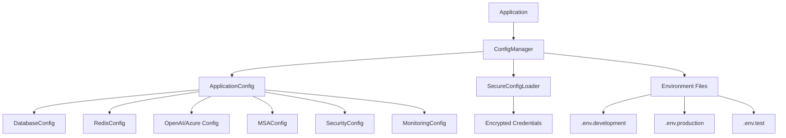

# Configuration Management System Documentation

## Overview

The MSA Reasoning Kernel uses a comprehensive configuration management system that centralizes all application settings, provides environment-specific configurations, and integrates with secure credential management.

## Key Features

- **🏗️ Centralized Configuration**: All settings managed through a single system
- **🔒 Security Integration**: Secure credential management with bcrypt hashing  
- **🌍 Environment Awareness**: Automatic environment-specific configuration overrides
- **⚡ Type Safety**: Pydantic validation ensures configuration correctness
- **🔄 Hot Reload**: Development environment configuration changes without restart
- **📊 Configuration Monitoring**: Built-in configuration validation and reporting

## Architecture



## Quick Start

### Basic Usage

```python
from reasoning_kernel.core.config_manager import get_config

# Get complete configuration
config = get_config()
print(f"Running in {config.environment} mode")

# Access specific subsystems
redis_host = config.redis.host
openai_key = config.azure_openai.api_key
debug_mode = config.debug
```

### Convenience Functions

```python
from reasoning_kernel.core.config_manager import (
    get_redis_config,
    get_openai_config, 
    get_msa_config,
    is_production,
    is_development,
    is_debug_enabled
)

# Get Redis configuration
redis_config = get_redis_config()
client = Redis(host=redis_config.host, port=redis_config.port)

# Environment checks
if is_production():
    # Production-specific logic
    pass

if is_debug_enabled():
    print("Debug mode active")
```

## Configuration Sections

### Database Configuration

```python
# Access database config
db_config = get_config().database

# Properties
db_config.host          # Database host
db_config.port          # Database port (default: 5432)
db_config.name          # Database name
db_config.user          # Database user
db_config.password      # Database password
db_config.max_connections    # Connection pool size
db_config.connection_timeout # Connection timeout
db_config.ssl_mode      # SSL mode
```

### Redis Configuration

```python
# Access Redis config
redis_config = get_redis_config()

# Properties
redis_config.host       # Redis host
redis_config.port       # Redis port
redis_config.password   # Redis password (from secure storage)
redis_config.db         # Redis database number
redis_config.url        # Complete Redis URL
redis_config.max_connections # Connection pool size
redis_config.ttl_seconds     # Default TTL
redis_config.timeout    # Operation timeout
redis_config.ssl        # Enable SSL
```

### OpenAI Configuration

```python
# Get OpenAI config (prefers Azure)
openai_config = get_openai_config()

# For Azure OpenAI
if hasattr(openai_config, 'endpoint'):
    api_key = openai_config.api_key
    endpoint = openai_config.endpoint
    deployment = openai_config.deployment
    api_version = openai_config.api_version

# For standard OpenAI
else:
    api_key = openai_config.api_key
    model = openai_config.model
```

### MSA Engine Configuration

```python
# Access MSA config
msa_config = get_msa_config()

# Properties
msa_config.max_reasoning_steps    # Maximum reasoning iterations
msa_config.probabilistic_samples  # Monte Carlo samples
msa_config.uncertainty_threshold  # Uncertainty cutoff
msa_config.reasoning_timeout      # Reasoning timeout (seconds)
msa_config.parallel_execution     # Enable parallel pipeline
msa_config.max_concurrency       # Parallel execution threads
msa_config.enable_caching        # Enable result caching
```

### Security Configuration

```python
# Access security config
security_config = get_config().security

# Properties
security_config.api_key_secret      # API key encryption secret
security_config.session_secret      # Session signing secret  
security_config.rate_limiting_enabled # Enable rate limiting
security_config.max_requests_per_minute # Rate limit threshold
security_config.validation_level    # Input validation level
security_config.audit_enabled      # Enable security auditing
security_config.cors_origins       # Allowed CORS origins
```

### Monitoring Configuration

```python
# Access monitoring config
monitoring_config = get_config().monitoring

# Properties
monitoring_config.log_level         # Logging level
monitoring_config.structured_logging # Enable structured logging
monitoring_config.metrics_enabled   # Enable metrics collection
monitoring_config.tracing_enabled   # Enable distributed tracing
monitoring_config.health_check_interval # Health check frequency
```

## Environment-Specific Configuration

### Development Environment (`.env.development`)

```bash
ENVIRONMENT=development
DEBUG=true
LOG_LEVEL=DEBUG

# Relaxed settings for development
VALIDATION_LEVEL=permissive
RATE_LIMITING_ENABLED=false
MSA_ENABLE_CACHING=false

# Development Redis
REDIS_HOST=localhost
REDIS_PORT=6379
REDIS_DB=0
```

### Production Environment (`.env.production`)

```bash
ENVIRONMENT=production
DEBUG=false
LOG_LEVEL=WARNING

# Strict production settings
VALIDATION_LEVEL=strict
RATE_LIMITING_ENABLED=true
MAX_REQUESTS_PER_MINUTE=100
REDIS_SSL=true

# Production optimizations
MSA_MAX_CONCURRENCY=6
MSA_ENABLE_CACHING=true
REDIS_MAX_CONNECTIONS=100
```

### Test Environment (`.env.test`)

```bash
ENVIRONMENT=test
DEBUG=false
LOG_LEVEL=ERROR

# Fast settings for testing
MSA_REASONING_TIMEOUT=30
PROBABILISTIC_SAMPLES=100
MSA_PARALLEL_EXECUTION=false

# Isolated test database
REDIS_DB=15
DATABASE_NAME=reasoning_kernel_test
```

## Environment Variable Loading

The system loads environment variables in this priority order:

1. **System environment variables** (highest priority)
2. **Environment-specific files** (`.env.{environment}`)
3. **Local override file** (`.env.local`)
4. **Base environment file** (`.env`)
5. **Configuration defaults** (lowest priority)

## Secure Credential Management

Sensitive values are handled through the integrated credential management system:

```python
# Credentials are automatically loaded from secure storage
config = get_config()

# These values come from encrypted storage
api_key = config.azure_openai.api_key      # From credential manager
redis_password = config.redis.password      # From credential manager
session_secret = config.security.session_secret # From credential manager
```

### Setting Up Credentials

```bash
# Set up environment variables for credential manager
export API_KEY_SECRET="your-encryption-secret"
export AZURE_OPENAI_API_KEY="your-azure-key"
export REDIS_PASSWORD="your-redis-password"
```

## Configuration Validation

The system provides comprehensive validation:

### Automatic Validation

```python
# Configuration is automatically validated on load
config = get_config()  # Raises ConfigurationError if invalid
```

### Manual Validation

```python
from reasoning_kernel.core.config_manager import ConfigManager

manager = ConfigManager()
try:
    config = manager.load_config()
    print("✅ Configuration valid")
except ConfigurationError as e:
    print(f"❌ Configuration error: {e}")
```

### Validation Rules

- **Production Environment**: Requires all API keys and secrets
- **Port Numbers**: Must be between 1-65535
- **Percentages**: Must be between 0.0-1.0
- **Positive Integers**: Must be greater than 0
- **Timeout Values**: Must be reasonable (5-3600 seconds)

## Configuration Export and Inspection

### Export Configuration

```python
from reasoning_kernel.core.config_manager import get_config_manager

manager = get_config_manager()

# Export to JSON (secrets redacted)
json_config = manager.export_config(format="json", include_secrets=False)
print(json_config)

# Export to YAML
yaml_config = manager.export_config(format="yaml", include_secrets=False)
print(yaml_config)
```

### Configuration Summary

```python
# Get configuration summary
summary = manager.get_config_summary()
print(f"Environment: {summary['environment']}")
print(f"Debug mode: {summary['debug_mode']}")
print(f"Redis configured: {summary['redis_configured']}")
print(f"OpenAI configured: {summary['openai_configured']}")
```

## Hot Reload (Development)

The system supports configuration hot-reload in development:

```python
# Enable configuration watching (development only)
manager = get_config_manager()
await manager.watch_config_changes()

# Manual reload
new_config = manager.reload_config()
```

## Migration from Legacy Configuration

### Before (Legacy)

```python
import os
from reasoning_kernel.core.config import settings

redis_host = os.getenv("REDIS_HOST", "localhost")
debug_mode = settings.debug
openai_key = os.getenv("AZURE_OPENAI_API_KEY")
```

### After (New System)

```python
from reasoning_kernel.core.config_manager import (
    get_redis_config, 
    get_config,
    is_debug_enabled
)

redis_config = get_redis_config()
redis_host = redis_config.host
debug_mode = is_debug_enabled()
openai_config = get_openai_config()
openai_key = openai_config.api_key
```

## Advanced Usage

### Custom Configuration Manager

```python
from reasoning_kernel.core.config_manager import ConfigManager
from pathlib import Path

# Create custom config manager with specific path
custom_manager = ConfigManager(config_path=Path("/custom/config/path"))
custom_config = custom_manager.load_config()
```

### Environment Override

```python
import os

# Override environment at runtime
os.environ["ENVIRONMENT"] = "staging"
get_config.cache_clear()  # Clear cache
config = get_config()     # Loads with new environment
```

### Configuration Testing

```python
import pytest
from unittest.mock import patch

@patch.dict(os.environ, {
    'ENVIRONMENT': 'test',
    'DEBUG': 'true',
    'REDIS_HOST': 'test-redis'
})
def test_configuration():
    get_config.cache_clear()  # Clear cache for test
    config = get_config()
    
    assert config.environment == Environment.TEST
    assert config.debug is True
    assert config.redis.host == "test-redis"
```

## Error Handling

### Configuration Errors

```python
from reasoning_kernel.core.config_manager import ConfigurationError

try:
    config = get_config()
except ConfigurationError as e:
    logger.error(f"Configuration failed: {e}")
    # Handle configuration error
```

### Common Error Scenarios

- **Missing Required Credentials**: In production, API keys must be configured
- **Invalid Environment Values**: Unknown environment names default to development
- **Port Range Errors**: Ports must be 1-65535
- **Validation Failures**: Configuration values must pass Pydantic validation

## Best Practices

### ✅ Do

- Use convenience functions like `get_redis_config()` for specific subsystems
- Check environment with `is_production()`, `is_development()` helpers
- Use environment-specific `.env.{environment}` files
- Validate configuration on application startup
- Use type hints when working with config objects

### ❌ Don't

- Access `os.getenv()` directly - use configuration system
- Hardcode configuration values - use config models
- Store secrets in plain text - use credential manager
- Ignore configuration validation errors
- Cache config objects across environment changes

## Troubleshooting

### Configuration Not Loading

```bash
# Check environment variables
env | grep -E "(ENVIRONMENT|DEBUG|REDIS|AZURE)"

# Verify environment files exist
ls -la .env*

# Test configuration loading
python -c "from reasoning_kernel.core.config_manager import get_config; print(get_config().environment)"
```

### Missing Credentials

```bash
# Check credential manager status
python -c "
from reasoning_kernel.security.credential_manager import SecureConfigLoader
loader = SecureConfigLoader()
config = loader.load_config()
print('Validation:', config['validation'])
"
```

### Configuration Validation Errors

```python
# Get detailed validation information
from reasoning_kernel.core.config_manager import get_config_manager

manager = get_config_manager()
try:
    config = manager.load_config()
except Exception as e:
    print(f"Validation failed: {e}")
    
    # Check configuration summary for more details
    summary = manager.get_config_summary()
    print("Configuration Summary:", summary)
```

## API Reference

See the `reasoning_kernel.core.config_manager` module for complete API documentation.

### Key Classes

- `ApplicationConfig`: Main configuration class
- `ConfigManager`: Configuration lifecycle management
- `Environment`: Environment enumeration
- `ConfigurationError`: Configuration-related exceptions

### Key Functions

- `get_config()`: Get application configuration
- `get_config_manager()`: Get configuration manager
- `get_redis_config()`: Get Redis configuration  
- `get_openai_config()`: Get OpenAI configuration
- `get_msa_config()`: Get MSA configuration
- `is_production()`: Check if in production
- `is_development()`: Check if in development
- `is_debug_enabled()`: Check if debug mode enabled
