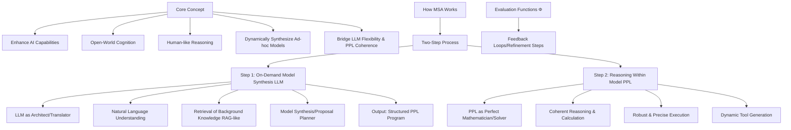

# MSA Framework: Model Synthesis Architecture

## Overview

The Model Synthesis Architecture (MSA) is a revolutionary two-step framework that enhances AI capabilities through dynamic model synthesis and specialized reasoning. This framework is at the core of the Reasoning Kernel's advanced cognitive abilities.

## Framework Visualization



## Core Concept

The MSA framework addresses fundamental limitations in current AI systems by combining the strengths of two complementary approaches:

### **Enhance AI Capabilities**

- **Open-World Cognition**: Handle novel, undefined scenarios with adaptive reasoning
- **Human-like Reasoning**: Mimic natural cognitive processes and intuitive problem-solving
- **Dynamic Model Synthesis**: Create specialized models on-demand for specific reasoning tasks
- **Bridge Flexibility & Coherence**: Combine LLM adaptability with PPL mathematical precision

## Two-Step Process Architecture

### Step 1: On-Demand Model Synthesis (LLM)

The first step leverages Large Language Models as **architects and translators** to understand and structure reasoning problems:

#### **LLM as Architect/Translator**

```python
class ModelSynthesisAgent(ChatCompletionAgent):
    """Agent responsible for understanding problems and synthesizing reasoning models"""
    
    def __init__(self, kernel: Kernel):
        super().__init__(
            kernel=kernel,
            service_id="gemini-chat",
            name="model_synthesis_agent",
            instructions="""
            You are a cognitive architect that transforms natural language problems 
            into structured reasoning models. Your role is to:
            1. Understand the problem domain and requirements
            2. Retrieve relevant background knowledge
            3. Design appropriate reasoning structures
            4. Generate executable PPL programs
            """
        )
    
    @kernel_function(
        name="synthesize_reasoning_model",
        description="Create a structured reasoning model for the given problem"
    )
    async def synthesize_model(
        self, 
        problem_description: str,
        domain_context: str = "",
        background_knowledge: List[str] = None
    ) -> Dict[str, Any]:
        """Synthesize a reasoning model for the given problem"""
        
        # Natural Language Understanding
        problem_analysis = await self._analyze_problem(problem_description)
        
        # Retrieval of Background Knowledge (RAG-like)
        relevant_knowledge = await self._retrieve_knowledge(
            problem_analysis, domain_context, background_knowledge
        )
        
        # Model Synthesis/Proposal (Planner)
        reasoning_model = await self._design_reasoning_structure(
            problem_analysis, relevant_knowledge
        )
        
        # Output: Structured PPL Program
        ppl_program = await self._generate_ppl_program(reasoning_model)
        
        return {
            "problem_analysis": problem_analysis,
            "knowledge_base": relevant_knowledge,
            "reasoning_model": reasoning_model,
            "ppl_program": ppl_program,
            "execution_ready": True
        }
```

#### **LLM Capabilities**

- **Natural Language Understanding**: Deep comprehension of problem requirements and constraints
- **Retrieval of Background Knowledge**: RAG-like knowledge integration from memory stores
- **Model Synthesis/Proposal**: Design of specialized reasoning architectures
- **Structured Output Generation**: Creation of executable PPL programs

### Step 2: Reasoning Within Model (PPL)

The second step executes the synthesized model using Probabilistic Programming Languages as **perfect mathematicians and solvers**:

#### **PPL as Perfect Mathematician/Solver**

```python
class ProbabilisticReasoningEngine:
    """PPL-based reasoning engine for precise mathematical computation"""
    
    def __init__(self, sandbox_client: DaytonaSandboxClient):
        self.sandbox = sandbox_client
        self.ppl_runtime = PPLRuntime()
        
    async def execute_reasoning_model(
        self, 
        ppl_program: str,
        input_data: Dict[str, Any],
        execution_config: Dict[str, Any] = None
    ) -> Dict[str, Any]:
        """Execute the synthesized PPL reasoning model"""
        
        # Coherent Reasoning & Calculation
        reasoning_trace = await self._execute_coherent_reasoning(
            ppl_program, input_data
        )
        
        # Robust & Precise Execution
        execution_result = await self._robust_execution(
            reasoning_trace, execution_config
        )
        
        # Dynamic Tool Generation
        generated_tools = await self._generate_dynamic_tools(
            execution_result, reasoning_trace
        )
        
        return {
            "reasoning_trace": reasoning_trace,
            "execution_result": execution_result,
            "generated_tools": generated_tools,
            "confidence_scores": self._calculate_confidence(execution_result),
            "verification_status": self._verify_consistency(execution_result)
        }
    
    async def _execute_coherent_reasoning(
        self, 
        ppl_program: str, 
        input_data: Dict[str, Any]
    ) -> List[Dict[str, Any]]:
        """Execute coherent mathematical reasoning steps"""
        
        # Compile PPL program in sandbox
        compilation_result = await self.sandbox.compile_ppl(ppl_program)
        
        if not compilation_result.success:
            raise PPLCompilationError(compilation_result.errors)
        
        # Execute reasoning steps
        reasoning_steps = []
        for step in compilation_result.execution_plan:
            step_result = await self.sandbox.execute_step(step, input_data)
            reasoning_steps.append({
                "step_id": step.id,
                "operation": step.operation,
                "inputs": step.inputs,
                "outputs": step_result.outputs,
                "confidence": step_result.confidence,
                "mathematical_proof": step_result.proof
            })
            
        return reasoning_steps
```

#### **PPL Capabilities**

- **Coherent Reasoning & Calculation**: Mathematically sound inference and computation
- **Robust & Precise Execution**: Error-resistant execution with formal verification
- **Dynamic Tool Generation**: Creation of specialized tools based on reasoning needs

## Framework Integration with Semantic Kernel

### Agent Orchestration for MSA

```python
class MSAOrchestrator:
    """Orchestrates the two-step MSA process using SK agents"""
    
    def __init__(self, kernel: Kernel):
        self.kernel = kernel
        self.synthesis_agent = ModelSynthesisAgent(kernel)
        self.reasoning_engine = ProbabilisticReasoningEngine(
            DaytonaSandboxClient()
        )
        self.memory = RedisMemoryStore()
        
    async def execute_msa_reasoning(
        self,
        problem: str,
        domain_context: str = "",
        memory_collections: List[str] = None
    ) -> MSAReasoningResult:
        """Execute the complete MSA reasoning process"""
        
        # Step 1: Model Synthesis (LLM)
        synthesis_result = await self.synthesis_agent.synthesize_model(
            problem_description=problem,
            domain_context=domain_context,
            background_knowledge=await self._retrieve_background_knowledge(
                problem, memory_collections
            )
        )
        
        # Step 2: PPL Reasoning
        reasoning_result = await self.reasoning_engine.execute_reasoning_model(
            ppl_program=synthesis_result["ppl_program"],
            input_data={"problem": problem, "context": domain_context}
        )
        
        # Evaluation and Feedback
        evaluation_result = await self._evaluate_and_refine(
            synthesis_result, reasoning_result
        )
        
        return MSAReasoningResult(
            problem=problem,
            synthesis_step=synthesis_result,
            reasoning_step=reasoning_result,
            evaluation=evaluation_result,
            confidence=evaluation_result.overall_confidence,
            generated_tools=reasoning_result["generated_tools"]
        )
```

### Memory Integration

```python
class MSAMemoryManager:
    """Manages memory operations for MSA framework"""
    
    def __init__(self, redis_store: RedisMemoryStore, embedding_service):
        self.memory = redis_store
        self.embeddings = embedding_service
        
    async def store_reasoning_pattern(
        self,
        pattern: Dict[str, Any],
        collection: str = "msa_patterns"
    ):
        """Store successful reasoning patterns for future synthesis"""
        
        pattern_embedding = await self.embeddings.generate_embedding(
            f"{pattern['problem_type']} {pattern['reasoning_approach']}"
        )
        
        await self.memory.upsert(
            collection=collection,
            record=MemoryRecord(
                id=f"msa_pattern_{pattern['id']}",
                text=pattern['description'],
                embedding=pattern_embedding,
                metadata={
                    "problem_type": pattern['problem_type'],
                    "reasoning_approach": pattern['reasoning_approach'],
                    "success_rate": pattern['success_rate'],
                    "ppl_template": pattern['ppl_template']
                }
            )
        )
    
    async def retrieve_similar_patterns(
        self,
        problem_description: str,
        limit: int = 5,
        relevance_threshold: float = 0.75
    ) -> List[MemoryRecord]:
        """Retrieve similar reasoning patterns for model synthesis"""
        
        query_embedding = await self.embeddings.generate_embedding(
            problem_description
        )
        
        return await self.memory.get_nearest_matches(
            collection="msa_patterns",
            embedding=query_embedding,
            limit=limit,
            min_relevance_score=relevance_threshold
        )
```

## Evaluation Functions (Φ) and Feedback Loops

### Continuous Refinement Process

```python
class MSAEvaluator:
    """Evaluation and refinement system for MSA reasoning"""
    
    def __init__(self):
        self.evaluation_functions = [
            self._evaluate_logical_consistency,
            self._evaluate_mathematical_accuracy,
            self._evaluate_reasoning_completeness,
            self._evaluate_solution_effectiveness
        ]
    
    async def evaluate_reasoning_result(
        self,
        synthesis_result: Dict[str, Any],
        reasoning_result: Dict[str, Any],
        ground_truth: Optional[Any] = None
    ) -> EvaluationResult:
        """Comprehensive evaluation of MSA reasoning process"""
        
        evaluations = {}
        
        for eval_func in self.evaluation_functions:
            eval_result = await eval_func(
                synthesis_result, reasoning_result, ground_truth
            )
            evaluations[eval_func.__name__] = eval_result
        
        overall_score = self._calculate_weighted_score(evaluations)
        refinement_suggestions = self._generate_refinement_suggestions(evaluations)
        
        return EvaluationResult(
            individual_scores=evaluations,
            overall_score=overall_score,
            passed_threshold=overall_score >= 0.8,
            refinement_suggestions=refinement_suggestions
        )
    
    async def _evaluate_logical_consistency(
        self, synthesis_result, reasoning_result, ground_truth
    ) -> float:
        """Evaluate logical consistency of reasoning steps"""
        reasoning_trace = reasoning_result["reasoning_trace"]
        
        consistency_violations = 0
        for i, step in enumerate(reasoning_trace[1:], 1):
            if not self._check_logical_consistency(
                reasoning_trace[i-1], step
            ):
                consistency_violations += 1
        
        consistency_score = max(0.0, 1.0 - (consistency_violations / len(reasoning_trace)))
        return consistency_score
    
    async def refine_based_on_feedback(
        self,
        original_synthesis: Dict[str, Any],
        evaluation_result: EvaluationResult,
        max_iterations: int = 3
    ) -> Dict[str, Any]:
        """Refine reasoning model based on evaluation feedback"""
        
        current_synthesis = original_synthesis
        
        for iteration in range(max_iterations):
            if evaluation_result.passed_threshold:
                break
                
            # Apply refinement suggestions
            refinement_prompt = self._create_refinement_prompt(
                current_synthesis, evaluation_result.refinement_suggestions
            )
            
            refined_synthesis = await self._apply_refinements(
                current_synthesis, refinement_prompt
            )
            
            # Re-evaluate
            new_reasoning_result = await self._execute_refined_model(
                refined_synthesis
            )
            
            evaluation_result = await self.evaluate_reasoning_result(
                refined_synthesis, new_reasoning_result
            )
            
            current_synthesis = refined_synthesis
        
        return current_synthesis
```

## Key Benefits of MSA Framework

### **1. Adaptive Intelligence**

- **Dynamic Problem Solving**: Creates specialized reasoning models for each unique problem
- **Open-World Cognition**: Handles undefined scenarios without pre-programmed solutions
- **Continuous Learning**: Improves through feedback loops and pattern recognition

### **2. Mathematical Precision**

- **Formal Verification**: PPL execution provides mathematical guarantees
- **Error Detection**: Automatic identification of logical inconsistencies
- **Confidence Quantification**: Probabilistic confidence scores for all reasoning steps

### **3. Scalable Architecture**

- **Modular Design**: Clear separation between synthesis and execution
- **Resource Optimization**: Efficient use of LLM and PPL capabilities
- **Extensible Framework**: Easy addition of new reasoning patterns and domains

### **4. Human-AI Collaboration**

- **Interpretable Process**: Clear reasoning traces and decision explanations
- **Interactive Refinement**: Human feedback integration for continuous improvement
- **Tool Generation**: Dynamic creation of specialized tools for specific domains

## Integration with Reasoning Kernel

The MSA framework is seamlessly integrated into the Reasoning Kernel's agent-based architecture:

- **Agent Coordination**: MSA orchestrator coordinates synthesis and reasoning agents
- **Memory Enhancement**: Redis memory stores successful reasoning patterns and knowledge
- **Sandbox Execution**: Daytona sandbox provides secure PPL execution environment
- **Gemini Integration**: Thinking modes enhance the synthesis agent's capabilities

This creates a powerful reasoning system that combines the flexibility of modern LLMs with the precision of mathematical programming, enabling sophisticated problem-solving capabilities across diverse domains.
