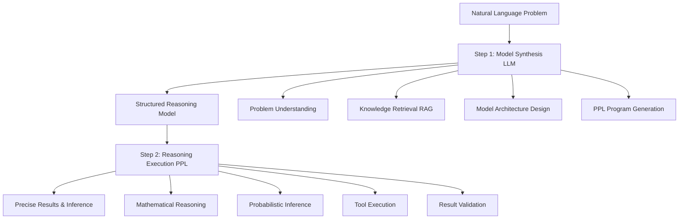
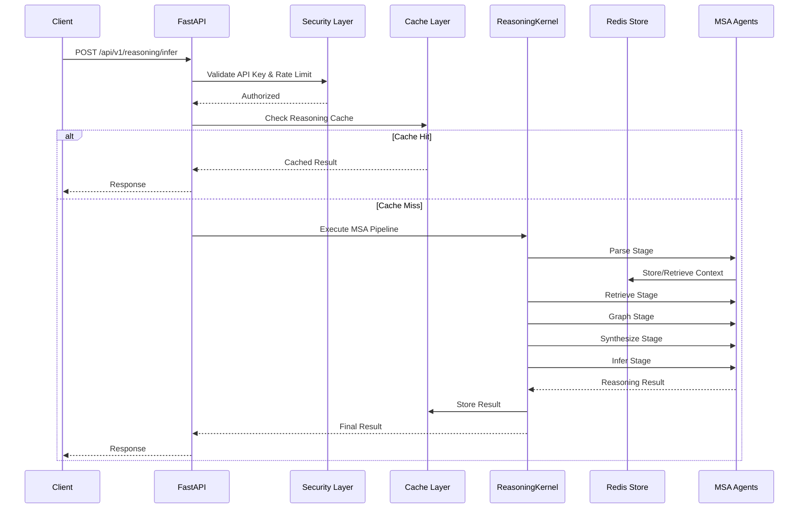
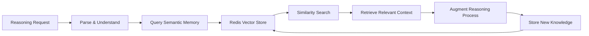

# Reasoning Kernel Architecture Overview

## 🏗️ System Architecture

The Reasoning Kernel is a **Semantic Kernel-native** reasoning system implementing the **Model Synthesis Architecture (MSA)** for open-world cognitive reasoning. The system is built with enterprise-grade components including security hardening, performance optimization, and production monitoring.

## 🎯 Core Design Principles

### **1. Semantic Kernel Native**
- Built entirely on Microsoft Semantic Kernel patterns
- Plugin-based modularity with SK orchestration
- Native SK planners for complex reasoning workflows

### **2. Model Synthesis Architecture (MSA)**
- Five-stage reasoning pipeline (Parse → Retrieve → Graph → Synthesize → Infer)  
- Dynamic model synthesis for specialized reasoning tasks
- Combines LLM flexibility with probabilistic programming coherence

### **3. Production Ready**
- Enterprise security with API key management and rate limiting
- Multi-tier caching with Redis backend
- Circuit breakers for fault tolerance
- Comprehensive monitoring and observability

## 🔄 Model Synthesis Architecture (MSA) Framework

### Two-Step Process



### **Step 1: Model Synthesis (LLM)**
The Large Language Model acts as an **architect and translator**:

- **Natural Language Understanding**: Parse complex problem descriptions
- **Knowledge Retrieval**: RAG-like background knowledge integration
- **Model Design**: Create appropriate reasoning structures
- **PPL Generation**: Output structured probabilistic programs

### **Step 2: Reasoning Execution (PPL)**
The Probabilistic Programming Language provides **mathematical precision**:

- **Coherent Reasoning**: Structured logical operations
- **Probabilistic Inference**: Uncertainty quantification
- **Dynamic Tool Generation**: Adaptive problem-solving capabilities
- **Robust Execution**: Reliable mathematical computations

## 🏛️ Five-Stage MSA Pipeline

### 1. **Parse Stage**
```python
async def parse_stage(vignette: str) -> ParseResult:
    \"\"\"Transform natural language into structured problem representation\"\"\"
    # Problem decomposition, entity extraction, intent classification
```

### 2. **Retrieve Stage**
```python
async def retrieve_stage(parsed_problem: ParseResult) -> RetrievalResult:
    \"\"\"Gather relevant knowledge and context using RAG patterns\"\"\"
    # Semantic search, knowledge base queries, context assembly
```

### 3. **Graph Stage**
```python
async def graph_stage(context: RetrievalResult) -> GraphResult:
    \"\"\"Build dependency graphs and reasoning structures\"\"\"
    # Relationship modeling, constraint identification, structure building
```

### 4. **Synthesize Stage**
```python
async def synthesize_stage(graph: GraphResult) -> SynthesisResult:
    \"\"\"Create probabilistic models and reasoning frameworks\"\"\"
    # Model generation, parameter estimation, structure optimization
```

### 5. **Infer Stage**
```python
async def infer_stage(model: SynthesisResult) -> InferenceResult:
    \"\"\"Execute reasoning and generate conclusions\"\"\"
    # Probabilistic inference, uncertainty quantification, result validation
```

## 🏗️ System Components

### **Core Reasoning Engine**

#### **ReasoningKernel (v2)**
- **Primary Interface**: Main reasoning orchestrator
- **Stage Management**: Executes five-stage MSA pipeline
- **Callback System**: Real-time progress updates and streaming
- **Result Aggregation**: Comprehensive reasoning result compilation

```python
class ReasoningKernel:
    async def reason(
        self,
        vignette: str,
        data: Optional[Dict[str, Any]] = None,
        session_id: Optional[str] = None,
        callbacks: Optional[Dict[str, Callable]] = None
    ) -> ReasoningResult
```

#### **MSAEngine (v1)**
- **Legacy Support**: Backward compatibility layer
- **Plugin Integration**: SK plugin-based reasoning
- **Graceful Fallback**: Operates when v2 components unavailable

### **Agent Architecture**

#### **ModelSynthesisAgent**
- **Role**: Problem understanding and model design
- **Capabilities**: Natural language processing, knowledge retrieval
- **Output**: Structured reasoning models and PPL programs

#### **ProbabilisticReasoningAgent**
- **Role**: Mathematical reasoning and inference execution
- **Capabilities**: Probabilistic calculations, uncertainty quantification
- **Output**: Precise results with confidence measures

#### **BaseReasoningAgent**
- **Role**: Common functionality and SK integration
- **Capabilities**: Plugin management, kernel services, lifecycle management
- **Pattern**: Abstract base for specialized reasoning agents

### **Storage & Memory**

#### **Redis Integration**
- **Primary Storage**: Redis-backed persistent memory
- **Semantic Memory**: SK SemanticTextMemory with Redis adapter
- **Caching Layer**: Multi-tier performance optimization
- **Session Management**: Conversation and reasoning state persistence

#### **Memory Architecture**
```python
# Redis Memory Adapter
class SimpleRedisMemoryAdapter(MemoryStoreBase):
    # MemoryStoreBase interface implementation
    # Vector similarity search with cosine similarity
    # Collection management and metadata tracking

# Semantic Memory Integration
SemanticTextMemory(
    storage=redis_memory_adapter,
    embeddings_generator=embedding_service
)
```

### **API Layer**

#### **FastAPI Application**
- **REST API**: RESTful reasoning endpoints
- **WebSocket Support**: Real-time streaming capabilities
- **OpenAPI Documentation**: Auto-generated API documentation
- **Middleware Stack**: Security, logging, monitoring integration

#### **Endpoint Categories**
```python
# Core Reasoning
POST /api/v1/reasoning/infer
POST /api/v1/reasoning/reason
GET  /api/v1/reasoning/sessions/{session_id}

# Admin & Security
POST /api/v1/admin/api-keys
GET  /api/v1/admin/api-keys
DELETE /api/v1/admin/api-keys/{key_id}

# Health & Monitoring
GET  /health
GET  /health/detailed
GET  /security/status
GET  /circuit-breakers
```

## 🔒 Security Architecture

### **Multi-Layer Security**

#### **1. Authentication & Authorization**
```python
# API Key Management
class APIKeyManager:
    # Secure key generation (rk_<32chars>)
    # Role-based access control (ADMIN/USER/READONLY/SERVICE)
    # Permission-based endpoint access
    # Usage tracking and limits
```

#### **2. Rate Limiting**
```python
# Sliding Window Rate Limiting
class RateLimitMiddleware:
    # Per-IP, per-API-key, per-user limits
    # Redis-backed distributed limiting
    # Endpoint-specific configurations
    # Automatic blocking with exponential backoff
```

#### **3. Input Validation**
```python
# Security Pattern Detection
class RequestValidationMiddleware:
    # SQL injection prevention
    # XSS protection and sanitization
    # Path traversal protection
    # Command injection detection
    # Request size and depth limits
```

#### **4. Audit Logging**
```python
# Comprehensive Security Monitoring
class AuditLogger:
    # 20+ structured event types
    # Security violation tracking
    # Threat detection and alerting
    # Performance monitoring
    # Redis + file dual storage
```

### **Security Headers & Configuration**
- **OWASP Standards**: Complete security header implementation
- **HTTPS Enforcement**: Production HTTPS requirement
- **CORS Configuration**: Origin validation and control
- **Content Security Policy**: XSS prevention framework

## 🚀 Performance Architecture

### **Caching System**

#### **Multi-Tier Caching**
```python
class ReasoningCache:
    # AdaptiveCache: LRU + TTL composite caching
    # Redis Backend: Distributed cache for scaling
    # 4-Level TTL: Critical(1h), Important(30m), Normal(15m), Low(5m)
    # Cache Warming: Proactive pattern loading
```

#### **MSA-Specific Patterns**
- **Reasoning Results**: Session-based result caching
- **Model Outputs**: Reusable model predictions
- **Embeddings**: Vector embedding persistence
- **Knowledge Retrieval**: RAG query result caching

### **Fault Tolerance**

#### **Circuit Breaker System**
```python
class CircuitBreaker:
    # 3-State Management: CLOSED/OPEN/HALF_OPEN
    # Service Protection: Daytona, Redis, WebSearch
    # Exponential Backoff: Configurable retry logic
    # Health Monitoring: Background recovery detection
```

#### **Graceful Degradation**
- **Cache Fallback**: Serve cached responses during failures
- **Service Alternatives**: Fallback service implementations
- **Error Context**: Rich error information and recovery guidance

## 🔧 Integration Architecture

### **External Services**

#### **Daytona Sandbox**
- **Secure Execution**: Isolated code execution environment
- **Circuit Protection**: Fault-tolerant service integration
- **Resource Management**: Sandbox lifecycle management
- **Security Validation**: Input sanitization and output verification

#### **Model Context Protocol (MCP)**
- **Redis Cloud Integration**: MCP server for Redis operations
- **Structured Communication**: Standardized service interfaces
- **Configuration Management**: Environment-based service setup

#### **AI Model Integration**
```python
# Multi-Model Support
SUPPORTED_MODELS = {
    'azure_openai': AzureOpenAIService,
    'google_gemini': GoogleGeminiService,
    'local_models': LocalModelService
}
```

### **Monitoring & Observability**

#### **OpenTelemetry Integration**
- **Distributed Tracing**: End-to-end request tracking
- **Correlation IDs**: Request correlation across services
- **Performance Profiling**: Automated performance monitoring
- **Span Creation**: Automatic instrumentation for all operations

#### **Health Monitoring**
```python
# Comprehensive Health Checks
GET /health -> {
    "status": "healthy",
    "components": {
        "redis": "healthy",
        "kernel": "healthy", 
        "security": "healthy"
    },
    "circuit_breakers": {...},
    "performance": {...}
}
```

## 🏗️ Deployment Architecture

### **Container Strategy**
```dockerfile
# Multi-stage Docker build
FROM python:3.12-slim as base
# Optimized dependency installation
# Security-hardened container configuration
# Multi-environment support (dev/staging/prod)
```

### **Kubernetes Deployment**
```yaml
# Production-ready K8s manifests
apiVersion: apps/v1
kind: Deployment
metadata:
  name: reasoning-kernel
spec:
  replicas: 3
  # Resource limits and requests
  # Health checks and probes
  # Environment-specific configuration
```

### **Environment Configuration**
```python
# Environment-based configuration
class Settings:
    # Security settings
    API_KEY_ENABLED: bool = True
    FORCE_HTTPS: bool = True
    
    # Performance settings  
    CACHE_TTL_HOURS: int = 1
    MAX_CONCURRENT_REQUESTS: int = 100
    
    # Integration settings
    REDIS_URL: str = "redis://localhost:6379"
    DAYTONA_API_URL: str = "https://api.daytona.io"
```

## 📊 Data Flow Architecture

### **Request Processing Flow**



### **Memory Architecture Flow**



## 🔄 Development Architecture

### **Plugin System**
```python
# SK Plugin Integration
@kernel_function(
    name="reasoning_stage",
    description="Execute specific MSA reasoning stage"
)
async def execute_reasoning_stage(
    stage: str,
    input_data: str,
    context: Dict[str, Any]
) -> Dict[str, Any]:
    # Stage-specific processing
    # Result validation and formatting
    # Context preservation and updates
```

### **Testing Architecture**
```python
# Comprehensive Test Strategy
class TestReasoningKernel:
    # Unit Tests: Individual component testing
    # Integration Tests: Cross-component validation
    # Performance Tests: Benchmarking and profiling
    # Security Tests: Vulnerability assessment
    # E2E Tests: Complete workflow validation
```

### **Configuration Management**
```python
# Environment-based Configuration
@dataclass
class ReasoningConfig:
    # Model configurations
    # Service endpoints
    # Security parameters
    # Performance tuning
    # Feature flags
```

## 🎯 Quality Attributes

### **Performance**
- **Response Time**: Less than 2s for standard reasoning tasks
- **Throughput**: 100+ concurrent requests supported
- **Cache Hit Rate**: >80% for common reasoning patterns
- **Memory Usage**: Less than 1GB per reasoning session

### **Reliability** 
- **Availability**: 99.9% uptime target
- **Fault Tolerance**: Circuit breakers prevent cascade failures
- **Data Consistency**: Redis transactions ensure state integrity
- **Error Recovery**: Automatic retry with exponential backoff

### **Security**
- **Authentication**: API key-based with RBAC
- **Authorization**: Permission-based endpoint access
- **Audit Trail**: Comprehensive security event logging
- **Input Validation**: Multi-layer security pattern detection

### **Scalability**
- **Horizontal Scaling**: Stateless service design
- **Caching Strategy**: Multi-tier performance optimization
- **Resource Management**: Circuit breakers prevent resource exhaustion
- **Load Distribution**: Redis-based distributed caching

This architecture provides a robust, secure, and scalable foundation for advanced AI reasoning capabilities while maintaining production-ready operational characteristics.
