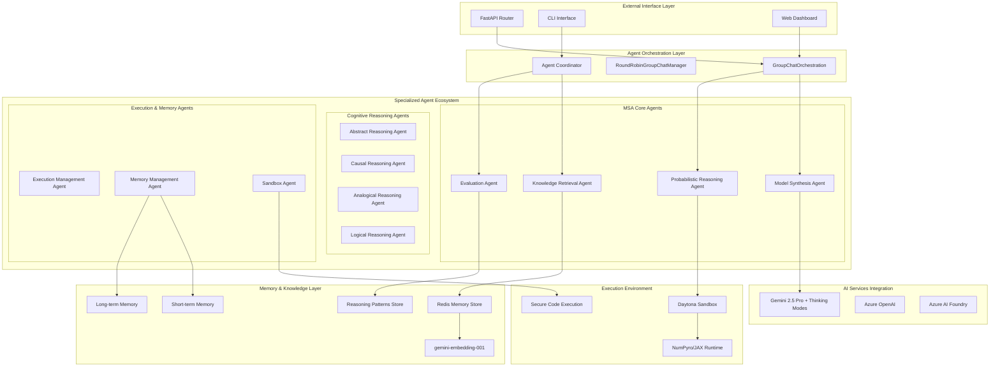
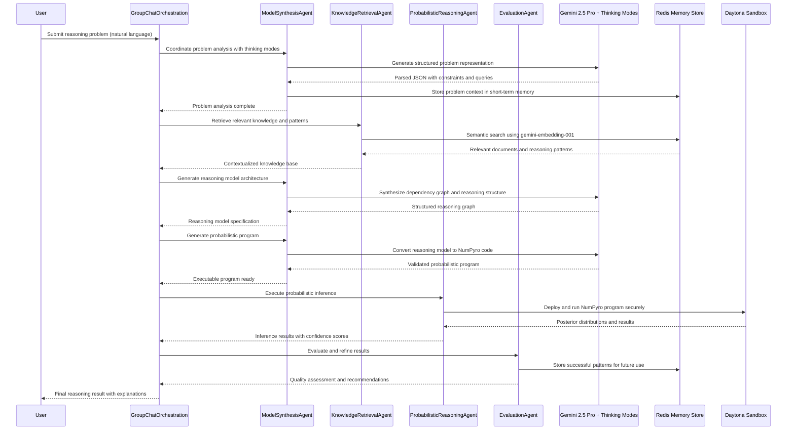

# Reasoning Kernel — Semantic Kernel Native Architecture

**Version:** 2.0  
**Date:** August 14, 2025  
**Authors:** Zachary Bensalem & AI Assistant  
**Status:** Updated for SK-Native Implementation  

---

## Abstract

`reasoning-kernel` is a **Semantic Kernel-native** Python framework for **open-world cognitive reasoning**, implementing the revolutionary **Model Synthesis Architecture (MSA)** through Microsoft Semantic Kernel's advanced agent ecosystem. The system leverages SK's latest agent orchestration patterns, memory abstractions, and plugin architecture to enable sophisticated cognitive reasoning capabilities.

The system integrates:  

- **Microsoft Semantic Kernel** with **ChatCompletionAgent** and **GroupChatOrchestration** patterns
- **Agent-based architecture** for collaborative reasoning and dynamic problem-solving
- **MSA Framework** implementing two-step reasoning (LLM synthesis → PPL execution)
- **Redis Memory Stores** with **gemini-embedding-001** for semantic search and knowledge management
- **Google Gemini 2.5 Pro** with **thinking modes** for enhanced reasoning capabilities
- **Daytona Sandbox Integration** for secure code execution and resource management
- **Azure AI Foundry** + **Azure Inference SDK** for enterprise-grade AI services
- **NumPyro + JAX** for probabilistic programming and Bayesian inference

---

## 1. Architectural Revolution: Agent-Native MSA Design

### 1.1 Core Design Principles

#### **Agent-First Architecture**

- All reasoning capabilities implemented through specialized ChatCompletionAgents
- Native agent orchestration using GroupChatOrchestration and RoundRobinGroupChatManager
- Leverage SK's built-in memory abstractions and AI service integrations
- Use agent-based kernel functions for all cognitive operations

#### **MSA-Driven Agent Ecosystem**

- **Model Synthesis Agent**: Responsible for problem understanding and reasoning model creation
- **Probabilistic Reasoning Agent**: Executes synthesized models with mathematical precision
- **Knowledge Retrieval Agent**: Manages semantic search and context gathering
- **Evaluation Agent**: Provides feedback loops and continuous refinement
- **Orchestration Agent**: Coordinates multi-agent workflows and ensures coherent execution

#### **Clean Separation of Concerns**

- **Agent Layer**: Specialized cognitive agents for specific reasoning tasks
- **Kernel Layer**: SK configuration, memory management, and service coordination
- **Memory Layer**: Redis-based semantic and episodic memory with gemini-embedding-001
- **Execution Layer**: Daytona sandbox integration for secure code execution
- **API Layer**: External interfaces and enterprise integrations

### 1.2 Agent-Based MSA Architecture Overview



## 2. MSA Framework Implementation

### 2.1 Two-Step MSA Process Architecture

The Reasoning Kernel implements the revolutionary Model Synthesis Architecture through specialized agents:

### Stage 1 — Parse & Understand

- **Agent:** `ModelSynthesisAgent` (ChatCompletionAgent with Gemini 2.5 Pro)
- **Models:** Gemini 2.5 Pro with thinking modes enabled
- **Validation:** `pydantic` schema enforcement with structured output parsing
- **Storage:** Redis short-term memory with session-based TTL
- **Function:** `@kernel_function parse_problem_vignette`

### Stage 2 — Retrieve & Contextualize

- **Agent:** `KnowledgeRetrievalAgent` (memory-enhanced ChatCompletionAgent)
- **Storage:** Redis vector store with gemini-embedding-001
- **Memory:** Long-term knowledge patterns and reasoning history
- **Function:** `@kernel_function retrieve_relevant_knowledge`
- **Integration:** Semantic search with relevance scoring and context ranking

### Stage 3 — Graph & Structure

- **Agent:** `ModelSynthesisAgent.generate_reasoning_graph`
- **Models:** Gemini 2.5 Pro with enhanced reasoning capabilities
- **Representation:** `NetworkX` + structured graph schemas
- **Function:** `@kernel_function create_dependency_graph`
- **Output:** JSON-serialized causal and logical relationship graphs

### Stage 4 — Synthesize & Generate

- **Agent:** `ModelSynthesisAgent.synthesize_probabilistic_program`
- **Models:** Gemini 2.5 Pro with code generation specialization
- **Post-processing:** `black` + `flake8` + security validation
- **Function:** `@kernel_function generate_ppl_program`
- **Output:** Validated NumPyro probabilistic programs

### Stage 5 — Execute & Infer

- **Agent:** `ProbabilisticReasoningAgent` (execution-specialized ChatCompletionAgent)
- **Runtime:** Daytona sandbox with secure execution environment
- **Libraries:** NumPyro, JAX, ArviZ for Bayesian inference
- **Function:** `@kernel_function execute_probabilistic_inference`
- **Integration:** Real-time execution monitoring and result validation

---

## 3.1 Agent-Level Sequence Diagram



---

## 3.2 Agent Function API Specifications

| Agent | Kernel Function | Input Schema | Output Schema | Primary Model |
|-------|-----------------|--------------|---------------|---------------|
| **ModelSynthesisAgent** | `parse_problem_vignette` | `{ "problem": str, "context": str }` | `{ "constraints": [...], "queries": [...], "structure": {...} }` | Gemini 2.5 Pro + Thinking |
| **KnowledgeRetrievalAgent** | `retrieve_relevant_knowledge` | `{ "queries": [...], "top_k": int, "threshold": float }` | `{ "documents": [...], "patterns": [...], "relevance_scores": [...] }` | gemini-embedding-001 |
| **ModelSynthesisAgent** | `create_dependency_graph` | `{ "context": str, "constraints": [...] }` | `{ "nodes": [...], "edges": [...], "reasoning_paths": [...] }` | Gemini 2.5 Pro |
| **ModelSynthesisAgent** | `generate_ppl_program` | `{ "graph": {...}, "queries": [...] }` | `{ "program": str, "validation": {...}, "metadata": {...} }` | Gemini 2.5 Pro |
| **ProbabilisticReasoningAgent** | `execute_probabilistic_inference` | `{ "program": str, "params": {...}, "config": {...} }` | `{ "posterior": {...}, "confidence": float, "diagnostics": {...} }` | Daytona + NumPyro |
| **EvaluationAgent** | `evaluate_reasoning_quality` | `{ "result": {...}, "ground_truth": {...} }` | `{ "quality_score": float, "feedback": str, "improvements": [...] }` | Gemini 2.5 Pro |

---

## 3.3 Error Handling & Agent Resilience

### Agent-Level Error Recovery

- **Gemini API Calls**  
  Agent-based retry with exponential backoff (max 3 attempts) on rate limits.  
  Automatic failover between agents and alternative reasoning paths.
  Thinking mode timeout handling with graceful degradation.

- **Redis Memory Operations**  
  On vector search failure → fallback to semantic similarity search.  
  Agent memory state preservation during temporary connection issues.
  TTL-enforced session cleanup with pattern archival.

- **Daytona Sandbox Execution**  
  Execution time limit: **30s** with progressive timeout warnings.  
  Memory monitoring: **512MB** with automatic cleanup procedures.  
  Agent coordination for failure recovery and alternative execution strategies.
  Structured error reporting: `{ "error": "...", "stage": "...", "agent": "...", "recovery_options": [...] }`.

### Agent Coordination Resilience

- **GroupChatOrchestration** failure handling with automatic agent rebalancing
- **Inter-agent communication** timeout management and message queuing
- **Memory consistency** across agent interactions with conflict resolution
- **Graceful degradation** when specific agents are unavailable

---

## 3.4 AI Model & Service Configuration Matrix

| Stage/Function | Primary Service | Fallback Service | Agent Coordination |
|----------------|-----------------|------------------|-------------------|
| **Problem Analysis** | Gemini 2.5 Pro + Thinking Modes | Azure GPT-4o | ModelSynthesisAgent |
| **Knowledge Retrieval** | gemini-embedding-001 + Redis | Azure OpenAI Embeddings | KnowledgeRetrievalAgent |
| **Graph Generation** | Gemini 2.5 Pro | Azure GPT-4o | ModelSynthesisAgent |
| **Program Synthesis** | Gemini 2.5 Pro | Azure GPT-4o | ModelSynthesisAgent |
| **Probabilistic Inference** | Daytona + NumPyro/JAX | Local Execution (dev) | ProbabilisticReasoningAgent |
| **Quality Evaluation** | Gemini 2.5 Pro | Azure GPT-4o | EvaluationAgent |

### Agent-Specific Model Preferences

- **ModelSynthesisAgent**: Optimized for Gemini 2.5 Pro with thinking modes for enhanced reasoning
- **KnowledgeRetrievalAgent**: Tuned for gemini-embedding-001 with Redis vector operations
- **ProbabilisticReasoningAgent**: Specialized for Daytona sandbox coordination and execution monitoring
- **EvaluationAgent**: Configured for comprehensive result analysis and feedback generation

---

## 3.5 Execution Environment — Detailed Daytona Integration

### Runtime Environment Specifications

- **Execution Host:** Daytona ephemeral sandbox with container isolation  
- **CPU:** 2 vCPU (burstable to 4 for ≤10s computational spikes)  
- **RAM:** 512MB with automatic memory management  
- **Execution Time Limit:** 30s with progressive timeout warnings  
- **Storage:** Ephemeral `/tmp` volume (50MB) + optional persistent volume (100MB)  
- **Python Runtime:** Python 3.12+ with optimized scientific stack  
- **Pre-installed Libraries:** `jax`, `numpyro`, `arviz`, `pandas`, `numpy`, `scipy`  
- **Network Policy:** No outbound network access for security  
- **Security:** AST static analysis blocks unsafe imports and operations  

### Agent-Coordinated Execution Flow

1. **ProbabilisticReasoningAgent** receives validated NumPyro program from ModelSynthesisAgent
2. **Sandbox Agent** initializes secure Daytona environment with resource constraints
3. **Execution monitoring** with real-time progress tracking and resource utilization
4. **Result serialization** with comprehensive posterior analysis and diagnostics
5. **Quality assurance** through EvaluationAgent with automatic result validation
6. **Memory integration** storing successful execution patterns in Redis for future optimization

---

## 4. Security & Compliance

### Agent Security Architecture

- **Inter-agent Communication:** Encrypted message passing with authentication
- **Memory Security:** Redis authentication with role-based access control
- **Sandbox Isolation:** Daytona containers with strict resource and network policies
- **API Security:** OAuth 2.0 + JWT tokens with rate limiting and request validation
- **Code Execution:** Static analysis + dynamic monitoring with automatic termination
- **Data Privacy:** Encryption at rest and in transit with GDPR compliance

### Compliance Standards

- **SOC 2 Type II:** Security, availability, and confidentiality controls
- **GDPR:** Privacy by design with data minimization and user consent
- **HIPAA:** Healthcare data protection for medical reasoning applications
- **ISO 27001:** Information security management system certification

---

## 5. Evaluation & Benchmarking Plan

### MSA-Specific Evaluation Metrics

- **Reasoning Quality:** Human evaluation scores on reasoning coherence and accuracy
- **Model Synthesis Effectiveness:** Success rate of LLM → PPL program generation
- **Execution Reliability:** Probabilistic inference completion rates and error analysis
- **Knowledge Integration:** Effectiveness of Redis-based memory retrieval and utilization
- **Agent Coordination:** Multi-agent workflow efficiency and communication overhead

### Benchmark Datasets

- **Model Olympics:** Original MSA evaluation dataset for sporting event reasoning
- **CommonsenseQA:** Extended with probabilistic reasoning requirements
- **MATH Dataset:** Mathematical problem solving with uncertainty quantification
- **ScienceQA:** Scientific reasoning with causal graph generation
- **Custom Reasoning Challenges:** Open-world cognitive reasoning scenarios

### Performance Targets

- **Response Time:** < 30 seconds for complete MSA pipeline execution
- **Accuracy:** > 85% agreement with human expert reasoning on benchmark tasks
- **Reliability:** > 99% uptime with graceful degradation under load
- **Scalability:** Support for 1000+ concurrent reasoning sessions

---

## 6. Development Roadmap

### Phase 1: Core Agent Implementation (Q1 2025)

- ✅ **Semantic Kernel integration** with latest agent patterns
- ✅ **MSA framework** implementation with specialized agents  
- ✅ **Redis memory integration** with gemini-embedding-001
- ✅ **Daytona sandbox** secure execution environment
- 🔄 **Basic reasoning pipeline** with agent orchestration

### Phase 2: Advanced Features (Q2 2025)

- 🔄 **Multi-modal reasoning** with vision and text integration
- 📋 **Advanced evaluation** with continuous learning capabilities
- 📋 **Enterprise API** with comprehensive monitoring and analytics
- 📋 **Plugin ecosystem** for domain-specific reasoning extensions

### Phase 3: Production Scale (Q3 2025)

- 📋 **High-availability deployment** with load balancing and auto-scaling
- 📋 **Advanced security** with zero-trust architecture
- 📋 **Enterprise integrations** with major cloud platforms
- 📋 **Performance optimization** with caching and model compression

### Phase 4: Research Extensions (Q4 2025)

- 📋 **Novel reasoning architectures** beyond MSA framework
- 📋 **Federated learning** for collaborative agent improvement
- 📋 **Causal discovery** with automated graph learning
- 📋 **Human-AI collaboration** interfaces for interactive reasoning

---

## 7. Repository Structure

```text
reasoning-kernel/
├── app/                              # Core application logic
│   ├── agents/                       # Specialized reasoning agents
│   │   ├── model_synthesis.py        # ModelSynthesisAgent implementation
│   │   ├── knowledge_retrieval.py    # KnowledgeRetrievalAgent
│   │   ├── probabilistic_reasoning.py # ProbabilisticReasoningAgent
│   │   └── evaluation.py             # EvaluationAgent
│   ├── orchestration/                # Agent coordination and management
│   │   ├── group_chat.py             # GroupChatOrchestration setup
│   │   ├── coordination.py           # Agent coordination logic
│   │   └── workflow_manager.py       # MSA workflow orchestration
│   ├── memory/                       # Redis-based memory management
│   │   ├── redis_store.py            # Redis memory store implementation
│   │   ├── embedding_service.py      # gemini-embedding-001 integration
│   │   └── pattern_manager.py        # Reasoning pattern storage
│   ├── sandbox/                      # Daytona integration
│   │   ├── execution_manager.py      # Sandbox execution coordination
│   │   ├── security_validator.py     # Code security validation
│   │   └── resource_monitor.py       # Resource usage monitoring
│   └── api/                          # REST API endpoints
│       ├── reasoning_endpoints.py    # MSA reasoning API
│       ├── agent_management.py       # Agent status and control
│       └── memory_endpoints.py       # Memory operations API
├── docs/                             # Comprehensive documentation
│   ├── architecture/                 # Architecture specifications
│   │   ├── msa-framework.md          # MSA framework detailed spec
│   │   └── semantic-kernel-architecture.md # SK integration guide
│   ├── plugins/                      # Plugin development guides
│   └── api/                          # API documentation
├── tests/                            # Comprehensive test suite
│   ├── agents/                       # Agent-specific tests
│   ├── integration/                  # End-to-end integration tests
│   └── benchmarks/                   # Performance and accuracy benchmarks
└── examples/                         # Usage examples and demos
    ├── basic_reasoning.py            # Simple MSA reasoning example
    ├── agent_coordination.py         # Multi-agent workflow demo
    └── enterprise_integration.py     # Enterprise API usage examples
```

---

## 8. Build & Dependency Management

### Modern Python Development Stack

- **Package Manager:** `uv` for fast dependency resolution and virtual environment management
- **Python Version:** Python 3.12+ with async/await optimizations
- **Packaging:** Modern `pyproject.toml` with complete metadata and build configuration
- **Code Quality:** `black`, `isort`, `flake8`, `mypy` with pre-commit hooks
- **Testing:** `pytest` with async test support and comprehensive coverage reporting
- **Documentation:** `mkdocs` with material theme and auto-generated API docs

### PyPI Distribution Strategy

- **Development Releases:** TestPyPI for pre-release testing and validation
- **Production Releases:** PyPI with semantic versioning and automated release notes
- **CI/CD Pipeline:** GitHub Actions with automated testing, building, and publishing
- **Quality Gates:** Automated testing, security scanning, and dependency updates

### Release & Versioning

#### Semantic Versioning Strategy

- **Major (X.0.0):** Breaking changes to agent interfaces or MSA framework
- **Minor (X.Y.0):** New agent capabilities, enhanced reasoning features, performance improvements
- **Patch (X.Y.Z):** Bug fixes, security updates, and compatibility improvements

#### Automated Release Pipeline

- **Tag Triggers:** Automatic release on version tags with `v*` pattern
- **Quality Assurance:** Comprehensive test suite, security scanning, and dependency auditing
- **Release Artifacts:** Wheel and source distributions with complete documentation
- **Release Notes:** Auto-generated from commit history with categorized changes

#### Release Checklist

- [ ] **Agent Testing:** All specialized agents pass comprehensive test suite
- [ ] **Integration Testing:** End-to-end MSA pipeline validation with multiple scenarios
- [ ] **Performance Benchmarking:** Regression testing against established performance baselines
- [ ] **Security Validation:** Static analysis, dependency scanning, and penetration testing
- [ ] **Documentation Updates:** Architecture docs, API references, and usage examples current
- [ ] **Compatibility Testing:** Cross-platform testing (Linux, macOS, Windows) with multiple Python versions
- [ ] **Deployment Validation:** TestPyPI release testing and production deployment verification
