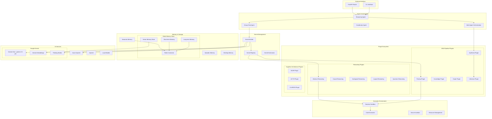

# Semantic Kernel Architecture Overview

## Introduction

The Reasoning Kernel has been completely refactored to leverage Microsoft Semantic Kernel (latest version) as the central orchestration framework. This document outlines the new SK-native architecture featuring Redis memory, Google Gemini embeddings with thinking modes, and Daytona sandbox execution.

## Core Design Principles

### 1. SK-First Architecture

- All reasoning capabilities implemented as Semantic Kernel agents and plugins
- Native SK Chat Completion Agents for orchestration and execution flow
- Leverage SK's built-in memory abstractions with Redis backends
- Use SK kernel functions for all atomic operations
- Agent-based multi-reasoning orchestration patterns

### 2. Plugin-Based Modularity

- Each reasoning type (abstract, causal, analogical) as separate plugins
- MSA pipeline stages as composable plugins
- Cognitive architectures as plugin collections
- Reusable skills across different reasoning modes
- Plugin ecosystem with standardized interfaces

### 3. Clean Separation of Concerns

- **Agent Layer**: SK Chat Completion Agents for orchestration
- **Plugin Layer**: Business logic and reasoning implementations  
- **Memory Layer**: Redis-based short/long-term memory with Gemini embeddings
- **Execution Layer**: Daytona sandbox for secure code execution
- **API Layer**: External interfaces and endpoints

## Architecture Diagram



## Core Components

### Agent-Based Architecture

The system uses SK Chat Completion Agents for orchestration:

```python
from semantic_kernel.agents import ChatCompletionAgent
from semantic_kernel.connectors.ai.google.google_ai import GoogleAIChatCompletion

# Reasoning Agent with Gemini 2.5 Pro and thinking modes
reasoning_agent = ChatCompletionAgent(
    service=GoogleAIChatCompletion(
        gemini_model_id="gemini-2.5-pro",
        api_key=api_key,
    ),
    name="ReasoningAgent",
    instructions="""
    You are an advanced reasoning agent with thinking capabilities.
    Use structured reasoning approaches and leverage memory for context.
    Execute code safely in sandbox when needed.
    """,
    plugins=[
        reasoning_plugins,
        memory_plugin,
        sandbox_plugin
    ]
)
```

### Memory Architecture with Redis

Integrated Redis memory store for short and long-term memory with Gemini embeddings:

```python
from semantic_kernel.connectors.memory.redis import RedisMemoryStore
from semantic_kernel.connectors.ai.google.google_ai import GoogleAITextEmbedding
from semantic_kernel.memory import SemanticTextMemory

# Configure Redis memory with Gemini embeddings
embedding_service = GoogleAITextEmbedding(
    embedding_model_id="gemini-embedding-001",
    api_key=api_key
)

redis_memory = RedisMemoryStore(
    connection_string=REDIS_URL
)

semantic_memory = SemanticTextMemory(
    storage=redis_memory,
    embeddings_generator=embedding_service
)

# Add to kernel
kernel.add_plugin(
    TextMemoryPlugin(semantic_memory),
    "MemoryPlugin"
)
```

### Plugin Architecture

All plugins inherit from standardized base classes and use SK decorators:

```python
from semantic_kernel.functions import kernel_function
from typing import Annotated

class AbstractReasoningPlugin:
    """Plugin for abstract reasoning capabilities."""
    
    def __init__(self, memory_plugin, sandbox_plugin):
        self.memory = memory_plugin
        self.sandbox = sandbox_plugin
    
    @kernel_function(
        name="extract_patterns",
        description="Extract abstract patterns from input using memory context"
    )
    async def extract_patterns(
        self,
        input_text: Annotated[str, "The input to analyze"],
        context: Annotated[str, "Additional context from memory"] = ""
    ) -> str:
        # Retrieve relevant context from memory
        memory_context = await self.memory.search(
            collection="reasoning_patterns",
            query=input_text,
            limit=3
        )
        
        # Process patterns with context
        # Implementation here
        return patterns

    @kernel_function(
        name="execute_analysis",
        description="Execute pattern analysis code in secure sandbox"
    )
    async def execute_analysis(
        self,
        analysis_code: Annotated[str, "Python code for analysis"]
    ) -> str:
        # Execute in Daytona sandbox
        result = await self.sandbox.execute(analysis_code)
        return result
```

### Multi-Agent Orchestration

Agent coordination using SK's group chat patterns:

```python
from semantic_kernel.agents import GroupChatOrchestration, RoundRobinGroupChatManager

# Create specialized agents
abstract_agent = ChatCompletionAgent(
    service=GoogleAIChatCompletion(gemini_model_id="gemini-2.5-pro"),
    name="AbstractReasoner",
    instructions="Focus on abstract pattern extraction and high-level reasoning",
    plugins=[abstract_reasoning_plugin, memory_plugin]
)

causal_agent = ChatCompletionAgent(
    service=GoogleAIChatCompletion(gemini_model_id="gemini-2.5-pro"),
    name="CausalReasoner", 
    instructions="Analyze causal relationships and temporal sequences",
    plugins=[causal_reasoning_plugin, memory_plugin]
)

synthesis_agent = ChatCompletionAgent(
    service=GoogleAIChatCompletion(gemini_model_id="gemini-2.5-pro"),
    name="SynthesisAgent",
    instructions="Synthesize insights from multiple reasoning approaches",
    plugins=[synthesis_plugin, memory_plugin, sandbox_plugin]
)

# Multi-agent orchestration
group_chat = GroupChatOrchestration(
    members=[abstract_agent, causal_agent, synthesis_agent],
    manager=RoundRobinGroupChatManager(max_rounds=5)
)
```

### Daytona Sandbox Integration

Secure code execution environment for reasoning computations:

```python
from semantic_kernel.functions import kernel_function

class SandboxPlugin:
    """Plugin for secure code execution in Daytona sandbox."""
    
    def __init__(self, daytona_client):
        self.client = daytona_client
    
    @kernel_function(
        name="execute_reasoning_code",
        description="Execute reasoning analysis code in secure sandbox"
    )
    async def execute_code(
        self,
        code: Annotated[str, "Python code to execute"],
        environment: Annotated[str, "Execution environment"] = "python3.12"
    ) -> str:
        # Create secure sandbox session
        session = await self.client.create_session(
            environment=environment,
            memory_limit="2GB",
            cpu_limit="1",
            timeout=300
        )
        
        try:
            # Execute code in sandbox
            result = await session.execute(code)
            return result.stdout
        except Exception as e:
            return f"Execution error: {str(e)}"
        finally:
            await session.cleanup()
```

### Memory Integration Patterns

Integrated memory usage throughout reasoning pipeline:

```python
async def reasoning_with_memory(input_text: str, reasoning_type: str):
    """Example of memory-enhanced reasoning flow."""
    
    # Search for relevant prior reasoning patterns
    relevant_patterns = await memory_plugin.search(
        collection=f"{reasoning_type}_patterns",
        query=input_text,
        limit=5,
        min_relevance_score=0.75
    )
    
    # Create context-aware prompt
    context_prompt = f"""
    Input: {input_text}
    
    Relevant patterns from memory:
    {chr(10).join([p.text for p in relevant_patterns])}
    
    Apply {reasoning_type} reasoning with this context.
    """
    
    # Execute reasoning with memory context
    result = await reasoning_agent.get_response(context_prompt)
    
    # Store successful reasoning patterns for future use
    if result.confidence > 0.8:
        await memory_plugin.save_information(
            collection=f"{reasoning_type}_patterns",
            id=f"pattern_{timestamp}",
            text=f"Input: {input_text}\nReasoning: {result.content}"
        )
    
    return result
```

## Technology Stack Integration

### Google Gemini Integration

Using Gemini 2.5 Pro with thinking modes for advanced reasoning:

```python
from semantic_kernel.connectors.ai.google.google_ai import (
    GoogleAIChatCompletion,
    GoogleAITextEmbedding
)

# Configure Gemini 2.5 Pro with thinking modes
gemini_service = GoogleAIChatCompletion(
    gemini_model_id="gemini-2.5-pro",
    api_key=api_key,
    # Enable thinking modes for complex reasoning
    additional_settings={
        "enable_thinking_mode": True,
        "temperature": 0.7,
        "max_output_tokens": 8192,
        "safety_settings": "high_precision"
    }
)

# Gemini embeddings for semantic memory
embedding_service = GoogleAITextEmbedding(
    embedding_model_id="text-embedding-004",
    api_key=api_key,
    dimensions=768  # Optimized for memory efficiency
)
```

### Redis Memory Configuration

Advanced Redis setup for both short and long-term memory:

```python
from semantic_kernel.connectors.memory.redis import RedisMemoryStore
from semantic_kernel.memory import SemanticTextMemory

# Redis configuration for multi-tier memory
redis_config = {
    "connection_string": "redis://localhost:6379",
    "db_short_term": 0,  # Short-term working memory
    "db_long_term": 1,   # Long-term episodic memory
    "db_patterns": 2,    # Reasoning pattern cache
    "max_memory": "2gb",
    "eviction_policy": "allkeys-lru"
}

# Short-term memory store
short_term_memory = RedisMemoryStore(
    connection_string=f"{redis_config['connection_string']}/{redis_config['db_short_term']}"
)

# Long-term memory store  
long_term_memory = RedisMemoryStore(
    connection_string=f"{redis_config['connection_string']}/{redis_config['db_long_term']}"
)

# Semantic memory with Gemini embeddings
semantic_memory = SemanticTextMemory(
    storage=long_term_memory,
    embeddings_generator=embedding_service
)
```

### Advanced Daytona Integration

Secure code execution with resource management:

```python
from dataclasses import dataclass
from typing import Optional

@dataclass
class DaytonaSandboxConfig:
    """Configuration for Daytona sandbox environment."""
    workspace_id: str
    python_version: str = "3.12"
    memory_limit: str = "4GB"
    cpu_limit: str = "2"
    timeout_seconds: int = 300
    allowed_packages: list = None

class DaytonaSandboxPlugin:
    """Plugin for secure code execution in Daytona sandbox."""
    
    def __init__(self, config: DaytonaSandboxConfig):
        self.config = config
        self.client = self._initialize_client()
    
    @kernel_function(
        name="execute_reasoning_code",
        description="Execute Python code for reasoning analysis in secure sandbox"
    )
    async def execute_code(
        self,
        code: Annotated[str, "Python code to execute"],
        requirements: Annotated[list, "Required Python packages"] = None
    ) -> str:
        """Execute code in Daytona sandbox with safety constraints."""
        
        # Validate code safety
        if not self._validate_code_safety(code):
            return "Error: Code contains potentially unsafe operations"
        
        # Create sandbox session
        session = await self.client.create_workspace(
            config={
                "python_version": self.config.python_version,
                "memory_limit": self.config.memory_limit,
                "cpu_limit": self.config.cpu_limit,
                "network_access": "restricted"
            }
        )
        
        try:
            # Install required packages
            if requirements:
                await session.install_packages(requirements)
            
            # Execute code with timeout
            result = await asyncio.wait_for(
                session.execute_python(code),
                timeout=self.config.timeout_seconds
            )
            
            return {
                "stdout": result.stdout,
                "stderr": result.stderr,
                "execution_time": result.duration,
                "memory_used": result.memory_usage
            }
            
        except asyncio.TimeoutError:
            return "Error: Code execution timed out"
        except Exception as e:
            return f"Error: {str(e)}"
        finally:
            await session.cleanup()
    
    def _validate_code_safety(self, code: str) -> bool:
        """Validate code for security and safety."""
        dangerous_patterns = [
            "import os", "import subprocess", "import socket",
            "exec(", "eval(", "__import__", "open(",
            "file(", "input(", "raw_input("
        ]
        
        return not any(pattern in code for pattern in dangerous_patterns)
```

## Benefits of Latest SK Architecture

### 1. Agent-Centric Design

- Modern agent patterns with Chat Completion Agents
- Multi-agent orchestration capabilities
- Group chat coordination for complex reasoning
- Streaming support for real-time interaction

### 2. Advanced Memory Integration

- Redis-backed semantic memory with Gemini embeddings
- Multi-tier memory architecture (short/long-term)
- Automatic context retrieval and storage
- Memory-enhanced reasoning patterns

### 3. Secure Execution Environment

- Daytona sandbox for code execution
- Resource-constrained environments
- Code safety validation
- Isolated execution contexts

### 4. State-of-the-Art AI Models

- Gemini 2.5 Pro with thinking modes
- Advanced reasoning capabilities
- Multimodal support potential
- High-quality embeddings for memory

### 5. Production Ready

- Enterprise-grade reliability patterns
- Comprehensive error handling
- Monitoring and observability
- Scalable architecture

## Migration Benefits

### Before (Legacy Architecture)

- Complex custom orchestration logic
- Tight coupling between components
- Limited memory capabilities
- Manual code execution management
- Difficult to test and maintain

### After (Latest SK Architecture)

- Agent-based orchestration with group chat
- Clean plugin-based modularity
- Redis-backed semantic memory with Gemini embeddings
- Secure Daytona sandbox execution
- Comprehensive testing framework
- Easy addition of new capabilities

## Implementation Roadmap

### Phase 1: Foundation & Memory (Weeks 1-2)

- [ ] Core agent setup with Gemini 2.5 Pro
- [ ] Redis memory store configuration
- [ ] Gemini embedding service integration
- [ ] Base plugin classes and interfaces
- [ ] Daytona sandbox connection

### Phase 2: Agent Migration (Weeks 2-3)

- [ ] Convert existing reasoning logic to agent patterns
- [ ] Implement multi-agent orchestration
- [ ] Integrate memory-enhanced reasoning
- [ ] Add secure code execution capabilities
- [ ] Create comprehensive test suite

### Phase 3: Advanced Features (Weeks 3-4)

- [ ] Thinking modes configuration
- [ ] Memory pattern optimization
- [ ] Streaming agent responses
- [ ] Performance optimizations
- [ ] Documentation and examples

### Phase 4: Production (Week 4)

- [ ] API integration with agent endpoints
- [ ] Monitoring and telemetry
- [ ] Deployment configurations
- [ ] Performance benchmarking
- [ ] Security validation

## Quality Assurance

### Code Standards

- All agents follow latest SK patterns
- Comprehensive type hints using SK types
- Structured logging throughout
- Error handling with SK exceptions
- Memory safety validation

### Testing Strategy

- Unit tests for all SK functions and agents
- Integration tests for multi-agent workflows
- Memory system performance tests
- Sandbox security validation
- End-to-end reasoning pipeline tests

### Documentation

- Agent configuration examples
- Memory integration patterns
- Sandbox usage guidelines
- Performance tuning guides
- Security best practices

This architecture leverages the latest Semantic Kernel capabilities including advanced agents, Redis memory, Gemini AI services, and secure sandbox execution for a state-of-the-art reasoning system.
