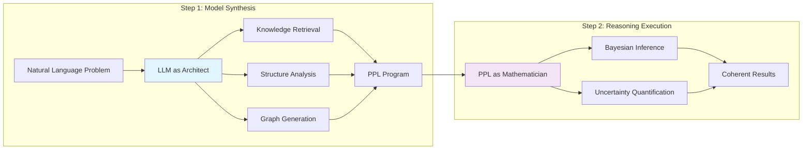

## Introduction

The **Model Synthesis Architecture (MSA)** is the core innovation of the Reasoning Kernel, implementing a revolutionary approach to AI reasoning based on the research paper "Modeling Open-World Cognition as On-Demand Synthesis of Probabilistic Models" (ArXiv:2507.12547).

<Info>
Unlike traditional AI systems that rely on monolithic, pre-trained models, MSA creates specialized mental models on-demand for each unique reasoning scenario, enabling true open-world cognition.
</Info>

## The Challenge: Open-World Cognition

Human intelligence excels at reasoning about novel, unfamiliar situations by dynamically constructing mental models. The MSA framework addresses two fundamental challenges:

<CardGroup cols={2}>
  <Card title="Global Relevance" icon="globe">
    **The Problem**: How do we identify and retrieve the small subset of relevant information from vast knowledge bases?
    
    **MSA Solution**: Large Language Models (LLMs) with their extensive training act as intelligent knowledge retrievers, identifying globally relevant considerations for any given situation.
  </Card>
  <Card title="Local Coherence" icon="puzzle-piece">
    **The Problem**: How do we use retrieved information to build consistent, coherent models of specific situations?
    
    **MSA Solution**: Probabilistic Programming Languages (PPLs) provide formal, structured frameworks for creating mathematically coherent reasoning models.
  </Card>
</CardGroup>

## Two-Step Architecture

The MSA framework implements a sophisticated two-step process:



### Step 1: On-Demand Model Synthesis (LLM)

The first step leverages **Large Language Models as architects and translators** to understand and structure reasoning problems:

<Tabs>
  <Tab title="Natural Language Understanding">
    The LLM acts as a sophisticated parser, breaking down complex natural language descriptions into structured components:
    
    ```python
    # Example: Problem decomposition
    scenario = """
    A manufacturing plant's assembly line stopped due to sensor malfunction.
    500 urgent orders are due in 48 hours. The backup sensor shows 
    inconsistent readings. How should management proceed?
    """
    
    # LLM extracts:
    parsed_structure = {
        "entities": ["manufacturing_plant", "assembly_line", "sensor", "orders"],
        "constraints": ["sensor_malfunction", "48_hour_deadline", "500_orders"],
        "relationships": ["sensor_controls_line", "orders_require_production"],
        "objectives": ["resume_production", "meet_deadline", "ensure_quality"]
    }
    ```
  </Tab>
  
  <Tab title="Knowledge Retrieval (RAG-like)">
    Drawing on vast implicit knowledge, the LLM identifies globally relevant considerations:
    
    ```python
    # Example: Contextual knowledge retrieval
    relevant_knowledge = {
        "manufacturing_principles": [
            "redundant_systems_reduce_downtime",
            "quality_control_critical_for_reputation",
            "overtime_costs_vs_delay_penalties"
        ],
        "domain_expertise": [
            "sensor_calibration_procedures",
            "emergency_production_protocols",
            "supply_chain_contingencies"
        ],
        "statistical_priors": {
            "sensor_failure_rate": "Normal(0.02, 0.005)",
            "production_capacity": "Beta(0.8, 0.2)",
            "quality_with_backup": "Normal(0.7, 0.1)"
        }
    }
    ```
  </Tab>
  
  <Tab title="Conceptual Dependency Graphs">
    The LLM generates explicit dependency structures between identified variables:
    
    ```python
    # Example: Causal dependency graph
    dependency_graph = {
        "nodes": [
            "sensor_reliability",
            "production_rate", 
            "quality_control",
            "delivery_timeline",
            "customer_satisfaction"
        ],
        "edges": [
            ("sensor_reliability", "production_rate"),
            ("sensor_reliability", "quality_control"),
            ("production_rate", "delivery_timeline"),
            ("quality_control", "customer_satisfaction"),
            ("delivery_timeline", "customer_satisfaction")
        ],
        "conditional_dependencies": {
            "quality_control": ["sensor_reliability", "production_speed"],
            "customer_satisfaction": ["delivery_timeline", "quality_control"]
        }
    }
    ```
  </Tab>
  
  <Tab title="PPL Program Generation">
    The culmination is a structured, executable probabilistic program:
    
    ```python
    # Example: Generated NumPyro program
    generated_ppl = """
    def manufacturing_decision_model():
        # Prior beliefs about system reliability
        sensor_reliability = sample("sensor_reliability", Beta(2, 8))
        backup_effectiveness = sample("backup_effectiveness", Beta(3, 7))
        
        # Production dynamics
        with plate("production_hours", 48):
            hourly_output = sample("hourly_output", 
                Normal(10 * sensor_reliability * backup_effectiveness, 2))
        
        # Quality control
        quality_rate = sample("quality_rate",
            Normal(0.95 * sensor_reliability, 0.05))
        
        # Decision outcomes
        total_production = deterministic("total_production", 
            jnp.sum(hourly_output))
        orders_completed = deterministic("orders_completed",
            jnp.minimum(total_production * quality_rate, 500))
        
        return {
            "production": total_production,
            "quality_orders": orders_completed,
            "success_probability": orders_completed / 500
        }
    """
    ```
  </Tab>
</Tabs>

### Step 2: Reasoning Within Model (PPL)

The second step executes the synthesized model using **Probabilistic Programming Languages as perfect mathematicians**:

<Tabs>
  <Tab title="Coherent Inference">
    PPL engines provide mathematically sound inference:
    
    ```python
    import numpyro
    from numpyro.infer import MCMC, NUTS
    import jax.random as random
    
    # Execute the synthesized model
    kernel = NUTS(manufacturing_decision_model)
    mcmc = MCMC(kernel, num_warmup=1000, num_samples=2000)
    mcmc.run(random.PRNGKey(0))
    
    # Extract coherent results
    samples = mcmc.get_samples()
    posterior_mean = {k: jnp.mean(v) for k, v in samples.items()}
    ```
  </Tab>
  
  <Tab title="Uncertainty Quantification">
    Precise probabilistic reasoning with confidence bounds:
    
    ```python
    # Quantify uncertainties
    uncertainty_analysis = {
        "success_probability": {
            "mean": float(jnp.mean(samples["success_probability"])),
            "std": float(jnp.std(samples["success_probability"])),
            "confidence_interval_95": [
                float(jnp.percentile(samples["success_probability"], 2.5)),
                float(jnp.percentile(samples["success_probability"], 97.5))
            ]
        },
        "production_range": {
            "low": float(jnp.percentile(samples["production"], 10)),
            "high": float(jnp.percentile(samples["production"], 90)),
            "expected": float(jnp.mean(samples["production"]))
        }
    }
    ```
  </Tab>
  
  <Tab title="Dynamic Tool Generation">
    The reasoning process generates specialized analysis tools:
    
    ```python
    # Generated decision support tools
    decision_tools = {
        "risk_assessment": lambda: calculate_production_risks(samples),
        "sensitivity_analysis": lambda param: analyze_parameter_impact(param, samples),
        "optimization_suggestions": lambda: generate_optimization_strategies(posterior_mean),
        "what_if_scenarios": lambda changes: simulate_parameter_changes(changes, model)
    }
    
    # Example usage
    risk_level = decision_tools["risk_assessment"]()
    # Output: {"high_risk": 0.23, "medium_risk": 0.45, "low_risk": 0.32}
    ```
  </Tab>
</Tabs>

## Implementation in Reasoning Kernel

The Reasoning Kernel implements MSA through specialized Semantic Kernel agents:

### Agent Architecture

<CodeGroup>
```python Model Synthesis Agent
from semantic_kernel.agents import ChatCompletionAgent
from semantic_kernel.functions import kernel_function

class ModelSynthesisAgent(ChatCompletionAgent):
    """Agent responsible for Step 1: Model synthesis using LLM capabilities"""
    
    def __init__(self, kernel):
        super().__init__(
            kernel=kernel,
            service_id="gemini-2.5-pro",
            name="model_synthesis_agent",
            instructions="""
            You are a cognitive architect specializing in transforming 
            natural language problems into structured reasoning models.
            """
        )
    
    @kernel_function(
        name="parse_problem_vignette",
        description="Parse natural language into structured components"
    )
    async def parse_problem(self, vignette: str) -> dict:
        """Extract entities, constraints, and relationships"""
        # Implementation using Gemini 2.5 Pro with thinking modes
        pass
    
    @kernel_function(
        name="generate_dependency_graph", 
        description="Create causal dependency structure"
    )
    async def generate_graph(self, parsed_problem: dict) -> dict:
        """Build conceptual dependency graph"""
        pass
    
    @kernel_function(
        name="synthesize_ppl_program",
        description="Generate executable probabilistic program"
    )
    async def synthesize_program(self, graph: dict, knowledge: dict) -> str:
        """Create NumPyro probabilistic program"""
        pass
```

```python Probabilistic Reasoning Agent  
class ProbabilisticReasoningAgent(ChatCompletionAgent):
    """Agent responsible for Step 2: PPL execution and inference"""
    
    def __init__(self, kernel, sandbox_service):
        super().__init__(
            kernel=kernel,
            service_id="inference-engine",
            name="probabilistic_reasoning_agent"
        )
        self.sandbox = sandbox_service
    
    @kernel_function(
        name="execute_probabilistic_inference",
        description="Run Bayesian inference on synthesized model"
    )
    async def execute_inference(self, ppl_program: str, evidence: dict) -> dict:
        """Execute PPL program in secure sandbox"""
        
        # Deploy to Daytona sandbox
        execution_result = await self.sandbox.execute_code(
            code=ppl_program,
            environment="numpyro-jax",
            timeout=300
        )
        
        return {
            "posterior_samples": execution_result.posterior,
            "uncertainty_bounds": execution_result.confidence_intervals,
            "convergence_diagnostics": execution_result.diagnostics
        }
```

```python MSA Orchestrator
from semantic_kernel.agents import GroupChatOrchestration

class MSAOrchestrator:
    """Coordinates the two-step MSA process"""
    
    def __init__(self, kernel):
        self.synthesis_agent = ModelSynthesisAgent(kernel)
        self.reasoning_agent = ProbabilisticReasoningAgent(kernel, sandbox)
        self.knowledge_agent = KnowledgeRetrievalAgent(kernel)
        
        # Set up group chat orchestration
        self.group_chat = GroupChatOrchestration(
            members=[self.synthesis_agent, self.knowledge_agent, self.reasoning_agent],
            manager=RoundRobinGroupChatManager(max_rounds=5)
        )
    
    async def execute_msa_reasoning(self, vignette: str) -> dict:
        """Execute complete MSA pipeline"""
        
        # Step 1: Model Synthesis
        parsed = await self.synthesis_agent.parse_problem(vignette)
        knowledge = await self.knowledge_agent.retrieve_context(parsed)
        graph = await self.synthesis_agent.generate_graph(parsed, knowledge)
        ppl_program = await self.synthesis_agent.synthesize_program(graph, knowledge)
        
        # Step 2: Probabilistic Reasoning  
        inference_result = await self.reasoning_agent.execute_inference(
            ppl_program, parsed.get("evidence", {})
        )
        
        return {
            "synthesis_step": {
                "parsed_problem": parsed,
                "dependency_graph": graph,
                "ppl_program": ppl_program
            },
            "reasoning_step": inference_result,
            "msa_confidence": self._calculate_overall_confidence(parsed, inference_result)
        }
```
</CodeGroup>

## Evaluation Functions (Φ)

MSA includes sophisticated evaluation mechanisms for continuous refinement:

<Tabs>
  <Tab title="Φparse - Parsing Quality">
    ```python
    def evaluate_parsing_quality(parsed_structure: dict) -> float:
        """Evaluate how well the LLM parsed the problem"""
        
        scores = []
        
        # Entity extraction completeness
        entity_score = len(parsed_structure.get("entities", [])) / expected_entities
        scores.append(entity_score)
        
        # Constraint identification accuracy  
        constraint_score = validate_constraints(parsed_structure.get("constraints", []))
        scores.append(constraint_score)
        
        # Relationship coherence
        relationship_score = validate_relationships(parsed_structure.get("relationships", []))
        scores.append(relationship_score)
        
        return sum(scores) / len(scores)
    ```
  </Tab>
  
  <Tab title="Φrelevance - Knowledge Relevance">
    ```python
    def evaluate_knowledge_relevance(knowledge: dict, problem_context: dict) -> float:
        """Assess relevance of retrieved knowledge"""
        
        # Semantic similarity between knowledge and problem
        knowledge_embeddings = embed_knowledge(knowledge)
        problem_embedding = embed_problem(problem_context)
        
        similarity_scores = compute_cosine_similarity(knowledge_embeddings, problem_embedding)
        
        # Domain appropriateness
        domain_match_score = evaluate_domain_match(knowledge, problem_context)
        
        # Statistical prior reasonableness
        prior_quality_score = evaluate_statistical_priors(knowledge.get("priors", {}))
        
        return weighted_average([
            (similarity_scores.mean(), 0.4),
            (domain_match_score, 0.3), 
            (prior_quality_score, 0.3)
        ])
    ```
  </Tab>
  
  <Tab title="Φmodel - Model Coherence">
    ```python
    def evaluate_model_coherence(ppl_program: str, dependency_graph: dict) -> float:
        """Evaluate mathematical and logical coherence of synthesized model"""
        
        # Syntax validation
        syntax_score = validate_ppl_syntax(ppl_program)
        
        # Graph consistency
        graph_consistency = validate_graph_acyclicity(dependency_graph)
        
        # Variable correspondence
        variable_match = validate_variable_correspondence(ppl_program, dependency_graph)
        
        # Prior-likelihood compatibility
        compatibility_score = validate_prior_likelihood_compatibility(ppl_program)
        
        # Identifiability check
        identifiability_score = check_model_identifiability(ppl_program)
        
        return weighted_average([
            (syntax_score, 0.25),
            (graph_consistency, 0.25),
            (variable_match, 0.2),
            (compatibility_score, 0.15),
            (identifiability_score, 0.15)
        ])
    ```
  </Tab>
</Tabs>

## Continuous Refinement Loop

MSA implements feedback loops for continuous improvement:

```python
class MSARefinementLoop:
    """Continuous refinement based on evaluation feedback"""
    
    async def refine_based_on_feedback(
        self,
        original_synthesis: dict,
        evaluation_scores: dict,
        max_iterations: int = 3
    ) -> dict:
        """Iteratively refine the reasoning model"""
        
        current_synthesis = original_synthesis
        
        for iteration in range(max_iterations):
            # Check if refinement needed
            if all(score > 0.8 for score in evaluation_scores.values()):
                break
            
            # Identify areas for improvement
            improvement_areas = [
                area for area, score in evaluation_scores.items() 
                if score < 0.8
            ]
            
            # Apply targeted refinements
            if "parsing_quality" in improvement_areas:
                current_synthesis = await self._refine_parsing(current_synthesis)
            
            if "knowledge_relevance" in improvement_areas:
                current_synthesis = await self._refine_knowledge_retrieval(current_synthesis)
            
            if "model_coherence" in improvement_areas:
                current_synthesis = await self._refine_model_structure(current_synthesis)
            
            # Re-evaluate
            evaluation_scores = await self._evaluate_synthesis(current_synthesis)
        
        return current_synthesis
```

## Benefits of MSA Framework

<CardGroup cols={2}>
  <Card title="Adaptive Intelligence" icon="brain">
    **Dynamic Problem Solving**: Creates specialized reasoning models for each unique problem, enabling adaptation to novel scenarios without pre-programmed solutions.
  </Card>
  <Card title="Mathematical Precision" icon="calculator">
    **Formal Verification**: PPL execution provides mathematical guarantees, automatic error detection, and probabilistic confidence quantification.
  </Card>
  <Card title="Interpretable Reasoning" icon="eye">
    **Transparent Process**: Clear reasoning traces, explicit dependency graphs, and human-readable decision explanations for full interpretability.
  </Card>
  <Card title="Continuous Learning" icon="arrow-trending-up">
    **Feedback Integration**: Evaluation functions and refinement loops enable continuous improvement of reasoning quality over time.
  </Card>
</CardGroup>

## Research Foundation

The MSA framework is based on cutting-edge research in cognitive science and AI:

<Tip>
**Paper Reference**: "Modeling Open-World Cognition as On-Demand Synthesis of Probabilistic Models" demonstrates that MSA significantly outperforms traditional reasoning approaches on novel causal structure reasoning tasks.
</Tip>

<Info>
**Cognitive Inspiration**: MSA models human cognition's ability to rapidly construct situational mental models, bridging the gap between AI and human-like reasoning capabilities.
</Info>

## Next Steps

Explore how MSA integrates with other Reasoning Kernel capabilities:

<CardGroup cols={2}>
  <Card title="Thinking Exploration" icon="lightbulb" href="/concepts/thinking-exploration">
    Learn how MSA enables dynamic exploration of novel situations
  </Card>
  <Card title="Agent Architecture" icon="robot" href="/concepts/semantic-kernel">
    Understand the Semantic Kernel agent implementation
  </Card>
  <Card title="Implementation Guide" icon="code" href="/guides/msa-implementation">
    Build applications using the MSA framework
  </Card>
  <Card title="Research Details" icon="academic-cap" href="/research/msa-paper">
    Deep dive into the research foundation and benchmarks
  </Card>
</CardGroup>
