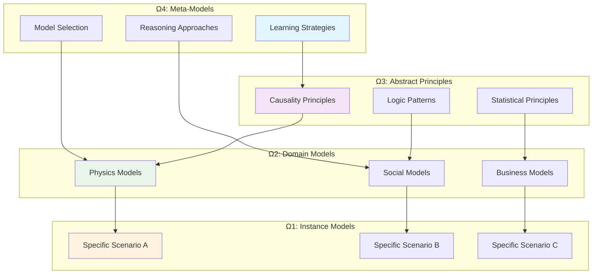
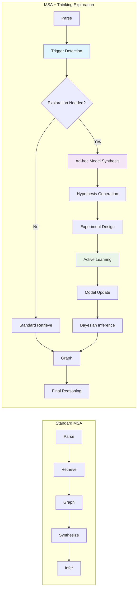

## Introduction

**Thinking Exploration** is a dynamic and adaptive process that enables the Reasoning Kernel to achieve human-like reasoning in novel and unfamiliar conditions. Unlike traditional AI systems that might fail when encountering out-of-distribution scenarios, the thinking exploration framework constructs and refines internal representations of the environment through on-demand "world models."

<Info>
Thinking exploration is the cognitive process that bridges the gap between artificial and human intelligence, enabling AI systems to handle truly open-world scenarios through adaptive reasoning.
</Info>

## Core Philosophy

The thinking exploration framework is based on the principle that human minds construct **ad-hoc symbolic mental models** for specific, novel situations, rather than relying on a single monolithic understanding of the world.

<CardGroup cols={2}>
  <Card title="Human-Like Adaptation" icon="brain">
    **Rapid Learning**: Like humans, the system quickly adapts to new problems using limited observations and background knowledge.
  </Card>
  <Card title="Sample Efficiency" icon="target">
    **Minimal Data**: Learn underlying structure from sparse online interaction, demonstrating "child as scientist" hypothesis-driven exploration.
  </Card>
  <Card title="Novel Situations" icon="lightbulb">
    **Open-World Reasoning**: Handle unprecedented scenarios by constructing specialized mental models on-demand.
  </Card>
  <Card title="Hierarchical Models" icon="layers">
    **Multi-Level Abstraction**: Build models from specific instances (Ω1) to abstract principles (Ωn).
  </Card>
</CardGroup>

## When Thinking Exploration Happens

Thinking exploration is triggered when the AI system encounters specific challenging conditions:

### Exploration Triggers

<Tabs>
  <Tab title="Novel Situations">
    **When**: Unprecedented or out-of-distribution scenarios
    
    **Examples**:
    - Medical diagnosis with unknown symptom combinations
    - Engineering problems with new material properties
    - Business scenarios in emerging markets
    
    ```python
    # Detection of novel situation
    novelty_score = await detector.assess_novelty(input_scenario, historical_data)
    if novelty_score > 0.7:
        trigger_exploration = True
        exploration_type = ExplorationTrigger.NOVEL_SITUATION
    ```
  </Tab>
  
  <Tab title="Dynamic Environments">
    **When**: Rapidly changing conditions requiring continuous adaptation
    
    **Examples**:
    - Financial markets during crisis events
    - Supply chain disruptions
    - Real-time system optimization
    
    ```python
    # Environment change detection
    change_magnitude = await detector.detect_environment_change(
        current_state, 
        historical_patterns
    )
    if change_magnitude > threshold:
        trigger_exploration = True
        exploration_type = ExplorationTrigger.DYNAMIC_ENVIRONMENT
    ```
  </Tab>
  
  <Tab title="Sparse Interaction">
    **When**: Limited data available but decisions still required
    
    **Examples**:
    - Early-stage startup strategy
    - New drug development decisions
    - Pioneer market entry
    
    ```python
    # Sparsity assessment
    data_density = calculate_information_density(available_data)
    interaction_frequency = measure_interaction_sparsity(context)
    
    if data_density < 0.3 and interaction_frequency > 0.6:
        trigger_exploration = True
        exploration_type = ExplorationTrigger.SPARSE_INTERACTION
    ```
  </Tab>
  
  <Tab title="Complex NL Problems">
    **When**: Natural language descriptions of complex, multi-faceted problems
    
    **Examples**:
    - Legal reasoning for novel cases
    - Strategic planning with multiple stakeholders
    - Ethical decision-making scenarios
    
    ```python
    # Complexity analysis
    complexity_metrics = analyze_nl_complexity(problem_description)
    if complexity_metrics.semantic_density > 0.8 and complexity_metrics.entity_count > 15:
        trigger_exploration = True
        exploration_type = ExplorationTrigger.COMPLEX_NL_PROBLEM
    ```
  </Tab>
</Tabs>

## How Thinking Exploration Works

The thinking exploration process implements a sophisticated framework combining the Model Synthesis Architecture with advanced cognitive principles:

### 1. Exploration Trigger Detection

```python
from reasoning_kernel.exploration import ExplorationTriggerDetector

class ExplorationTriggerDetector:
    """Detects when thinking exploration should be activated"""
    
    async def detect_exploration_need(
        self,
        input_scenario: str,
        context: Dict[str, Any]
    ) -> ExplorationAssessment:
        """Comprehensive assessment of exploration needs"""
        
        # Multi-dimensional analysis
        assessments = await asyncio.gather(
            self._assess_novelty(input_scenario, context),
            self._detect_environment_dynamics(context),
            self._measure_data_sparsity(context),
            self._analyze_complexity(input_scenario)
        )
        
        # Combine assessments
        overall_score = self._combine_assessments(assessments)
        triggers = self._identify_triggers(assessments)
        
        return ExplorationAssessment(
            should_explore=overall_score > 0.7,
            confidence=overall_score,
            primary_triggers=triggers,
            exploration_strategy=self._recommend_strategy(triggers)
        )
```

### 2. On-Demand Model Synthesis

When exploration is triggered, the system constructs bespoke mental models:

<Tabs>
  <Tab title="Problem Structure Analysis">
    ```python
    class ProblemStructureAnalyzer:
        """Analyzes and structures novel problems"""
        
        async def analyze_structure(self, scenario: str) -> StructuredProblem:
            """Break down complex scenario into components"""
            
            # Use Gemini 2.5 Pro with thinking modes
            analysis = await self.gemini_service.analyze_with_thinking(
                prompt=f"""
                Analyze this scenario and extract:
                1. Key entities and their properties
                2. Relationships and dependencies
                3. Constraints and limitations
                4. Objectives and success criteria
                5. Uncertainties and unknowns
                
                Scenario: {scenario}
                
                Think step by step about the underlying structure.
                """,
                enable_thinking=True
            )
            
            return StructuredProblem(
                entities=analysis.entities,
                relationships=analysis.relationships,
                constraints=analysis.constraints,
                objectives=analysis.objectives,
                uncertainties=analysis.uncertainties
            )
    ```
  </Tab>
  
  <Tab title="Knowledge Integration">
    ```python
    class KnowledgeIntegrator:
        """Integrates relevant background knowledge"""
        
        async def integrate_knowledge(
            self,
            structured_problem: StructuredProblem,
            exploration_context: ExplorationContext
        ) -> IntegratedKnowledge:
            """Retrieve and integrate relevant knowledge"""
            
            # Semantic search across memory collections
            relevant_patterns = await self.memory.search_patterns(
                query=structured_problem.semantic_summary,
                collections=["reasoning_patterns", "domain_knowledge"],
                limit=10,
                min_relevance=0.75
            )
            
            # Domain-specific knowledge retrieval
            domain_knowledge = await self._retrieve_domain_knowledge(
                structured_problem.primary_domain,
                structured_problem.entities
            )
            
            # Statistical priors and assumptions
            priors = await self._generate_statistical_priors(
                structured_problem,
                relevant_patterns
            )
            
            return IntegratedKnowledge(
                patterns=relevant_patterns,
                domain_knowledge=domain_knowledge,
                statistical_priors=priors,
                confidence=self._assess_knowledge_confidence(relevant_patterns)
            )
    ```
  </Tab>
  
  <Tab title="Hypothesis Generation">
    ```python
    class HypothesisGenerator:
        """Generates testable hypotheses about the problem"""
        
        async def generate_hypotheses(
            self,
            structured_problem: StructuredProblem,
            integrated_knowledge: IntegratedKnowledge
        ) -> List[Hypothesis]:
            """Generate hypotheses using 'child as scientist' approach"""
            
            hypotheses = []
            
            # Causal hypotheses
            causal_hypotheses = await self._generate_causal_hypotheses(
                structured_problem.relationships,
                integrated_knowledge.patterns
            )
            hypotheses.extend(causal_hypotheses)
            
            # Mechanism hypotheses
            mechanism_hypotheses = await self._generate_mechanism_hypotheses(
                structured_problem.entities,
                integrated_knowledge.domain_knowledge
            )
            hypotheses.extend(mechanism_hypotheses)
            
            # Constraint hypotheses
            constraint_hypotheses = await self._generate_constraint_hypotheses(
                structured_problem.constraints,
                integrated_knowledge.statistical_priors
            )
            hypotheses.extend(constraint_hypotheses)
            
            # Rank hypotheses by testability and informativeness
            ranked_hypotheses = self._rank_hypotheses(hypotheses)
            
            return ranked_hypotheses[:10]  # Top 10 most promising
    ```
  </Tab>
  
  <Tab title="Experimental Design">
    ```python
    class ExperimentDesigner:
        """Designs experiments to test hypotheses efficiently"""
        
        async def design_experiments(
            self,
            hypotheses: List[Hypothesis],
            available_resources: ResourceConstraints
        ) -> List[Experiment]:
            """Design sample-efficient experiments"""
            
            experiments = []
            
            for hypothesis in hypotheses:
                # Calculate information gain potential
                info_gain = await self._calculate_information_gain(
                    hypothesis,
                    available_resources
                )
                
                # Design specific test
                experiment = await self._design_hypothesis_test(
                    hypothesis,
                    info_gain,
                    available_resources
                )
                
                experiments.append(experiment)
            
            # Optimize experimental sequence
            optimized_sequence = self._optimize_experiment_sequence(
                experiments,
                available_resources
            )
            
            return optimized_sequence
    ```
  </Tab>
</Tabs>

### 3. Hierarchical World Models

The system maintains multiple levels of abstraction in its world models:



<Tabs>
  <Tab title="Instance Models (Ω1)">
    **Specific Situation Models**: Detailed representations for particular scenarios
    
    ```python
    class InstanceWorldModel:
        """Ω1: Specific situation model"""
        
        def __init__(self, scenario_id: str):
            self.scenario_id = scenario_id
            self.entities = {}           # Specific entities in this scenario
            self.relationships = {}      # Concrete relationships
            self.constraints = {}        # Specific constraints
            self.parameters = {}         # Measured/estimated parameters
            self.confidence = 0.0        # Model confidence
            
        async def construct_from_scenario(
            self,
            scenario: str,
            abstract_priors: Dict[str, Any]
        ):
            """Construct instance model with abstract priors"""
            
            # Parse scenario specifics
            self.entities = await self._extract_entities(scenario)
            self.relationships = await self._infer_relationships(scenario)
            
            # Apply abstract priors
            self._apply_abstract_priors(abstract_priors)
            
            # Generate probabilistic model
            self.probabilistic_model = await self._synthesize_ppl_model()
    ```
  </Tab>
  
  <Tab title="Domain Models (Ω2)">
    **Domain-Specific Models**: General patterns within specific domains
    
    ```python
    class DomainWorldModel:
        """Ω2: Domain-specific general model"""
        
        def __init__(self, domain: str):
            self.domain = domain
            self.general_patterns = {}    # Domain patterns
            self.typical_entities = {}    # Common entity types
            self.causal_structures = {}   # Typical causal patterns
            self.statistical_priors = {} # Domain priors
            
        async def abstract_from_instances(
            self,
            instance_models: List[InstanceWorldModel]
        ):
            """Learn domain patterns from multiple instances"""
            
            # Extract common patterns
            common_patterns = self._extract_common_patterns(instance_models)
            
            # Generalize entity types
            self.typical_entities = self._generalize_entities(instance_models)
            
            # Learn causal structures
            self.causal_structures = self._learn_causal_structures(instance_models)
            
            # Estimate statistical priors
            self.statistical_priors = self._estimate_priors(instance_models)
    ```
  </Tab>
  
  <Tab title="Abstract Principles (Ω3)">
    **Universal Principles**: Cross-domain abstract concepts
    
    ```python
    class AbstractPrincipleModel:
        """Ω3: Abstract cross-domain principles"""
        
        def __init__(self):
            self.causality_principles = {}    # General causality rules
            self.reasoning_principles = {}    # Logic and inference rules
            self.uncertainty_principles = {}  # Probability and uncertainty
            self.optimization_principles = {} # Decision-making rules
            
        async def learn_principles(
            self,
            domain_models: List[DomainWorldModel]
        ):
            """Extract universal principles from domain models"""
            
            # Learn causality principles
            self.causality_principles = self._extract_causality_patterns(
                domain_models
            )
            
            # Learn reasoning principles
            self.reasoning_principles = self._extract_reasoning_patterns(
                domain_models
            )
            
            # Learn uncertainty handling
            self.uncertainty_principles = self._extract_uncertainty_patterns(
                domain_models
            )
    ```
  </Tab>
  
  <Tab title="Meta-Models (Ω4)">
    **Learning Strategies**: How to learn and adapt models
    
    ```python
    class MetaLearningModel:
        """Ω4: Meta-learning strategies"""
        
        def __init__(self):
            self.learning_strategies = {}     # How to learn efficiently
            self.model_selection = {}         # Which models to use when
            self.adaptation_strategies = {}   # How to adapt to new info
            self.exploration_strategies = {}  # How to explore effectively
            
        async def optimize_learning(
            self,
            learning_history: List[LearningEpisode],
            current_context: ExplorationContext
        ):
            """Optimize learning strategy based on history"""
            
            # Analyze successful learning episodes
            successful_strategies = self._analyze_successful_episodes(
                learning_history
            )
            
            # Adapt strategies to current context
            context_strategy = self._adapt_to_context(
                successful_strategies,
                current_context
            )
            
            return context_strategy
    ```
  </Tab>
</Tabs>

### 4. Sample-Efficient Learning

The thinking exploration framework implements advanced sample-efficient learning:

<Tabs>
  <Tab title="Information Gain Optimization">
    ```python
    class InformationGainOptimizer:
        """Optimizes learning from minimal observations"""
        
        async def plan_information_gathering(
            self,
            current_model: WorldModel,
            knowledge_gaps: List[str],
            available_actions: List[str]
        ) -> InformationGatheringPlan:
            """Plan actions to maximize information gain"""
            
            # Calculate expected information gain for each action
            action_gains = {}
            for action in available_actions:
                expected_gain = await self._calculate_expected_information_gain(
                    action,
                    current_model,
                    knowledge_gaps
                )
                action_gains[action] = expected_gain
            
            # Select optimal sequence of actions
            optimal_sequence = self._select_optimal_sequence(
                action_gains,
                resource_constraints={"time": 300, "cost": 1000}
            )
            
            return InformationGatheringPlan(
                actions=optimal_sequence,
                expected_total_gain=sum(action_gains[a] for a in optimal_sequence),
                confidence_improvement=self._estimate_confidence_improvement(
                    optimal_sequence
                )
            )
    ```
  </Tab>
  
  <Tab title="Active Learning Strategy">
    ```python
    class ActiveLearningStrategy:
        """Implements 'child as scientist' learning approach"""
        
        async def generate_learning_experiments(
            self,
            world_model: WorldModel,
            uncertainty_areas: List[str]
        ) -> List[LearningExperiment]:
            """Generate experiments like a curious child scientist"""
            
            experiments = []
            
            for uncertainty in uncertainty_areas:
                # What would a curious child try?
                experiment = await self._design_curiosity_driven_experiment(
                    uncertainty,
                    world_model
                )
                
                # Estimate learning value
                learning_value = self._estimate_learning_value(
                    experiment,
                    world_model
                )
                
                # Add exploration bonus (curiosity)
                curiosity_bonus = self._calculate_curiosity_bonus(
                    experiment,
                    self.exploration_history
                )
                
                total_value = learning_value + curiosity_bonus
                
                experiments.append(LearningExperiment(
                    experiment=experiment,
                    learning_value=learning_value,
                    curiosity_bonus=curiosity_bonus,
                    total_value=total_value
                ))
            
            # Sort by total value and return top experiments
            return sorted(experiments, key=lambda x: x.total_value, reverse=True)[:5]
    ```
  </Tab>
  
  <Tab title="Bayesian Model Updating">
    ```python
    class BayesianModelUpdater:
        """Updates world models based on new observations"""
        
        async def update_model_with_observations(
            self,
            world_model: WorldModel,
            observations: List[Observation]
        ) -> UpdatedWorldModel:
            """Perform Bayesian update with new observations"""
            
            # Convert observations to evidence
            evidence = self._convert_observations_to_evidence(observations)
            
            # Generate update code for sandbox execution
            update_code = self._generate_bayesian_update_code(
                world_model.probabilistic_model,
                evidence
            )
            
            # Execute in secure sandbox
            updated_model = await self.sandbox.execute_bayesian_update(
                code=update_code,
                timeout=120
            )
            
            # Calculate model confidence change
            confidence_change = self._calculate_confidence_change(
                world_model,
                updated_model,
                observations
            )
            
            return UpdatedWorldModel(
                model=updated_model,
                confidence_change=confidence_change,
                learning_efficiency=len(observations) / confidence_change,
                remaining_uncertainties=self._identify_remaining_uncertainties(
                    updated_model
                )
            )
    ```
  </Tab>
</Tabs>

## Implementation Architecture

The thinking exploration framework integrates seamlessly with the MSA pipeline:

```python
from reasoning_kernel.exploration import ThinkingExplorationFramework
from reasoning_kernel.agents import ExplorationAgent

class ThinkingExplorationFramework:
    """Complete thinking exploration implementation"""
    
    def __init__(self, kernel):
        self.kernel = kernel
        self.trigger_detector = ExplorationTriggerDetector()
        self.model_synthesizer = AdHocModelSynthesizer()
        self.hypothesis_generator = HypothesisGenerator()
        self.experiment_designer = ExperimentDesigner()
        self.world_model_manager = HierarchicalWorldModelManager()
        self.learning_optimizer = SampleEfficientLearningOptimizer()
        
    async def explore_and_reason(
        self,
        scenario: str,
        context: Dict[str, Any]
    ) -> ExplorationResult:
        """Complete thinking exploration pipeline"""
        
        # 1. Detect if exploration is needed
        exploration_assessment = await self.trigger_detector.detect_exploration_need(
            scenario, context
        )
        
        if not exploration_assessment.should_explore:
            # Use standard MSA pipeline
            return await self._standard_reasoning(scenario)
        
        # 2. Synthesize ad-hoc model for this specific situation
        structured_problem = await self._analyze_problem_structure(scenario)
        integrated_knowledge = await self._integrate_background_knowledge(
            structured_problem
        )
        
        # 3. Generate and test hypotheses
        hypotheses = await self.hypothesis_generator.generate_hypotheses(
            structured_problem, integrated_knowledge
        )
        
        experiments = await self.experiment_designer.design_experiments(
            hypotheses, context.get("resources", {})
        )
        
        # 4. Execute experiments and update model
        experiment_results = []
        current_model = await self._construct_initial_model(
            structured_problem, integrated_knowledge
        )
        
        for experiment in experiments:
            result = await self._execute_experiment(experiment)
            experiment_results.append(result)
            
            # Update model with new observations
            current_model = await self._update_model_with_observations(
                current_model, [result]
            )
            
            # Check if sufficient confidence reached
            if current_model.confidence > 0.85:
                break
        
        # 5. Store learned patterns for future use
        await self._store_learning_patterns(
            scenario, current_model, experiment_results
        )
        
        # 6. Generate final reasoning result
        final_reasoning = await self._generate_final_reasoning(
            current_model, structured_problem
        )
        
        return ExplorationResult(
            reasoning_result=final_reasoning,
            confidence=current_model.confidence,
            exploration_triggered=True,
            experiments_conducted=len(experiment_results),
            learning_efficiency=self._calculate_learning_efficiency(
                experiment_results
            ),
            world_model=current_model
        )
```

## Use Cases for Thinking Exploration

The thinking exploration framework excels in scenarios requiring adaptive reasoning:

<CardGroup cols={2}>
  <Card title="Novel Medical Diagnosis" icon="stethoscope">
    **Scenario**: Patient with unprecedented symptom combination
    
    **Exploration**: Synthesize new diagnostic model, test hypotheses about rare conditions
  </Card>
  <Card title="Emerging Market Strategy" icon="chart-line">
    **Scenario**: Business entering completely new market
    
    **Exploration**: Build market model from limited data, test strategic hypotheses
  </Card>
  <Card title="Scientific Discovery" icon="flask">
    **Scenario**: Unexpected experimental results
    
    **Exploration**: Generate new theoretical models, design confirmatory experiments
  </Card>
  <Card title="Crisis Management" icon="exclamation-triangle">
    **Scenario**: Unprecedented crisis requiring novel solutions
    
    **Exploration**: Rapid model construction, hypothesis-driven response planning
  </Card>
</CardGroup>

## Benefits of Thinking Exploration

<AccordionGroup>
  <Accordion title="🧠 Human-Like Adaptability" icon="brain">
    **Rapid Adaptation**: Like humans, the system quickly adapts to novel situations using background knowledge and hypothesis-driven exploration.
    
    **Open-World Reasoning**: Handles truly unprecedented scenarios without requiring specific training data.
    
    **Cognitive Flexibility**: Dynamically adjusts reasoning approach based on the specific characteristics of each situation.
  </Accordion>
  
  <Accordion title="📊 Sample Efficiency" icon="chart-bar">
    **Minimal Data Learning**: Learns effectively from sparse observations, maximizing information gain from each data point.
    
    **Strategic Exploration**: Plans information-gathering activities to maximize learning efficiency.
    
    **Active Learning**: Proactively seeks information that will most improve model accuracy.
  </Accordion>
  
  <Accordion title="🔄 Continuous Improvement" icon="arrow-path">
    **Learning Accumulation**: Each exploration episode improves future reasoning through pattern storage and retrieval.
    
    **Meta-Learning**: Learns how to learn more effectively over time through meta-cognitive strategies.
    
    **Knowledge Transfer**: Applies insights from one domain to novel situations in related domains.
  </Accordion>
  
  <Accordion title="🎯 Targeted Reasoning" icon="bullseye">
    **Situational Models**: Creates specialized models tailored to each specific scenario.
    
    **Uncertainty Quantification**: Explicitly tracks and reduces uncertainties through targeted exploration.
    
    **Confidence Calibration**: Provides accurate confidence estimates based on evidence quality.
  </Accordion>
</AccordionGroup>

## Integration with MSA

Thinking exploration enhances the Model Synthesis Architecture:



## Research Foundation

The thinking exploration framework is grounded in cognitive science and AI research:

<Tip>
**Cognitive Science**: Based on research into human cognitive flexibility, curiosity-driven learning, and the "child as scientist" hypothesis.
</Tip>

<Info>
**Sample Efficiency**: Implements principles from active learning, optimal experimental design, and Bayesian optimization for maximum learning efficiency.
</Info>

<Check>
**World Models**: Draws from research on hierarchical world models, mental model construction, and adaptive cognition in uncertain environments.
</Check>

## Next Steps

Explore related concepts and implementation details:

<CardGroup cols={2}>
  <Card title="MSA Framework" icon="brain" href="/concepts/msa-framework">
    Understand how thinking exploration integrates with Model Synthesis Architecture
  </Card>
  <Card title="Implementation Guide" icon="code" href="/guides/thinking-exploration-guide">
    Build applications using the thinking exploration framework
  </Card>
  <Card title="Agent Architecture" icon="robot" href="/agents/exploration-agent">
    Learn about the ExplorationAgent and its capabilities
  </Card>
  <Card title="Research Details" icon="academic-cap" href="/research/thinking-exploration">
    Deep dive into the research foundation and cognitive principles
  </Card>
</CardGroup>
