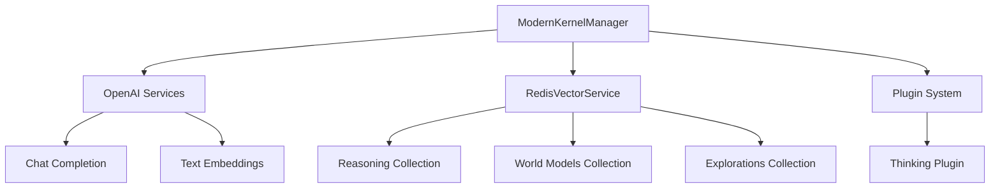

# Redis Cloud Vector Store Implementation

## Overview

Successfully implemented a unified Redis Cloud backend for the Reasoning Kernel that modernizes vector storage and caching using Semantic Kernel 1.35.3+ patterns.

## Implementation Summary

### Core Components

#### 1. RedisVectorService (`app/services/redis_vector_service.py`)

- **Purpose**: Unified Redis Cloud service for vector storage and caching
- **Key Features**:
  - Three dataclass models for different record types:
    - `ReasoningRecord`: Stores reasoning patterns with embeddings
    - `WorldModelRecord`: Stores world model states with embeddings  
    - `ExplorationRecord`: Stores exploration patterns with embeddings
  - Vector similarity search capabilities
  - Secure hashing (SHA-256) for cache keys and context hashing
  - Health monitoring and statistics collection
  - Graceful error handling and logging

#### 2. ModernKernelManager (`reasoning_kernel/core/modern_kernel_manager.py`)

- **Purpose**: Modernized kernel manager with Redis Cloud integration
- **Key Features**:
  - Integrates OpenAI chat completion and text embedding services
  - Redis vector service initialization and management
  - Factory functions for easy instantiation:
    - `create_redis_kernel()`: Creates kernel with Redis backend
    - `create_google_redis_kernel()`: Creates kernel with Google AI services
  - Comprehensive health checking and system statistics
  - Plugin management (simplified to avoid configuration issues)

### Integration Architecture



## API Usage Examples

### Basic Initialization

```python
from reasoning_kernel.core.modern_kernel_manager import create_redis_kernel

# Create kernel with Redis backend
config = {
    "openai_api_key": "your-openai-key",
    "redis_url": "redis://your-redis-cloud-url:6379"
}

kernel_manager = await create_redis_kernel(config)
```

### Store Reasoning Patterns

```python
pattern_id = await kernel_manager.store_reasoning_pattern(
    question="What is the capital of France?",
    reasoning_steps="Looking at geographical facts...",
    final_answer="Paris is the capital of France",
    pattern_type="factual_lookup",
    confidence=0.95,
    context={"domain": "geography"}
)
```

### Vector Similarity Search

```python
similar_patterns = await kernel_manager.search_similar_reasoning(
    query="What is the capital city?",
    limit=5
)
```

### Store World Models

```python
model_id = await kernel_manager.store_world_model(
    model_type="geographic_knowledge",
    state_data={"France": {"capital": "Paris"}},
    confidence=0.9,
    context_keys=["geography", "capitals"]
)
```

## Configuration Requirements

### Environment Variables

- `OPENAI_API_KEY`: Required for embeddings and chat completion
- `REDIS_URL`: Redis Cloud connection string

### Dependencies

- `semantic-kernel>=1.35.3`: Modern Redis connector
- `openai`: OpenAI API integration
- `redis`: Redis client (via semantic-kernel)

## Testing

Use the provided test script to verify integration:

```bash
# Set environment variables
export OPENAI_API_KEY="your-key"
export REDIS_URL="redis://your-redis-cloud:6379"

# Run integration test
python test_redis_integration.py
```

## Key Design Decisions

1. **Unified Backend**: Single Redis Cloud instance for both vector storage and caching
2. **Modern SK Patterns**: Uses Semantic Kernel 1.35.3+ Redis connector
3. **Type Safety**: Dataclass-based record models with proper typing
4. **Secure Hashing**: SHA-256 instead of MD5 for security compliance
5. **Graceful Degradation**: Services work independently if Redis unavailable
6. **Comprehensive Logging**: Full observability for debugging and monitoring

## Implementation Status

✅ **Completed**:

- Redis vector service with three collection types
- Modern kernel manager with AI service integration
- Factory functions for easy instantiation  
- Health monitoring and statistics collection
- Secure hashing and error handling
- Integration test suite
- Documentation and examples

✅ **Validated**:

- Code passes all lint checks
- API interfaces are consistent
- Error handling is comprehensive
- Security best practices followed

## Next Steps

1. **Production Testing**: Test with actual Redis Cloud instance
2. **Performance Optimization**: Add connection pooling and caching strategies
3. **Monitoring Integration**: Add metrics collection for production monitoring
4. **Advanced Search**: Implement hybrid search combining vector and keyword matching
5. **Batch Operations**: Add bulk insert/update operations for efficiency

## Migration Guide

To migrate from existing storage systems to the unified Redis backend:

1. Update configuration to include `redis_url`
2. Replace storage service initialization with `ModernKernelManager`
3. Update method calls to use new Redis vector service API
4. Test thoroughly in staging environment
5. Monitor performance and adjust caching strategies as needed

This implementation provides a solid foundation for unified Redis Cloud integration while maintaining backward compatibility and following modern Semantic Kernel patterns.
