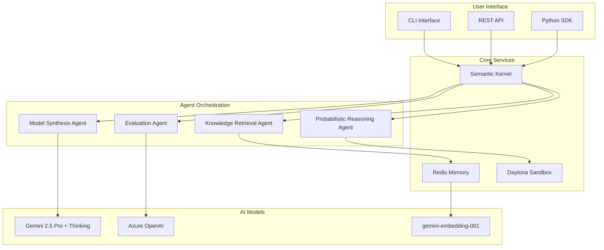

## Welcome to Reasoning Kernel

The **Reasoning Kernel** is a cutting-edge AI reasoning system that implements the revolutionary Model Synthesis Architecture (MSA). Built on Microsoft Semantic Kernel, it enables sophisticated cognitive reasoning through on-demand synthesis of bespoke mental models for novel situations.

<CardGroup cols={2}>
  <Card
    title="Model Synthesis Architecture"
    icon="brain"
    href="/concepts/msa-framework"
  >
    Revolutionary two-step reasoning: LLM synthesis → PPL execution for human-like cognitive reasoning
  </Card>
  <Card
    title="Thinking Exploration"
    icon="lightbulb"
    href="/concepts/thinking-exploration"
  >
    Dynamic exploration framework that adapts to novel situations through hypothesis-driven learning
  </Card>
  <Card
    title="Semantic Kernel Native"
    icon="puzzle-piece"
    href="/concepts/semantic-kernel"
  >
    Built on Microsoft Semantic Kernel with agent orchestration and plugin ecosystem
  </Card>
  <Card
    title="Production Ready"
    icon="rocket-launch"
    href="/quickstart"
  >
    Enterprise-grade with Redis memory, secure sandbox execution, and comprehensive monitoring
  </Card>
</CardGroup>

## Key Features

<AccordionGroup>
  <Accordion title="🧠 Advanced Reasoning Capabilities" icon="brain">
    - **Multi-Stage Architecture**: Parse → Retrieve → Graph → Synthesize → Infer
    - **Probabilistic Programming**: NumPyro/JAX for mathematical precision
    - **Causal Modeling**: Dynamic dependency graph construction
    - **Uncertainty Quantification**: Confidence scoring and error bounds
  </Accordion>

  <Accordion title="🔍 Thinking Exploration Framework" icon="magnifying-glass">
    - **Novel Situation Detection**: Automatic exploration trigger identification
    - **On-Demand Model Synthesis**: Bespoke mental models for specific scenarios
    - **Hierarchical World Models**: Multi-level abstraction (Ω1 to Ωn)
    - **Sample-Efficient Learning**: Hypothesis-driven "child as scientist" approach
  </Accordion>

  <Accordion title="🤖 Agent-Based Architecture" icon="robot">
    - **Specialized Agents**: ModelSynthesis, KnowledgeRetrieval, ProbabilisticReasoning, Evaluation
    - **Group Chat Orchestration**: Multi-agent coordination using Semantic Kernel patterns
    - **Plugin Ecosystem**: Modular, reusable reasoning components
    - **Memory Integration**: Redis-based short and long-term memory with Gemini embeddings
  </Accordion>

  <Accordion title="🛡️ Enterprise Features" icon="shield-check">
    - **Secure Execution**: Daytona sandbox for safe code execution
    - **Redis Memory**: Distributed memory with semantic search capabilities
    - **Monitoring & Analytics**: Comprehensive observability and performance tracking
    - **Multi-Model Support**: Azure OpenAI, Google Gemini, local models
  </Accordion>
</AccordionGroup>

## Architecture Overview

The Reasoning Kernel implements a sophisticated architecture that combines multiple AI paradigms:



## Quick Start

Get started with the Reasoning Kernel in minutes:

<Steps>
  <Step title="Installation">
    Install the Reasoning Kernel using pip or uv:
    ```bash
    pip install reasoning-kernel
    # or with uv
    uv add reasoning-kernel
    ```
  </Step>
  
  <Step title="Configuration">
    Set up your environment variables:
    ```bash
    export GEMINI_API_KEY="your-gemini-api-key"
    export REDIS_URL="redis://your-redis-instance:6379"
    export DAYTONA_WORKSPACE_ID="your-workspace-id"
    ```
  </Step>
  
  <Step title="Basic Usage">
    Create your first reasoning session:
    ```python
    from reasoning_kernel import ReasoningKernel
    
    kernel = ReasoningKernel()
    result = await kernel.reason(
        "A manufacturing plant's assembly line stopped due to sensor malfunction. "
        "500 urgent orders are due in 48 hours. Analyze the situation."
    )
    
    print(f"Analysis: {result.reasoning_result}")
    print(f"Confidence: {result.confidence}")
    ```
  </Step>
</Steps>

## Use Cases

The Reasoning Kernel excels in scenarios requiring sophisticated cognitive reasoning:

<CardGroup cols={3}>
  <Card title="Business Intelligence" icon="chart-line">
    Complex decision-making scenarios with multiple variables and uncertain outcomes
  </Card>
  <Card title="Scientific Research" icon="flask">
    Novel hypothesis generation and experimental design for unexplored domains
  </Card>
  <Card title="Risk Assessment" icon="shield-exclamation">
    Multi-factor risk analysis with uncertainty quantification and confidence bounds
  </Card>
  <Card title="Strategic Planning" icon="chess">
    Long-term planning under uncertainty with adaptive strategy refinement
  </Card>
  <Card title="Medical Diagnosis" icon="stethoscope">
    Complex diagnostic reasoning with rare or novel symptom combinations
  </Card>
  <Card title="Financial Modeling" icon="coins">
    Dynamic market analysis with real-time adaptation to new information
  </Card>
</CardGroup>

## What Makes It Different

<Tip>
**Revolutionary MSA Framework**: Unlike traditional AI systems that rely on monolithic models, the Reasoning Kernel creates specialized mental models on-demand for each unique situation, enabling true open-world cognition.
</Tip>

<Info>
**Thinking Exploration**: The system automatically detects when it encounters novel situations and engages in hypothesis-driven exploration, learning efficiently from minimal data like human cognition.
</Info>

<Check>
**Production Ready**: Built on enterprise-grade infrastructure with comprehensive monitoring, security, and scalability features for real-world deployment.
</Check>

## Community and Support

Join our growing community of researchers and developers:

- **GitHub**: [Star and contribute](https://github.com/qredence/reasoning-kernel)
- **Discord**: [Join our community](https://discord.gg/reasoning-kernel)
- **Documentation**: Comprehensive guides and API reference
- **Examples**: Real-world use cases and implementation patterns

Ready to build the next generation of reasoning applications? [Get started now](/quickstart) or explore our [comprehensive guides](/guides/basic-reasoning).
